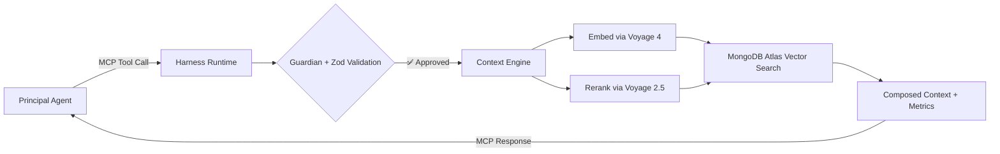



## 🎯 Overview

Traditional AI agents operate in **fragmented contexts**, generating hallucinations, wasting tokens, and accidentally exposing secrets. **Vectora** solves this not by being "another chat", but as a **[Tier 2 Sub-Agent](/concepts/sub-agents/)** designed exclusively for software engineering: it intercepts calls via [MCP Protocol](/protocols/mcp/), validates security in real-time with [Guardian](/security/guardian/), orchestrates multi-hop retrieval via [Context Engine](/concepts/context-engine/), and delivers structured context to your principal agent (Claude Code, Gemini CLI, Cursor, etc.).

> [!IMPORTANT]
> **Core Formula**: `Functional Agent = Model (Gemini 3 Flash) + [Harness Runtime](/concepts/harness-runtime/) + Governed Context (Voyage 4 + MongoDB Atlas)`

---

## 🔍 The Problem Vectora Solves

| Failure in Generic Agents       | Practical Impact                                        | How Vectora Mitigates                                                                                                                        |
| ------------------------------- | ------------------------------------------------------- | -------------------------------------------------------------------------------------------------------------------------------------------- |
| **Shallow Context**             | Search for "authentication" returns 50 irrelevant files | [Reranker 2.5](/concepts/reranker/) filters by real semantic relevance, not raw cosine similarity                                            |
| **No Pre-Execution Validation** | Dangerous tool calls run before being audited           | [Harness Runtime](/concepts/harness-runtime/) intercepts, validates Zod schema, and applies [Guardian](/security/guardian/) before execution |
| **Lack of Isolation**           | Data from different projects leaks between sessions     | [Namespace Isolation](/security/rbac/) via application-level RBAC + mandatory backend filtering                                              |
| **Unpredictable Consumption**   | LLMs overfetch, waste tokens on boilerplate             | [Context Engine](/concepts/context-engine/) decides scope, applies compaction (head/tail), injects only what's relevant                      |
| **Fragile Security**            | Blocklists depend on prompts (jailbreakable)            | [Hard-Coded Guardian](/security/guardian/) is compiled into runtime, impossible to bypass via prompt                                         |

---

## 🧩 The Solution: Sub-Agent Architecture

Vectora is exposed **exclusively via MCP**. There is no chat CLI, TUI, or direct conversational interface. It operates silently as a governance and context layer:

### Core Components

| Module                                            | Responsibility                                                                   | Documentation                                                                   |
| ------------------------------------------------- | -------------------------------------------------------------------------------- | ------------------------------------------------------------------------------- |
| **[Harness Runtime](/concepts/harness-runtime/)** | Orchestrates execution, validates schemas, intercepts tool calls, persists state | Infrastructure that connects the LLM to the real world, not a testing framework |
| **[Context Engine](/concepts/context-engine/)**   | Decides scope (filesystem vs vector), applies AST parsing, multi-hop compaction  | Pipeline `Embed → Search → Rerank → Compose → Validate`                         |
| **[Provider Router](/models/gemini/)**            | Routes to curated stack, manages BYOK fallback, tracks quota                     | No generic layers. Official SDKs, stable parsing                                |
| **[Tool Executor](/reference/mcp-tools/)**        | Validates args via Zod, executes with exponential retry, sanitizes output        | Immutable blocklist applied before any call                                     |

---

## 📦 Curated Stack & Infrastructure

Vectora **is not provider-agnostic**. We operate with models rigorously calibrated to guarantee metric consistency, parsing stability, and predictable costs:

| Layer                    | Technology             | Why we chose it                                                          | Docs                                             |
| ------------------------ | ---------------------- | ------------------------------------------------------------------------ | ------------------------------------------------ |
| **LLM (Inference)**      | `gemini-3-flash`       | Latency <30ms, stable tool calling, 90% lower cost vs Pro                | [Gemini 3](/models/gemini/)                      |
| **Embeddings**           | `voyage-4`             | AST-aware, captures functional similarity (`validateToken` ≈ `checkJWT`) | [Voyage 4](/models/voyage/)                      |
| **Reranking**            | `voyage-rerank-2.5`    | Cross-encoder optimized for code, latency <100ms, +25% precision vs BM25 | [Reranker](/concepts/reranker/)                  |
| **Vector DB + Metadata** | `MongoDB Atlas`        | Unified backend (vectors + docs + state + audit), scalable, no ETL       | [MongoDB Atlas](/backend/mongodb-atlas/)         |
| **State Persistence**    | Sessions + `AGENTS.md` | Working memory between MCP calls, continuity for long-horizon context    | [State Persistence](/backend/state-persistence/) |

> [!WARNING]
> **No support for generic fallbacks**: Vectora does not integrate OpenAI, Anthropic, OpenRouter, or local models. The calibration of [Harness Runtime](/concepts/harness-runtime/) strictly depends on this stack. For multi-provider, use standard market MCP tools.

---

## 🛡️ Security, Governance & BYOK

Security in Vectora is implemented **at the application layer**, not delegated to the database:

| Layer                   | Implementation                                                                                  | Document                                |
| ----------------------- | ----------------------------------------------------------------------------------------------- | --------------------------------------- |
| **Hard-Coded Guardian** | Immutable blocklist (`.env`, `.key`, `.pem`, binaries, lockfiles) executed before any tool call | [Guardian](/security/guardian/)         |
| **Trust Folder**        | Path validation with `fs.realpath` + per-namespace/project scope                                | [Trust Folder](/security/trust-folder/) |
| **Application RBAC**    | Roles (`reader`, `contributor`, `admin`, `auditor`) validated at runtime                        | [RBAC](/security/rbac/)                 |
| **Mandatory BYOK**      | `GEMINI_API_KEY` + `VOYAGE_API_KEY` are provided by the user on all plans                       | [Free Plan](/plans/free/)               |
| **Automatic Fallback**  | Managed quota exhausts → silently routes to BYOK without interruption                           | [Pro Plan](/plans/pro/)                 |

---

## 💰 Plans & Retention Policy

Vectora operates with a **BYOK First** model, where the backend (MongoDB Atlas) is managed by Kaffyn on all plans, but API keys belong to the user:

| Plan             | Price                    | Storage                   | API Quota                            | Retention                                  | Docs                         |
| ---------------- | ------------------------ | ------------------------- | ------------------------------------ | ------------------------------------------ | ---------------------------- |
| 🟢 **Free**       | $0/month                 | 512MB total               | Pure BYOK                            | 30 days inactivity = vector index deletion | [Free](/plans/free/)         |
| 🔵 **Pro**        | ~$20/month               | 10GB total                | 500k tokens + 100k vectors/month     | 90 days post-cancellation                  | [Pro](/plans/pro/)           |
| 🟣 **Team**       | $5 base + $15/user/month | 50GB total                | Shared pool + per-user BYOK fallback | 180 days post-cancellation                 | [Team](/plans/team/)         |
| ⚫ **Enterprise** | Custom                   | Unlimited (VPC/Dedicated) | Per contract                         | Custom policy                              | [Overview](/plans/overview/) |

> [!NOTE]
> **Retention Rules**: Free accounts inactive for 30 days have their vector index automatically deleted. Metadata is preserved for +90 days for export via `vectora export`. Downgrades notify of limit reduction and grant 7 days for backup. Details in [Retention Policy](/plans/retention/).

---

## 🔄 Operation Flow (MCP-First)

1. **Detection**: [Principal Agent](/integrations/claude-code/) identifies need for deep context and triggers `context_search` via MCP.
2. **Interception**: [Harness Runtime](/concepts/harness-runtime/) captures call, validates namespace, applies [Guardian](/security/guardian/).
3. **Decision**: [Context Engine](/concepts/context-engine/) chooses scope (filesystem, vector, or hybrid) and applies AST parsing.
4. **Embed + Rerank**: Query is embedded via `voyage-4`, raw results are refined by `voyage-rerank-2.5`.
5. **Search & Compaction**: [MongoDB Atlas](/backend/mongodb-atlas/) returns top-N with compaction (head/tail + pointers) to avoid context rot.
6. **Structured Response**: Validated context + metrics are returned to the principal agent, which generates the final user response.

---

## 🧭 Where to Start?

| Category              | Document                                                                            | Description                                                                    |
| --------------------- | ----------------------------------------------------------------------------------- | ------------------------------------------------------------------------------ |
| 🚀 **Quick Start**     | [Getting Started](/getting-started/)                                                | `npm install -g vectora-agent`, BYOK setup, MCP integration                    |
| 🧠 **Concepts**        | [Sub-Agents](/concepts/sub-agents/)                                                 | Why Sub-Agent and not passive MCP tools? Active governance vs static functions |
| 🔄 **Harness Runtime** | [Harness Runtime](/concepts/harness-runtime/)                                       | Tool Execution, Context Engineering, State Management, Verification Hooks      |
| 🔍 **Context & RAG**   | [Context Engine](/concepts/context-engine/)                                         | AST parsing, compaction, multi-hop reasoning, hybrid ranking                   |
| 🎯 **Reranking**       | [Reranker](/concepts/reranker/)                                                     | Pipeline Embed → Search → Rerank → LLM, precision metrics                      |
| 📚 **Models**          | [Gemini 3](/models/gemini/) · [Voyage 4](/models/voyage/)                           | Curated stack, BYOK fallback, config schema, per-query costs                   |
| 🗄️ **Backend**         | [MongoDB Atlas](/backend/mongodb-atlas/)                                            | Vector Search, collections, state persistence, multi-tenant isolation          |
| 🔐 **Security**        | [Guardian](/security/guardian/) · [RBAC](/security/rbac/)                           | Hard-coded blocklist, Trust Folder, sanitization, per-namespace roles          |
| 💳 **Plans**           | [Overview](/plans/overview/)                                                        | Free/Pro/Team, managed quota, automatic fallback, retention policy             |
| 🔌 **Integrations**    | [Claude Code](/integrations/claude-code/) · [Gemini CLI](/integrations/gemini-cli/) | MCP configuration, IDE extensions, custom agents                               |
| 📖 **Reference**       | [MCP Tools](/reference/mcp-tools/) · [Config YAML](/reference/config-yaml/)         | Tool schema, Zod-validated config.yaml, error codes                            |
| 🤝 **Contributing**    | [Guidelines](/contributing/guidelines/)                                             | Strict TypeScript, Harness tests first, PRs, public roadmap                    |

---

> 💡 **Phrase to remember**:  
> _"Vectora doesn't respond to the user. It delivers governed context to your agent. Managed backend, API under your key, security in the application, your data always yours."_

---

_Part of the Vectora ecosystem · Open Source (MIT) · TypeScript_  
