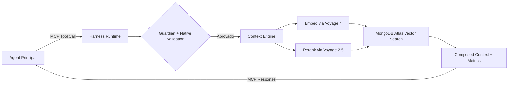


Agentes de IA tradicionais operam em **contextos fragmentados**, gerando alucinações, desperdício de tokens e exposição acidental de segredos. O **Vectora** resolve isso não sendo "mais um chat", mas sim um **[Sub-Agent Tier 2](/concepts/sub-agents/)** projetado exclusivamente para engenharia de software: ele intercepta chamadas via [Protocolo MCP](/protocols/mcp/), valida segurança em tempo real com o [Guardian](/security/guardian/), orquestra recuperação multi-hop via [Context Engine](/concepts/context-engine/) e entrega contexto estruturado ao seu agent principal (Claude Code, Gemini CLI, Cursor, etc.).

> [!IMPORTANT] > **Fórmula Central**:
> `Agente Funcional = Modelo (Gemini 3 Flash) + [Harness Runtime](/concepts/harness-runtime/) + Contexto Governado (Voyage 4 + MongoDB Atlas)`

## O Problema que Vectora Resolve

| Falha em Agents Genéricos      | Impacto Prático                                           | Como Vectora Mitiga                                                                                                                                                                   |
| ------------------------------ | --------------------------------------------------------- | ------------------------------------------------------------------------------------------------------------------------------------------------------------------------------------- |
| **Contexto Raso**              | Busca por "autenticação" retorna 50 arquivos irrelevantes | [Reranker 2.5](/concepts/reranker/) filtra por relevância semântica real, não por similaridade cossena bruta                                                                          |
| **Sem Validação Pré-Execução** | Tool calls perigosos rodam antes de serem auditados       | [Harness Runtime](/concepts/harness-runtime/) intercepta, valida via [Struct Validation](/implementation/security-engine/) e aplica [Guardian](/security/guardian/) antes da execução |
| **Falta de Isolamento**        | Dados de projetos diferentes vazam entre sessões          | [Namespace Isolation](/security/rbac/) via RBAC na aplicação + filtragem obrigatória no backend                                                                                       |
| **Consumo Imprevisível**       | LLMs geram overfetch, gastam tokens em boilerplate        | [Context Engine](/concepts/context-engine/) decide escopo, aplica compaction (head/tail) e injeta só o relevante                                                                      |
| **Segurança Frágil**           | Blocklists dependem de prompts (jailbreakáveis)           | [Hard-Coded Guardian](/security/guardian/) é compilado no binário Go, impossível de bypassar via prompt                                                                               |

## A Solução: Arquitetura de Sub-Agent

Vectora é exposto **exclusivamente via MCP**. Não há CLI de chat, TUI ou interface de conversação direta. Ele opera silenciosamente como camada de governança e contexto:

## Componentes Nucleares

| Módulo                                            | Responsabilidade                                                               | Documentação                                                               |
| ------------------------------------------------- | ------------------------------------------------------------------------------ | -------------------------------------------------------------------------- |
| **[Harness Runtime](/concepts/harness-runtime/)** | Orquestra execução, valida schemas, intercepta tool calls, persiste estado     | Infraestrutura que conecta o LLM ao mundo real, não um framework de testes |
| **[Context Engine](/concepts/context-engine/)**   | Decide escopo (filesystem vs vector), aplica AST parsing, compaction multi-hop | Pipeline `Embed → Search → Rerank → Compose → Validate`                    |
| **[Provider Router](/models/gemini/)**            | Roteia para stack curada, gerencia fallback BYOK, rastreia quota               | Sem camadas genéricas. SDKs oficiais, parsing estável                      |
| **[Tool Executor](/reference/mcp-tools/)**        | Valida args via Strong Typing, executa com retry exponencial, sanitiza output  | Blocklist imutável aplicada antes de qualquer chamada                      |

## Stack Curada & Infraestrutura

Vectora **não é provider-agnóstico**. Operamos com modelos rigorosamente calibrados para garantir consistência de métricas, estabilidade de parsing e custos previsíveis:

| Camada                   | Tecnologia             | Por que escolhemos                                                          | Docs                                             |
| ------------------------ | ---------------------- | --------------------------------------------------------------------------- | ------------------------------------------------ |
| **LLM (Inferência)**     | `gemini-3-flash`       | Latência <30ms, tool calling estável, custo 90% menor vs Pro                | [Gemini 3](/models/gemini/)                      |
| **Embeddings**           | `voyage-4`             | AST-aware, captura similaridade funcional (`validateToken` ≈ `checkJWT`)    | [Voyage 4](/models/voyage/)                      |
| **Reranking**            | `voyage-rerank-2.5`    | Cross-encoder otimizado para código, latência <100ms, precisão +25% vs BM25 | [Reranker](/concepts/reranker/)                  |
| **Vector DB + Metadata** | `MongoDB Atlas`        | Backend unificado (vetores + docs + estado + audit), escalável, sem ETL     | [MongoDB Atlas](/backend/mongodb-atlas/)         |
| **State Persistence**    | Sessions + `AGENTS.md` | Working memory entre chamadas MCP, continuidade de contexto longo           | [State Persistence](/backend/state-persistence/) |

> [!WARNING] > **Vectora Cloud Only**: O Vectora é uma solução 100% baseada em nuvem otimizada para a stack Gemini + Voyage. **Não oferecemos suporte para modelos locais (Ollama, LlamaCpp, etc.)** ou outros provedores genéricos para garantir a precisão do engine.

## Segurança, Governança & BYOK

A segurança no Vectora é implementada **na camada de aplicação**, não delegada ao banco de dados:

| Camada                  | Implementação                                                                                          | Documento                               |
| ----------------------- | ------------------------------------------------------------------------------------------------------ | --------------------------------------- |
| **Guardian Hard-Coded** | Blocklist imutável (`.env`, `.key`, `.pem`, binários, lockfiles) executada antes de qualquer tool call | [Guardian](/security/guardian/)         |
| **Trust Folder**        | Validação de paths com `fs.realpath` + escopo por namespace/projeto                                    | [Trust Folder](/security/trust-folder/) |
| **RBAC Aplicativo**     | Roles (`reader`, `contributor`, `admin`, `auditor`) validadas em runtime                               | [RBAC](/security/rbac/)                 |
| **BYOK ou Managed**     | Chaves do usuário (Free) ou créditos inclusos (Plus)                                                   | [Plano Free](/plans/free/)              |
| **Managed (Plus)**      | Quota gerenciada inclusa nos planos Pro e Team                                                         | [Plano Pro](/plans/pro/)                |

## Planos & Política de Retenção

Vectora opera com modelo **Digital Sovereignty First**, oferecendo **BYOK (Bring Your Own Key)** para controle total ou **Managed (Plus)** para conveniência:

| Plano          | Preço   | Storage                   | API Quota                | Retenção                                          | Docs                         |
| -------------- | ------- | ------------------------- | ------------------------ | ------------------------------------------------- | ---------------------------- |
| **Free**       | $0/mês  | 512MB total               | BYOK puro                | 30 dias inatividade = exclusão do índice vetorial | [Free](/plans/free/)         |
| **Pro**        | $29/mês | 5GB total                 | Unlimited (Plus) ou BYOK | 90 dias pós-cancelamento                          | [Pro](/plans/pro/)           |
| **Team**       | Custom  | Custom                    | Unlimited (Plus) ou BYOK | Política de Compliance                            | [Team](/plans/team/)         |
| **Enterprise** | Custom  | Ilimitado (VPC/Dedicated) | Sob contrato             | Política custom                                   | [Overview](/plans/_index.md) |

> [!NOTE] > **Regras de Retenção**: Contas Free inativas por 30 dias têm o índice vetorial excluído automaticamente. Metadados são preservados por +90 dias para exportação via `vectora export`. Downgrades notificam redução de limites e concedem 7 dias para backup. Detalhes em [Política de Retenção](/plans/retention/).

## Fluxo de Operação (MCP-First)

1. **Detecção**: [Agent Principal](/integrations/mcp-protocol/) identifica necessidade de contexto profundo e dispara `context_search` via MCP.
2. **Interceptação**: [Harness Runtime](/concepts/harness-runtime/) captura chamada, valida namespace e aplica [Guardian](/security/guardian/).
3. **Decisão**: [Context Engine](/concepts/context-engine/) escolhe escopo (filesystem, vector ou híbrido) e aplica AST parsing.
4. **Embed + Rerank**: Query é embedada via `voyage-4`, resultados brutos são refinados por `voyage-rerank-2.5`.
5. **Busca & Compaction**: [MongoDB Atlas](/backend/mongodb-atlas/) retorna top-N com compaction (head/tail + pointers) para evitar context rot.
6. **Resposta Estruturada**: Contexto validado + métricas são retornados ao agent principal, que gera a resposta final ao usuário.

## Por Onde Começar?

| Categoria           | Documento                                                                                                                                                                     | Descrição                                                                         |
| ------------------- | ----------------------------------------------------------------------------------------------------------------------------------------------------------------------------- | --------------------------------------------------------------------------------- |
| **Início Rápido**   | [Getting Started](/getting-started/)                                                                                                                                          | `winget install kaffyn.vectora`, configuração via Systray, integração MCP         |
| **Conceitos**       | [Sub-Agents](/concepts/sub-agents/)                                                                                                                                           | Por que Sub-Agent e não tools MCP passivas? Governança ativa vs funções estáticas |
| **Harness Runtime** | [Harness Runtime](/concepts/harness-runtime/)                                                                                                                                 | Tool Execution, Context Engineering, State Management, Verification Hooks         |
| **Context & RAG**   | [Context Engine](/concepts/context-engine/)                                                                                                                                   | AST parsing, compaction, multi-hop reasoning, hybrid ranking                      |
| **Reranking**       | [Reranker](/concepts/reranker/) · [Reranker Local](/concepts/reranker-local/)                                                                                                 | VectorDB + cross-encoder ou late binding para dados mutáveis, trade-offs de custo |
| **Modelos**         | [Gemini 3](/models/gemini/) · [Voyage 4](/models/voyage/)                                                                                                                     | Stack curada, fallback BYOK, schema de configuração, custos por query             |
| **Backend**         | [MongoDB Atlas](/backend/mongodb-atlas/)                                                                                                                                      | Vector Search, collections, state persistence, isolamento multi-tenant            |
| **Segurança**       | [Guardian](/security/guardian/) · [RBAC](/security/rbac/)                                                                                                                     | Blocklist hard-coded, Trust Folder, sanitização, roles por namespace              |
| **Planos**          | [Overview](/plans/overview/)                                                                                                                                                  | Free/Pro/Team, quota gerenciada, fallback automático, política de retenção        |
| **Integrações**     | [MCP Protocol](/integrations/mcp-protocol/) · [VS Code](/integrations/vscode-extension/) · [ChatGPT](/integrations/chatgpt-plugin/) · [Gemini API](/integrations/gemini-api/) | MCP genérico, extensions, plugins, APIs                                           |
| **Referência**      | [MCP Tools](/reference/mcp-tools/) · [Config YAML](/reference/config-yaml/)                                                                                                   | Schema de tools, config.yaml validado negativamente, códigos de erro              |
| **Implementação**   | [Engineering](/implementation/)                                                                                                                                               | Arquitetura em Golang, Migração de Core, CLI Engine, Systray UX                   |
| **Contribuição**    | [Guidelines](/contributing/guidelines/)                                                                                                                                       | Golang estrito, testes de performance, PRs, roadmap público                       |

---

> **Frase para guardar**:
> _"Vectora não responde ao usuário. Ele entrega contexto governado ao seu agent. Backend gerenciado, API sob sua chave, segurança na aplicação, dados sempre seus."_

## Guia de Navegação

- [**Início Rápido**](./getting-started/) — Instalação, configuração BYOK e integração MCP.
- [**Conceitos Nucleares**](./concepts/) — Entenda Sub-Agents, Context Engine e Reranking.
- [**Segurança & Governança**](./security/) — Detalhes sobre o Guardian, Trust Folder e RBAC.
- [**Autenticação**](./auth/) — Fluxos de SSO, Identidade Unificada e API Keys.
- [**Modelos & Providers**](./models/) — Stack curada com Gemini 3 e Voyage AI.
- [**Backend & Persistência**](./backend/) — MongoDB Atlas, Sessões e State Persistence.
- [**Integrações**](./integrations/) — Como usar com Claude Code, Gemini CLI e Cursor.
- [**Planos & Preços**](./plans/) — Comparativo de recursos e política de retenção.
- [**Referência Técnica**](./reference/) — Schema de ferramentas MCP e Config YAML.
- [**Contribuição**](./contributing/) — Guidelines, padrões de código e roadmap.
- [**Perguntas Frequentes**](./faq/) — Solução de problemas e dúvidas comuns.
- [**Protocolos**](./protocols/) — Especificações do Protocolo MCP no Vectora.

---

Parte do ecossistema Vectora · Open Source (MIT)
