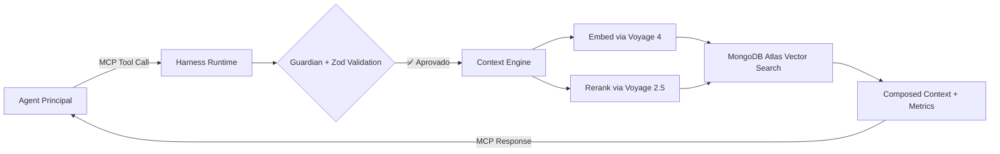



## 🎯 Visão Geral

Agentes de IA tradicionais operam em **contextos fragmentados**, gerando alucinações, desperdício de tokens e exposição acidental de segredos. O **Vectora** resolve isso não sendo "mais um chat", mas sim um **Sub-Agent Tier 2** projetado exclusivamente para engenharia de software: ele intercepta chamadas via [MCP](./protocols/mcp/), valida segurança em tempo real com o [Guardian](./security/guardian/), orquestra recuperação multi-hop via [Context Engine](./concepts/context-engine/) e entrega contexto estruturado ao seu agent principal (Claude Code, Gemini CLI, Cursor, etc.).

> [!IMPORTANT]
> **Fórmula Central**: `Agente Funcional = Modelo (Gemini 3 Flash) + Harness Runtime + Contexto Governado (Voyage 4 + MongoDB Atlas)`

---

## 🔍 O Problema que Vectora Resolve

| Falha em Agents Genéricos      | Impacto Prático                                           | Como Vectora Mitiga                                                                                                                      |
| ------------------------------ | --------------------------------------------------------- | ---------------------------------------------------------------------------------------------------------------------------------------- |
| **Contexto Raso**              | Busca por "autenticação" retorna 50 arquivos irrelevantes | [Reranker 2.5](./concepts/reranker/) filtra por relevância semântica real, não por similaridade cossena bruta                            |
| **Sem Validação Pré-Execução** | Tool calls perigosos rodam antes de serem auditados       | [Harness Runtime](./concepts/harness-runtime/) intercepta, valida schema Zod e aplica [Guardian](./security/guardian/) antes da execução |
| **Falta de Isolamento**        | Dados de projetos diferentes vazam entre sessões          | [Namespace Isolation](./security/rbac/) via RBAC na aplicação + filtragem obrigatória no backend                                         |
| **Consumo Imprevisível**       | LLMs geram overfetch, gastam tokens em boilerplate        | [Context Engine](./concepts/context-engine/) decide escopo, aplica compaction (head/tail) e injeta só o relevante                        |
| **Segurança Frágil**           | Blocklists dependem de prompts (jailbreakáveis)           | [Hard-Coded Guardian](./security/guardian/) é compilado no runtime, impossível de bypassar via prompt                                    |

---

## 🧩 A Solução: Arquitetura de Sub-Agent

Vectora é exposto **exclusivamente via MCP**. Não há CLI de chat, TUI ou interface de conversação direta. Ele opera silenciosamente como camada de governança e contexto:

### Componentes Nucleares

| Módulo              | Responsabilidade                                                               | Documentação                                                                |
| ------------------- | ------------------------------------------------------------------------------ | --------------------------------------------------------------------------- |
| **Harness Runtime** | Orquestra execução, valida schemas, intercepta tool calls, persiste estado     | [./concepts/harness-runtime/](./concepts/harness-runtime/)                  |
| **Context Engine**  | Decide escopo (filesystem vs vector), aplica AST parsing, compaction multi-hop | [./concepts/context-engine/](./concepts/context-engine/)                    |
| **Provider Router** | Roteia para stack curada, gerencia fallback BYOK, rastreia quota               | [./models/gemini/](./models/gemini/) · [./models/voyage/](./models/voyage/) |
| **Tool Executor**   | Valida args via Zod, executa com retry exponencial, sanitiza output            | [./reference/mcp-tools/](./reference/mcp-tools/)                            |

---

## 📦 Stack Curada & Infraestrutura

Vectora **não é provider-agnóstico**. Operamos com modelos rigorosamente calibrados para garantir consistência de métricas, estabilidade de parsing e custos previsíveis:

| Camada                   | Tecnologia           | Por que escolhemos                                                          | Docs                                                         |
| ------------------------ | -------------------- | --------------------------------------------------------------------------- | ------------------------------------------------------------ |
| **LLM (Inferência)**     | `gemini-3-flash`     | Latência <30ms, tool calling estável, custo 90% menor vs Pro                | [./models/gemini/](./models/gemini/)                         |
| **Embeddings**           | `voyage-4`           | AST-aware, captura similaridade funcional (`validateToken` ≈ `checkJWT`)    | [./models/voyage/](./models/voyage/)                         |
| **Reranking**            | `voyage-rerank-2.5`  | Cross-encoder otimizado para código, latência <100ms, precisão +25% vs BM25 | [./concepts/reranker/](./concepts/reranker/)                 |
| **Vector DB + Metadata** | `MongoDB Atlas`      | Backend unificado (vetores + docs + estado + audit), escalável, sem ETL     | [./backend/mongodb-atlas/](./backend/mongodb-atlas/)         |
| **State Persistence**    | Sessions + AGENTS.md | Working memory entre chamadas MCP, continuidade de contexto longo           | [./backend/state-persistence/](./backend/state-persistence/) |

> [!WARNING]
> **Sem suporte a fallbacks genéricos**: Vectora não integra OpenAI, Anthropic, OpenRouter ou modelos locais. A calibração do [Harness Runtime](./concepts/harness-runtime/) depende estritamente dessa stack. Para multi-provider, use [tools MCP padrão do mercado](./reference/mcp-tools/#modo-tools-only).

---

## 🛡️ Segurança, Governança & BYOK

A segurança no Vectora é implementada **na camada de aplicação**, não delegada ao banco de dados:

| Camada                  | Implementação                                                                                          | Documento                                            |
| ----------------------- | ------------------------------------------------------------------------------------------------------ | ---------------------------------------------------- |
| **Guardian Hard-Coded** | Blocklist imutável (`.env`, `.key`, `.pem`, binários, lockfiles) executada antes de qualquer tool call | [./security/guardian/](./security/guardian/)         |
| **Trust Folder**        | Validação de paths com `fs.realpath` + escopo por namespace/projeto                                    | [./security/trust-folder/](./security/trust-folder/) |
| **RBAC Aplicativo**     | Roles (`reader`, `contributor`, `admin`, `auditor`) validadas em runtime                               | [./security/rbac/](./security/rbac/)                 |
| **BYOK Obrigatório**    | `GEMINI_API_KEY` + `VOYAGE_API_KEY` são fornecidas pelo usuário em todos os planos                     | [./plans/free/](./plans/free/)                       |
| **Fallback Automático** | Quota gerenciada esgota → roteia silenciosamente para BYOK sem interrupção                             | [./plans/pro/](./plans/pro/)                         |

---

## 💰 Planos & Política de Retenção

Vectora opera com modelo **BYOK First**, onde o backend (MongoDB Atlas) é gerenciado pela Kaffyn em todos os planos, mas as chaves de API são do usuário:

| Plano             | Preço                  | Storage                   | API Quota                                   | Retenção                                          | Docs                                   |
| ----------------- | ---------------------- | ------------------------- | ------------------------------------------- | ------------------------------------------------- | -------------------------------------- |
| 🟢 **Free**       | $0/mês                 | 512MB total               | BYOK puro                                   | 30 dias inatividade = exclusão do índice vetorial | [./plans/free/](./plans/free/)         |
| 🔵 **Pro**        | ~$20/mês               | 10GB total                | 500k tokens + 100k vetores/mês              | 90 dias pós-cancelamento                          | [./plans/pro/](./plans/pro/)           |
| 🟣 **Team**       | $5 base + $15/user/mês | 50GB total                | Pool compartilhado + fallback BYOK por user | 180 dias pós-cancelamento                         | [./plans/team/](./plans/team/)         |
| ⚫ **Enterprise** | Custom                 | Ilimitado (VPC/Dedicated) | Sob contrato                                | Política custom                                   | [./plans/overview/](./plans/overview/) |

> [!NOTE]
> **Regras de Retenção**: Contas Free inativas por 30 dias têm o índice vetorial excluído automaticamente. Metadados são preservados por +90 dias para exportação via `vectora export`. Downgrades notificam redução de limites e concedem 7 dias para backup. Detalhes em [./plans/retention/](./plans/retention/).

---

## 🔄 Fluxo de Operação (MCP-First)

1. **Detecção**: [Agent Principal](./integrations/claude-code/) identifica necessidade de contexto profundo e dispara `context_search` via MCP.
2. **Interceptação**: [Harness Runtime](./concepts/harness-runtime/) captura chamada, valida namespace e aplica [Guardian](./security/guardian/).
3. **Decisão**: [Context Engine](./concepts/context-engine/) escolhe escopo (filesystem, vector ou híbrido) e aplica AST parsing.
4. **Embed + Rerank**: Query é embedada via `voyage-4`, resultados brutos são refinados por `voyage-rerank-2.5`.
5. **Busca & Compaction**: [MongoDB Atlas](./backend/mongodb-atlas/) retorna top-N com compaction (head/tail + pointers) para evitar context rot.
6. **Resposta Estruturada**: Contexto validado + métricas são retornados ao agent principal, que gera a resposta final ao usuário.

---

## 🧭 Por Onde Começar?

| Categoria              | Documento                                                                                                             | Descrição                                                                         |
| ---------------------- | --------------------------------------------------------------------------------------------------------------------- | --------------------------------------------------------------------------------- |
| 🚀 **Início Rápido**   | [./getting-started/installation/](./getting-started/installation/)                                                    | `npm install -g vectora-agent`, configuração BYOK, integração MCP                 |
| 🧠 **Conceitos**       | [./concepts/sub-agents/](./concepts/sub-agents/)                                                                      | Por que Sub-Agent e não tools MCP passivas? Governança ativa vs funções estáticas |
| 🔄 **Harness Runtime** | [./concepts/harness-runtime/](./concepts/harness-runtime/)                                                            | Tool Execution, Context Engineering, State Management, Verification Hooks         |
| 🔍 **Context & RAG**   | [./concepts/context-engine/](./concepts/context-engine/)                                                              | AST parsing, compaction, multi-hop reasoning, hybrid ranking                      |
| 🎯 **Reranking**       | [./concepts/reranker/](./concepts/reranker/)                                                                          | Pipeline Embed → Search → Rerank → LLM, métricas de precisão                      |
| 📚 **Modelos**         | [./models/gemini/](./models/gemini/) · [./models/voyage/](./models/voyage/)                                           | Stack curada, fallback BYOK, schema de configuração, custos por query             |
| 🗄️ **Backend**         | [./backend/mongodb-atlas/](./backend/mongodb-atlas/)                                                                  | Vector Search, collections, state persistence, isolamento multi-tenant            |
| 🔐 **Segurança**       | [./security/guardian/](./security/guardian/) · [./security/rbac/](./security/rbac/)                                   | Blocklist hard-coded, Trust Folder, sanitização, roles por namespace              |
| 💳 **Planos**          | [./plans/overview/](./plans/overview/)                                                                                | Free/Pro/Team, quota gerenciada, fallback automático, política de retenção        |
| 🔌 **Integrações**     | [./integrations/claude-code/](./integrations/claude-code/) · [./integrations/gemini-cli/](./integrations/gemini-cli/) | Configuração MCP, extensões IDE, agents customizados                              |
| 📖 **Referência**      | [./reference/mcp-tools/](./reference/mcp-tools/) · [./reference/config-yaml/](./reference/config-yaml/)               | Schema de tools, config.yaml validado por Zod, códigos de erro                    |
| 🤝 **Contribuição**    | [./contributing/guidelines/](./contributing/guidelines/)                                                              | TypeScript estrito, testes Harness primeiro, PRs, roadmap público                 |

---

> 💡 **Frase para guardar**:  
> _"Vectora não responde ao usuário. Ele entrega contexto governado ao seu agent. Backend gerenciado, API sob sua chave, segurança na aplicação, dados sempre seus."_

---

_Parte do ecossistema Vectora · Open Source (MIT) · TypeScript_  
_Backend Unificado: MongoDB Atlas (vetores + metadados + estado) — gerenciado pela Kaffyn_  
_Stack Curada: Gemini 3 Flash (LLM) + Voyage 4 (embeddings) + Voyage Rerank 2.5 (precisão)_  
_Interface: Exclusivamente MCP. Sub-agent silencioso, sem CLI de chat._  
_Segurança: Camada de aplicação (Guardian + RBAC lógico) + criptografia de infra_  
_Versão: 3.0.0 | Última revisão: Q2 2026_
