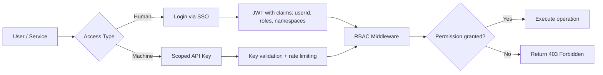



## Authentication and Authorization in Vectora

The Vectora authentication layer ensures that only authorized users and services can access resources, namespaces, and sensitive operations. This section documents the identity mechanisms, API key management, and access control that protect your context infrastructure.

> [!IMPORTANT] > **Application-level security, not database-level**: Vectora implements RBAC, namespace validation, and sanitization in the application layer (`Guardian`, `RBAC Logic`). The backend (MongoDB Atlas) stores data; the application decides who can access what.

---

### Topics in this section

| Page                                 | Description                                                                                                    |
| ------------------------------------ | -------------------------------------------------------------------------------------------------------------- |
| [SSO / Unified Identity](/auth/sso/) | Centralized authentication, session management, and integration with external providers (GitHub, Google, SAML) |
| [API Keys](/auth/api-keys/)          | Creation, rotation, and scopes of API keys for programmatic integration with Vectora                           |

---

### Typical Authentication Flow



---

### Fundamental Concepts

| Term             | Definition                                                                                  |
| ---------------- | ------------------------------------------------------------------------------------------- |
| **Namespace**    | Logical isolation of data and operations; each project/team has its own namespace           |
| **RBAC**         | Role-Based Access Control: roles like `reader`, `contributor`, `admin` define permissions   |
| **API Key**      | Access token for programmatic integration, with granular scopes (`read`, `write`, `search`) |
| **JWT**          | Signed JSON Web Token that carries identity and permission claims                           |
| **Trust Folder** | Filesystem scope allowed for operations; validated before any tool call                     |

---

### Security Best Practices

**Use API Keys with minimal scope**: Grant only `read` if the integration doesn't need to write  
 **Periodic key rotation**: Renew API Keys every 90 days or after incidents  
 **Validate namespaces in each call**: Don't trust only the token; revalidate scope at runtime  
 **Monitor audit logs**: Use `audit_logs` to detect anomalous access  
 **Never expose keys in the client**: API Keys belong to the backend or the main agent, never to the browser

> [!WARNING] > **Hard-coded Blocklist**: Files like `.env`, `.key`, `.pem` are blocked by `Guardian` before any processing — regardless of authentication. Security by code, not by configuration.

---

### Integration with Your System

#### Example: JWT Validation in Your Backend

```ts
// Example: JWT validation middleware
import { verifyJWT } from "@vectora/auth";

export async function authMiddleware(req: Request, next: Handler) {
  const token = req.headers.get("Authorization")?.replace("Bearer ", "");
  if (!token) return next({ status: 401, error: "Missing token" });

  try {
    const claims = await verifyJWT(token, { audience: "vectora-api" });
    req.context = { userId: claims.sub, roles: claims.roles, namespaces: claims.namespaces };
    return next();
  } catch {
    return next({ status: 403, error: "Invalid token" });
  }
}
```

#### Example: Using API Key in MCP Call

```json
{
  "mcpServers": {
    "vectora": {
      "command": "npx",
      "args": ["vectora-agent", "mcp-serve"],
      "env": {
        "VECTORA_API_KEY": "vca_live_...",
        "VECTORA_NAMESPACE": "my-project"
      }
    }
  }
}
```

---

### Frequently Asked Questions

**Q: Do I need SSO to use Vectora?**  
A: No. The Free plan uses local authentication via `vectora auth login`. SSO is available in Pro/Team plans for integration with corporate providers.

**Q: Can I use my own auth infrastructure?**  
A: Yes. Vectora accepts any valid JWT configured via `auth.jwt.publicKey`. See [SSO](/auth/sso/) for custom integration details.

**Q: How do I revoke a compromised API Key?**  
A: Via the dashboard (`/settings/api-keys`) or CLI: `vectora api-key revoke --id <key_id>`. Revocation is immediate across all nodes.

**Q: Does Vectora store my credentials?**  
A: No. API keys are stored as hashes (bcrypt). JWT tokens are validated but not persisted. Provider credentials (Gemini, Voyage) are provided via BYOK and are never touched by Kaffyn.

---

> **Key Takeaway**:  
> _"Authentication verifies who you are. Authorization defines what you can do. Vectora applies both to every tool call — not just at login."_
