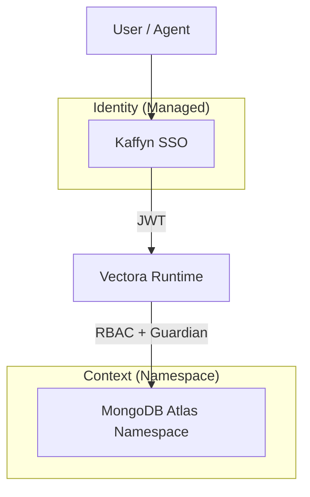


**Kaffyn SSO** is the centralized identity layer that connects all components of the Vectora ecosystem. It ensures that your context, permissions, and quotas are consistent across any environment, whether it's your work IDE or your personal laptop.

## Unified Identity (Kaffyn SSO)

> [!IMPORTANT]
> Kaffyn SSO is a **managed (SaaS)** offering. It is exclusive to Pro, Team, and Enterprise plans. In the **Free** plan, authentication is local and isolated per device via `vectora auth login`.

## Identity Architecture

Unlike traditional systems, identity in Vectora is decoupled from data storage to ensure maximum security:

SSO acts as the decision point for:

1. **Identification**: Who are you and which organization do you belong to?
2. **Authorization**: Which namespaces can you read or write to?
3. **Quota Management**: How much storage and processing remains for your plan?
4. **Governance**: Centralized audit logs per user.

## Key Features

| Feature                   | Description                                               | Availability      |
| ------------------------- | --------------------------------------------------------- | ----------------- |
| **Social Login**          | Fast authentication via GitHub or Google                  | Pro / Team        |
| **SAML/OIDC Integration** | Connect your corporate provider (Okta, Azure AD, Auth0)   | Team / Enterprise |
| **Unified Session**       | Single login that persists across IDE, CLI, and Dashboard | Pro / Team        |
| **API Key Management**    | Centralized interface to create and revoke keys           | Pro / Team        |
| **Granular RBAC**         | Role assignment such as `admin`, `contributor`, `reader`  | Team              |

## Security: "Air Gap" Architecture

To protect your privacy, identity data (email, profiles) is kept on infrastructure isolated from your code content (embeddings and metadata). Even in the event of a processing cluster compromise, your payment credentials and identity remain protected in Kaffyn's global layer.

| Layer        | Technology             | What it stores                   |
| ------------ | ---------------------- | -------------------------------- |
| **Identity** | SaaS Identity Provider | UUID, email, OAuth profiles      |
| **Session**  | Signed JWT             | Permission claims, expiration    |
| **Context**  | MongoDB Atlas          | Embeddings, AST, code (redacted) |

## Agent Login Flow

To authenticate your local environment:

1. Run: `vectora auth login`
2. Your browser will automatically open the Kaffyn login page.
3. After successful login (GitHub, Google, or Email), a JWT token is generated.
4. Vectora stores this token securely and use it to sign all subsequent MCP calls.

> [!TIP]
> The JWT token has automatic renewal. You will only need to log in manually if the session is revoked or after long periods of inactivity.

## Frequently Asked Questions

**Q: Can I self-host the SSO?**
A: No. Kaffyn SSO is the service layer that allows multi-tenant orchestration. For 100% offline scenarios or without dependency on Kaffyn, use the **Local** mode of the agent with pure BYOK.

**Q: Does the SSO have access to my code?**
A: No. The SSO only manages your **identity and permissions**. Code traffic and search occurs between your local agent and the MongoDB backend (also isolated by your namespace), governed by the [Guardian](/security/guardian/) logic.

**Q: How do roles work in the Team plan?**
A: The team administrator invites members. Each member has their own SSO identity, but namespace access permissions are defined by roles: `reader` (search only), `contributor` (can index new files), and `admin` (full management).

---

> **Phrase to remember**:
> _"SSO says who you are. RBAC says where you can go. Vectora ensures you only see what is yours."_
