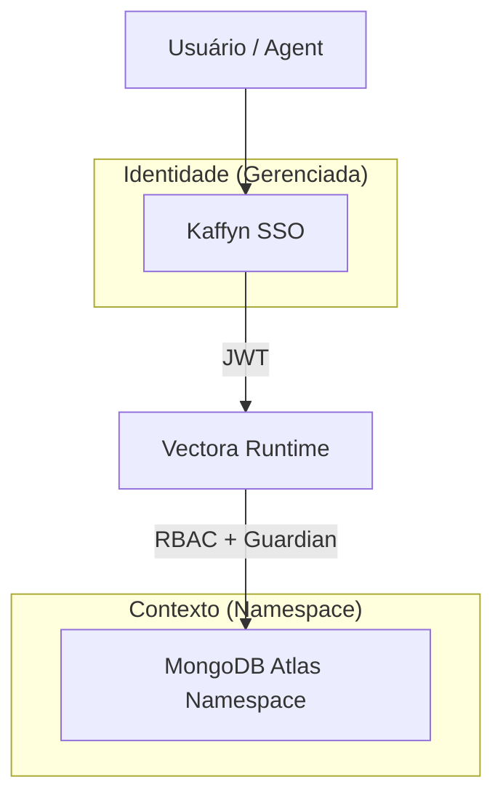



## 🆔 Identidade Unificada (Kaffyn SSO)

O **Kaffyn SSO** é a camada de identidade centralizada que conecta todos os componentes do ecossistema Vectora. Ele garante que seu contexto, permissões e quotas sejam consistentes em qualquer ambiente, seja na IDE do trabalho ou no seu notebook pessoal.

> [!IMPORTANT]
> O Kaffyn SSO é uma oferta **gerenciada (SaaS)**. Ele é exclusivo para os planos Pro, Team e Enterprise. No plano **Free**, a autenticação é local e isolada por dispositivo via `vectora auth login`.

---

### 🏛️ Arquitetura de Identidade

Diferente de sistemas tradicionais, a identidade no Vectora é desacoplada do armazenamento de dados para garantir máxima segurança:

O SSO atua como o ponto de decisão para:

1. **Identificação**: Quem é você e a qual organização pertence?
2. **Autorização**: Quais namespaces você pode ler ou escrever?
3. **Gestão de Quota**: Quanto armazenamento e processamento resta para seu plano?
4. **Governança**: Logs de auditoria centralizados por usuário.

---

### 🧩 Funcionalidades Principais

| Recurso                  | Descrição                                                 | Disponibilidade   |
| ------------------------ | --------------------------------------------------------- | ----------------- |
| **Login Social**         | Autenticação rápida via GitHub ou Google                  | Pro / Team        |
| **Integração SAML/OIDC** | Conecte seu provedor corporativo (Okta, Azure AD, Auth0)  | Team / Enterprise |
| **Sessão Unificada**     | Login único que persiste entre IDE, CLI e Dashboard       | Pro / Team        |
| **Gestão de API Keys**   | Interface centralizada para criar e revogar chaves        | Pro / Team        |
| **RBAC Granular**        | Atribuição de roles como `admin`, `contributor`, `reader` | Team              |

---

### 🔐 Segurança: Arquitetura "Air Gap"

Para proteger sua privacidade, os dados de identidade (e-mail, perfis) são mantidos em uma infraestrutura isolada do seu conteúdo de código (embeddings e metadados). Mesmo em caso de comprometimento de um cluster de processamento, suas credenciais de pagamento e identidade permanecem protegidas na camada global da Kaffyn.

| Camada         | Tecnologia      | O que armazena                     |
| -------------- | --------------- | ---------------------------------- |
| **Identidade** | Identidade SaaS | UUID, e-mail, perfis OAuth         |
| **Sessão**     | JWT assinado    | Claims de permissão, expiração     |
| **Contexto**   | MongoDB Atlas   | Embeddings, AST, código (redigido) |

---

### 🔄 Fluxo de Login do Agente

Para autenticar seu ambiente local:

1. Execute: `vectora auth login`
2. O navegador abrirá automaticamente a página de login da Kaffyn.
3. Após login bem-sucedido (GitHub, Google ou E-mail), um token JWT é gerado.
4. O Vectora armazena esse token de forma segura e o utiliza para assinar todas as chamadas MCP subsequentes.

> [!TIP]
> O token JWT tem renovação automática. Você só precisará fazer login manualmente se a sessão for revogada ou após longos períodos de inatividade.

---

### ❓ Perguntas Frequentes

**P: Posso fazer self-host do SSO?**  
R: Não. O Kaffyn SSO é a camada de serviço que permite a orquestração multi-tenant. Para cenários 100% offline ou sem dependência da Kaffyn, use o modo **Local** do agente com BYOK puro.

**P: O SSO tem acesso ao meu código?**  
R: Não. O SSO gerencia apenas sua **identidade e permissões**. O tráfego de código e busca ocorre entre seu agente local e o backend MongoDB (também isolado por seu namespace), governado pela lógica do [Guardian](/security/guardian/).

**P: Como funcionam as roles no plano Team?**  
R: O administrador do time convida membros. Cada membro tem sua identidade SSO, mas as permissões de acesso ao namespace do time são definidas por roles: `reader` (apenas busca), `contributor` (pode indexar novos arquivos) e `admin` (gestão total).

---

> 💡 **Frase para lembrar**:  
> _"O SSO diz quem você é. O RBAC diz onde você pode entrar. O Vectora garante que você só veja o que é seu."_
