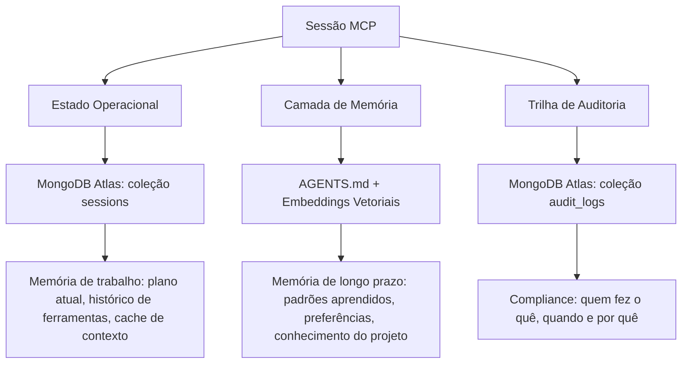
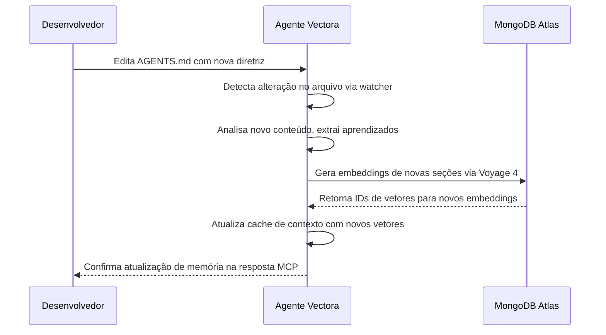




A camada de persistência de estado do Vectora garante que os agentes mantenham continuidade entre interações, permitindo tarefas de longo prazo, aprendizado incremental e consciência contextual que sobrevive a reinicializações da IDE, desconexões de MCP e reboots do sistema.

Diferente de sistemas RAG tradicionais que tratam cada consulta como independente, o Vectora trata o estado como uma prioridade de primeira classe: o que o agente aprendeu ontem informa o que ele faz hoje.

## Mantendo Contexto Entre Sessões

## Visão Geral da Arquitetura

O estado no Vectora é gerenciado através de três mecanismos complementares:



## Estado Operacional (coleção sessions)

Estado de curta duração que rastreia o contexto de execução atual:

| Campo           | Tipo      | Descrição                                                          |
| --------------- | --------- | ------------------------------------------------------------------ |
| `session_id`    | string    | Identificador único para a sessão MCP                              |
| `user_id`       | string    | Usuário autenticado através do Kaffyn SSO                          |
| `namespace`     | string    | Contexto isolado de projeto/workspace                              |
| `current_plan`  | object    | Plano de execução ativo com etapas e dependências                  |
| `tool_history`  | array     | Sequência de chamadas de ferramentas com entradas, saídas e timing |
| `context_cache` | object    | Embeddings pré-buscados, ASTs analisadas e dependências resolvidas |
| `created_at`    | timestamp | Hora de início da sessão                                           |
| `last_activity` | timestamp | Última interação MCP (usada para limpeza TTL)                      |

## Camada de Memória (AGENTS.md + embeddings)

Conhecimento de longo prazo que persiste além de sessões individuais:

- **AGENTS.md**: Arquivo de memória legível por humanos armazenado na raiz do projeto, contendo padrões aprendidos, preferências e diretrizes específicas do projeto.
- **Embeddings vetoriais**: Representação semântica do conteúdo do AGENTS.md indexada no MongoDB Atlas para recuperação durante a construção do contexto.
- **Atualizações incrementais**: Novos aprendizados são anexados ao AGENTS.md e re-embedados sem re-indexar o arquivo inteiro.

## Trilha de Auditoria (coleção audit_logs)

Registros imutáveis de ações do agente para compliance e depuração:

| Campo             | Tipo      | Descrição                                                                  |
| ----------------- | --------- | -------------------------------------------------------------------------- |
| `log_id`          | string    | Identificador único de registro de auditoria                               |
| `session_id`      | string    | Referência à sessão de origem                                              |
| `action`          | string    | Nome da ferramenta ou evento de sistema                                    |
| `input_hash`      | string    | SHA-256 dos argumentos da ferramenta (nunca armazena segredos brutos)      |
| `output_metadata` | object    | Metadados de resultado não sensíveis (status, duração, contagem de tokens) |
| `security_flags`  | array     | Validações do Guardian, verificações de blocklist, eventos de sanitização  |
| `timestamp`       | timestamp | Hora precisa do evento com resolução de milissegundos                      |

## Gerenciamento de Ciclo de Vida da Sessão

## Criação de Sessão

Quando um cliente MCP se conecta:

1. O Vectora valida o JWT do Kaffyn SSO.
2. Verifica sessões ativas existentes para este `user_id` + `namespace`.
3. Cria um novo documento de sessão com estrutura padrão de `current_plan`.
4. Carrega o AGENTS.md se presente e atualiza o cache de contexto.
5. Retorna o `session_id` ao cliente para solicitações subsequentes.

## Continuação de Sessão

Para interações contínuas:

1. O cliente inclui o `session_id` nos cabeçalhos da solicitação MCP.
2. O Vectora carrega o estado operacional do MongoDB Atlas.
3. Atualiza o timestamp `last_activity` para evitar a limpeza TTL.
4. Executa a chamada da ferramenta com consciência contextual completa.
5. Persiste o estado atualizado antes de responder.

## Limpeza de Sessão

Manutenção automática via índices TTL do MongoDB:

```yaml
# Configuração TTL do MongoDB Atlas
sessions:
  ttl_field: "last_activity"
  ttl_seconds: 86400 # 24 horas de inatividade

audit_logs:
  ttl_field: "timestamp"
  ttl_seconds: 7776000 # retenção de 90 dias (configurável por plano)
```

Limpeza manual via CLI:

```bash
# Deletar sessões expiradas para um namespace
vectora state cleanup --namespace meu-projeto --dry-run

# Forçar a deleção de uma sessão específica
vectora state delete --session-id sess_abc123

# Exportar o estado da sessão antes da deleção
vectora state export --session-id sess_abc123 --output ./backup.json
```

## AGENTS.md: Interface de Memória Humano-Máquina

O AGENTS.md serve como ponte entre a compreensão humana e a memória do agente:

## Estrutura

```markdown
# Memória do Projeto: meu-projeto

## Padrões Aprendidos

- Fluxos de autenticação usam JWT com expiração de 1 hora
- Conexões de banco de dados usam connection pooling com máximo de 10 conexões
- Tratamento de erros segue o padrão Result<T, E>

## Preferências

- Preferir composição funcional sobre herança de classes
- Usar modo estrito de TypeScript para todos os novos arquivos
- Níveis de log: debug para desenvolvimento, info para produção

## Diretrizes do Projeto

- Todos os endpoints de API devem incluir anotações OpenAPI
- Testes devem atingir 80% de cobertura de ramificação
- Revisões de segurança necessárias para qualquer alteração relacionada a autenticação
```

## Fluxo de Integração



## Considerações de Segurança

- O AGENTS.md está sujeito à mesma blocklist do Guardian que outros arquivos: padrões `.env`, `.key`, `.pem` nunca são embedados.
- Conteúdo sensível detectado via regex é redigido antes da geração do embedding.
- O isolamento de namespace garante que o AGENTS.md de um projeto nunca influencie outro.

## Integração com Harness: Validando Gerenciamento de Estado

O Harness Runtime inclui testes específicos para persistência de estado:

```yaml
# tests/state/session-continuity.yaml
id: "state-session-continuity"
name: "Agente mantém plano após desconexões de MCP"

task:
  prompt: "Continue refatorando o módulo de autenticação de onde paramos"
  session_id: "${PREVIOUS_SESSION_ID}"

context:
  providers: [vectora]
  namespace: auth-service
  load_agents_md: true

expectations:
  state:
    plan_resumed: true
    tool_history_preserved: true
    context_cache_reused: true
  output:
    references_previous_steps: true
    avoids_redundant_work: true

evaluation:
  judge_config: { method: "hybrid", judge_model: "gemini-3-flash" }
  scoring:
    weights: { correctness: 0.40, performance: 0.30, maintainability: 0.30 }
  thresholds: { pass_score: 0.75 }
```

## Referência de Configuração

## vectora.config.yaml

```yaml
state:
  # Gerenciamento de sessão
  session:
    ttl_hours: 24 # Tempo limite de inatividade antes da limpeza
    max_concurrent: 5 # Limite de sessões por usuário/namespace
    persist_on_exit: true # Salva o estado quando a conexão MCP fecha

  # Camada de memória
  memory:
    agents_file: "AGENTS.md" # Caminho relativo à raiz do projeto
    auto_update: true # Atualiza automaticamente embeddings de novo conteúdo do AGENTS.md
    embedding_model: "voyage-4" # Modelo para embeddings de memória
    max_memory_tokens: 4096 # Limite de contexto injetado a partir da memória

  # Configurações de auditoria
  audit:
    enabled: true
    retain_days: 90 # Período de retenção para logs de auditoria
    redact_patterns: # Padrões regex adicionais para redigir
      - "password\\s*[:=]\\s*['\"]?[^'\"\\s]+"
      - "api[_-]?key\\s*[:=]\\s*['\"]?[^'\"\\s]+"

  # Conexão com backend (gerenciada pela Kaffyn)
  mongodb:
    database: "vectora"
    collections:
      sessions: "sessions"
      audit: "audit_logs"
      memory_vectors: "memory_embeddings"
```

## Otimizações de Performance

## Estratégia de Cache de Contexto

Para minimizar a latência durante a continuação da sessão:

- **Evicção LRU**: Mantém os embeddings acessados mais recentemente na memória.
- **Prefetching**: Carrega contexto provavelmente necessário baseado na etapa atual do plano.
- **Atualizações Delta**: Re-embeda apenas seções alteradas do AGENTS.md, não o arquivo inteiro.

## Operações em Lote

Operações do MongoDB são feitas em lote para maior eficiência:

```typescript
// packages/core/src/state/batch-operations.ts
export async function updateSessionState(sessionId: string, updates: StateUpdate[]): Promise<void> {
  // Agrupa atualizações por coleção para operações em lote
  const byCollection = groupByCollection(updates);

  // Executa bulk writes com ordered=false para paralelismo
  await Promise.all(
    Object.entries(byCollection).map(([collection, ops]) =>
      mongodb.collection(collection).bulkWrite(ops, { ordered: false }),
    ),
  );
}
```

## Solução de Problemas

## Sessão Não Encontrada

```text
Error: Session sess_abc123 not found for namespace auth-service
```

Causas possíveis:

- Sessão expirada devido à limpeza TTL (verifique o timestamp `last_activity`).
- Incompatibilidade de namespace entre a solicitação do cliente e a sessão armazenada.
- Problema de conectividade com o MongoDB Atlas.

Resolução:

```bash
# Verificar se a sessão existe
vectora state list --namespace auth-service

# Verificar conectividade com MongoDB
vectora health check --component mongodb

# Reconectar com uma nova sessão
vectora auth refresh
```

## AGENTS.md Não Atualizando a Memória

```text
Warning: AGENTS.md changes detected but memory not updated
```

Causas possíveis:

- Cota de embedding esgotada (verifique os limites do plano).
- Blocklist do Guardian impediu o embedding do novo conteúdo.
- API da Voyage temporariamente indisponível.

Resolução:

```bash
# Verificar o status da cota de embedding
vectora quota status --component embeddings

# Acionar manualmente a atualização de memória
vectora memory sync --file AGENTS.md

# Revisar logs do Guardian para conteúdo bloqueado
vectora logs --filter guardian --namespace auth-service
```

## Logs de Auditoria Faltando Entradas

```text
Warning: Expected audit entry for tool_call not found
```

Causas possíveis:

- Log de auditoria desabilitado na configuração.
- Write concern do MongoDB não atingido (problema de rede).
- Limpeza de sessão deletou registros de auditoria relacionados prematuramente.

Resolução:

```bash
# Verificar configuração de auditoria
vectora config get state.audit.enabled

# Verificar operações de escrita do MongoDB
vectora health check --component mongodb --verbose

# Revisar configurações de TTL para a coleção audit_logs
vectora config get state.audit.retain_days
```

## FAQ

P: Posso desabilitar a persistência de estado para projetos sensíveis à privacidade?
R: Sim. Configure `state.session.persist_on_exit: false` e `state.audit.enabled: false` no vectora.config.yaml. Note que isso desabilita a continuidade da sessão e os logs de conformidade.

P: Como o AGENTS.md é diferente da documentação regular do projeto?
R: O AGENTS.md é especificamente analisado e embedado para a memória do agente. Arquivos de documentação regulares são indexados através do pipeline RAG padrão. O conteúdo do AGENTS.md recebe maior prioridade durante a construção do contexto.

P: O que acontece com o estado quando eu mudo do plano Pro para o Free?
R: Sessões e logs de auditoria são mantidos por 90 dias conforme a política de retenção. Se o seu uso exceder os limites do nível Free, novas gravações de estado serão bloqueadas até que você faça o upgrade ou libere espaço. Os dados existentes permanecem acessíveis para exportação.

P: Vários agentes podem compartilhar o mesmo AGENTS.md?
R: Sim, dentro do mesmo namespace. O AGENTS.md tem escopo de projeto, não de usuário. Todos os agentes operando no namespace "auth-service" verão o mesmo arquivo de memória. Use namespaces separados para isolamento.

P: Como faço para migrar o estado entre regiões do MongoDB Atlas?
R: Use o fluxo de exportação/importação:

```bash
# Exportar da região de origem
vectora state export --namespace meu-projeto --output ./state-backup.json

# Importar para a região de destino
vectora state import --namespace meu-projeto --input ./state-backup.json --region us-east-1
```

Frase para lembrar:
"A persistência de estado transforma consultas isoladas em colaboração contínua. O estado operacional rastreia o agora, a memória preserva o aprendido e a auditoria garante a responsabilidade."
