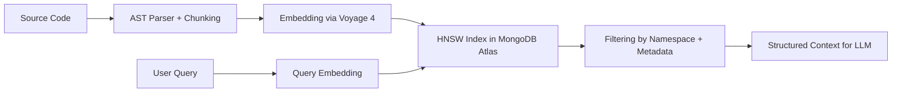
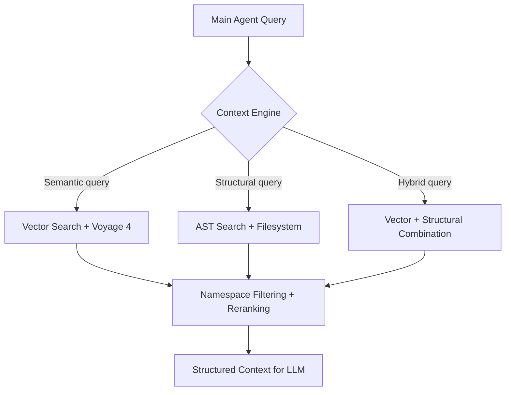



## Vector Search Fundamentals

Vector search is the core mechanism that allows Vectora to retrieve semantically relevant context in complex codebases. Unlike keyword-based text searches, vector search operates in semantic space, capturing functional similarity between code concepts.

### How It Works

1. **Embedding**: Code snippets are transformed into high-dimensional numerical vectors using the `voyage-4` model.
2. **Indexing**: Vectors are stored in MongoDB Atlas with an HNSW index for Approximate Nearest Neighbor (ANN) search.
3. **Query**: A query is converted into an embedding and compared against the index to find the most similar vectors.
4. **Filtering**: Results are filtered by namespace, visibility, and structural metadata before being returned to the agent.



### Why Vector Search for Code

Traditional text searches fail in software engineering scenarios because:

- **Lexical similarity does not imply functional similarity**: `validateToken` and `checkJWT` might be semantically equivalent but lexically distinct.
- **Boilerplate generates noise**: Files with similar structures but different logic appear relevant.
- **Implicit dependencies are not captured**: Imports, function calls, and architectural patterns require structural understanding.

Specialized code embeddings, such as `voyage-4`, are trained on billions of snippets and capture:

- Functional similarity between implementations
- Recurring architectural patterns
- Relationships between imports and dependencies
- Semantic context from comments and docstrings

---

## Vector Search Architecture in Vectora

### Unified Backend: MongoDB Atlas

Vectora uses MongoDB Atlas as a unified backend for vectors, metadata, and operational state. This choice eliminates the need for synchronization between separate systems and ensures atomic consistency between embeddings and their associated metadata.

| Component          | Implementation                            | Benefit                                              |
| ------------------ | ----------------------------------------- | ---------------------------------------------------- |
| **Vector Index**   | HNSW with cosine metric                   | ANN search with logarithmic complexity               |
| **Vector Storage** | `embedding_vector` field in BSON document | Vector and metadata in the same document             |
| **Filtering**      | Native Atlas payload filtering            | Filter by namespace before vector search             |
| **Scalability**    | Automatic Atlas sharding                  | Scale from MBs to TBs without manual reconfiguration |

### Atlas Document Structure

Each indexed code chunk is stored as a MongoDB document with the following structure:

```json
{
  "_id": "ObjectId(...)",
  "namespace_id": "auth-service",
  "file_path": "src/auth/jwt_validator.go",
  "start_line": 45,
  "end_line": 78,
  "content": "func ValidateToken(token string) error { ... }",
  "ast_metadata": {
    "function_name": "ValidateToken",
    "imports": ["github.com/golang-jwt/jwt"],
    "dependencies": ["ParseToken", "VerifySignature"]
  },
  "embedding_vector": [0.023, -0.145, ..., 0.089],
  "visibility": "private",
  "indexed_at": "2026-04-18T22:30:00Z",
  "checksum": "sha256:abc123..."
}
```

### HNSW Index Configuration

Vectora configures HNSW indices in MongoDB Atlas with parameters optimized for codebases:

```yaml
# Default vector index configuration
vector_index:
  name: "vector_search_index"
  path: "embedding_vector"
  dimensions: 1024 # Voyage 4
  similarity: "cosine"
  type: "vector"
  hnsw_config:
    m: 16 # Number of connections per node
    ef_construction: 200 # Accuracy in index construction
    ef_search: 100 # Accuracy in search (configurable per query)
```

Adjustable parameters based on codebase size:

| Parameter         | Low Value | High Value | Impact                                                    |
| ----------------- | --------- | ---------- | --------------------------------------------------------- |
| `m`               | 8         | 32         | More connections = higher accuracy, more memory           |
| `ef_construction` | 100       | 400        | More candidates in construction = more precise index      |
| `ef_search`       | 50        | 200        | More candidates in search = higher recall, higher latency |

---

## Indexing Pipeline

### AST-Guided Chunking

Before generating embeddings, Vectora parses the code using `tree-sitter` to identify coherent semantic units:

- Functions and methods
- Classes and structs
- Conditional logic blocks
- Imports and type declarations

Each chunk is limited to 512 tokens for compatibility with the embedding model, preserving syntactic boundaries whenever possible.

```typescript
// packages/core/src/indexer/chunker.ts
export function chunkCodeByAST(content: string, language: string): CodeChunk[] {
  const parser = new Parser();
  parser.setLanguage(getLanguage(language));
  const tree = parser.parse(content);

  return recursiveChunk(tree.rootNode, {
    maxTokens: 512,
    preserveBoundaries: true, // Do not cut in the middle of a function
    includeImports: true, // Append import list to the chunk
    minSize: 32, // Ignore very small chunks
  });
}
```

### Embedding Generation with Voyage 4

Each chunk is sent to the Voyage AI API for embedding generation:

```typescript
// packages/core/src/providers/voyage.ts
export async function generateEmbedding(chunk: CodeChunk): Promise<number[]> {
  const response = await voyageClient.embed({
    input: chunk.content,
    model: "voyage-4",
    encoding_format: "float",
    input_type: "document", // Optimized for code
  });

  return response.data[0].embedding;
}
```

The `voyage-4` model was chosen for its:

- Fixed dimension of 1024, compatible with HNSW indices
- Specialized training on code, capturing functional similarity
- Long context support, allowing chunks with more structure
- Stable API with integrated retry logic and rate limiting

### Atomic Insertion into Atlas

Vector and metadata are inserted into MongoDB Atlas in a single atomic operation:

```typescript
// packages/core/src/backend/atlas-writer.ts
export async function insertChunkWithVector(chunk: CodeChunk, embedding: number[]): Promise<void> {
  await mongodb.collection("documents").insertOne({
    namespace_id: chunk.namespace,
    file_path: chunk.filePath,
    content: chunk.content,
    ast_metadata: chunk.astMetadata,
    embedding_vector: embedding,
    visibility: chunk.visibility,
    indexed_at: new Date(),
    checksum: chunk.checksum,
  });

  // HNSW index is automatically updated by Atlas
}
```

---

## Vector Query with Namespace Filtering

### Query Flow

When a main agent requests context via MCP:

1. The query is converted into an embedding using `voyage-4`.
2. A vector search is executed in Atlas with mandatory filters for `namespace_id` and `visibility`.
3. Results are re-ranked by similarity score and limited to the configured `top_k`.
4. Structural metadata (AST, imports) is attached to enrich the returned context.

```typescript
// packages/core/src/context/vector-search.ts
export async function semanticSearch(
  query: string,
  namespace: string,
  options: SearchOptions,
): Promise<SearchResult[]> {
  // 1. Query embedding
  const queryEmbedding = await generateEmbedding({ content: query } as CodeChunk);

  // 2. Vector search with mandatory filters
  const results = await mongodb
    .collection("documents")
    .aggregate([
      {
        $vectorSearch: {
          index: "vector_search_index",
          path: "embedding_vector",
          queryVector: queryEmbedding,
          numCandidates: options.ef_search || 100,
          limit: options.top_k || 10,
          filter: {
            namespace_id: namespace,
            visibility: { $in: ["private", "team", "public"] },
          },
        },
      },
      {
        $project: {
          score: { $meta: "vectorSearchScore" },
          file_path: 1,
          content: 1,
          ast_metadata: 1,
          start_line: 1,
          end_line: 1,
        },
      },
    ])
    .toArray();

  // 3. Enrich with structural metadata
  return results.map((r) => enrichWithAST(r));
}
```

### Namespace Isolation

All vector queries include mandatory filters for `namespace_id`. This ensures that:

- Data from different projects never mix
- `private` namespaces remain isolated even in multi-tenant clusters
- `public` namespaces can be mounted in multiple workspaces without data duplication

```yaml
# Example of filter automatically applied
filter:
  namespace_id: "auth-service"
  visibility: { $in: ["private", "team"] }
```

---

## Performance Optimizations

### Query Embedding Cache

Frequent queries are cached to avoid repeated calls to the Voyage API:

```typescript
// packages/core/src/cache/query-embeddings.ts
export class QueryEmbeddingCache {
  private cache: Map<string, { embedding: number[]; timestamp: number }>;
  private readonly TTL_MS = 24 * 60 * 60 * 1000; // 24 hours

  async getOrGenerate(query: string): Promise<number[]> {
    const key = createHash("sha256").update(query).digest("hex");
    const cached = this.cache.get(key);

    if (cached && Date.now() - cached.timestamp < this.TTL_MS) {
      return cached.embedding;
    }

    const embedding = await generateEmbedding({ content: query } as CodeChunk);
    this.cache.set(key, { embedding, timestamp: Date.now() });
    return embedding;
  }
}
```

### Batch Insertion for Mass Indexing

During initial ingestion or re-indexing, chunks are processed in batches to maximize throughput:

```typescript
// packages/core/src/indexer/batch-ingest.ts
export async function batchIngest(chunks: CodeChunk[], batchSize: number = 32): Promise<void> {
  for (let i = 0; i < chunks.length; i += batchSize) {
    const batch = chunks.slice(i, i + batchSize);

    // Generate embeddings in parallel
    const embeddings = await Promise.all(batch.map((chunk) => generateEmbedding(chunk)));

    // Insert into Atlas in bulk
    await mongodb.collection("documents").insertMany(
      batch.map((chunk, idx) => ({
        ...chunk,
        embedding_vector: embeddings[idx],
        indexed_at: new Date(),
      })),
    );
  }
}
```

### Dynamic `ef_search` Adjustment

The `ef_search` parameter controls the trade-off between accuracy and latency. Vectora adjusts it dynamically based on the query context:

- General navigation queries: `ef_search=50` (low latency)
- Critical refactoring queries: `ef_search=150` (high accuracy)
- Multiple-hop queries: `ef_search=200` (maximum recall)

```typescript
// packages/core/src/context/search-config.ts
export function getEfSearchForQuery(query: QueryContext): number {
  if (query.intent === "refactor" || query.intent === "security_audit") {
    return 150;
  }
  if (query.multiHop) {
    return 200;
  }
  return 100; // default
}
```

---

## Integration with Context Engine

Vector search is just one source of context. The Context Engine decides when to use vector search, filesystem search, or a hybrid combination:



### Optional Reranking

For critical queries, vector search results can undergo reranking with `voyage-rerank-2.5` for higher accuracy:

```typescript
// packages/core/src/context/reranker.ts
export async function rerankResults(query: string, results: SearchResult[]): Promise<SearchResult[]> {
  const documents = results.map((r) => r.content);
  const reranked = await voyageClient.rerank({
    query,
    documents,
    model: "voyage-rerank-2.5",
    top_k: results.length,
  });

  return reranked.results.sort((a, b) => b.relevance_score - a.relevance_score).map((r) => results[r.index]);
}
```

---

## FAQ

Q: What is the dimension of the vectors generated by Voyage 4?
A: 1024 dimensions. This fixed dimension allows for efficient HNSW indices and compatibility between queries and documents.

Q: How is namespace isolation guaranteed in vector search?
A: All MongoDB Atlas queries include mandatory filters for `namespace_id` and `visibility`. RBAC at the application layer validates permissions before any query.

Q: Can I adjust vector search accuracy?
A: Yes. The `ef_search` parameter controls the trade-off between recall and latency. Higher values increase accuracy but also increase latency.

Q: What happens if the Voyage API is unavailable?
A: Vectora automatically routes to `gemini-embedding-2` as a fallback, maintaining the same vector dimension for compatibility with existing indices.

Q: How are embeddings updated when code changes?
A: The file watcher detects modifications, recalculates embeddings for affected chunks, and updates documents in Atlas atomically. Unmodified chunks remain unchanged.

Q: Does vector search work for documentation and comments?
A: Yes. The `voyage-4` model is trained on code and technical documentation, capturing semantic similarity between comments, docstrings, and implementations.

---

Phrase to remember:
"Embedding transforms code into a vector. HNSW finds similar ones. Namespace filters the scope. Context Engine orchestrates the result."
