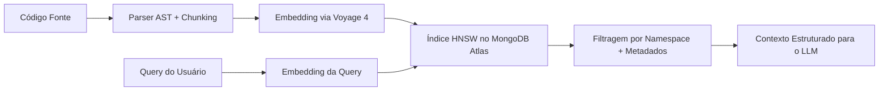
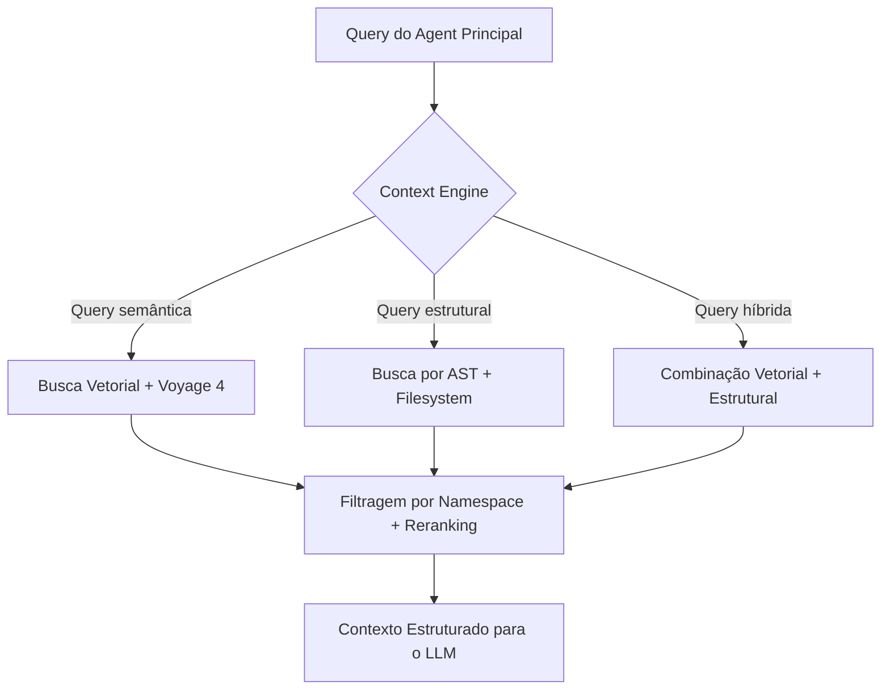




A busca vetorial é o mecanismo central que permite ao Vectora recuperar contexto semanticamente relevante em codebases complexos. Diferente de buscas textuais baseadas em palavras-chave, a busca vetorial opera no espaço semântico, capturando similaridade funcional entre conceitos de código.

## Fundamentos de Busca Vetorial

## Como Funciona

1. **Embedding**: Trechos de código são transformados em vetores numéricos de alta dimensão usando o modelo `voyage-4`
2. **Indexação**: Vetores são armazenados no MongoDB Atlas com índice HNSW para busca aproximada de vizinhos mais próximos (ANN)
3. **Consulta**: Uma query é convertida em embedding e comparada contra o índice para encontrar os vetores mais similares
4. **Filtragem**: Resultados são filtrados por namespace, visibilidade e metadados estruturais antes de retornar ao agent



## Por Que Busca Vetorial para Código

Buscas textuais tradicionais falham em cenários de engenharia de software porque:

- **Similaridade lexical não implica similaridade funcional**: `validateToken` e `checkJWT` podem ser semanticamente equivalentes mas lexicalmente distintos
- **Boilerplate gera ruído**: Arquivos com estruturas similares mas lógica diferente aparecem como relevantes
- **Dependências implícitas não são capturadas**: Imports, chamadas de função e padrões arquiteturais exigem compreensão estrutural

Embeddings especializados para código, como `voyage-4`, são treinados em bilhões de snippets e capturam:

- Similaridade funcional entre implementações
- Padrões arquiteturais recorrentes
- Relações entre imports e dependências
- Contexto semântico de comentários e docstrings

## Arquitetura de Vector Search no Vectora

## Backend Unificado: MongoDB Atlas

O Vectora utiliza MongoDB Atlas como backend unificado para vetores, metadados e estado operacional. Esta escolha elimina a necessidade de sincronização entre sistemas distintos e garante consistência atômica entre embeddings e seus metadados associados.

| Componente                   | Implementação                              | Benefício                                     |
| ---------------------------- | ------------------------------------------ | --------------------------------------------- |
| **Índice Vetorial**          | HNSW com métrica de cosseno                | Busca ANN com complexidade logarítmica        |
| **Armazenamento de Vetores** | Campo `embedding_vector` no documento BSON | Vetor e metadados no mesmo documento          |
| **Filtragem**                | Payload filtering nativo do Atlas          | Filtra por namespace antes da busca vetorial  |
| **Escalabilidade**           | Sharding automático do Atlas               | Escala de MBs a TBs sem reconfiguração manual |

## Estrutura do Documento no Atlas

Cada chunk de código indexado é armazenado como um documento MongoDB com a seguinte estrutura:

```json
{
  "_id": "ObjectId(...)",
  "namespace_id": "auth-service",
  "file_path": "src/auth/jwt_validator.go",
  "start_line": 45,
  "end_line": 78,
  "content": "func ValidateToken(token string) error { ... }",
  "ast_metadata": {
    "function_name": "ValidateToken",
    "imports": ["github.com/golang-jwt/jwt"],
    "dependencies": ["ParseToken", "VerifySignature"]
  },
  "embedding_vector": [0.023, -0.145, ..., 0.089],
  "visibility": "private",
  "indexed_at": "2026-04-18T22:30:00Z",
  "checksum": "sha256:abc123..."
}
```

## Configuração do Índice HNSW

O Vectora configura índices HNSW no MongoDB Atlas com parâmetros otimizados para codebases:

```yaml
# Configuração padrão do índice vetorial
vector_index:
  name: "vector_search_index"
  path: "embedding_vector"
  dimensions: 1024 # Voyage 4
  similarity: "cosine"
  type: "vector"
  hnsw_config:
    m: 16 # Número de conexões por nó
    ef_construction: 200 # Precisão na construção do índice
    ef_search: 100 # Precisão na busca (configurável por query)
```

Parâmetros ajustáveis conforme o tamanho da codebase:

| Parâmetro         | Valor Baixo | Valor Alto | Impacto                                                 |
| ----------------- | ----------- | ---------- | ------------------------------------------------------- |
| `m`               | 8           | 32         | Mais conexões = maior precisão, maior memória           |
| `ef_construction` | 100         | 400        | Mais candidatos na construção = índice mais preciso     |
| `ef_search`       | 50          | 200        | Mais candidatos na busca = recall maior, latência maior |

## Pipeline de Indexação

## Chunking Guiado por AST

Antes de gerar embeddings, o Vectora parseia o código usando `tree-sitter` para identificar unidades semânticas coerentes:

- Funções e métodos
- Classes e structs
- Blocos de lógica condicional
- Imports e declarações de tipo

Cada chunk é limitado a 512 tokens para compatibilidade com o modelo de embedding, preservando limites sintáticos sempre que possível.

```typescript
// packages/core/src/indexer/chunker.ts
export function chunkCodeByAST(content: string, language: string): CodeChunk[] {
  const parser = new Parser();
  parser.setLanguage(getLanguage(language));
  const tree = parser.parse(content);

  return recursiveChunk(tree.rootNode, {
    maxTokens: 512,
    preserveBoundaries: true, // Não cortar no meio de uma função
    includeImports: true, // Anexar lista de imports ao chunk
    minSize: 32, // Ignorar chunks muito pequenos
  });
}
```

## Geração de Embeddings com Voyage 4

Cada chunk é enviado para a API do Voyage AI para geração de embedding:

```typescript
// packages/core/src/providers/voyage.ts
export async function generateEmbedding(chunk: CodeChunk): Promise<number[]> {
  const response = await voyageClient.embed({
    input: chunk.content,
    model: "voyage-4",
    encoding_format: "float",
    input_type: "document", // Otimizado para código
  });

  return response.data[0].embedding;
}
```

O modelo `voyage-4` foi escolhido por:

- Dimensão fixa de 1024, compatível com índices HNSW
- Treinamento especializado em código, capturando similaridade funcional
- Suporte a contexto longo, permitindo chunks com mais estrutura
- API estável com retry logic e rate limiting integrados

## Inserção Atômica no Atlas

Vetor e metadados são inseridos no MongoDB Atlas em uma única operação atômica:

```typescript
// packages/core/src/backend/atlas-writer.ts
export async function insertChunkWithVector(chunk: CodeChunk, embedding: number[]): Promise<void> {
  await mongodb.collection("documents").insertOne({
    namespace_id: chunk.namespace,
    file_path: chunk.filePath,
    content: chunk.content,
    ast_metadata: chunk.astMetadata,
    embedding_vector: embedding,
    visibility: chunk.visibility,
    indexed_at: new Date(),
    checksum: chunk.checksum,
  });

  // O índice HNSW é atualizado automaticamente pelo Atlas
}
```

## Consulta Vetorial com Filtragem por Namespace

## Query Flow

Quando um agent principal solicita contexto via MCP:

1. A query é convertida em embedding usando `voyage-4`
2. Uma busca vetorial é executada no Atlas com filtros obrigatórios por `namespace_id` e `visibility`
3. Resultados são reordenados por score de similaridade e limitados ao `top_k` configurado
4. Metadados estruturais (AST, imports) são anexados para enriquecer o contexto retornado

```typescript
// packages/core/src/context/vector-search.ts
export async function semanticSearch(
  query: string,
  namespace: string,
  options: SearchOptions,
): Promise<SearchResult[]> {
  // 1. Embedding da query
  const queryEmbedding = await generateEmbedding({
    content: query,
  } as CodeChunk);

  // 2. Busca vetorial com filtros obrigatórios
  const results = await mongodb
    .collection("documents")
    .aggregate([
      {
        $vectorSearch: {
          index: "vector_search_index",
          path: "embedding_vector",
          queryVector: queryEmbedding,
          numCandidates: options.ef_search || 100,
          limit: options.top_k || 10,
          filter: {
            namespace_id: namespace,
            visibility: { $in: ["private", "team", "public"] },
          },
        },
      },
      {
        $project: {
          score: { $meta: "vectorSearchScore" },
          file_path: 1,
          content: 1,
          ast_metadata: 1,
          start_line: 1,
          end_line: 1,
        },
      },
    ])
    .toArray();

  // 3. Enriquecer com metadados estruturais
  return results.map((r) => enrichWithAST(r));
}
```

## Isolamento por Namespace

Todas as consultas vetoriais incluem filtros obrigatórios por `namespace_id`. Isso garante que:

- Dados de projetos diferentes nunca se misturam
- Namespaces `private` permanecem isolados mesmo em clusters multi-tenant
- Namespaces `public` podem ser montados em múltiplos workspaces sem duplicação de dados

```yaml
# Exemplo de filtro aplicado automaticamente
filter:
  namespace_id: "auth-service"
  visibility: { $in: ["private", "team"] }
```

## Otimizações de Performance

## Cache de Embeddings de Query

Queries frequentes são cacheadas para evitar chamadas repetidas à API do Voyage:

```typescript
// packages/core/src/cache/query-embeddings.ts
export class QueryEmbeddingCache {
  private cache: Map<string, { embedding: number[]; timestamp: number }>;
  private readonly TTL_MS = 24 * 60 * 60 * 1000; // 24 horas

  async getOrGenerate(query: string): Promise<number[]> {
    const key = createHash("sha256").update(query).digest("hex");
    const cached = this.cache.get(key);

    if (cached && Date.now() - cached.timestamp < this.TTL_MS) {
      return cached.embedding;
    }

    const embedding = await generateEmbedding({ content: query } as CodeChunk);
    this.cache.set(key, { embedding, timestamp: Date.now() });
    return embedding;
  }
}
```

## Batch de Inserção para Indexação em Massa

Durante ingestão inicial ou reindexação, chunks são processados em batches para maximizar throughput:

```typescript
// packages/core/src/indexer/batch-ingest.ts
export async function batchIngest(chunks: CodeChunk[], batchSize: number = 32): Promise<void> {
  for (let i = 0; i < chunks.length; i += batchSize) {
    const batch = chunks.slice(i, i + batchSize);

    // Gerar embeddings em paralelo
    const embeddings = await Promise.all(batch.map((chunk) => generateEmbedding(chunk)));

    // Inserir no Atlas em bulk
    await mongodb.collection("documents").insertMany(
      batch.map((chunk, idx) => ({
        ...chunk,
        embedding_vector: embeddings[idx],
        indexed_at: new Date(),
      })),
    );
  }
}
```

## Ajuste Dinâmico de ef_search

O parâmetro `ef_search` controla o trade-off entre precisão e latência. O Vectora ajusta dinamicamente conforme o contexto da query:

- Queries de navegação geral: `ef_search=50` (latência baixa)
- Queries de refatoração crítica: `ef_search=150` (precisão alta)
- Queries com múltiplos hops: `ef_search=200` (recall máximo)

```typescript
// packages/core/src/context/search-config.ts
export function getEfSearchForQuery(query: QueryContext): number {
  if (query.intent === "refactor" || query.intent === "security_audit") {
    return 150;
  }
  if (query.multiHop) {
    return 200;
  }
  return 100; // padrão
}
```

## Integração com o Context Engine

A busca vetorial é apenas uma das fontes de contexto. O Context Engine decide quando usar busca vetorial, busca por filesystem ou combinação híbrida:



## Reranking Opcional

Para queries críticas, resultados da busca vetorial podem passar por reranking com `voyage-rerank-2.5` para maior precisão:

```typescript
// packages/core/src/context/reranker.ts
export async function rerankResults(query: string, results: SearchResult[]): Promise<SearchResult[]> {
  const documents = results.map((r) => r.content);
  const reranked = await voyageClient.rerank({
    query,
    documents,
    model: "voyage-rerank-2.5",
    top_k: results.length,
  });

  return reranked.results.sort((a, b) => b.relevance_score - a.relevance_score).map((r) => results[r.index]);
}
```

## FAQ

P: Qual a dimensão dos vetores gerados pelo Voyage 4?
R: 1024 dimensões. Esta dimensão fixa permite índices HNSW eficientes e compatibilidade entre queries e documentos.

P: Como é garantido o isolamento entre namespaces na busca vetorial?
R: Todas as consultas ao MongoDB Atlas incluem filtros obrigatórios por `namespace_id` e `visibility`. O RBAC na camada de aplicação valida permissões antes de qualquer consulta.

P: Posso ajustar a precisão da busca vetorial?
R: Sim. O parâmetro `ef_search` controla o trade-off entre recall e latência. Valores mais altos aumentam a precisão mas também a latência.

P: O que acontece se a API do Voyage estiver indisponível?
R: O Vectora roteia automaticamente para `gemini-embedding-2` como fallback, mantendo a mesma dimensão de vetor para compatibilidade com índices existentes.

P: Como é feita a atualização de embeddings quando o código muda?
R: O file watcher detecta modificações, recalcula embeddings para chunks afetados e atualiza os documentos no Atlas atomicamente. Chunks não modificados permanecem inalterados.

P: Busca vetorial funciona para documentação e comentários?
R: Sim. O modelo `voyage-4` é treinado em código e documentação técnica, capturando similaridade semântica entre comentários, docstrings e implementações.

---

Frase para lembrar:
"Embedding transforma código em vetor. HNSW encontra similares. Namespace filtra o escopo. Context Engine orquestra o resultado."

## External Linking

| Concept               | Resource                                                 | Link                                                                                                       |
| --------------------- | -------------------------------------------------------- | ---------------------------------------------------------------------------------------------------------- |
| **MongoDB Atlas**     | Atlas Vector Search Documentation                        | [www.mongodb.com/docs/atlas/atlas-vector-search/](https://www.mongodb.com/docs/atlas/atlas-vector-search/) |
| **Voyage Embeddings** | Voyage Embeddings Documentation                          | [docs.voyageai.com/docs/embeddings](https://docs.voyageai.com/docs/embeddings)                             |
| **Voyage Reranker**   | Voyage Reranker API                                      | [docs.voyageai.com/docs/reranker](https://docs.voyageai.com/docs/reranker)                                 |
| **AST Parsing**       | Tree-sitter Official Documentation                       | [tree-sitter.github.io/tree-sitter/](https://tree-sitter.github.io/tree-sitter/)                           |
| **HNSW**              | Efficient and robust approximate nearest neighbor search | [arxiv.org/abs/1603.09320](https://arxiv.org/abs/1603.09320)                                               |
| **JWT**               | RFC 7519: JSON Web Token Standard                        | [datatracker.ietf.org/doc/html/rfc7519](https://datatracker.ietf.org/doc/html/rfc7519)                     |

---

_Parte do ecossistema Vectora_ · [Open Source (MIT)](https://github.com/Kaffyn/Vectora) · [Contribuidores](https://github.com/Kaffyn/Vectora/graphs/contributors)
