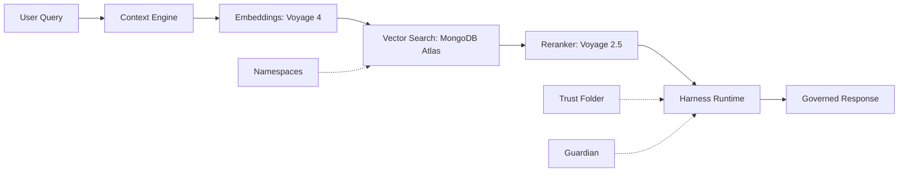



Understand the technological pillars that underpin Vectora and how it solves the fragmented context problem in complex codebases.

> [!IMPORTANT] Vectora is not a chatbot. It is a **Sub-Agent Tier 2** with governed context via MCP — designed to be called by main agents (Claude Code, Gemini CLI, VS Code) when they need precise context retrieval in code repositories.

## Conceptual Map



## 5 Essential Pillars

| Pillar              | What it is (new definition)                                                                           | Why it matters                                                                                                 | Link                                      |
| ------------------- | ----------------------------------------------------------------------------------------------------- | -------------------------------------------------------------------------------------------------------------- | ----------------------------------------- |
| **Context Engine**  | 2-stage retrieval pipeline: vector recall + precision via reranking                                   | Finds code by functional similarity, not exact keywords                                                        | [→ Context Engine](./context-engine.md)   |
| **Embeddings**      | Vector representation of code trained on real repositories (Voyage 4)                                 | Enables searching for "retry implementation" even without the word "retry" in code                             | [→ Embeddings](./embeddings.md)           |
| **Reranker**        | Cross-encoder that reorders raw vector search results                                                 | Increases precision@5 from ~0.45 to ~0.89 — critical for useful responses                                      | [→ Reranker](./reranker.md)               |
| **Harness Runtime** | **Distributed nervous system**: orchestrates observation, auto-correction and governance in real-time | Transforms Gemini from "model that calls tools" to "agent that assists, evaluates and adjusts its own actions" | [→ Harness Runtime](./harness-runtime.md) |
| **Trust Folder**    | Filesystem sandbox with path validation, symlink detection and BYOK                                   | Prevents directory traversal, secrets leakage and unauthorized file access                                     | [→ Trust Folder](./trust-folder.md)       |

## Deep Technical Concepts

### Search & Retrieval (RAG for Code)

| Concept                                    | Description                                                          | When to use                                                                 |
| ------------------------------------------ | -------------------------------------------------------------------- | --------------------------------------------------------------------------- |
| [**Vector Search**](./vector-search.md)    | Search by embedding similarity in MongoDB Atlas Vector Search        | When you need to find semantically similar code, not lexically identical    |
| [**Embeddings & Models**](./embeddings.md) | Voyage 4: 1536 dimensions, trained on code, 32K context              | To generate representations of code chunks that preserve functional meaning |
| [**Reranker**](./reranker.md)              | Voyage Rerank 2.5: cross-encoder that evaluates pairs (query, chunk) | To filter top-100 from vector search down to top-5 highly relevant results  |
| [**Reranker Local**](./reranker-local.md)  | BM25 + heuristics for scenarios without VectorDB or mutable data     | For prototyping, ephemeral data or offline environments                     |

### Architecture & Runtime (The "Nervous System")

| Concept                                     | Description                                                                                     | Differentiation                                                                            |
| ------------------------------------------- | ----------------------------------------------------------------------------------------------- | ------------------------------------------------------------------------------------------ |
| [**Harness Runtime**](./harness-runtime.md) | Distributed pattern: Context Pipeline + Streaming Execution + Recovery Ladder + State Threading | Not a module — it's the intelligence that permeates prompt, tools, state and configuration |
| [**Trust Folder**](./trust-folder.md)       | Filesystem isolation with fs.realpath, compiled blocklist in Go, BYOK                           | "Shift-left" security: validation before execution, not post-hoc audit                     |
| [**Namespaces**](./namespaces.md)           | Multi-tenant logical isolation: projects, teams, environments                                   | Allows ingesting multiple repositories without cross-context pollution                     |

### Advanced Concepts (Scaling the Agent)

| Concept                                              | Description                                                                  | Use case                                                                       |
| ---------------------------------------------------- | ---------------------------------------------------------------------------- | ------------------------------------------------------------------------------ |
| [**RAG (Retrieval-Augmented Generation)**](./rag.md) | Context enrichment pattern: retrieve → rerank → inject → generate            | For any task requiring knowledge external to the model's training              |
| [**Sub-Agents**](./sub-agents.md)                    | Coordination of specialized agents with isolated context and handoff via MCP | When a complex task requires distinct phases (research → planning → execution) |
| [**State Persistence**](./state-persistence.md)      | MongoDB as unified backend for context, execution memory and audit trail     | For long sessions, failure recovery and continuous learning                    |

## Complete Flow: Query → Governed Response

```text
1. IDE/CLI makes query via MCP: "How to validate JWT tokens in middleware Go?"
   ↓
2. Context Engine:
   - Parse query with AST-aware chunking
   - Generate embedding via Voyage 4 (fallback local if unavailable)
   ↓
3. Vector Search (MongoDB Atlas):
   - Vector search: top-100 chunks by cosine similarity
   - Filter by namespace, permissions RBAC, Trust Folder
   ↓
4. Reranker (Voyage 2.5):
   - Cross-encoder reorders top-100 → top-5 by semantic relevance
   - Metric precision@5 injected into Gemini context
   ↓
5. Harness Runtime (Distributed):
   - [Observation] Gemini "watches" metrics: precision=0.89, confidence=0.94
   - [Auto-correction] If precision < 0.65 → retry with refined query
   - [Governance] Guardian validates: no paths outside Trust Folder, no secrets
   - [State] New iteration builds immutable AgentState with audit trail
   ↓
6. Tool Executor:
   - Returns reranked chunks + metrics + audit log to model
   - Gemini synthesizes response with citations, links and context warnings
   ↓
7. Response to User:
   - Code example with file attribution
   - Direct link to docs: cafegame.dev/docs/vectora/auth/jwt
   - Option: "Want me to analyze how this is implemented in YOUR project?"
```

> [!TIP] Harness is not a "phase" in this flow — it is present in **every arrow**, observing, validating and adjusting agent behavior in real-time.

## Guides by Profile

### For Beginners (First 30 Minutes)

1. [**Context Engine**](./context-engine.md) — Understand how Vectora "sees" code
2. [**Vector Search**](./vector-search.md) — The technique behind semantic search
3. [**Trust Folder**](./trust-folder.md) — How to configure filesystem sandbox securely

### For Developers (Daily Integration and Use)

1. [**Harness Runtime**](./harness-runtime.md) — How Vectora self-evaluates and self-corrects
2. [**Sub-Agents**](./sub-agents.md) — When and how to delegate complex tasks
3. [**MCP Protocol**](../integrations/mcp.md) — Connecting Vectora to your favorite IDE/CLI

### For Architects (Scalability and Governance)

1. [**Namespaces**](./namespaces.md) — Multi-tenant isolation and access policies
2. [**State Persistence**](./state-persistence.md) — MongoDB as unified backend for context and audit
3. [**Guardian**](./guardian.md) — Immutable blocklist, path validation and BYOK in production

## Frequently Asked Conceptual Questions

<details>
<summary>Why does Vectora use Voyage instead of OpenAI embeddings?</summary>

Voyage 4 was trained specifically on code repositories (GitHub, GitLab), resulting in embeddings that capture architectural patterns, language conventions and API semantics — something generic models don't achieve with the same precision. [→ Embeddings](./embeddings.md#por-que-voyage)

</details>

<details>
<summary>Is Harness Runtime a module I import?</summary>

No. Harness is a **distributed architectural pattern** — not a `/harness` folder in the code. It emerges from the interaction between: system prompt (meta-instructions), tool schemas (with observation hooks), state management (immutable + audit trail) and configuration (recovery ladder in YAML). [→ Harness Runtime](./harness-runtime.md#what-harness-really-is)

</details>

<details>
<summary>Can I use Vectora without MongoDB Atlas?</summary>

Yes, with limitations. Local Reranker enables intelligent search without VectorDB, ideal for prototyping or mutable data. However, for production with >10k chunks, MongoDB Atlas Vector Search offers scalability, automatic TTL and native integration with the ingestion pipeline. [→ Reranker Local](./reranker-local.md)

</details>

---

> Questions about a concept? [GitHub Discussions](https://github.com/Kaffyn/Vectora/discussions) · [Report docs error](https://github.com/Kaffyn/Vectora/issues/new?labels=docs)

## External Linking

| Concept               | Resource                                    | Link                                                                                                       |
| --------------------- | ------------------------------------------- | ---------------------------------------------------------------------------------------------------------- |
| **MongoDB Atlas**     | Atlas Vector Search Documentation           | [www.mongodb.com/docs/atlas/atlas-vector-search/](https://www.mongodb.com/docs/atlas/atlas-vector-search/) |
| **Voyage Embeddings** | Voyage Embeddings Documentation             | [docs.voyageai.com/docs/embeddings](https://docs.voyageai.com/docs/embeddings)                             |
| **Voyage Reranker**   | Voyage Reranker API                         | [docs.voyageai.com/docs/reranker](https://docs.voyageai.com/docs/reranker)                                 |
| **MCP**               | Model Context Protocol Specification        | [modelcontextprotocol.io/specification](https://modelcontextprotocol.io/specification)                     |
| **MCP Go SDK**        | Go SDK for MCP (anthropics/go-sdk)          | [github.com/anthropics/anthropic-sdk-go](https://github.com/anthropics/anthropic-sdk-go)                   |
| **Gemini API**        | Google AI Studio & Gemini API Documentation | [ai.google.dev/docs](https://ai.google.dev/docs)                                                           |

---

**Vectora v0.1.0** · [GitHub](https://github.com/Kaffyn/Vectora) · [License (MIT)](https://github.com/Kaffyn/Vectora/blob/master/LICENSE) · [Contributors](https://github.com/Kaffyn/Vectora/graphs/contributors)

_Part of the Vectora AI Agent ecosystem. Built with [ADK](https://adk.dev/), [Claude](https://claude.ai/), and [Go](https://golang.org/)._

© 2026 Vectora Contributors. All rights reserved.
