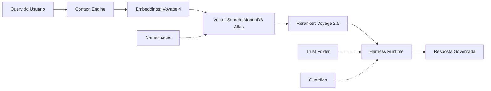



Entenda os pilares tecnológicos que sustentam o Vectora e como ele resolve o problema do contexto fragmentado em codebases complexos.

> [!IMPORTANT] Vectora não é um chatbot. É um **Sub-Agent Tier 2** com contexto governado via MCP — projetado para ser chamado por agentes principais (Claude Code, Gemini CLI, VS Code) quando precisarem de recuperação precisa de contexto em repositórios de código.

## Mapa Conceitual



## 5 Pilares Essenciais

| Pilar               | O que é (nova definição)                                                                        | Por que importa                                                                                                | Link                                      |
| ------------------- | ----------------------------------------------------------------------------------------------- | -------------------------------------------------------------------------------------------------------------- | ----------------------------------------- |
| **Context Engine**  | Pipeline de recuperação em 2 estágios: recall vetorial + precision via reranking                | Encontra código por similaridade funcional, não por palavras-chave exatas                                      | [→ Context Engine](./context-engine.md)   |
| **Embeddings**      | Representação vetorial de código treinada em repositórios reais (Voyage 4)                      | Permite buscar "implementação de retry" mesmo sem a palavra "retry" no código                                  | [→ Embeddings](./embeddings.md)           |
| **Reranker**        | Cross-encoder que reordena resultados brutos da busca vetorial                                  | Aumenta precision@5 de ~0.45 para ~0.89 — crítico para respostas úteis                                         | [→ Reranker](./reranker.md)               |
| **Harness Runtime** | **Sistema nervoso distribuído**: orquestra observação, auto-correção e governança em tempo real | Transforma o Gemini de "modelo que chama tools" para "agente que assiste, avalia e ajusta suas próprias ações" | [→ Harness Runtime](./harness-runtime.md) |
| **Trust Folder**    | Sandbox de filesystem com validação de paths, symlink detection e BYOK                          | Previne directory traversal, vazamento de secrets e acesso não autorizado a arquivos                           | [→ Trust Folder](./trust-folder.md)       |

## Conceitos Técnicos Profundos

### Busca & Recuperação (RAG para Código)

| Conceito                                    | Descrição                                                           | Quando usar                                                                       |
| ------------------------------------------- | ------------------------------------------------------------------- | --------------------------------------------------------------------------------- |
| [**Vector Search**](./vector-search.md)     | Busca por similaridade de embeddings em MongoDB Atlas Vector Search | Quando precisa encontrar código semanticamente similar, não lexicalmente idêntico |
| [**Embeddings & Modelos**](./embeddings.md) | Voyage 4: 1536 dimensões, treinado em código, 32K contexto          | Para gerar representações de chunks de código que preservam significado funcional |
| [**Reranker**](./reranker.md)               | Voyage Rerank 2.5: cross-encoder que avalia pares (query, chunk)    | Para filtrar top-100 da busca vetorial para top-5 altamente relevantes            |
| [**Reranker Local**](./reranker-local.md)   | BM25 + heurísticas para cenários sem VectorDB ou dados mutáveis     | Para prototipagem, dados efêmeros ou ambientes offline                            |

### Arquitetura & Runtime (O "Sistema Nervoso")

| Conceito                                    | Descrição                                                                                      | Diferencial                                                                         |
| ------------------------------------------- | ---------------------------------------------------------------------------------------------- | ----------------------------------------------------------------------------------- |
| [**Harness Runtime**](./harness-runtime.md) | Padrão distribuído: Context Pipeline + Streaming Execution + Recovery Ladder + State Threading | Não é um módulo — é a inteligência que permeia prompt, tools, estado e configuração |
| [**Trust Folder**](./trust-folder.md)       | Isolamento de filesystem com fs.realpath, blocklist compilada em Go, BYOK                      | Segurança "shift-left": validação antes da execução, não auditoria pós-fato         |
| [**Namespaces**](./namespaces.md)           | Isolamento lógico multi-tenant: projetos, equipes, ambientes                                   | Permite ingestão de múltiplos repositórios sem poluição cruzada de contexto         |

### Conceitos Avançados (Escalando o Agente)

| Conceito                                             | Descrição                                                                       | Caso de Uso                                                                            |
| ---------------------------------------------------- | ------------------------------------------------------------------------------- | -------------------------------------------------------------------------------------- |
| [**RAG (Retrieval-Augmented Generation)**](./rag.md) | Padrão de enriquecimento de contexto: retrieve → rerank → inject → generate     | Para qualquer tarefa que exija conhecimento externo ao treinamento do modelo           |
| [**Sub-Agents**](./sub-agents.md)                    | Coordenação de agentes especializados com contexto isolado e handoff via MCP    | Quando uma tarefa complexa requer fases distintas (pesquisa → planejamento → execução) |
| [**State Persistence**](./state-persistence.md)      | MongoDB como backend unificado para contexto, memória de execução e audit trail | Para sessões longas, recuperação de falhas e aprendizado contínuo                      |

## Fluxo Completo: Query → Resposta Governada

```text
1. IDE/CLI faz query via MCP: "Como validar tokens JWT em middleware Go?"
   ↓
2. Context Engine:
   - Parse da query com AST-aware chunking
   - Geração de embedding via Voyage 4 (fallback local se indisponível)
   ↓
3. Vector Search (MongoDB Atlas):
   - Busca vetorial: top-100 chunks por similaridade de cosseno
   - Filtro por namespace, permissões RBAC, Trust Folder
   ↓
4. Reranker (Voyage 2.5):
   - Cross-encoder reordena top-100 → top-5 por relevância semântica
   - Métrica precision@5 injetada no contexto do Gemini
   ↓
5. Harness Runtime (Distribuído):
   - [Observação] Gemini "assiste" métricas: precision=0.89, confidence=0.94
   - [Auto-correção] Se precision < 0.65 → retry com query refinada
   - [Governança] Guardian valida: sem paths fora do Trust Folder, sem secrets
   - [State] Nova iteração constrói AgentState imutável com audit trail
   ↓
6. Tool Executor:
   - Retorna chunks rerankeados + métricas + audit log ao modelo
   - Gemini sintetiza resposta com citações, links e advertências de contexto
   ↓
7. Resposta ao Usuário:
   - Código exemplo com atribuição de arquivo
   - Link direto para docs: cafegame.dev/docs/vectora/auth/jwt
   - Opção: "Quer que eu analise como isso está implementado no SEU projeto?"
```

> [!TIP] O Harness não é uma "fase" neste fluxo — ele está presente em **cada seta**, observando, validando e ajustando o comportamento do agente em tempo real.

## Guias por Perfil

### Para Iniciantes (Primeiros 30 Minutos)

1. [**Context Engine**](./context-engine.md) — Entenda como o Vectora "enxerga" código
2. [**Vector Search**](./vector-search.md) — A técnica por trás da busca semântica
3. [**Trust Folder**](./trust-folder.md) — Como configurar o sandbox de filesystem com segurança

### Para Desenvolvedores (Integração e Uso Diário)

1. [**Harness Runtime**](./harness-runtime.md) — Como o Vectora auto-avalia e auto-corrige
2. [**Sub-Agents**](./sub-agents.md) — Quando e como delegar tarefas complexas
3. [**MCP Protocol**](../integrations/mcp.md) — Conectando Vectora ao seu IDE/CLI favorito

### Para Arquitetos (Escalabilidade e Governança)

1. [**Namespaces**](./namespaces.md) — Isolamento multi-tenant e políticas de acesso
2. [**State Persistence**](./state-persistence.md) — MongoDB como backend unificado para contexto e audit
3. [**Guardian**](./guardian.md) — Blocklist imutável, validação de paths e BYOK em produção

## Perguntas Frequentes Conceituais

<details>
<summary>Por que Vectora usa Voyage em vez de OpenAI embeddings?</summary>

Voyage 4 foi treinado especificamente em repositórios de código (GitHub, GitLab), resultando em embeddings que capturam padrões de arquitetura, convenções de linguagem e semântica de APIs — algo que modelos genéricos não fazem com a mesma precisão. [→ Embeddings](./embeddings.md#por-que-voyage)

</details>

<details>
<summary>Harness Runtime é um módulo que eu importo?</summary>

Não. Harness é um **padrão arquitetural distribuído** — não uma pasta `/harness` no código. Ele emerge da interação entre: system prompt (meta-instruções), tool schemas (com observation hooks), state management (imutável + audit trail) e configuração (recovery ladder em YAML). [→ Harness Runtime](./harness-runtime.md#o-que-harness-realmente-e)

</details>

<details>
<summary>Posso usar Vectora sem MongoDB Atlas?</summary>

Sim, com limitações. O Reranker Local permite busca inteligente sem VectorDB, ideal para prototipagem ou dados mutáveis. Porém, para produção com >10k chunks, MongoDB Atlas Vector Search oferece escalabilidade, TTL automático e integração nativa com o pipeline de ingestão. [→ Reranker Local](./reranker-local.md)

</details>

---

> Dúvidas sobre um conceito? [GitHub Discussions](https://github.com/Kaffyn/Vectora/discussions) · [Reportar erro na docs](https://github.com/Kaffyn/Vectora/issues/new?labels=docs)

## External Linking

| Conceito                                | Recurso                                             | Link                                                                                                                          | Por que este link?                                                                                                       |
| --------------------------------------- | --------------------------------------------------- | ----------------------------------------------------------------------------------------------------------------------------- | ------------------------------------------------------------------------------------------------------------------------ |
| **MongoDB Atlas Vector Search**         | Documentação oficial de busca vetorial              | [mongodb.com/docs/atlas/atlas-vector-search](https://www.mongodb.com/docs/atlas/atlas-vector-search/)                         | Referência canônica para configuração de indexes vetoriais, métricas de distância e integração com pipelines de ingestão |
| **Model Context Protocol (MCP)**        | Especificação do protocolo de contexto para agentes | [modelcontextprotocol.io/specification](https://modelcontextprotocol.io/specification)                                        | Padrão aberto que Vectora implementa para interoperabilidade com Claude Code, Cursor, VS Code e outros hosts             |
| **Voyage AI Embeddings**                | Documentação técnica dos modelos de embedding       | [docs.voyageai.com/docs/embeddings](https://docs.voyageai.com/docs/embeddings)                                                | Detalhes sobre dimensionalidade, treinamento em código, e melhores práticas para chunking de repositórios                |
| **RAG: Retrieval-Augmented Generation** | Artigo seminal do padrão RAG (Lewis et al., 2020)   | [arxiv.org/abs/2005.11401](https://arxiv.org/abs/2005.11401)                                                                  | Fundamentação acadêmica do padrão que Vectora adapta para domínio de código                                              |
| **Agentic Design Patterns**             | 12 padrões de Harness extraídos do Claude Code      | [generativeprogrammer.com/p/12-agentic-harness-patterns](https://generativeprogrammer.com/p/12-agentic-harness-patterns-from) | Guia prático de padrões reutilizáveis para orquestração distribuída de agentes                                           |

---

_Parte do ecossistema Vectora_ · [Open Source (MIT)](https://github.com/Kaffyn/Vectora) · [Contribuidores](https://github.com/Kaffyn/Vectora/graphs/contributors)
