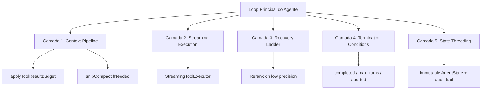



> [!WARNING] **Redefinição Crítica**: Harness Runtime **não é um módulo**, **não é uma pasta**, **não é um protocolo**.
> Harness é o **sistema nervoso distribuído** do Vectora — a inteligência que permeia cada camada, observando, validando, corrigindo e orquestrando o comportamento do Gemini em tempo real.

## O Que Harness Realmente É

```yaml
harness_definition:
  old_view: "Módulo de validação pré/pós tool execution"
  new_view: "Camada cognitiva distribuída que torna o Vectora auto-consciente, auto-corretivo e auto-otimizável"

  core_responsibilities:
    - "Observação em tempo real: Gemini 'assiste' cada tool call e ajusta seu raciocínio"
    - "Meta-cognição: O modelo avalia sua própria confiança e decide quando delegar, corrigir ou pedir clarificação"
    - "Orquestração distribuída: Decisões emergem da interação entre prompt, tools, contexto e estado"
    - "Auto-correção: Recovery ladder ordenada por custo (fallback local → retry → rerank → humano)"
    - "Memória de execução: Cada decisão, erro e correção persistida para aprendizado contínuo"
```

### Harness ≠ Framework. Harness = Padrão Arquitetural

| Conceito             | O Que É                                                                          | O Que Não É                          |
| -------------------- | -------------------------------------------------------------------------------- | ------------------------------------ |
| **Harness**          | Padrão de orquestração distribuída entre system prompt, tools, contexto e estado | Uma pasta `/harness` no código       |
| **Tool Observation** | Gemini "assiste" o output de cada tool e ajusta seu raciocínio em tempo real     | Logging passivo de execuções         |
| **Recovery Ladder**  | Escada de estratégias de recuperação ordenadas por custo                         | Try/catch genérico                   |
| **State Threading**  | Estado tipado e reconstruído em cada iteração, com audit trail de decisões       | Variáveis globais mutáveis           |
| **Context Pipeline** | Compressão, trimming e reshaping do contexto antes de cada chamada ao modelo     | "Append messages until context full" |

## As 5 Camadas Distribuídas do Harness



### Camada 1: Context Pipeline (Antes de Cada Chamada ao Modelo)

O Harness mantém o contexto dentro dos limites do modelo sem perder informação crítica através de:

- **applyToolResultBudget**: Cap output size para tool results > 2KB, preservando chunks mais relevantes via rerank score
- **snipCompactIfNeeded**: Remove mensagens antigas quando contexto > 80% do window, preservando prompt + recente
- **autoCompactIfNeeded**: Summarização via LLM quando contexto > 95% do window

**Métricas**:

- Compression ratio: alvo ≥ 0.65 (35% redução)
- Information preservation: precision@3 ≥ 0.90
- Pipeline latency: ≤ 150ms p95

### Camada 2: Streaming Execution (Durante a Chamada ao Modelo)

Reduz latência executando tools enquanto o modelo gera resposta:

```text
Model stream: [text] [tool_A: search_db] [text] [tool_B: rerank] [end]
                     ↓ ↓
          [execute search_db] [execute rerank]
                     ↓ ↓
          [stream results to model as they arrive]
```

**Benefício**: Reduz latência de turn em 40-60% via paralelismo entre model generation e tool execution.

### Camada 3: Recovery Ladder (Após Falhas ou Degradação)

Escada de estratégias ordenadas por custo (barato → caro):

1. **Rerank com modelo mais pesado** (`retrieval_precision < 0.65`) — +$0.001/query
2. **Retry com parâmetros ajustados** (`tool_accuracy < 0.95`) — +1 API call, max 3 retries
3. **Bloquear execução + alertar** (`security_events > 0`) — Query rejeitada
4. **Erro estruturado + sugestão** (all above failed) — Query incompleta

**Circuit breakers**:

- Mesma recovery strategy não dispara 2x seguidas sem progresso
- Total recovery attempts por query ≤ 5

### Camada 4: Condições de Término Tipadas

Terminal states explícitos:

- `completed`: Model terminou naturalmente → Retorna resposta
- `max_turns`: Limite de turns atingido → Resposta parcial + prompt de continuação
- `prompt_too_long`: Context overflow → Erro + sugestão de refinamento
- `blocking_limit`: Guardian block → Violação de política + audit log

### Camada 5: State Threading (Estado Tipado Entre Iterações)

```go
type AgentState struct {
  Messages []Message
  ToolContext struct {
    Pending []ToolCall
    Completed []ToolResult
  }
  RecoveryAttempts map[string]int
  Transition struct {
    Reason string // "tool_executed", "recovery_retry"
    Timestamp time.Time
  } // audit trail
}
```

**Invariantes**:

- Estado é imutável: cada `continue` constrói um NOVO AgentState
- Campo Transition cria audit trail append-only de decisões de recovery

## Tool Observation: O Gemini "Assiste" Cada Tool Call

Gemini não apenas chama tools — **OBSERVA** o output e ajusta seu raciocínio em tempo real:

### Pontos de Observação por Tool

**search_database**:

- Número de resultados vs esperado
- Scores de relevância dos chunks (rerank score ≥ 0.70?)
- Diversidade de fontes
- → Auto-correção: Se precision baixa, ajustar query + retry

**voyage_rerank**:

- Distribuição de scores (todos < 0.5? query ambígua?)
- Gap entre #1 e #2 (gap grande = alta confiança)
- → Auto-correção: Se scores baixos, pedir clarificação; se top-1 > 0.95, confiar fortemente

**bash_terminal**:

- Exit code (0 = sucesso, ≠0 = investigar stderr)
- Pattern matching de erros conhecidos
- → Auto-correção: Se exit ≠0, analisar stderr + sugerir correção

## Métricas & SLAs do Harness

### Core Metrics (Monitoradas em Cada Iteração)

```yaml
retrieval_precision:
  target: ">= 0.65"
  description: "Relevância da busca (precision@5)"
  action_if_failed: "Rerank + query refinement"

tool_accuracy:
  target: ">= 0.95"
  description: "Taxa de sucesso de tool calls"
  action_if_failed: "Retry up to 3x"

confidence_score:
  target: ">= 0.80"
  description: "Auto-avaliação do Gemini"
  action_if_failed: "Seek additional context"

latency_p95:
  target: "< 2000ms"
  description: "95º percentil de latência total"
  action_if_failed: "Aggressive compaction + reduce TopK"

token_efficiency:
  target: ">= 0.85"
  description: "Tokens úteis / tokens totais"
  action_if_failed: "Stricter compaction + rerank filtering"
```

### Exemplo de Execução com Métricas

```yaml
execution_id: "harness_20260419_abc123"
tool: search_context
query: "Como validar tokens JWT em middleware Go?"

metrics:
  retrieval_precision: 0.89 # above threshold
  tool_accuracy: 1.00
  confidence_score: 0.94
  latency_p95_ms: 1240
  token_efficiency: 0.91

recovery_log: [] # No recovery needed
transition:
  reason: "completed"
  timestamp: "2026-04-19T14:32:18Z"
```

## Configuração do Harness (Distribuída)

```yaml
# config/harness.yaml
harness:
  context:
    compaction:
      apply_tool_result_budget: true
      snip_compact_threshold: 0.80
      auto_compact_threshold: 0.95

  recovery:
    strategies:
      - name: query_refinement
        trigger: "retrieval_precision < 0.65"
        max_attempts: 2

      - name: rerank_heavier
        trigger: "precision < 0.65 after query_refinement"
        cost_delta: "+$0.001/query"

    circuit_breakers:
      max_consecutive_same_strategy: 2
      max_total_recovery_attempts: 5

  state:
    immutable: true
    audit_trail: true
    checkpoint_interval: "every 5 turns"

  termination:
    natural_completion_confidence: 0.80
    max_turns_default: 10
    max_turns_premium: 25
```

## Degradation Paths

Se métricas caem abaixo do SLA:

| Métrica                      | Ação                         |
| ---------------------------- | ---------------------------- |
| `retrieval_precision < 0.65` | Rerank com model mais pesado |
| `tool_accuracy < 0.95`       | Retry até 3x                 |
| `security_events > 0`        | Bloqueia execução + Alert    |
| `latency_p95 > 3000ms`       | Ativa compaction + timeout   |

## Comparação: Com vs Sem Harness

A diferença fundamental é que Harness adiciona validação, observabilidade e resiliência a cada chamada de tool. O comparativo abaixo mostra os impactos práticos.

## Sem Harness (MCP genérico)

```text
Agent → Tool → Output (confiar que é bom) → Response
```

- Sem validação pré-execução
- Sem captura de métricas
- Sem verificação de segurança inline
- Falhas silenciosas possíveis

## Com Harness

```text
Agent → Guardian → Preconditions → Tool (Wrapped) →
Output Validation → Metrics → Decision (use/retry/fail)
```

- Guardian blocklist enforcement
- Métricas por execução
- Retry automático em falhas transitórias
- Reranking se precision cai
- Circuit breaker em cascata

## Validação & Debug

Para validar que mudanças de performance foram positivas, Harness oferece um modo de comparação que testa antes/depois automaticamente.

## Mode de Comparação (--compare)

Use comparison mode para validar mudanças de performance após alterar reranker, embeddings ou índice:

## Caso 1: Testar novo reranker

```bash
vectora execute search_context \
  --query "Como validar tokens JWT em middleware?" \
  --compare baseline \
  --reranker voyage-rerank-2.5 # Novo reranker vs anterior
```

Output detalhado:

```yaml
execution_id: "harness_20260419_abc123"
tool: search_context
query: "Como validar tokens JWT em middleware?"

baseline: # Versão anterior (voyage-rerank-2.4 ou BM25)
  precision: 0.68
  latency_ms: 1520
  chunks_returned: 8
  top_chunk: { file: "src/auth/jwt.ts", relevance: 0.64 }
  top_chunk_2: { file: "src/utils/crypto.ts", relevance: 0.52 } # Ruído
  token_efficiency: 0.71

current: # Nova config (voyage-rerank-2.5)
  precision: 0.87
  latency_ms: 1240
  chunks_returned: 8
  top_chunk: { file: "src/auth/guards.ts", relevance: 0.92 }
  top_chunk_2: { file: "src/auth/jwt.ts", relevance: 0.84 } # Relevante
  token_efficiency: 0.89

delta:
  precision: +0.19 (28% improvement)
  latency: -280ms (faster)
  token_efficiency: +0.18
  verdict: "APPROVE - Reranker upgrade recommended"
```

## Caso 2: Validar reindex após schema change

```bash
# Reindexar com novo schema
vectora index --namespace "meu-projeto" --force

# Comparar contra versão anterior (backup automático)
vectora execute search_context \
  --query "handlers de autenticação" \
  --compare backup-20260418 # Compara vs índice anterior
```

## Caso 3: Monitorar degradação de performance

```bash
# Runbook: detectar problemas antes do SLA cair
vectora execute search_context \
  --query "rate limiting" \
  --compare last-1h \
  --fail-if-precision-drops 0.10 # Falha se cair >10%
```

Se `precision < 0.55` (abaixo do SLA 0.65):

```yaml
status: FAILED
reason: "precision degradation detected"
action: "Ativando recompression + rerank pesado"
fallback: true
```

## Logs de Validação

Ativa logging estruturado:

```yaml
# .env
VECTORA_HARNESS_DEBUG=true
VECTORA_LOG_LEVEL=debug
VECTORA_LOG_FORMAT=json
```

Logs incluem:

- Pre-execution: Guardian checks, preconditions
- Execution: Timeouts, retries, chunks
- Post-execution: Validation, metrics, decisions

## Configuração

```yaml
context_engine:
  harness:
    enabled: true
    pre_execution:
      validate_guardian: true
      validate_preconditions: true
      rate_limit_per_minute: 60
    execution:
      timeout_ms: 30000
      retry_attempts: 3
      circuit_breaker_threshold: 5
    post_execution:
      validate_output: true
      capture_metrics: true
      comparison_mode: false # true para --compare
    thresholds:
      min_retrieval_precision: 0.65
      min_tool_accuracy: 0.95
      max_security_events: 0
      max_latency_p95_ms: 3000

    # Fallbacks automáticos
    degradation:
      rerank_on_low_precision: true
      retry_on_timeout: true
      circuit_break_on_failures: true
```

## Como Testar o Harness

### Teste de Observação de Tool Calls

Gemini observa métricas de precision baixa e dispara recovery automaticamente:

```gherkin
Cenário: Recovery ladder ordenada por custo
  Dado que a API do Voyage retorna HTTP 503
  Quando o Vectora tenta gerar embedding
  Então deve tentar na ordem:
    1. Retry com backoff exponencial (custo: +latência)
    2. Fallback para modelo local sentence-transformers (custo: +tokens, -precision)
    3. Retornar erro estruturado com sugestão de retry manual
```

## Estrutura de Arquivos (Harness Distribuído)

```text
vectora/
├── harness/ # NÃO é uma pasta única — é um padrão distribuído
│ ├── context/
│ │ ├── pipeline.go # Context compaction pipeline
│ │ └── compactors/ # Implementações dos compactors
│ ├── execution/
│ │ ├── streaming_executor.go # StreamingToolExecutor
│ │ └── partitioner.go # ToolPartitioner: concurrent vs serial
│ ├── recovery/
│ │ ├── ladder.go # RecoveryLadder: strategies ordered by cost
│ │ └── strategies/ # Implementações de cada strategy
│ ├── termination/
│ │ └── conditions.go # Typed terminal states
│ └── state/
│ ├── types.go # AgentState schema (immutable)
│ └── audit.go # Transition trail serialization
```

---

> **Próximo**: [Namespaces](./namespaces.md) — Isolamento lógico multi-tenant

---

## External Linking

| Conceito                                 | Recurso                                                            | Link                                                                                                                          | Por que este link?                                                                                                               |
| ---------------------------------------- | ------------------------------------------------------------------ | ----------------------------------------------------------------------------------------------------------------------------- | -------------------------------------------------------------------------------------------------------------------------------- |
| **Agentic Harness Patterns**             | 12 padrões extraídos do Claude Code com exemplos práticos          | [generativeprogrammer.com/p/12-agentic-harness-patterns](https://generativeprogrammer.com/p/12-agentic-harness-patterns-from) | Guia definitivo de padrões reutilizáveis para orquestração distribuída de agentes, base para a redefinição do Harness no Vectora |
| **Inside Claude Code Agent Harness**     | Análise técnica profunda do padrão Harness em produção             | [redreamality.com/blog/inside-claude-code-agent-harness](https://redreamality.com/blog/inside-claude-code-agent-harness/)     | Case real de como um sistema nervoso distribuído é implementado em um agente de engenharia de software em escala                 |
| **MCP Tool Calling Specification**       | Contrato oficial para chamadas de tools via Model Context Protocol | [modelcontextprotocol.io/specification/server/tools](https://modelcontextprotocol.io/specification/server/tools)              | Referência canônica para implementar observation hooks e recovery strategies compatíveis com o ecossistema MCP                   |
| **Prompting for Tool Use**               | Melhores práticas do Google para modelos que usam tools            | [ai.google.dev/docs/prompting_for_tool_use](https://ai.google.dev/docs/prompting_for_tool_use)                                | Guia oficial para estruturar system prompts que habilitam meta-cognição e auto-correção em modelos Gemini                        |
| **Test-Driven Development for LLM Apps** | Estratégia de testes para aplicações probabilísticas               | [www.promptingguide.ai/techniques/tdd-llm](https://www.promptingguide.ai/techniques/tdd-llm)                                  | Abordagem prática para escrever testes determinísticos para comportamentos não-determinísticos de LLMs                           |

---

_Parte do ecossistema Vectora_ · [Open Source (MIT)](https://github.com/Kaffyn/Vectora) · [Contribuidores](https://github.com/Kaffyn/Vectora/graphs/contributors)
