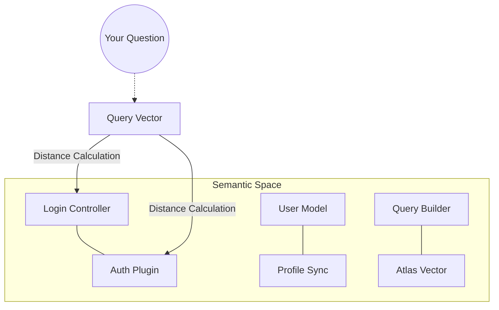



## What is Vector Search?

**Vector Search** is the technology that allows you to find information not by exact keywords (like in SQL `LIKE %term%`), but by **semantic meaning**.

Imagine you want to find where your system handles "subscription cancellation" in your code.

- **Traditional Search**: Looks for `cancel`, `subscription`, `unsub`. If the programmer used `deactivateAccount`, traditional search fails.
- **Vector Search**: Understands that "deactivate account" and "cancel subscription" are in the same semantic universe of service termination and finds the result.

## How it Works: From Code to Vector

Vector search transforms text or code into a list of numbers (a **vector**) that represents its position in a high-dimensional "thought space."

## 1. Embedding (The Coordinate)

[Voyage 4](/concepts/embeddings/) processes a snippet of code and generates a vector of 1,536 numbers.

- Code about "Auth" will have high numbers in the security dimension.
- Code about "Database" will have high numbers in the persistence dimension.

## 2. Vector Space

Think of a 3D map (though in Vectora there are 1,536 dimensions). Similar code stays **physically close** on the map.

## Similarity Metrics

To know how "close" a query is to a piece of code in Vectora, we use **Cosine Similarity**.

| Metric                 | How it Works                                        | Why it matters                                                                        |
| ---------------------- | --------------------------------------------------- | ------------------------------------------------------------------------------------- |
| **Cosine Similarity**  | Measures the angle between two vectors.             | Ideal for comparing snippets of different sizes (a short phrase vs. a long function). |
| **Euclidean Distance** | Measures the straight-line distance between points. | Useful for pure numerical data, but less accurate for natural language/code.          |
| **Dot Product**        | Direct multiplication of vectors.                   | Extremely fast on modern hardware, used internally by MongoDB Atlas.                  |

## The HNSW Algorithm

Vectora uses **HNSW (Hierarchical Navigable Small World)** in MongoDB Atlas. It is the "State of the Art" in Approximate Nearest Neighbors (ANN) search.

- **The Problem**: Comparing your query with 1 million vectors one by one is slow (O(N)).
- **The Solution (HNSW)**: Creates a "layered" structure like a highway system.
  1. The top layer has few points (main highways).
  2. The algorithm quickly jumps between distant points.
  3. As it gets closer, it moves down to lower layers (local streets) with more detail.
- **Performance in Vectora**: Finds the top 20 results in <50ms even in massive databases.

## Vector Search vs. Full-Text Search in Atlas

MongoDB Atlas offers both. Here is the difference:

| Feature         | Full-Text (Lucene)                    | Vector (HNSW)                          |
| --------------- | ------------------------------------- | -------------------------------------- |
| **Base**        | Words/Tokens                          | Embeddings                             |
| **Precision**   | High for exact names (e.g., `UserID`) | High for concepts (e.g., `validation`) |
| **Flexibility** | Rigid to typos                        | Resilient to synonyms and errors       |
| **Context**     | Ignores intent                        | Prioritizes semantics                  |

**Vectora's Strategy**: We use **Hybrid Search** where applicable, but the driving force is vector search refined by the [Reranker](/concepts/reranker/).

## Vector Search FAQ

**Q: Why does vector search sometimes bring results that don't contain the text I typed?**
A: Because it understood the **intent**. If you search for "security," it will bring results about `Bcrypt`, `JWT`, and `Salting`, even if the word "security" does not appear in the code.

**Q: Does Vectora understand code from any language?**
A: Yes, thanks to Voyage 4, semantic structures of loops, conditionals, and type declarations are similar across almost all modern languages.

**Q: How do namespaces affect search?**
A: Vectora applies a **metadata filter** ("Pre-filtering") before the vector search. This ensures the HNSW algorithm only traverses vectors belonging to your authorized project.

---

> **Phrase to remember**:
> _"In traditional search you type words. In Vectora's vector search, you express intentions."_
