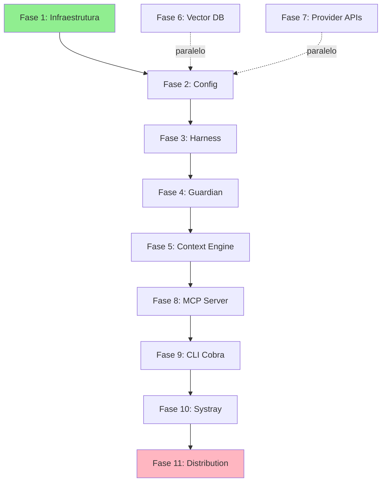




Esta seção contém os **planos de implementação detalhados** para cada área de desenvolvimento do Vectora. Cada documento descreve arquitetura, fases de implementação, exemplos de código Go/TypeScript, dependências entre componentes, e métricas de sucesso.

## Pilares da Arquitetura

Vectora é um **Sub-Agent Tier 2** (não genérico) reconstruído em Go com dois objetivos centrais:

1. **Performance Nativa**: Binário estático ~20MB, startup <50ms, processamento RAG 3x mais rápido que Node.js
2. **Segurança Compilada**: Guardian com blocklist imutável, validação de tipos em tempo de compilação, zero overhead de parsing

## Stack Técnica Confirmada

| Camada           | Tecnologia                | Por quê                                                  |
| :--------------- | :------------------------ | :------------------------------------------------------- |
| **Core**         | **Go 1.21+**              | Performance, concorrência nativa, binário estático       |
| **CLI**          | **Cobra Framework**       | Subcomandos estruturados, shell completion, padrão Go    |
| **Interface**    | **Systray (Go)**          | Cross-platform, integração IPC com CLI                   |
| **LLM**          | **Gemini 3 Flash**        | 30ms latência, $0.075/1M tokens, 1M context window       |
| **Embeddings**   | **Voyage 4**              | AST-aware, similaridade funcional de código              |
| **Reranking**    | **Voyage Rerank 2.5**     | Cross-encoder, <100ms, +25% vs BM25                      |
| **Vector DB**    | **MongoDB Atlas**         | HNSW, isolamento multi-tenant, backend unificado         |
| **Distribution** | **GoReleaser + Winget**   | Multiplataforma, assinatura SHA256, instalação sem admin |
| **Extensions**   | **TypeScript** _(futuro)_ | VS Code, custom middleware                               |

## Estrutura de 11 Fases



## Documento por Fase

### **Fases 1-4: Fundações (Setup, Config, Harness, Guardian)**

**[Core Migration](./core-migration.md)** — Plano completo de 8 fases

- Fase 1: Setup & Infraestrutura (2 semanas)
- Fase 2: Configuração & Validação (1 semana)
- Fase 3: Harness Runtime (3 semanas)
- Fase 4: Guardian Security (2 semanas)

Inclui: Estrutura Go, Cobra basics, Config YAML, Harness Lifecycle, Guardian Blocklist
Código: Structs de config, Harness.ExecuteToolCall, Guardian pattern matching
Testes: Unit tests, bypass tests, validação

### **Fase 5: Context Engine & RAG**

**[Context Engine Implementation](./context-engine.md)** _(a criar)_

- AST parser para Go/TypeScript
- Embedding pipeline (Query → Voyage 4 → HNSW)
- Reranking (Top-50 → Top-10 via Voyage Rerank 2.5)
- Compaction (head/tail, pointers)
- Hybrid search (semântica + estrutural)

Duração: 4 semanas
Dependências: Guardian, Vector DB, Provider APIs

### **Fase 6: Vector Database (MongoDB Atlas)**

**[Vector Database Implementation](./vector-database.md)** _(a criar)_

- MongoDB client com pooling
- 3 coleções: documents, sessions, audit_logs
- HNSW indexing com namespace filtering
- Query builders otimizados
- Atomicidade metadata-vetor

Duração: 2 semanas
Dependências: Config (paralelo possível)

### **Fase 7: Provider Router (Gemini + Voyage)**

**[Provider Router Implementation](./provider-router.md)** _(a criar)_

- Gemini 3 Flash client (com exponential backoff)
- Voyage 4 embedding client
- Voyage Rerank 2.5 client
- Fallback BYOK support
- Rate limiting + quota tracking

Duração: 2 semanas
Dependências: Config (paralelo possível)

### **Fase 8: MCP Server**

**[MCP Server Implementation](./mcp-server.md)** _(a criar)_

- JSON-RPC 2.0 server (stdio transport)
- Tool registry dinâmico (12 ferramentas)
- Message routing + error handling
- Conformance vs spec MCP
- Session management via MCP headers

Duração: 2 semanas
Dependências: Harness, Context Engine, Guardian

### **Fase 9: CLI Engine (Cobra)**

**[CLI Engine](./cli-engine.md)** — Plano completo de 6 fases

- Fase 1: Setup Cobra (1 semana)
- Fase 2: Auth commands (2 semanas)
- Fase 3: Config commands (1 semana)
- Fase 4: Index commands (2 semanas)
- Fase 5: Service commands (1 semana)
- Fase 6: Shell completion (5 dias)

Subcomandos: `auth`, `config`, `index`, `service`, `status`
Global flags: `--debug`, `--config`, `--namespace`, `--json`
IPC sync com Systray em tempo real

Duração: 2 semanas
Dependências: Harness, Config

### **Fase 10: Systray UX**

**[Systray UX](./systray-ux.md)** — Expansão com implementação

- Aplicativo Systray em Go (tray-go library)
- Menu: Status, Login, Settings, About
- SSO flow com browser callback local
- Real-time sync com CLI (IPC pipes ou sockets)
- Windows Service registry
- Auto-start on login

Duração: 2 semanas
Dependências: CLI Engine

### **Fase 11: Distribution Pipeline**

**[Distribution Pipeline](./distribution-pipeline.md)** — Plano completo de 6 fases

- Fase 1: CI Workflow (1 semana)
- Fase 2: GoReleaser config (1 semana)
- Fase 3: Winget integration (1 semana)
- Fase 4: CD Workflow (1 semana)
- Fase 5: Local installer (1 semana)
- Fase 6: Build automation (3 dias)

CI: golangci-lint, `go test -race`, smoke builds
CD: GoReleaser (6 arquiteturas), checksums, GitHub Releases
Winget: Manifests automáticos, submissão PR, `winget install kaffyn.vectora`
Instalação: `%LOCALAPPDATA%\Programs\Vectora`, sem UAC

Duração: 2 semanas
Dependências: Todos os componentes acima

## Verificação de Stack por Documento

| Documento                                           | Go? | Cobra?   | Systray? | Winget?  | Segurança? |
| :-------------------------------------------------- | :-- | :------- | :------- | :------- | :--------- |
| [Core Migration](./core-migration.md)               |     | Fase 1-3 | -        | -        | Fase 4     |
| [CLI Engine](./cli-engine.md)                       |     | Completo | IPC      | -        | Validação  |
| [Systray UX](./systray-ux.md)                       |     | -        | Completo | -        | SSO        |
| [Security Engine](./security-engine.md)             |     | -        | -        | -        | Bloklist   |
| [Distribution Pipeline](./distribution-pipeline.md) |     | -        | -        | Completo | SHA256     |
| [Context Engine](./context-engine.md)               |     | -        | -        | -        | -          |
| [Vector Database](./vector-database.md)             |     | -        | -        | -        | -          |
| [Provider Router](./provider-router.md)             |     | -        | -        | -        | -          |
| [MCP Server](./mcp-server.md)                       |     | -        | -        | -        | Auth       |

## Caminho Crítico de Implementação

**Sequência obrigatória** (dependências em cascata):

```text
Fase 1 (Setup)
  → Fase 2 (Config)
    → Fase 3 (Harness)
      → Fase 4 (Guardian)
        → Fase 5 (Context Engine)
          → Fase 8 (MCP Server)
            → Fase 9 (CLI)
              → Fase 10 (Systray)
                → Fase 11 (Distribution)
```

**Paralelos possíveis**:

- Fases 6 (Vector DB) e 7 (Provider APIs) podem rodar com Fase 2 (Config)

**Duração Total**:

- Crítico: 22 semanas (4,4 meses)
- Com paralelismo: 20 semanas (4 meses)
- Com paralelismo agressivo (full team): 16 semanas (3,2 meses)

## Garantias de Qualidade

Cada fase inclui:

**Código Go tipado**: Structs com validação, interfaces para abstração
**Testes**: Unit, integration, testes de segurança
**Documentação**: Exemplos de código, arquitetura, métricas
**Métricas de Sucesso**: Latência, cobertura, conformance
**CI/CD**: Integração contínua em cada fase

## Navegação Rápida

| Você quer...                    | Leia                                                 |
| :------------------------------ | :--------------------------------------------------- |
| Entender infraestrutura e build | [Core Migration](./core-migration.md) Fase 1         |
| Aprender sobre segurança        | [Security Engine](./security-engine.md)              |
| Implementar CLI robusta         | [CLI Engine](./cli-engine.md)                        |
| Integrar com Systray            | [Systray UX](./systray-ux.md)                        |
| Configurar distribuição         | [Distribution Pipeline](./distribution-pipeline.md)  |
| Detalhes de RAG/busca           | [Context Engine](./context-engine.md) _(em breve)_   |
| Persistência de estado          | [Vector Database](./vector-database.md) _(em breve)_ |
| APIs Gemini/Voyage              | [Provider Router](./provider-router.md) _(em breve)_ |
| Protocolo MCP                   | [MCP Server](./mcp-server.md) _(em breve)_           |

---

_Parte do ecossistema Vectora_ · Engenharia Interna
