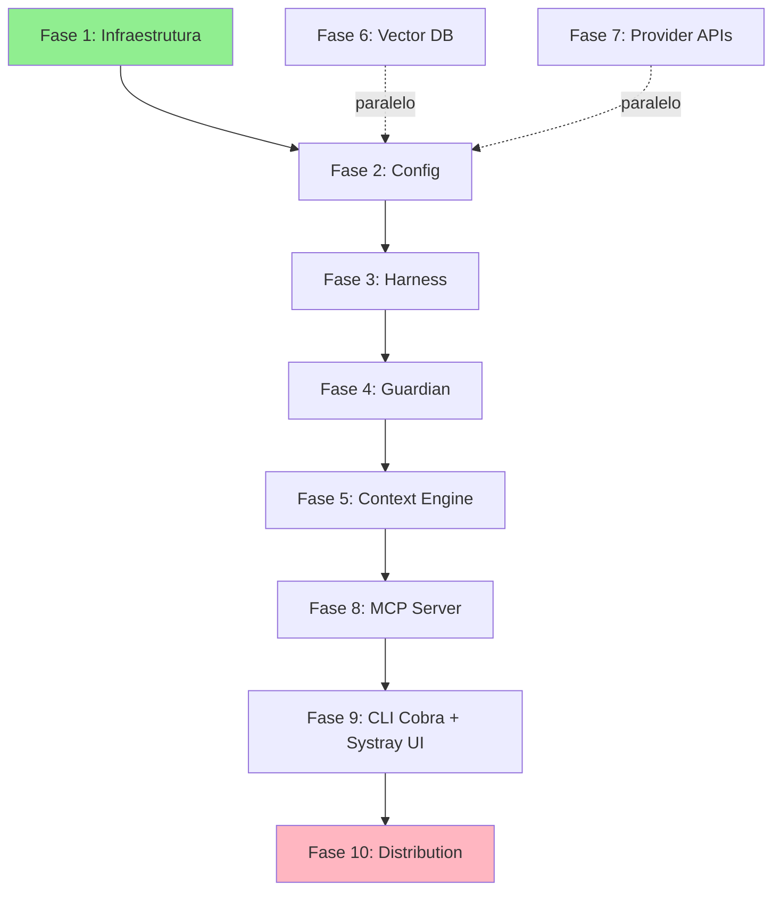




Esta seção contém os **planos de implementação detalhados** para cada área de desenvolvimento do Vectora. Cada documento descreve arquitetura, fases de implementação, exemplos de código Go/TypeScript, dependências entre componentes, e métricas de sucesso.

## Pilares da Arquitetura

Vectora é um **Sub-Agent Tier 2** (não genérico) reconstruído em Go com dois objetivos centrais:

1. **Performance Nativa**: Binário estático ~20MB, startup <50ms, processamento RAG 3x mais rápido que Node.js
2. **Segurança Compilada**: Guardian com blocklist imutável, validação de tipos em tempo de compilação, zero overhead de parsing

## Stack Técnica Confirmada

| Camada           | Tecnologia                | Por quê                                                  |
| :--------------- | :------------------------ | :------------------------------------------------------- |
| **Core**         | **Go 1.21+**              | Performance, concorrência nativa, binário estático       |
| **CLI**          | **Cobra Framework**       | Subcomandos estruturados, shell completion, padrão Go    |
| **Interface**    | **Systray (Go)**          | Cross-platform, sincronização via shared memory com CLI  |
| **LLM**          | **Gemini 3 Flash**        | 30ms latência, $0.075/1M tokens, 1M context window       |
| **Embeddings**   | **Voyage 4**              | AST-aware, similaridade funcional de código              |
| **Reranking**    | **Voyage Rerank 2.5**     | Cross-encoder, <100ms, +25% vs BM25                      |
| **Vector DB**    | **MongoDB Atlas**         | HNSW, isolamento multi-tenant, backend unificado         |
| **Distribution** | **GoReleaser + Winget**   | Multiplataforma, assinatura SHA256, instalação sem admin |
| **Extensions**   | **TypeScript** _(futuro)_ | VS Code, custom middleware                               |

## Estrutura de 10 Fases



## Documento por Fase

### **Fases 1-4: Fundações (Setup, Config, Harness, Guardian)**

**[Core Migration](./core-migration.md)** — Plano completo de 8 fases

- Fase 1: Setup & Infraestrutura (2 semanas)
- Fase 2: Configuração & Validação (1 semana)
- Fase 3: Harness Runtime (3 semanas)
- Fase 4: Guardian Security (2 semanas)

Inclui: Estrutura Go, Cobra basics, Config YAML, Harness Lifecycle, Guardian Blocklist
Código: Structs de config, Harness.ExecuteToolCall, Guardian pattern matching
Testes: Unit tests, bypass tests, validação

### **Fase 5: Context Engine & RAG**

**[Context Engine Implementation](./context-engine.md)** _(a criar)_

- AST parser para Go/TypeScript
- Embedding pipeline (Query → Voyage 4 → HNSW)
- Reranking (Top-50 → Top-10 via Voyage Rerank 2.5)
- Compaction (head/tail, pointers)
- Hybrid search (semântica + estrutural)

Duração: 4 semanas
Dependências: Guardian, Vector DB, Provider APIs

### **Fase 6: Vector Database (MongoDB Atlas)**

**[Vector Database Implementation](./vector-database.md)** _(a criar)_

- MongoDB client com pooling
- 3 coleções: documents, sessions, audit_logs
- HNSW indexing com namespace filtering
- Query builders otimizados
- Atomicidade metadata-vetor

Duração: 2 semanas
Dependências: Config (paralelo possível)

### **Fase 7: Provider Router (Gemini + Voyage)**

**[Provider Router Implementation](./provider-router.md)** _(a criar)_

- Gemini 3 Flash client (com exponential backoff)
- Voyage 4 embedding client
- Voyage Rerank 2.5 client
- Fallback BYOK support
- Rate limiting + quota tracking

Duração: 2 semanas
Dependências: Config (paralelo possível)

### **Fase 8: MCP Server**

**[MCP Server Implementation](./mcp-server.md)** _(a criar)_

- JSON-RPC 2.0 server (stdio transport)
- Tool registry dinâmico (12 ferramentas)
- Message routing + error handling
- Conformance vs spec MCP
- Session management via MCP headers

Duração: 2 semanas
Dependências: Harness, Context Engine, Guardian

### **Fase 9: CLI Engine (Cobra)**

**[CLI Engine](./cli-engine.md)** — Plano completo de 6 fases

- Fase 1: Setup Cobra (1 semana)
- Fase 2: Auth commands (2 semanas)
- Fase 3: Config commands (1 semana)
- Fase 4: Index commands (2 semanas)
- Fase 5: Service commands (1 semana)
- Fase 6: Shell completion (5 dias)

Subcomandos: `auth`, `config`, `index`, `service`, `status`
Global flags: `--debug`, `--config`, `--namespace`, `--json`

**[Systray UX](./systray-ux.md)** (integrado no mesmo processo):

- UI em Go (tray-go library)
- Menu: Status, Login, Settings, About
- SSO flow com browser callback
- Real-time sync com CLI (shared memory)
- Windows Service registry
- Auto-start on login

Duração: 2 semanas
Dependências: Harness, Config

### **Fase 10: Distribution Pipeline**

**[Distribution Pipeline](./distribution-pipeline.md)** — Plano completo de 6 fases

- Fase 1: CI Workflow (1 semana)
- Fase 2: GoReleaser config (1 semana)
- Fase 3: Winget integration (1 semana)
- Fase 4: CD Workflow (1 semana)
- Fase 5: Local installer (1 semana)
- Fase 6: Build automation (3 dias)

CI: golangci-lint, `go test -race`, smoke builds
CD: GoReleaser (6 arquiteturas), checksums, GitHub Releases
Winget: Manifests automáticos, submissão PR, `winget install kaffyn.vectora`
Instalação: `%LOCALAPPDATA%\Programs\Vectora`, sem UAC

Duração: 2 semanas
Dependências: Todos os componentes acima

### **Fase 11 (Extensão 1): Distribuição via Homebrew (macOS)**

**[Homebrew Distribution](./homebrew-distribution.md)** — Plano completo de 6 fases

- Fase 1: Criar Homebrew Tap (3 dias)
- Fase 2: Criar Fórmulas Ruby (1 semana)
- Fase 3: Integração GoReleaser (3 dias)
- Fase 4: CI/CD Workflow (1 semana)
- Fase 5: Testes & Validação (3 dias)
- Fase 6: Documentação (3 dias)

Inclui: Repositório kaffyn/homebrew-vectora, fórmulas para CLI e Systray, auto-update via script, testes de instalação
Suporte: Intel (amd64) + Apple Silicon (arm64)
Tempo até Homebrew: <24h após release

Duração: 1 semana
Dependências: GoReleaser, GitHub Releases

### **Fase 11 (Extensão 2): Distribuição via Docker**

**[Docker Distribution](./docker-distribution.md)** — Plano completo de 7 fases

- Fase 1: Dockerfile multi-stage (1 semana)
- Fase 2: Dockerfile Managed Instances (1 semana)
- Fase 3: docker-compose.yml (3 dias)
- Fase 4: GitHub Actions + GoReleaser (1 semana)
- Fase 5: Kubernetes Deployment (2 semanas)
- Fase 6: Testes & Segurança (1 semana)
- Fase 7: Documentação (3 dias)

Inclui: Build multi-arch (amd64/arm64), docker-compose dev/prod, Kubernetes manifests, HPA, SBOM, security scanning (Trivy)
Imagem: <150MB, user não-root, healthcheck integrado
Registry: Docker Hub (kaffyn/vectora)
CI/CD: Auto push ao tag, SBOM generation, Slack notifications

Duração: 4 semanas
Dependências: GoReleaser, GitHub Releases

### **Fase 11 (Extensão 3): Distribuição para Linux (apt/yum)**

**[Linux Distribution](./linux-distribution.md)** _(a criar)_

- Fase 1: .deb packages (Debian/Ubuntu)
- Fase 2: .rpm packages (Fedora/CentOS)
- Fase 3: Integração GoReleaser
- Fase 4: Repositórios APT/YUM
- Fase 5: Testes

Duração: 2 semanas
Dependências: GoReleaser, distribution-pipeline

## Verificação de Stack por Documento

| Documento                                           | Go?   | Cobra?   | Systray? | Dist.    | Segurança?   |
| :-------------------------------------------------- | :---- | :------- | :------- | :------- | :----------- |
| [CLI Engine](./cli-engine.md)                       | -     | Completo | Completo | -        | Validação    |
| [Systray UX](./systray-ux.md)                       | -     | Integr.  | Completo | -        | SSO          |
| [Security Engine](./security-engine.md)             | -     | -        | -        | -        | Blocklist    |
| [Distribution Pipeline](./distribution-pipeline.md) | -     | -        | -        | Winget   | SHA256       |
| [Homebrew Distribution](./homebrew-distribution.md) | -     | -        | -        | Homebrew | Assinatura   |
| [Docker Distribution](./docker-distribution.md)     | Multi | -        | -        | Docker   | Trivy + SBOM |
| [Context Engine](./context-engine.md)               | -     | -        | -        | -        | -            |
| [Vector Database](./vector-database.md)             | -     | -        | -        | -        | -            |
| [Provider Router](./provider-router.md)             | -     | -        | -        | -        | -            |
| [MCP Server](./mcp-server.md)                       | -     | -        | -        | -        | Auth         |

## Caminho Crítico de Implementação

**Sequência obrigatória** (dependências em cascata):

```text
Fase 1 (Setup)
  → Fase 2 (Config)
    → Fase 3 (Harness)
      → Fase 4 (Guardian)
        → Fase 5 (Context Engine)
          → Fase 8 (MCP Server)
            → Fase 9 (CLI + Systray)
              → Fase 10 (Distribution)
```

**Paralelos possíveis**:

- Fases 6 (Vector DB) e 7 (Provider APIs) podem rodar com Fase 2 (Config)

**Duração Total**:

- Crítico: 22 semanas (4,4 meses)
- Com paralelismo: 20 semanas (4 meses)
- Com paralelismo agressivo (full team): 16 semanas (3,2 meses)

## Garantias de Qualidade

Cada fase inclui:

**Código Go tipado**: Structs com validação, interfaces para abstração
**Testes**: Unit, integration, testes de segurança
**Documentação**: Exemplos de código, arquitetura, métricas
**Métricas de Sucesso**: Latência, cobertura, conformance
**CI/CD**: Integração contínua em cada fase

## Navegação Rápida

| Você quer...                    | Leia                                                 |
| :------------------------------ | :--------------------------------------------------- |
| Entender infraestrutura e build | [Core Migration](./core-migration.md) Fase 1         |
| Aprender sobre segurança        | [Security Engine](./security-engine.md)              |
| Implementar CLI robusta         | [CLI Engine](./cli-engine.md)                        |
| Integrar com Systray            | [Systray UX](./systray-ux.md)                        |
| Distribuição Windows            | [Distribution Pipeline](./distribution-pipeline.md)  |
| Distribuição macOS              | [Homebrew Distribution](./homebrew-distribution.md)  |
| Distribuição Docker/K8s         | [Docker Distribution](./docker-distribution.md)      |
| Detalhes de RAG/busca           | [Context Engine](./context-engine.md) _(em breve)_   |
| Persistência de estado          | [Vector Database](./vector-database.md) _(em breve)_ |
| APIs Gemini/Voyage              | [Provider Router](./provider-router.md) _(em breve)_ |
| Protocolo MCP                   | [MCP Server](./mcp-server.md) _(em breve)_           |

---

## External Linking

| Concept               | Resource                                   | Link                                                                                   |
| --------------------- | ------------------------------------------ | -------------------------------------------------------------------------------------- |
| **MCP**               | Model Context Protocol Specification       | [modelcontextprotocol.io/specification](https://modelcontextprotocol.io/specification) |
| **MCP Go SDK**        | Go SDK for MCP (mark3labs)                 | [github.com/mark3labs/mcp-go](https://github.com/mark3labs/mcp-go)                     |
| **Docker**            | Docker Documentation                       | [docs.docker.com/](https://docs.docker.com/)                                           |
| **Voyage Embeddings** | Voyage Embeddings Documentation            | [docs.voyageai.com/docs/embeddings](https://docs.voyageai.com/docs/embeddings)         |
| **Voyage Reranker**   | Voyage Reranker API                        | [docs.voyageai.com/docs/reranker](https://docs.voyageai.com/docs/reranker)             |
| **Cobra**             | A Commander for modern Go CLI interactions | [cobra.dev/](https://cobra.dev/)                                                       |

---

_Parte do ecossistema Vectora_ · [Open Source (MIT)](https://github.com/Kaffyn/Vectora) · [Contribuidores](https://github.com/Kaffyn/Vectora/graphs/contributors)
