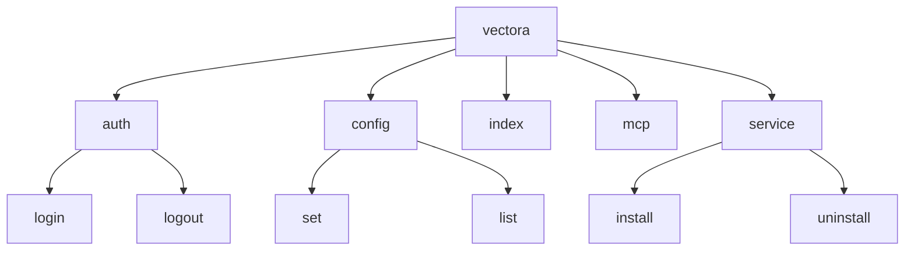




Vectora uses the **Cobra** framework to manage its command-line interface. This choice ensures a strict command structure, automatic `--help` support, and compliance with POSIX standards.

## Command Architecture

The CLI is organized into a command tree, where the base `vectora` command acts as the main entry point, delegating functions to specialized subcommands.



## Why Cobra?

- **Nested Subcommands**: Allows creating clear namespaces like `vectora auth login` instead of complex flags.
- **Global vs. Local Flags**: Flags like `--debug` or `--config` can be accessed by any command, while flags like `--force` are exclusive to `index`.
- **Smart Suggestions**: Provides automatic suggestions ("Did you mean...?") for mistyped commands.
- **Shell Completion**: Automatically generates completion scripts for Bash, Zsh, Fish, and PowerShell.

## Technical Implementation

Each command in Vectora is defined as an instance of `&cobra.Command`. The execution logic is kept separate from `main.go`, residing in directories like `cmd/` and functionally linked to the `pkg/core` package.

## Command Structure Example (Go Mockup)

```go
var indexCmd = &cobra.Command{
    Use:   "index [path]",
    Short: "Indexes files in the current namespace",
    Run: func(cmd *cobra.Command, args []string) {
        // Indexing logic calling the Context Engine
    },
}
```

## Systray Integration

While Vectora has a robust CLI, it also communicates with the [Systray](./systray-ux.md) process through system signals or simple IPC (Inter-Process Communication). This allows actions triggered via the terminal (such as a successful login) to instantly update the visual state in the system tray.

---

_Part of the Vectora ecosystem_ · Internal Engineering
