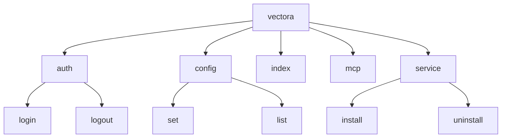



Vectora uses the **Cobra** framework for its CLI. Cobra and **Systray** coexist in the same daemon binary — the CLI provides automation/scripting while Systray provides the visual interface, both synchronized in real-time through shared in-memory state.

## Command Architecture

The CLI is organized into a command tree, where the base `vectora` command acts as the main entry point, delegating functions to specialized subcommands.



## Why Cobra?

- **Nested Subcommands**: Allows creating clear namespaces like `vectora auth login` instead of complex flags.
- **Global vs. Local Flags**: Flags like `--debug` or `--config` can be accessed by any command, while flags like `--force` are exclusive to `index`.
- **Smart Suggestions**: Provides automatic suggestions ("Did you mean...?") for mistyped commands.
- **Shell Completion**: Automatically generates completion scripts for Bash, Zsh, Fish, and PowerShell.

## Technical Implementation

Each command in Vectora is defined as an instance of `&cobra.Command`. The execution logic is kept separate from `main.go`, residing in directories like `cmd/` and functionally linked to the `pkg/core` package.

## Command Structure Example (Go Mockup)

```go
var indexCmd = &cobra.Command{
    Use:   "index [path]",
    Short: "Indexes files in the current namespace",
    Run: func(cmd *cobra.Command, args []string) {
        // Indexing logic calling the Context Engine
    },
}
```

## Systray Integration

Systray and CLI coexist in the same daemon process. Actions in the CLI (like `vectora auth login`) instantly update the Systray UI state through shared memory — no separate process or IPC needed. See [Systray UX](./systray-ux.md) for details on the unified architecture.

---

_Part of the Vectora ecosystem_ · [Open Source (MIT)](https://github.com/Kaffyn/Vectora) · [Contributors](https://github.com/Kaffyn/Vectora/graphs/contributors)
