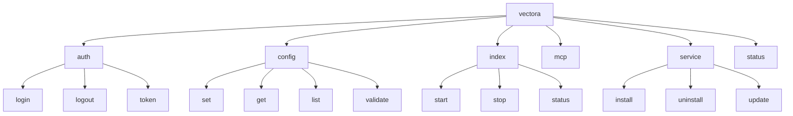
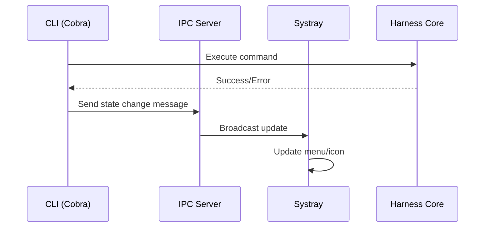




O Vectora utiliza **Cobra** para sua interface CLI. Cobra e **Systray** coexistem no mesmo binário daemon — a CLI fornece automação/scripts enquanto Systray fornece a interface visual, ambas sincronizadas em tempo real através de estado compartilhado em memória.

## Arquitetura de Comandos



## Justificativa de Cobra

| Critério              | Flag-Based Approach            | Cobra Subcommands                        |
| :-------------------- | :----------------------------- | :--------------------------------------- |
| **Clareza**           | `vectora --index --path=./src` | `vectora index ./src`                    |
| **Discoverabilidade** | Requer ler docs                | `vectora --help` + `vectora auth --help` |
| **Shell Completion**  | Manual                         | Automático (Bash, Zsh, Fish, PowerShell) |
| **Extensibilidade**   | Difícil (flags crescem)        | Fácil (novos subcomandos)                |

## Fases de Implementação

### **Fase 1: Setup Inicial de Cobra**

**Duração**: 1 semana

**Deliverables**:

- [ ] Estrutura de projeto com `cmd/` e `pkg/`
- [ ] Comando raiz com flags globais
- [ ] Autocompletar para shells populares

**Código de Exemplo - Root Command**:

```go
// cmd/vectora/main.go
package main

import (
    "fmt"
    "os"
    "github.com/spf13/cobra"
    "github.com/spf13/viper"
)

var (
    cfgFile string
    debug bool
    version = "dev"
)

var rootCmd = &cobra.Command{
    Use: "vectora",
    Short: "Vectora - AI Sub-Agent for Code Context",
    Long: `Vectora is a Tier-2 sub-agent that manages context and security for AI coding agents.

It operates exclusively via MCP protocol, providing governance, RAG, and context engineering
to your primary agent (Claude, Gemini, Cursor, etc.).`,
    Version: version,
    SilenceUsage: true,
}

var versionCmd = &cobra.Command{
    Use: "version",
    Short: "Print version information",
    Run: func(cmd *cobra.Command, args []string) {
        fmt.Printf("Vectora version %s\n", version)
    },
}

func init() {
    cobra.OnInitialize(initConfig)

    rootCmd.PersistentFlags().StringVar(&cfgFile, "config", "", "config file (default: ~/.vectora/config.yaml)")
    rootCmd.PersistentFlags().BoolVar(&debug, "debug", false, "enable debug logging")

    viper.BindPFlag("config", rootCmd.PersistentFlags().Lookup("config"))
    viper.BindPFlag("debug", rootCmd.PersistentFlags().Lookup("debug"))

    rootCmd.AddCommand(versionCmd)
}

func initConfig() {
    if cfgFile != "" {
        viper.SetConfigFile(cfgFile)
    } else {
        home, err := os.UserHomeDir()
        cobra.CheckErr(err)
        viper.AddConfigPath(home + "/.vectora")
        viper.SetConfigType("yaml")
        viper.SetConfigName("config")
    }

    if err := viper.ReadInConfig(); err != nil && !os.IsNotExist(err) {
        fmt.Fprintf(os.Stderr, "Error reading config: %v\n", err)
    }
}

func main() {
    if err := rootCmd.Execute(); err != nil {
        os.Exit(1)
    }
}
```

### **Fase 2: Subcomandos de Autenticação**

**Duração**: 2 semanas

**Deliverables**:

- [ ] `vectora auth login` (abre navegador SSO)
- [ ] `vectora auth logout`
- [ ] `vectora auth token` (listar/revogar tokens)
- [ ] Sincronização de estado com Systray UI
- [ ] OAuth 2.0 flow com callback local

**Código de Exemplo - Auth Commands**:

```go
// cmd/vectora/cmd/auth.go
package cmd

import (
    "fmt"
    "os"
    "github.com/spf13/cobra"
    "vectora/pkg/auth"
)

var authCmd = &cobra.Command{
    Use: "auth",
    Short: "Manage authentication",
}

var loginCmd = &cobra.Command{
    Use: "login",
    Short: "Authenticate via SSO (opens browser)",
    RunE: func(cmd *cobra.Command, args []string) error {
        authMgr, err := auth.NewAuthManager(viper.GetString("config"))
        if err != nil {
            return fmt.Errorf("failed to initialize auth: %w", err)
        }

        // Login sempre abre navegador; Systray UI sincroniza estado automaticamente
        token, err := authMgr.LoginWithBrowser()
        if err != nil {
            return fmt.Errorf("login failed: %w", err)
        }

        fmt.Println(" Successfully authenticated")
        // Notifica Systray via shared state (sem chamadas externas)
        authMgr.NotifyUIStateChange("authenticated")
        return nil
    },
}

var logoutCmd = &cobra.Command{
    Use: "logout",
    Short: "Logout from Vectora",
    RunE: func(cmd *cobra.Command, args []string) error {
        authMgr, err := auth.NewAuthManager(viper.GetString("config"))
        if err != nil {
            return err
        }

        if err := authMgr.Logout(); err != nil {
            return fmt.Errorf("logout failed: %w", err)
        }

        fmt.Println(" Successfully logged out")
        authMgr.NotifyUIStateChange("unauthenticated")
        return nil
    },
}

var tokenCmd = &cobra.Command{
    Use: "token",
    Short: "Manage API tokens",
}

var tokenListCmd = &cobra.Command{
    Use: "list",
    Short: "List all active tokens",
    RunE: func(cmd *cobra.Command, args []string) error {
        authMgr, err := auth.NewAuthManager(viper.GetString("config"))
        if err != nil {
            return err
        }

        tokens, err := authMgr.ListTokens()
        if err != nil {
            return fmt.Errorf("failed to list tokens: %w", err)
        }

        for _, token := range tokens {
            fmt.Printf("ID: %s | Created: %s | Expires: %s\n",
                token.ID, token.CreatedAt, token.ExpiresAt)
        }

        return nil
    },
}

func init() {
    rootCmd.AddCommand(authCmd)
    authCmd.AddCommand(loginCmd, logoutCmd, tokenCmd)
    tokenCmd.AddCommand(tokenListCmd)

    // Sem flags --gui; Systray está sempre presente no mesmo processo
}
```

### **Fase 3: Subcomandos de Configuração**

**Duração**: 1 semana

**Deliverables**:

- [ ] `vectora config get <key>`
- [ ] `vectora config set <key> <value>`
- [ ] `vectora config list`
- [ ] Validação de schema ao salvar

**Código de Exemplo - Config Commands**:

```go
// cmd/vectora/cmd/config.go
package cmd

import (
    "fmt"
    "github.com/spf13/cobra"
    "github.com/spf13/viper"
)

var configCmd = &cobra.Command{
    Use: "config",
    Short: "Manage configuration",
}

var configGetCmd = &cobra.Command{
    Use: "get <key>",
    Short: "Get a configuration value",
    Args: cobra.ExactArgs(1),
    RunE: func(cmd *cobra.Command, args []string) error {
        key := args[0]
        value := viper.Get(key)

        if value == nil {
            return fmt.Errorf("key not found: %s", key)
        }

        fmt.Printf("%s: %v\n", key, value)
        return nil
    },
}

var configSetCmd = &cobra.Command{
    Use: "set <key> <value>",
    Short: "Set a configuration value",
    Args: cobra.ExactArgs(2),
    RunE: func(cmd *cobra.Command, args []string) error {
        key, value := args[0], args[1]

        // Validar configuração antes de salvar
        if err := validateConfigKey(key, value); err != nil {
            return fmt.Errorf("invalid configuration: %w", err)
        }

        viper.Set(key, value)
        if err := viper.WriteConfig(); err != nil {
            return fmt.Errorf("failed to save config: %w", err)
        }

        fmt.Printf(" Set %s = %s\n", key, value)
        return nil
    },
}

var configListCmd = &cobra.Command{
    Use: "list",
    Short: "List all configuration values",
    RunE: func(cmd *cobra.Command, args []string) error {
        settings := viper.AllSettings()
        for key, value := range settings {
            fmt.Printf("%s: %v\n", key, value)
        }
        return nil
    },
}

func validateConfigKey(key, value string) error {
    switch key {
    case "api_key":
        if len(value) < 32 {
            return fmt.Errorf("api_key must be at least 32 characters")
        }
    case "namespace":
        if value == "" {
            return fmt.Errorf("namespace cannot be empty")
        }
    case "debug":
        if value != "true" && value != "false" {
            return fmt.Errorf("debug must be 'true' or 'false'")
        }
    }
    return nil
}

func init() {
    rootCmd.AddCommand(configCmd)
    configCmd.AddCommand(configGetCmd, configSetCmd, configListCmd)
}
```

### **Fase 4: Subcomandos de Indexação**

**Duração**: 2 semanas

**Deliverables**:

- [ ] `vectora index start [path]` (iniciar indexação assíncrona)
- [ ] `vectora index stop` (parar indexação)
- [ ] `vectora index status` (mostrar progresso)
- [ ] Event-based sync com Systray

**Código de Exemplo - Index Commands**:

```go
// cmd/vectora/cmd/index.go
package cmd

import (
    "fmt"
    "github.com/spf13/cobra"
    "vectora/pkg/core"
    "vectora/pkg/ipc"
)

var indexCmd = &cobra.Command{
    Use: "index",
    Short: "Manage vector indexing",
}

var indexStartCmd = &cobra.Command{
    Use: "start [path]",
    Short: "Start indexing a directory",
    Args: cobra.MaximumNArgs(1),
    RunE: func(cmd *cobra.Command, args []string) error {
        path := "."
        if len(args) > 0 {
            path = args[0]
        }

        harness, err := core.NewHarness(viper.GetViper())
        if err != nil {
            return fmt.Errorf("failed to initialize harness: %w", err)
        }
        defer harness.Close()

        // Iniciar indexação e notificar Systray
        indexID, err := harness.StartIndexing(cmd.Context(), path)
        if err != nil {
            return fmt.Errorf("indexing failed: %w", err)
        }

        // Notificar Systray via IPC
        client := ipc.NewClient()
        client.Send(&ipc.Message{
            Type: "index_started",
            Data: map[string]interface{}{
                "id": indexID,
                "path": path,
            },
        })

        fmt.Printf(" Indexing started with ID: %s\n", indexID)
        return nil
    },
}

var indexStatusCmd = &cobra.Command{
    Use: "status",
    Short: "Show indexing status",
    RunE: func(cmd *cobra.Command, args []string) error {
        harness, err := core.NewHarness(viper.GetViper())
        if err != nil {
            return err
        }
        defer harness.Close()

        status, err := harness.GetIndexingStatus(cmd.Context())
        if err != nil {
            return err
        }

        fmt.Printf("Status: %s\n", status.State)
        fmt.Printf("Progress: %d/%d files\n", status.ProcessedFiles, status.TotalFiles)
        fmt.Printf("Elapsed: %v\n", status.Elapsed)
        return nil
    },
}

func init() {
    rootCmd.AddCommand(indexCmd)
    indexCmd.AddCommand(indexStartCmd, indexStatusCmd)
}
```

### **Fase 5: Subcomandos de Serviço**

**Duração**: 1 semana

**Deliverables**:

- [ ] `vectora service install` (registrar como Windows Service)
- [ ] `vectora service uninstall`
- [ ] `vectora service start`
- [ ] `vectora service stop`

**Código de Exemplo - Service Commands**:

```go
// cmd/vectora/cmd/service.go
package cmd

import (
    "fmt"
    "github.com/spf13/cobra"
    "vectora/pkg/service"
)

var serviceCmd = &cobra.Command{
    Use: "service",
    Short: "Manage Vectora service",
}

var serviceInstallCmd = &cobra.Command{
    Use: "install",
    Short: "Install Vectora as Windows Service",
    RunE: func(cmd *cobra.Command, args []string) error {
        if err := service.Install(); err != nil {
            return fmt.Errorf("installation failed: %w", err)
        }
        fmt.Println(" Service installed successfully")
        return nil
    },
}

var serviceUninstallCmd = &cobra.Command{
    Use: "uninstall",
    Short: "Uninstall Vectora service",
    RunE: func(cmd *cobra.Command, args []string) error {
        if err := service.Uninstall(); err != nil {
            return fmt.Errorf("uninstallation failed: %w", err)
        }
        fmt.Println(" Service uninstalled successfully")
        return nil
    },
}

var serviceStartCmd = &cobra.Command{
    Use: "start",
    Short: "Start Vectora service",
    RunE: func(cmd *cobra.Command, args []string) error {
        if err := service.Start(); err != nil {
            return fmt.Errorf("failed to start service: %w", err)
        }
        fmt.Println(" Service started")
        return nil
    },
}

var serviceStopCmd = &cobra.Command{
    Use: "stop",
    Short: "Stop Vectora service",
    RunE: func(cmd *cobra.Command, args []string) error {
        if err := service.Stop(); err != nil {
            return fmt.Errorf("failed to stop service: %w", err)
        }
        fmt.Println(" Service stopped")
        return nil
    },
}

func init() {
    rootCmd.AddCommand(serviceCmd)
    serviceCmd.AddCommand(
        serviceInstallCmd,
        serviceUninstallCmd,
        serviceStartCmd,
        serviceStopCmd,
    )
}
```

### **Fase 6: Shell Completion & Help**

**Duração**: 5 dias

**Deliverables**:

- [ ] Autocompletar para Bash/Zsh/Fish/PowerShell
- [ ] Help customizado com exemplos
- [ ] Validação de argumentos

**Código de Exemplo - Completion**:

```go
// cmd/vectora/cmd/completion.go
package cmd

import (
    "github.com/spf13/cobra"
)

var completionCmd = &cobra.Command{
    Use: "completion [bash|zsh|fish|powershell]",
    Short: "Generate shell completion",
    Args: cobra.MatchAll(cobra.ExactArgs(1), cobra.OnlyValidArgs),
    ValidArgs: []string{"bash", "zsh", "fish", "powershell"},
    RunE: func(cmd *cobra.Command, args []string) error {
        switch args[0] {
        case "bash":
            return rootCmd.GenBashCompletion(os.Stdout)
        case "zsh":
            return rootCmd.GenZshCompletion(os.Stdout)
        case "fish":
            return rootCmd.GenFishCompletion(os.Stdout, true)
        case "powershell":
            return rootCmd.GenPowerShellCompletion(os.Stdout)
        }
        return nil
    },
}

func init() {
    rootCmd.AddCommand(completionCmd)
}
```

## Integração com Systray via IPC

A CLI e o Systray se comunicam através de **Named Pipes (Windows)** ou **Unix Sockets (Linux/macOS)** para sincronizar estado em tempo real.

**Fluxo de Sincronização**:



## Métricas de Sucesso

- Todos os subcomandos possuem `--help` com exemplos
- Autocompletar funciona em 4+ shells
- Startup CLI <100ms
- 100% de testes para validação de flags
- IPC sync latência <500ms

---

_Parte do ecossistema Vectora_ · Engenharia Interna
