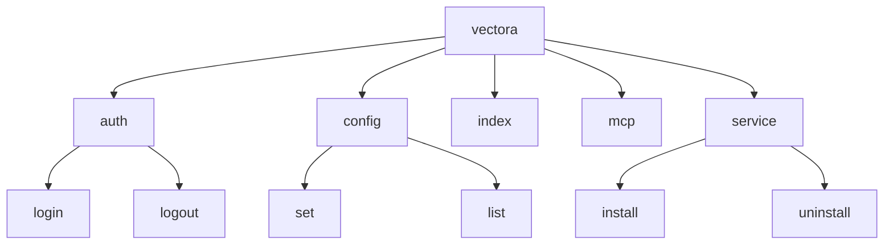




O Vectora utiliza o framework **Cobra** para gerenciar sua interface de linha de comando. Esta escolha garante uma estrutura de comandos rigorosa, auxílio automático via `--help` e conformidade com os padrões POSIX.

## Arquitetura de Comandos

A CLI é organizada em uma árvore de comandos, onde o comando base `vectora` atua como o ponto de entrada principal, delegando funções para subcomandos especializados.



## Por que Cobra?

- **Subcomandos Aninhados**: Permite criar namespaces claros como `vectora auth login` em vez de flags complexas.
- **Flags Globais vs Locais**: Flags como `--debug` ou `--config` podem ser acessadas por qualquer comando, enquanto flags como `--force` são exclusivas do `index`.
- **Sugestão Inteligente**: Fornece sugestões automáticas ("Did you mean...?") para comandos digitados incorretamente.
- **Shell Completion**: Geração automática de scripts de autocompletar para Bash, Zsh, Fish e PowerShell.

## Implementação Técnica

Cada comando no Vectora é definido como uma instância de `&cobra.Command`. A lógica de execução é mantida separada do `main.go`, residindo em diretórios como `cmd/` e vinculada funcionalmente ao pacote `pkg/core`.

## Exemplo de Estrutura de Comando (Mockup Go)

```go
var indexCmd = &cobra.Command{
    Use:   "index [path]",
    Short: "Indexa arquivos no namespace atual",
    Run: func(cmd *cobra.Command, args []string) {
        // Lógica de indexação chamando o Context Engine
    },
}
```

## Integração com o Systray

Embora o Vectora possua uma CLI robusta, ele também se comunica com o processo do [Systray](./systray-ux.md) através de sinais do sistema ou IPC (Inter-Process Communication) simples. Isso permite que ações disparadas via terminal (como um login bem-sucedido) atualizem instantaneamente o estado visual na bandeja do sistema.

---

_Parte do ecossistema Vectora_ · Engenharia Interna
