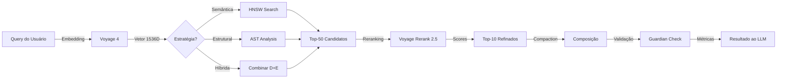




O **Context Engine** é o coração da recuperação de contexto no Vectora. Ele implementa um pipeline completo: **Query → Embed → Search → Rerank → Compose → Validate**. Este documento detalha a implementação em Go puro.

## Arquitetura de Alto Nível



## Fases de Implementação

### **Fase 1: AST Parser para Código**

**Duração**: 1,5 semanas

**Deliverables**:

- [ ] Parser Go AST nativo
- [ ] Extrair funções, tipos, imports
- [ ] Chunking inteligente (max 500 tokens)
- [ ] Preservar contexto de hierarquia

**Código de Exemplo - AST Parser Go**:

```go
// pkg/parser/ast_parser.go
package parser

import (
    "fmt"
    "go/ast"
    "go/parser"
    "go/token"
    "strings"
)

type CodeChunk struct {
    FilePath string
    StartLine int
    EndLine int
    Content string
    Type string // function, struct, interface, etc
    Name string
    Dependencies []string
    Imports []string
}

type ASTParser struct {
    fset *token.FileSet
}

func NewASTParser() *ASTParser {
    return &ASTParser{
        fset: token.NewFileSet(),
    }
}

func (ap *ASTParser) ParseFile(filePath string, content string) ([]CodeChunk, error) {
    f, err := parser.ParseFile(ap.fset, filePath, content, parser.ParseComments)
    if err != nil {
        return nil, fmt.Errorf("failed to parse file: %w", err)
    }

    var chunks []CodeChunk

    for _, decl := range f.Decls {
        switch d := decl.(type) {
        case *ast.FuncDecl:
            chunk := ap.extractFunctionChunk(d, filePath, content)
            if chunk != nil {
                chunks = append(chunks, *chunk)
            }

        case *ast.GenDecl:
            if d.Tok == token.TYPE {
                for _, spec := range d.Specs {
                    if ts, ok := spec.(*ast.TypeSpec); ok {
                        chunk := ap.extractTypeChunk(ts, d, filePath, content)
                        if chunk != nil {
                            chunks = append(chunks, *chunk)
                        }
                    }
                }
            }
        }
    }

    return chunks, nil
}

func (ap *ASTParser) extractFunctionChunk(fn *ast.FuncDecl, filePath string, content string) *CodeChunk {
    start := ap.fset.Position(fn.Pos()).Line
    end := ap.fset.Position(fn.End()).Line

    // Extrair dependências (chamadas de funções)
    deps := ap.extractDependencies(fn.Body)

    return &CodeChunk{
        FilePath: filePath,
        StartLine: start,
        EndLine: end,
        Content: ap.extractLines(content, start, end),
        Type: "function",
        Name: fn.Name.Name,
        Dependencies: deps,
    }
}

func (ap *ASTParser) extractDependencies(node ast.Node) []string {
    var deps []string
    ast.Inspect(node, func(n ast.Node) bool {
        if call, ok := n.(*ast.CallExpr); ok {
            if ident, ok := call.Fun.(*ast.Ident); ok {
                deps = append(deps, ident.Name)
            }
        }
        return true
    })
    return deps
}

func (ap *ASTParser) extractLines(content string, start, end int) string {
    lines := strings.Split(content, "\n")
    if start < 1 || end > len(lines) {
        return ""
    }
    return strings.Join(lines[start-1:end], "\n")
}
```

### **Fase 2: Embedding Pipeline via Voyage 4**

**Duração**: 1 semana

**Deliverables**:

- [ ] Client Voyage 4 com retry logic
- [ ] Batch embedding (múltiplos chunks)
- [ ] Caching de embeddings
- [ ] Tratamento de rate limits

**Código de Exemplo - Voyage Client**:

```go
// pkg/providers/voyage.go
package providers

import (
    "bytes"
    "context"
    "encoding/json"
    "fmt"
    "io"
    "net/http"
    "time"
)

type VoyageClient struct {
    apiKey string
    baseURL string
    httpClient *http.Client
    model string
}

type EmbeddingRequest struct {
    Input []string `json:"input"`
    Model string `json:"model"`
    InputType string `json:"input_type,omitempty"` // document or query
    TruncateInputs bool `json:"truncate_inputs,omitempty"`
}

type EmbeddingResponse struct {
    Data []EmbeddingData `json:"data"`
    Model string `json:"model"`
    Usage map[string]int `json:"usage"`
}

type EmbeddingData struct {
    Embedding []float32 `json:"embedding"`
    Index int `json:"index"`
}

func NewVoyageClient(apiKey string) *VoyageClient {
    return &VoyageClient{
        apiKey: apiKey,
        baseURL: "https://api.voyageai.com/v1",
        httpClient: &http.Client{
            Timeout: 30 * time.Second,
        },
        model: "voyage-4",
    }
}

func (vc *VoyageClient) EmbedQuery(ctx context.Context, query string) ([]float32, error) {
    return vc.embed(ctx, []string{query}, "query")
}

func (vc *VoyageClient) EmbedDocuments(ctx context.Context, docs []string) ([][]float32, error) {
    embeddings := make([][]float32, 0)

    // Processar em batches de 128
    batchSize := 128
    for i := 0; i < len(docs); i += batchSize {
        end := i + batchSize
        if end > len(docs) {
            end = len(docs)
        }

        batch := docs[i:end]
        batchEmbeddings, err := vc.embed(ctx, batch, "document")
        if err != nil {
            return nil, fmt.Errorf("batch embedding failed: %w", err)
        }

        embeddings = append(embeddings, batchEmbeddings...)
    }

    return embeddings, nil
}

func (vc *VoyageClient) embed(ctx context.Context, texts []string, inputType string) ([][]float32, error) {
    req := EmbeddingRequest{
        Input: texts,
        Model: vc.model,
        InputType: inputType,
        TruncateInputs: true,
    }

    return vc.doRequest(ctx, req)
}

func (vc *VoyageClient) doRequest(ctx context.Context, req EmbeddingRequest) ([][]float32, error) {
    body, err := json.Marshal(req)
    if err != nil {
        return nil, err
    }

    httpReq, err := http.NewRequestWithContext(ctx, "POST", vc.baseURL+"/embeddings", bytes.NewReader(body))
    if err != nil {
        return nil, err
    }

    httpReq.Header.Set("Authorization", "Bearer "+vc.apiKey)
    httpReq.Header.Set("Content-Type", "application/json")

    // Retry logic com exponential backoff
    var lastErr error
    for attempt := 0; attempt < 3; attempt++ {
        resp, err := vc.httpClient.Do(httpReq)
        if err != nil {
            lastErr = err
            time.Sleep(time.Duration(1<<uint(attempt)) * time.Second)
            continue
        }
        defer resp.Body.Close()

        if resp.StatusCode == http.StatusTooManyRequests {
            time.Sleep(time.Duration(1<<uint(attempt)) * time.Second)
            continue
        }

        if resp.StatusCode >= 400 {
            body, _ := io.ReadAll(resp.Body)
            return nil, fmt.Errorf("API error %d: %s", resp.StatusCode, string(body))
        }

        var result EmbeddingResponse
        if err := json.NewDecoder(resp.Body).Decode(&result); err != nil {
            return nil, fmt.Errorf("failed to decode response: %w", err)
        }

        embeddings := make([][]float32, len(result.Data))
        for _, data := range result.Data {
            embeddings[data.Index] = data.Embedding
        }

        return embeddings, nil
    }

    return nil, lastErr
}
```

### **Fase 3: Vector Search (HNSW via MongoDB Atlas)**

**Duração**: 1 semana

**Deliverables**:

- [ ] MongoDB vector search query builder
- [ ] Filtros por namespace obrigatórios
- [ ] Handling de timeouts e falhas
- [ ] Logging de queries

**Código de Exemplo - Vector Search**:

```go
// pkg/core/vector_search.go
package core

import (
    "context"
    "fmt"
    "go.mongodb.org/mongo-driver/bson"
    "go.mongodb.org/mongo-driver/mongo"
)

type SearchResult struct {
    ID string `bson:"_id"`
    FilePath string `bson:"file_path"`
    StartLine int `bson:"start_line"`
    Content string `bson:"content"`
    Score float32 `bson:"score"`
    Metadata map[string]interface{} `bson:"metadata"`
}

func (ce *ContextEngine) SearchVector(ctx context.Context, embedding []float32, namespace string, k int) ([]SearchResult, error) {
    collection := ce.mongoClient.Database("vectora").Collection("documents")

    // Pipeline de aggregation com busca vetorial + filtragem
    pipeline := mongo.Pipeline{
        bson.EM{
            "$search": bson.M{
                "cosmosSearch": bson.M{
                    "vector": embedding,
                    "k": k,
                    "similarityMetric": "cosine",
                },
                "returnStoredSource": true,
            },
        },
        // Filtro obrigatório por namespace
        bson.EM{
            "$match": bson.M{
                "namespace_id": namespace,
                "visibility": "public",
            },
        },
        // Extrair score de similaridade
        bson.EM{
            "$addFields": bson.M{
                "score": bson.M{"$meta": "searchScore"},
            },
        },
        // Limitar resultados
        bson.EM{
            "$limit": int64(k),
        },
    }

    cursor, err := collection.Aggregate(ctx, pipeline)
    if err != nil {
        return nil, fmt.Errorf("aggregation failed: %w", err)
    }
    defer cursor.Close(ctx)

    var results []SearchResult
    if err := cursor.All(ctx, &results); err != nil {
        return nil, fmt.Errorf("failed to decode results: %w", err)
    }

    return results, nil
}
```

### **Fase 4: Reranking via Voyage Rerank 2.5**

**Duração**: 1 semana

**Deliverables**:

- [ ] Voyage Rerank client
- [ ] Batch reranking (top-50 → top-10)
- [ ] Score normalization
- [ ] Fallback sem reranking

**Código de Exemplo - Rerank Client**:

```go
// pkg/providers/voyage_rerank.go
package providers

import (
    "bytes"
    "context"
    "encoding/json"
    "fmt"
    "net/http"
)

type RerankRequest struct {
    Query string `json:"query"`
    Documents []string `json:"documents"`
    TopK int `json:"top_k"`
    Model string `json:"model"`
}

type RerankResult struct {
    Index int `json:"index"`
    Score float32 `json:"relevance_score"`
    Document string `json:"document"`
}

type RerankResponse struct {
    Results []RerankResult `json:"results"`
    Model string `json:"model"`
}

func (vc *VoyageClient) Rerank(ctx context.Context, query string, documents []string, topK int) ([]RerankResult, error) {
    req := RerankRequest{
        Query: query,
        Documents: documents,
        TopK: topK,
        Model: "rerank-lite-1-voyageai",
    }

    body, err := json.Marshal(req)
    if err != nil {
        return nil, err
    }

    httpReq, err := http.NewRequestWithContext(ctx, "POST", vc.baseURL+"/rerank", bytes.NewReader(body))
    if err != nil {
        return nil, err
    }

    httpReq.Header.Set("Authorization", "Bearer "+vc.apiKey)
    httpReq.Header.Set("Content-Type", "application/json")

    resp, err := vc.httpClient.Do(httpReq)
    if err != nil {
        return nil, fmt.Errorf("request failed: %w", err)
    }
    defer resp.Body.Close()

    if resp.StatusCode >= 400 {
        return nil, fmt.Errorf("rerank API error: %d", resp.StatusCode)
    }

    var result RerankResponse
    if err := json.NewDecoder(resp.Body).Decode(&result); err != nil {
        return nil, fmt.Errorf("failed to decode rerank response: %w", err)
    }

    return result.Results, nil
}
```

### **Fase 5: Compaction (Head/Tail Strategy)**

**Duração**: 1 semana

**Deliverables**:

- [ ] Extração de cabeço (primeiras linhas)
- [ ] Extração de cauda (últimas linhas)
- [ ] Pointers para contexto omitido
- [ ] Preservação de sintaxe

**Código de Exemplo - Compaction**:

```go
// pkg/core/compaction.go
package core

import (
    "fmt"
    "strings"
)

type CompactedChunk struct {
    Head string // Primeiras N linhas
    Tail string // Últimas N linhas
    Pointer string // "... [50 linhas omitidas] ..."
    Original string
    Tokens int
    Compressed bool
}

const MAX_TOKENS = 1024

func (ce *ContextEngine) CompactChunk(content string, maxTokens int) *CompactedChunk {
    // Estimar tokens (rough: 1 token ≈ 4 caracteres)
    estimatedTokens := len(content) / 4

    if estimatedTokens <= maxTokens {
        return &CompactedChunk{
            Original: content,
            Tokens: estimatedTokens,
            Compressed: false,
        }
    }

    lines := strings.Split(content, "\n")
    targetTokens := maxTokens / 2 // Dividir entre head e tail

    headLines := ce.extractHeadLines(lines, targetTokens)
    tailLines := ce.extractTailLines(lines, targetTokens)

    omittedLines := len(lines) - len(headLines) - len(tailLines)

    head := strings.Join(headLines, "\n")
    tail := strings.Join(tailLines, "\n")
    pointer := fmt.Sprintf("\n... [%d linhas omitidas] ...\n", omittedLines)

    return &CompactedChunk{
        Head: head,
        Tail: tail,
        Pointer: pointer,
        Original: content,
        Tokens: maxTokens,
        Compressed: true,
    }
}

func (ce *ContextEngine) extractHeadLines(lines []string, targetTokens int) []string {
    tokens := 0
    var result []string

    for _, line := range lines {
        lineTokens := len(line) / 4
        if tokens+lineTokens > targetTokens {
            break
        }
        result = append(result, line)
        tokens += lineTokens
    }

    return result
}

func (ce *ContextEngine) extractTailLines(lines []string, targetTokens int) []string {
    tokens := 0
    var result []string

    for i := len(lines) - 1; i >= 0; i-- {
        line := lines[i]
        lineTokens := len(line) / 4
        if tokens+lineTokens > targetTokens {
            break
        }
        result = append([]string{line}, result...)
        tokens += lineTokens
    }

    return result
}
```

### **Fase 6: Composição & Validação Final**

**Duração**: 1 semana

**Deliverables**:

- [ ] Composição de chunks + metadados
- [ ] Guardian validation
- [ ] Cálculo de métricas (precision, recall)
- [ ] Estrutura final para MCP

**Código de Exemplo - Composição**:

```go
// pkg/core/composition.go
package core

import (
    "fmt"
    "time"
)

type ComposedContext struct {
    Chunks []ContextChunk `json:"chunks"`
    Query string `json:"query"`
    Strategy string `json:"strategy"` // semantic, structural, hybrid
    Metrics SearchMetrics `json:"metrics"`
    TotalTokens int `json:"total_tokens"`
    ProcessingTimeMs int64 `json:"processing_time_ms"`
    SecurityValidated bool `json:"security_validated"`
}

type ContextChunk struct {
    FilePath string `json:"file_path"`
    StartLine int `json:"start_line"`
    EndLine int `json:"end_line"`
    Content string `json:"content"`
    Relevance float32 `json:"relevance_score"` // 0-1
    Type string `json:"type"` // function, struct, etc
    Compressed bool `json:"compressed"`
    Metadata map[string]interface{} `json:"metadata"`
}

type SearchMetrics struct {
    RetrievalPrecision float32 `json:"retrieval_precision"` // top-10 relevância
    TokenEfficiency float32 `json:"token_efficiency"` // úteis / totais
    SearchLatencyMs int64 `json:"search_latency_ms"`
    RerankLatencyMs int64 `json:"rerank_latency_ms"`
    CompactionRatio float32 `json:"compaction_ratio"` // original / compressed
}

func (ce *ContextEngine) ComposeContext(
    ctx context.Context,
    chunks []SearchResult,
    query string,
    strategy string,
) (*ComposedContext, error) {
    start := time.Now()

    // 1. Validar chunks com Guardian
    validatedChunks := make([]ContextChunk, 0)
    for _, chunk := range chunks {
        if err := ce.guardian.ValidateContent(chunk.Content); err != nil {
            // Log mas não falhe
            continue
        }

        // Compactar se necessário
        compacted := ce.CompactChunk(chunk.Content, 500)

        ctxChunk := ContextChunk{
            FilePath: chunk.FilePath,
            StartLine: chunk.StartLine,
            EndLine: chunk.EndLine,
            Content: compacted.Head + compacted.Pointer + compacted.Tail,
            Relevance: chunk.Score,
            Compressed: compacted.Compressed,
            Metadata: map[string]interface{}{
                "original_tokens": compacted.Tokens,
                "compressed_tokens": len(compacted.Original) / 4,
            },
        }

        validatedChunks = append(validatedChunks, ctxChunk)
    }

    // 2. Calcular métricas
    totalTokens := 0
    usefulTokens := 0
    totalRelevance := float32(0)

    for _, chunk := range validatedChunks {
        tokens := len(chunk.Content) / 4
        totalTokens += tokens

        if chunk.Relevance > 0.6 {
            usefulTokens += tokens
        }

        totalRelevance += chunk.Relevance
    }

    precision := totalRelevance / float32(len(validatedChunks))
    efficiency := float32(usefulTokens) / float32(totalTokens)

    return &ComposedContext{
        Chunks: validatedChunks,
        Query: query,
        Strategy: strategy,
        Metrics: SearchMetrics{
            RetrievalPrecision: precision,
            TokenEfficiency: efficiency,
            SearchLatencyMs: time.Since(start).Milliseconds(),
        },
        TotalTokens: totalTokens,
        ProcessingTimeMs: time.Since(start).Milliseconds(),
        SecurityValidated: true,
    }, nil
}
```

## Métricas de Sucesso

- Latência end-to-end <2 segundos (Query → Composed Context)
- Precision (top-10) ≥ 0.65
- Token efficiency ≥ 0.85
- AST parsing em <100ms para files até 10KB
- HNSW search em <300ms para 1M+ chunks
- Reranking em <150ms para 50 candidatos

---

_Parte do ecossistema Vectora_ · Engenharia Interna
