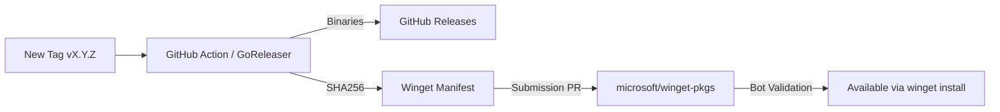




Vectora uses an automated distribution pipeline to ensure that every stable version is compiled, tested, and made available for multiple operating systems and package managers (such as Winget) without manual intervention.

## CI/CD Architecture

Our workflow is divided into two main stages running on **GitHub Actions**:

## 1. Continuous Integration (CI)

Executed on every Pull Request or Push to the `main` branch:

- **Linting**: Code validation with `golangci-lint`.
- **Testing**: Execution of unit and integration suites via `go test ./...`.
- **Smoke Test**: Fast build to verify the binary initializes correctly.

## 2. Continuous Delivery (CD)

Executed exclusively when a new **Version Tag** (e.g., `v2.1.0`) is detected:

- **GoReleaser**: Orchestrates multi-platform builds (Windows/AMD64, macOS/ARM64, Linux/AMD64).
- **Checksums**: SHA256 hash generation for binary integrity.
- **GitHub Release**: Automatic file upload and Changelog generation.

## Winget Publication

For Windows users, Vectora is distributed through the official Microsoft repository (`winget-pkgs`).



## Installation in `%LOCALAPPDATA%`

Unlike global installers that require Administrator permission, Vectora is configured to be installed in:
`%LOCALAPPDATA%\Programs\Vectora`

**Advantages of this approach:**

- **Security**: The application runs under the context of the logged-in user.
- **Silent Updates**: The [Systray](./systray-ux.md) can check for and download new versions without interrupting the workflow with UAC (User Account Control) prompts.
- **Isolation**: Each system user can have their own version and configurations of Vectora independently.

## Local Build Automation

For developers wanting to replicate the pipeline locally:

```bash
# Run linting
golangci-lint run

# Run tests
go test ./...

# Simulate a release (snapshot)
goreleaser release --snapshot --clean
```

---

_Part of the Vectora ecosystem_ · [Open Source (MIT)](https://github.com/Kaffyn/Vectora) · [Contributors](https://github.com/Kaffyn/Vectora/graphs/contributors)
