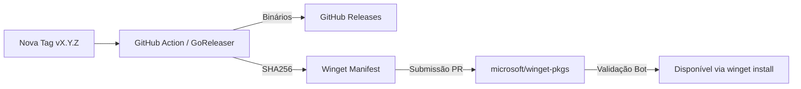




## Pipeline de Distribuição

O Vectora utiliza um pipeline de distribuição automatizado para garantir que cada versão estável seja compilada, testada e disponibilizada para múltiplos sistemas operacionais e gerenciadores de pacotes (como o Winget) sem intervenção manual.

### Arquitetura de CI/CD

Nosso workflow é dividido em duas etapas principais rodando no **GitHub Actions**:

#### 1. Integração Contínua (CI)

Executado em todo Pull Request ou Push para a branch `main`:

- **Linting**: Validação de código com `golangci-lint`.
- **Testes**: Execução de suites unitárias e de integração via `go test ./...`.
- **Smoke Test**: Build rápido para verificar se o binário inicializa corretamente.

#### 2. Entrega Contínua (CD)

Executado exclusivamente quando uma nova **Tag de Versão** (ex: `v2.1.0`) é detectada:

- **GoReleaser**: Orquestra o build multiplataforma (Windows/AMD64, macOS/ARM64, Linux/AMD64).
- **Checksums**: Geração de hashes SHA256 para integridade do binário.
- **GitHub Release**: Upload automático de arquivos e geração do Changelog.

### Publicação no Winget

Para usuários Windows, o Vectora é distribuído no repositório oficial da Microsoft (`winget-pkgs`).



### Instalação em `%LOCALAPPDATA%`

Ao contrário de instaladores globais que exigem permissão de Administrador, o Vectora é configurado para ser instalado em:
`%LOCALAPPDATA%\Programs\Vectora`

**Vantagens desta abordagem:**

- **Segurança**: O aplicativo roda sob o contexto do usuário logado.
- **Atualizações Silenciosas**: O [Systray](./systray-ux.md) pode verificar e baixar novas versões sem interromper o fluxo de trabalho com prompts de UAC (User Account Control).
- **Isolamento**: Cada usuário do sistema pode ter sua própria versão e configurações do Vectora de forma independente.

### Automação de Builds Locais

Para desenvolvedores que desejam replicar o pipeline localmente:

```bash
# Executa o linting
golangci-lint run

# Roda os testes
go test ./...

# Simula uma release (snapshot)
goreleaser release --snapshot --clean
```

---

_Parte do ecossistema Vectora_ · Engenharia Interna
