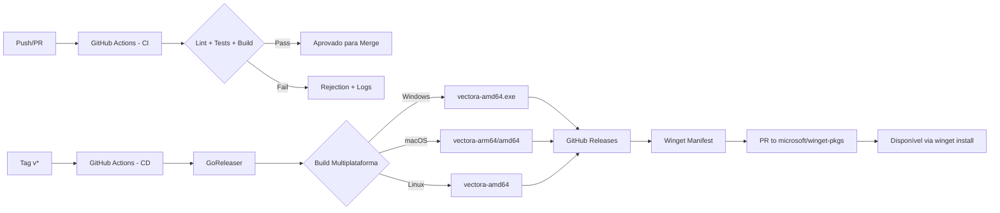



O Vectora utiliza um pipeline de distribuição totalmente automatizado para garantir que cada versão estável seja compilada, testada e disponibilizada para Windows, macOS e Linux via Winget, GitHub Releases e outros gerenciadores de pacotes.

## Visão Geral da Arquitetura



## Fases de Implementação

### **Fase 1: Configuração de CI (GitHub Actions)**

**Duração**: 1 semana

**Deliverables**:

- [ ] Workflow de CI (lint, test, build)
- [ ] Caching de dependências Go
- [ ] Relatórios de cobertura de testes
- [ ] Slack/Discord notifications

**Código de Exemplo - .github/workflows/ci.yml**:

```yaml
name: CI

on:
  push:
    branches: [main, develop]
  pull_request:
    branches: [main]

jobs:
  lint:
    runs-on: ubuntu-latest
    steps:
      - uses: actions/checkout@v4

      - uses: actions/setup-go@v4
        with:
          go-version: "1.21"
          cache: true

      - name: Run golangci-lint
        uses: golangci/golangci-lint-action@v3
        with:
          version: latest
          args: --timeout=5m

  test:
    runs-on: ubuntu-latest
    steps:
      - uses: actions/checkout@v4

      - uses: actions/setup-go@v4
        with:
          go-version: "1.21"
          cache: true

      - name: Run tests
        run: go test -race -coverprofile=coverage.out -covermode=atomic ./...

      - name: Upload coverage
        uses: codecov/codecov-action@v3
        with:
          files: ./coverage.out
          flags: unittests

  build:
    runs-on: ${{ matrix.os }}
    strategy:
      matrix:
        os: [ubuntu-latest, macos-latest, windows-latest]
    steps:
      - uses: actions/checkout@v4

      - uses: actions/setup-go@v4
        with:
          go-version: "1.21"
          cache: true

      - name: Build (Unix)
        if: runner.os != 'Windows'
        run: |
          go build -o vectora ./cmd/vectora

      - name: Build (Windows)
        if: runner.os == 'Windows'
        run: |
          go build -o vectora.exe ./cmd/vectora

      - name: Upload build artifacts
        uses: actions/upload-artifact@v3
        with:
          name: vectora-${{ runner.os }}
          path: vectora*
```

### **Fase 2: Configuração de GoReleaser**

**Duração**: 1 semana

**Deliverables**:

- [ ] Arquivo `.goreleaser.yml` com builds multiplataforma
- [ ] Geração de checksums
- [ ] Release notes automáticas
- [ ] Docker image (opcional)

**Código de Exemplo - .goreleaser.yml**:

```yaml
project_name: vectora
dist: dist

before:
  hooks:
    - go mod download
    - go mod verify

builds:
  # Build da CLI principal
  - id: vectora-cli
    main: ./cmd/vectora
    binary: vectora

    goos:
      - linux
      - darwin
      - windows

    goarch:
      - amd64
      - arm64

    # Não compilar arm64 no Windows
    ignore:
      - goos: windows
        goarch: arm64

    ldflags:
      - -s -w
      - -X main.Version={{.Version}}
      - -X main.Commit={{.Commit}}
      - -X main.Date={{.Date}}
      - -X main.BuiltBy=GoReleaser

    env:
      - CGO_ENABLED=0

archives:
  - id: default
    format: tar.gz
    format_overrides:
      - goos: windows
        format: zip

    name_template: >-
      {{ .ProjectName }}-
      {{- .Version }}-
      {{- .Os }}-
      {{- .Arch }}

    files:
      - README.md
      - LICENSE
      - docs/

checksum:
  name_template: "checksums.txt"
  algorithm: sha256

release:
  github:
    owner: kaffyn
    name: vectora

  name_template: "Release {{.Version}}"
  footer: |
    **Full Changelog**: https://github.com/kaffyn/vectora/compare/{{ .PreviousTag }}...{{ .Tag }}

changelog:
  use: github
  sort: asc
  groups:
    - title: "Features"
      regexp: '^.*?feat(\(.+\))?!?:.+$'
      order: 0
    - title: "Bug fixes"
      regexp: '^.*?fix(\(.+\))?!?:.+$'
      order: 1
    - title: "Maintenance"
      regexp: '^.*?chore(\(.+\))?!?:.+$'
      order: 2
```

### **Fase 3: Integração com Winget**

**Duração**: 1 semana

**Deliverables**:

- [ ] Winget manifest YAML validado
- [ ] Script de submissão automática de PR
- [ ] Teste local de instalação via Winget

**Código de Exemplo - Manifest Winget (manifests/k/kaffyn/vectora/X.Y.Z/)**:

```yaml
# manifests/k/kaffyn/vectora/2.1.0/kaffyn.vectora.yaml
PackageIdentifier: kaffyn.vectora
PackageVersion: 2.1.0
DefaultLocale: en-US
ManifestType: metadata
ManifestVersion: 1.4.0

---
# manifests/k/kaffyn/vectora/2.1.0/kaffyn.vectora.installer.yaml
PackageIdentifier: kaffyn.vectora
PackageVersion: 2.1.0
InstallerType: portable
Installers:
  - Architecture: x64
    InstallerUrl: https://github.com/kaffyn/vectora/releases/download/v2.1.0/vectora-2.1.0-windows-amd64.zip
    InstallerSha256: "ACTUAL_SHA256_HASH_HERE"
    InstallerSwitches:
      Silent: /S
      SilentWithProgress: /S
ManifestType: installer
ManifestVersion: 1.4.0

---
# manifests/k/kaffyn/vectora/2.1.0/kaffyn.vectora.locale.en-US.yaml
PackageIdentifier: kaffyn.vectora
PackageVersion: 2.1.0
PackageLocale: en-US
Publisher: Kaffyn
PublisherUrl: https://kaffyn.com
PackageName: Vectora
PackageUrl: https://github.com/kaffyn/vectora
License: MIT
LicenseUrl: https://github.com/kaffyn/vectora/blob/main/LICENSE
ShortDescription: AI Sub-Agent for Code Context
Description: Vectora is a Tier-2 sub-agent that manages context and security for AI coding agents.
Tags:
  - ai
  - agent
  - context
  - mcp
  - golang
ManifestType: defaultLocale
ManifestVersion: 1.4.0
```

**Código de Exemplo - Script de Submissão (.github/scripts/winget-submit.sh)**:

```bash
#!/bin/bash
set -e

VERSION=$1
RELEASE_URL="https://github.com/kaffyn/vectora/releases/download/v${VERSION}"

# Baixar o binário Windows
BINARY_URL="${RELEASE_URL}/vectora-${VERSION}-windows-amd64.zip"
SHA256=$(curl -s "${BINARY_URL}.sha256" | cut -d' ' -f1)

# Clonar o repositório winget-pkgs
git clone https://github.com/microsoft/winget-pkgs.git temp-winget
cd temp-winget

# Criar estrutura de diretórios
MANIFEST_DIR="manifests/k/kaffyn/vectora/${VERSION}"
mkdir -p "$MANIFEST_DIR"

# Gerar manifests
cat > "$MANIFEST_DIR/kaffyn.vectora.yaml" <<EOF
PackageIdentifier: kaffyn.vectora
PackageVersion: ${VERSION}
DefaultLocale: en-US
ManifestType: metadata
ManifestVersion: 1.4.0
EOF

# ... adicionar installer e locale manifests ...

# Submeter PR
git checkout -b "submit/vectora-${VERSION}"
git add manifests/
git commit -m "Submit: Vectora v${VERSION}"
git push origin "submit/vectora-${VERSION}"
```

### **Fase 4: CD Workflow (GitHub Actions)**

**Duração**: 1 semana

**Deliverables**:

- [ ] Workflow que dispara ao criar tag
- [ ] Build multiplataforma com GoReleaser
- [ ] Geração automática de release notes
- [ ] Opcional: PR automática para Winget

**Código de Exemplo - .github/workflows/cd.yml**:

```yaml
name: CD - Release

on:
  push:
    tags:
      - "v*"

jobs:
  release:
    runs-on: ubuntu-latest
    steps:
      - uses: actions/checkout@v4
        with:
          fetch-depth: 0

      - uses: actions/setup-go@v4
        with:
          go-version: "1.21"
          cache: true

      - name: Run GoReleaser
        uses: goreleaser/goreleaser-action@v4
        with:
          distribution: goreleaser
          version: latest
          args: release --clean
        env:
          GITHUB_TOKEN: ${{ secrets.GITHUB_TOKEN }}

      - name: Upload to Winget-PKGs (Optional)
        if: success()
        env:
          VERSION: ${{ github.ref_name }}
        run: |
          bash .github/scripts/winget-submit.sh ${VERSION#v}

  notify:
    runs-on: ubuntu-latest
    needs: release
    if: always()
    steps:
      - name: Notify Slack
        uses: slackapi/slack-github-action@v1.24.0
        with:
          payload: |
            {
              "text": "Vectora Release ${{ github.ref_name }}",
              "blocks": [
                {
                  "type": "section",
                  "text": {
                    "type": "mrkdwn",
                    "text": "Release Status: ${{ job.status }}\nTag: ${{ github.ref_name }}\n[View Release](https://github.com/kaffyn/vectora/releases/tag/${{ github.ref_name }})"
                  }
                }
              ]
            }
        env:
          SLACK_WEBHOOK_URL: ${{ secrets.SLACK_WEBHOOK_URL }}
```

### **Fase 5: Instalação Local & Auto-Update**

**Duração**: 1 semana

**Deliverables**:

- [ ] Script de instalação pós-download
- [ ] Verificação de integridade (SHA256)
- [ ] Registro no Windows para auto-start
- [ ] Verificador de atualização no Systray

**Código de Exemplo - Instalador (Go)**:

```go
// pkg/installer/installer.go
package installer

import (
    "crypto/sha256"
    "fmt"
    "io"
    "os"
    "path/filepath"
)

type Installer struct {
    SourceBinary string
    TargetDir string
    VerifySHA256 bool
    ExpectedHash string
}

func (i *Installer) Install() error {
    // 1. Criar diretório de instalação
    if err := os.MkdirAll(i.TargetDir, 0755); err != nil {
        return fmt.Errorf("failed to create target directory: %w", err)
    }

    // 2. Verificar integridade (se habilitado)
    if i.VerifySHA256 {
        if err := i.verifySHA256(); err != nil {
            return fmt.Errorf("SHA256 verification failed: %w", err)
        }
    }

    // 3. Copiar binário
    targetPath := filepath.Join(i.TargetDir, filepath.Base(i.SourceBinary))
    if err := i.copyFile(i.SourceBinary, targetPath); err != nil {
        return fmt.Errorf("failed to copy binary: %w", err)
    }

    // 4. Registrar no Windows (se Windows)
    if runtime.GOOS == "windows" {
        if err := i.registerWindowsService(targetPath); err != nil {
            // Log but don't fail
            fmt.Printf("Warning: failed to register service: %v\n", err)
        }
    }

    return nil
}

func (i *Installer) verifySHA256() error {
    file, err := os.Open(i.SourceBinary)
    if err != nil {
        return err
    }
    defer file.Close()

    hash := sha256.New()
    if _, err := io.Copy(hash, file); err != nil {
        return err
    }

    calculated := fmt.Sprintf("%x", hash.Sum(nil))
    if calculated != i.ExpectedHash {
        return fmt.Errorf("hash mismatch: expected %s, got %s", i.ExpectedHash, calculated)
    }

    return nil
}

func (i *Installer) copyFile(src, dst string) error {
    source, err := os.Open(src)
    if err != nil {
        return err
    }
    defer source.Close()

    destination, err := os.Create(dst)
    if err != nil {
        return err
    }
    defer destination.Close()

    _, err = io.Copy(destination, source)
    return err
}
```

### **Fase 6: Local Build & Testing**

**Duração**: 3 dias

**Deliverables**:

- [ ] Makefile com targets comuns
- [ ] Scripts de teste reproduzível
- [ ] Documentação de setup local

**Código de Exemplo - Makefile**:

```makefile
.PHONY: install deps lint test build release clean snapshot help

install:
 @which golangci-lint > /dev/null || go install github.com/golangci/golangci-lint/cmd/golangci-lint@latest
 @which goreleaser > /dev/null || go install github.com/goreleaser/goreleaser@latest

deps:
 go mod download
 go mod tidy

lint:
 golangci-lint run --timeout=5m

test:
 go test -race -cover ./...

build:
 go build -o bin/vectora ./cmd/vectora

release:
 goreleaser release --clean

snapshot:
 goreleaser release --snapshot --clean

clean:
 rm -rf dist/ bin/
 go clean

help:
 @echo "Available targets:"
 @echo " install - Install build dependencies"
 @echo " deps - Download and verify dependencies"
 @echo " lint - Run code linting"
 @echo " test - Run test suite"
 @echo " build - Build local binaries"
 @echo " release - Build release (requires git tag)"
 @echo " snapshot - Build snapshot release"
 @echo " clean - Clean build artifacts"
```

## Estratégia de Versionamento

Vectora segue **Semantic Versioning** (SemVer):

- **MAJOR**: Mudanças incompatíveis na API MCP
- **MINOR**: Novas features backward-compatible
- **PATCH**: Bug fixes

**Exemplo de Tag**:

```bash
git tag -a v2.1.0 -m "Release 2.1.0: Add context compaction"
git push origin v2.1.0
```

## Checklist de Release

Antes de criar uma tag:

- [ ] Todos os testes passam (`make test`)
- [ ] Linting passa (`make lint`)
- [ ] Changelog atualizado
- [ ] Versão atualizada em `cmd/vectora/main.go`
- [ ] Build local validado (`make snapshot`)
- [ ] Documentação atualizada

## Métricas de Sucesso

- Build pipeline completa em <5 minutos
- Binários disponíveis para 6 arquiteturas
- SHA256 verificável para integridade
- Winget submission automatizada
- Release notes geradas automaticamente
- <30 minutos do tag ao Winget availability

---

## External Linking

| Concept            | Resource                                       | Link                                                                                   |
| ------------------ | ---------------------------------------------- | -------------------------------------------------------------------------------------- |
| **MCP**            | Model Context Protocol Specification           | [modelcontextprotocol.io/specification](https://modelcontextprotocol.io/specification) |
| **MCP Go SDK**     | Go SDK for MCP (mark3labs)                     | [github.com/mark3labs/mcp-go](https://github.com/mark3labs/mcp-go)                     |
| **GitHub Actions** | Automate your workflow from idea to production | [docs.github.com/en/actions](https://docs.github.com/en/actions)                       |
| **Docker**         | Docker Documentation                           | [docs.docker.com/](https://docs.docker.com/)                                           |

---

_Parte do ecossistema Vectora_ · [Open Source (MIT)](https://github.com/Kaffyn/Vectora) · [Contribuidores](https://github.com/Kaffyn/Vectora/graphs/contributors)
