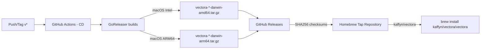




O Vectora para macOS é distribuído via **Homebrew**, um gerenciador de pacotes nativo do macOS. Este documento descreve como criar, manter e integrar a fórmula Homebrew ao pipeline de CI/CD existente.

## Visão Geral da Arquitetura



## Fases de Implementação

### **Fase 1: Criar Homebrew Tap (Repositório)**

**Duração**: 3 dias

**Deliverables**:

- [ ] Repositório GitHub `homebrew-vectora`
- [ ] Estrutura de diretórios padrão do Homebrew
- [ ] README com instruções de instalação
- [ ] LICENSE (MIT)

**Passo a Passo**:

1. Criar repositório: `https://github.com/kaffyn/homebrew-vectora`
2. Estrutura:

```text
homebrew-vectora/
├── Formula/
│ └── vectora.rb (inclui daemon core + Systray + CLI Cobra)
├── README.md
├── LICENSE
└── .github/
    └── workflows/
        └── tests.yml
```

3. Arquivo `README.md`:

```markdown
# Homebrew Vectora

Homebrew tap for Vectora - AI Sub-Agent for Code Context

## Installation

# Tap the repository

brew tap kaffyn/vectora

# Install Vectora CLI

brew install vectora

# Install with Systray (GUI)

brew install vectora-systray
```

## Updates

```bash
brew upgrade vectora
```

## Uninstall

```bash
brew uninstall vectora
brew untap kaffyn/vectora
```

## Issues

Report issues at <https://github.com/kaffyn/vectora/issues>

### **Fase 2: Criar Fórmula Homebrew (Ruby)**

**Duração**: 1 semana

**Deliverables**:

- [ ] `vectora.rb` - Fórmula única (daemon core + Systray + CLI)
- [ ] Suporte Intel (amd64) + Apple Silicon (arm64)
- [ ] Verificação de integridade via SHA256
- [ ] Post-install hooks para configuração

**Código de Exemplo - Formula/vectora.rb**:

```ruby
# Formula/vectora.rb
class Vectora < Formula
  desc "AI Sub-Agent for Code Context (MCP)"
  homepage "https://github.com/kaffyn/vectora"
  license "MIT"

  # URLs e checksums são preenchidos automaticamente
  on_macos do
    on_intel do
      url "https://github.com/kaffyn/vectora/releases/download/v#{version}/vectora-#{version}-darwin-amd64.tar.gz"
      sha256 "INTEL_SHA256_PLACEHOLDER"
    end
    on_arm do
      url "https://github.com/kaffyn/vectora/releases/download/v#{version}/vectora-#{version}-darwin-arm64.tar.gz"
      sha256 "ARM64_SHA256_PLACEHOLDER"
    end
  end

  def install
    # Extrair binário principal
    bin.install "vectora"

    # Criar man page (opcional)
    # man1.install "vectora.1"

    # Copiar completions para Zsh/Bash (se existir)
    bash_completion.install "vectora.bash-completion.sh" if File.exist?("vectora.bash-completion.sh")
    zsh_completion.install "vectora.zsh-completion.sh" if File.exist?("vectora.zsh-completion.sh")
  end

  def post_install
    puts ""
    puts " Vectora installed successfully!"
    puts ""
    puts "To start using Vectora:"
    puts " vectora --help"
    puts ""
    puts "To integrate with VS Code/Cursor:"
    puts " vectora config set --key=ide_path --value=/path/to/your/project"
    puts ""
    puts "Documentation: https://vectora.ai/docs"
    puts ""
  end

  test do
    # Teste básico de versão
    assert_match /#{version}/, shell_output("#{bin}/vectora --version")
  end
end
```

### **Fase 3: Integração com GoReleaser**

**Duração**: 3 dias

**Deliverables**:

- [ ] Script que extrai SHA256 dos releases
- [ ] Geração automática de Brew formula
- [ ] Validação da fórmula
- [ ] PR automática para o tap

**Código de Exemplo - Script de Atualização (.github/scripts/homebrew-update.sh)**:

```bash
#!/bin/bash
set -e

VERSION=$1
TAP_REPO="https://github.com/kaffyn/homebrew-vectora.git"
GITHUB_TOKEN=$2

# Baixar checksums do GitHub Release
echo "Fetching checksums from GitHub Release..."
RELEASE_URL="https://github.com/kaffyn/vectora/releases/download/v${VERSION}"

# SHA256 para Intel (amd64)
INTEL_SHA=$(curl -s "${RELEASE_URL}/vectora-${VERSION}-darwin-amd64.tar.gz.sha256" | awk '{print $1}')
echo "Intel SHA256: $INTEL_SHA"

# SHA256 para Apple Silicon (arm64)
ARM_SHA=$(curl -s "${RELEASE_URL}/vectora-${VERSION}-darwin-arm64.tar.gz.sha256" | awk '{print $1}')
echo "ARM64 SHA256: $ARM_SHA"

# Clonar o tap
echo "Cloning tap repository..."
git clone "${TAP_REPO}" temp-homebrew-tap
cd temp-homebrew-tap

# Atualizar vectora.rb (fórmula única com daemon core + Systray + CLI)
cat > "Formula/vectora.rb" <<EOF
class Vectora < Formula
  desc "AI Sub-Agent for Code Context (daemon + Systray + CLI)"
  homepage "https://github.com/kaffyn/vectora"
  license "MIT"
  version "${VERSION}"

  on_macos do
    on_intel do
      url "https://github.com/kaffyn/vectora/releases/download/v#{version}/vectora-#{version}-darwin-amd64.tar.gz"
      sha256 "${INTEL_SHA}"
    end
    on_arm do
      url "https://github.com/kaffyn/vectora/releases/download/v#{version}/vectora-#{version}-darwin-arm64.tar.gz"
      sha256 "${ARM_SHA}"
    end
  end

  def install
    bin.install "vectora"
  end

  test do
    assert_match /#{version}/, shell_output("#{bin}/vectora --version")
  end
end
EOF

# Validar fórmula
echo "Validating formula..."
brew formula vectora

# Fazer commit e push
git config user.name "Vectora Bot"
git config user.email "bot@vectora.ai"

git checkout -b "update/v${VERSION}"
git add Formula/
git commit -m "chore: Update Vectora to v${VERSION}"
git push origin "update/v${VERSION}"

# Criar PR (requer GitHub CLI)
gh pr create \
  --title "Update Vectora to v${VERSION}" \
  --body "Automated release: v${VERSION}" \
  --base main \
  --head "update/v${VERSION}" \
  --repo kaffyn/homebrew-vectora || true

echo " Homebrew tap updated for v${VERSION}"
```

### **Fase 4: CI/CD Workflow (GitHub Actions)**

**Duração**: 1 semana

**Deliverables**:

- [ ] Workflow que dispara ao criar tag
- [ ] Executa script de atualização Homebrew
- [ ] Valida fórmulas antes de atualizar
- [ ] Notificação de sucesso

**Código de Exemplo - .github/workflows/homebrew-release.yml**:

```yaml
name: Homebrew Release

on:
  push:
    tags:
      - "v*"

jobs:
  homebrew:
    runs-on: ubuntu-latest
    steps:
      - uses: actions/checkout@v4

      - name: Install GitHub CLI
        run: sudo apt-get install -y gh

      - name: Update Homebrew Tap
        env:
          VERSION: ${{ github.ref_name }}
          GITHUB_TOKEN: ${{ secrets.HOMEBREW_TAP_TOKEN }}
        run: |
          bash .github/scripts/homebrew-update.sh ${VERSION#v} ${GITHUB_TOKEN}

      - name: Notify Slack
        if: always()
        uses: slackapi/slack-github-action@v1.24.0
        with:
          payload: |
            {
              "text": "Homebrew Release ${{ github.ref_name }}",
              "blocks": [
                {
                  "type": "section",
                  "text": {
                    "type": "mrkdwn",
                    "text": "Status: ${{ job.status }}\nVersion: ${{ github.ref_name }}\n[Tap Repository](https://github.com/kaffyn/homebrew-vectora)"
                  }
                }
              ]
            }
          webhook-url: ${{ secrets.SLACK_WEBHOOK_URL }}
```

### **Fase 5: Testes Locais & Validação**

**Duração**: 3 dias

**Deliverables**:

- [ ] Script de teste de instalação
- [ ] Validação em Intel + Apple Silicon
- [ ] Testes de atualização (`brew upgrade`)
- [ ] Testes de desinstalação

**Código de Exemplo - Teste Local (Makefile)**:

```makefile
.PHONY: test-homebrew test-homebrew-intel test-homebrew-arm test-homebrew-upgrade

test-homebrew:
 @echo "Testing Homebrew installation..."
 @if [ "$$(uname -m)" = "arm64" ]; then \
  $(MAKE) test-homebrew-arm; \
 else \
  $(MAKE) test-homebrew-intel; \
 fi

test-homebrew-intel:
 @echo "Testing on Intel Mac..."
 brew tap kaffyn/homebrew-vectora file://./
 brew install vectora --verbose
 vectora --version
 # Verify Systray and CLI are included
 test -f "$(which vectora)"
 brew uninstall vectora

test-homebrew-arm:
 @echo "Testing on Apple Silicon..."
 brew tap kaffyn/homebrew-vectora file://./
 brew install vectora --verbose
 vectora --version
 test -f "$(which vectora)"
 brew uninstall vectora

test-homebrew-upgrade:
 @echo "Testing brew upgrade..."
 brew install vectora
 brew upgrade vectora
 vectora --version
 brew uninstall vectora
```

**Script de Teste - .github/scripts/test-homebrew.sh**:

```bash
#!/bin/bash
set -e

echo " Testing Homebrew installation..."

# Detectar arquitetura
ARCH=$(uname -m)
echo "Detected architecture: $ARCH"

# Instalar a fórmula localmente
echo " Installing Vectora via Homebrew..."
brew tap --force-auto-update kaffyn/vectora file://./

brew install vectora --verbose
if [ $? -ne 0 ]; then
    echo " Installation failed"
    exit 1
fi

# Testar executável principal (inclui daemon, Systray e CLI Cobra)
echo " Testing vectora binary (daemon + Systray + CLI)..."
if ! vectora --version; then
    echo " Binary test failed"
    exit 1
fi

# Testar acesso ao Systray e CLI
echo " Verifying Systray and CLI are included..."
VECTORA_BIN=$(which vectora)
if [ ! -f "$VECTORA_BIN" ]; then
    echo " Vectora binary not found in PATH"
    exit 1
fi

# Limpar
echo " Cleaning up..."
brew uninstall vectora
brew untap kaffyn/vectora

echo " All Homebrew tests passed!"
```

### **Fase 6: Documentação & Suporte**

**Duração**: 3 dias

**Deliverables**:

- [ ] Guia de instalação em docs (integrado em `installation.md`)
- [ ] FAQ sobre Homebrew
- [ ] Troubleshooting
- [ ] Contribuição para Homebrew oficial (opcional)

**Nota**: A documentação de instalação é mantida em `content/docs/vectora/getting-started/installation.md` (veja seção "macOS / Via Homebrew") e não em um arquivo separado. Este plano de implementação foca apenas na arquitetura técnica, automação e infraestrutura.

## Métricas de Sucesso

| Métrica                     | Alvo       |
| :-------------------------- | :--------- |
| Tempo até instalação        | <2 minutos |
| Downloads via Homebrew/mês  | >1,000     |
| Taxa de sucesso instalação  | >99%       |
| Tempo de atualização (brew) | <1 minuto  |
| Satisfação (GitHub issues)  | <5% bugs   |
| Suporte Intel + ARM64       | Ambos      |
| Latência de release         | <24h       |

---

## External Linking

| Concept            | Resource                                       | Link                                                                                   |
| ------------------ | ---------------------------------------------- | -------------------------------------------------------------------------------------- |
| **MCP**            | Model Context Protocol Specification           | [modelcontextprotocol.io/specification](https://modelcontextprotocol.io/specification) |
| **MCP Go SDK**     | Go SDK for MCP (mark3labs)                     | [github.com/mark3labs/mcp-go](https://github.com/mark3labs/mcp-go)                     |
| **Cobra**          | A Commander for modern Go CLI interactions     | [cobra.dev/](https://cobra.dev/)                                                       |
| **GitHub Actions** | Automate your workflow from idea to production | [docs.github.com/en/actions](https://docs.github.com/en/actions)                       |

---

_Parte do ecossistema Vectora_ · [Open Source (MIT)](https://github.com/Kaffyn/Vectora) · [Contribuidores](https://github.com/Kaffyn/Vectora/graphs/contributors)
