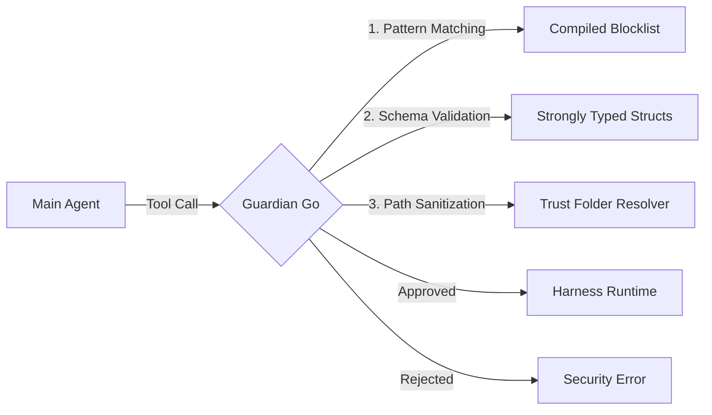




**Guardian** is Vectora's governance engine, responsible for intercepting all tool calls and ensuring they comply with security policies before execution. In the transition to Golang, Guardian was rewritten to operate natively and in a compiled manner.

## Strongly Typed Validation vs Zod

In the previous stack, we used the **Zod** library (JavaScript) for runtime schema validation. Although flexible, Zod introduced latency and a dependency on a V8 interpreter.

The new Go implementation uses **Native Struct Validation**:

| Feature            | Technical Transition                 | Advantage in Go                                                           |
| :----------------- | :----------------------------------- | :------------------------------------------------------------------------ |
| **Parsing**        | `zod.parse()` → `json.Unmarshal()`   | Lower CPU overhead and zero unnecessary allocations.                      |
| **Type Guarantee** | Runtime Check → Static Check + Tags  | Schema errors are detected during deserialization by the internal engine. |
| **Extensibility**  | Custom Zod functions → Go Interfaces | Complex validations are executed as optimized binary code.                |

## The Interception Engine

Guardian Go acts as a middleware layer between the **Main Agent** and the **Harness Runtime**.

## Key Protections

Guardian applies multiple layers of defense to ensure that the sub-agent's execution remains within the security boundaries set by the user and the organization.

## 1. Compiled Blocklist

Unlike past versions that read rules from an external JSON, critical Guardian patterns (such as access to `/etc/passwd`, `.env`, or `.pem` keys) are now embedded directly in the Go code. This prevents security behavior from being altered through malicious configuration file injection.

## 2. Trust Folder Resolver

Go's file system allows the use of `filepath.Abs` and `os.Readlink` atomically to resolve paths before validation. Guardian ensures that the execution scope never leaves the trust folder defined in `vectora.config.yaml`.

## 3. Output Sanitization

Guardian doesn't just monitor what goes in, but also what comes out of the sub-agent. If an MCP tool accidentally tries to return an API token or a sensitive string captured from the console, Guardian Go applies heuristic-based secret masking before the data reaches the LLM.

---

_Part of the Vectora ecosystem_ · Internal Engineering
