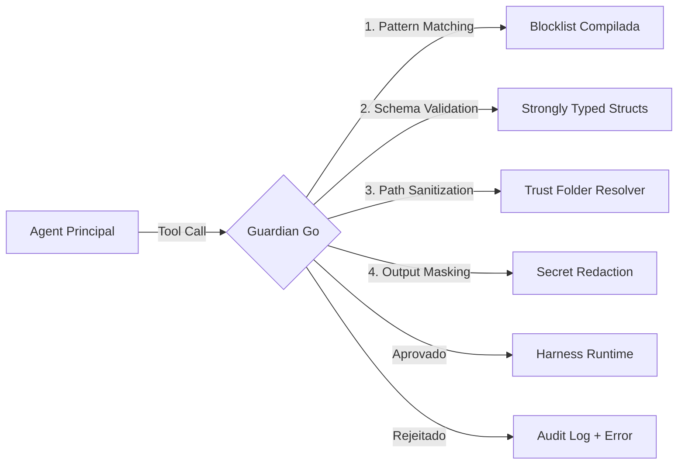




O **Guardian** é o motor de governança do Vectora, responsável por interceptar todas as chamadas de ferramentas e garantir que elas cumpram as políticas de segurança antes da execução. Na transição para Golang, o Guardian opera como código compilado e imutável.

---

## Arquitetura de Segurança



---

## Fases de Implementação

### **Fase 1: Blocklist Compilada & Pattern Matching**

**Duração**: 1 semana

**Deliverables**:

- [ ] Enum de padrões sensíveis compilados
- [ ] Regex patterns para detecção de segredos
- [ ] Audit logging para tentativas bloqueadas

**Código de Exemplo - Blocklist Compilada**:

```go
// pkg/guardian/blocklist.go
package guardian

import (
    "regexp"
    "sync"
)

// BlockPattern define um padrão que deve ser bloqueado
type BlockPattern struct {
    ID string
    Pattern *regexp.Regexp
    Description string
    Severity BlockSeverity
}

type BlockSeverity string

const (
    SeverityCritical BlockSeverity = "critical"
    SeverityHigh BlockSeverity = "high"
    SeverityMedium BlockSeverity = "medium"
)

// CompiledBlocklist contém padrões que nunca podem ser modificados em runtime
type CompiledBlocklist struct {
    mu sync.RWMutex
    patterns map[string]*BlockPattern
}

func NewCompiledBlocklist() *CompiledBlocklist {
    cb := &CompiledBlocklist{
        patterns: make(map[string]*BlockPattern),
    }

    // Padrões compilados na inicialização (imutáveis)
    cb.registerPattern("env_files", `\.env(?:\.[a-z]+)?$`, "Environment files", SeverityCritical)
    cb.registerPattern("private_keys", `\.(pem|key|p12|jks)$`, "Private keys", SeverityCritical)
    cb.registerPattern("credentials", `(?i)(password|passwd|pwd|secret|token|api[_-]?key|access[_-]?key)`, "Credential patterns", SeverityHigh)
    cb.registerPattern("system_files", `^(/etc/passwd|/etc/shadow|/etc/sudoers|C:\\Windows\\System32)`, "System files", SeverityCritical)
    cb.registerPattern("git_config", `\.git(?:/|\\)config`, "Git configuration", SeverityHigh)
    cb.registerPattern("aws_credentials", `(?i)(aws_access_key|aws_secret|~/.aws)`, "AWS credentials", SeverityCritical)
    cb.registerPattern("database_strings", `(?i)(connection[_-]?string|mongodb[_+]?uri|sql[_+]?password)`, "Database credentials", SeverityHigh)

    return cb
}

func (cb *CompiledBlocklist) registerPattern(id, pattern, desc string, severity BlockSeverity) {
    re := regexp.MustCompile(pattern)
    cb.patterns[id] = &BlockPattern{
        ID: id,
        Pattern: re,
        Description: desc,
        Severity: severity,
    }
}

func (cb *CompiledBlocklist) MatchesPattern(input string) (*BlockPattern, bool) {
    cb.mu.RLock()
    defer cb.mu.RUnlock()

    for _, pattern := range cb.patterns {
        if pattern.Pattern.MatchString(input) {
            return pattern, true
        }
    }

    return nil, false
}

func (cb *CompiledBlocklist) AllPatterns() []*BlockPattern {
    cb.mu.RLock()
    defer cb.mu.RUnlock()

    patterns := make([]*BlockPattern, 0, len(cb.patterns))
    for _, p := range cb.patterns {
        patterns = append(patterns, p)
    }
    return patterns
}
```

---

### **Fase 2: Trust Folder & Path Validation**

**Duração**: 1 semana

**Deliverables**:

- [ ] Struct `TrustFolder` com validação de paths
- [ ] Resolução atômica de symlinks
- [ ] Testes de bypass (jailbreak attempts)

**Código de Exemplo - Trust Folder**:

```go
// pkg/guardian/trust_folder.go
package guardian

import (
    "fmt"
    "os"
    "path/filepath"
    "strings"
)

type TrustFolder struct {
    rootPath string
    absPath string
}

func NewTrustFolder(rootPath string) (*TrustFolder, error) {
    // Resolver para caminho absoluto
    absPath, err := filepath.Abs(rootPath)
    if err != nil {
        return nil, fmt.Errorf("invalid root path: %w", err)
    }

    // Resolver symlinks
    realPath, err := filepath.EvalSymlinks(absPath)
    if err != nil {
        return nil, fmt.Errorf("failed to resolve symlinks: %w", err)
    }

    // Validar que o diretório existe
    info, err := os.Stat(realPath)
    if err != nil {
        return nil, fmt.Errorf("trust folder does not exist: %w", err)
    }
    if !info.IsDir() {
        return nil, fmt.Errorf("trust folder path is not a directory")
    }

    return &TrustFolder{
        rootPath: rootPath,
        absPath: realPath,
    }, nil
}

func (tf *TrustFolder) IsPathAllowed(requestPath string) bool {
    // Resolver o caminho solicitado
    absRequestPath, err := filepath.Abs(requestPath)
    if err != nil {
        return false
    }

    // Resolver symlinks no caminho solicitado
    realPath, err := filepath.EvalSymlinks(absRequestPath)
    if err != nil {
        // Se não conseguir resolver symlinks, usar o caminho absoluto
        realPath = absRequestPath
    }

    // Verificar se está dentro do trust folder
    rel, err := filepath.Rel(tf.absPath, realPath)
    if err != nil {
        return false
    }

    // Bloquecar tentativas de "../" ou caminhos que escapam
    if strings.HasPrefix(rel, "..") || strings.HasPrefix(rel, string(filepath.Separator)+"..") {
        return false
    }

    // Não permitir caminhos absolutos fora do trust folder
    if filepath.IsAbs(rel) {
        return false
    }

    return true
}

func (tf *TrustFolder) ResolvePath(requestPath string) (string, error) {
    if !tf.IsPathAllowed(requestPath) {
        return "", fmt.Errorf("path is outside trust folder: %s", requestPath)
    }

    absPath, err := filepath.Abs(requestPath)
    if err != nil {
        return "", err
    }

    return absPath, nil
}
```

---

### **Fase 3: Schema Validation (Typed Structs)**

**Duração**: 1 semana

**Deliverables**:

- [ ] Validação de structs com tags
- [ ] Custom validators para tipos complexos
- [ ] Testes de mutação

**Código de Exemplo - Schema Validation**:

```go
// pkg/guardian/validation.go
package guardian

import (
    "fmt"
    "regexp"
)

// ToolCallSchema define as regras de validação para uma tool call
type ToolCallSchema struct {
    ToolName string `validate:"required,min=1,max=100"`
    Arguments map[string]interface{} `validate:"required"`
}

type ToolCallValidator struct {
    blocklist *CompiledBlocklist
    trustFolder *TrustFolder
}

func NewToolCallValidator(blocklist *CompiledBlocklist, trustFolder *TrustFolder) *ToolCallValidator {
    return &ToolCallValidator{
        blocklist: blocklist,
        trustFolder: trustFolder,
    }
}

func (v *ToolCallValidator) ValidateToolCall(toolName string, args map[string]interface{}) error {
    // 1. Validar nome da ferramenta
    if toolName == "" {
        return fmt.Errorf("tool name cannot be empty")
    }

    if len(toolName) > 100 {
        return fmt.Errorf("tool name exceeds max length of 100")
    }

    // 2. Validar argumentos contra blocklist
    for argName, argValue := range args {
        if err := v.validateArgument(argName, argValue); err != nil {
            return err
        }
    }

    return nil
}

func (v *ToolCallValidator) validateArgument(name string, value interface{}) error {
    switch val := value.(type) {
    case string:
        return v.validateStringArgument(name, val)
    case []interface{}:
        for _, item := range val {
            if err := v.validateArgument(name, item); err != nil {
                return err
            }
        }
    case map[string]interface{}:
        for k, v := range val {
            if err := v.validateArgument(k, v); err != nil {
                return err
            }
        }
    }

    return nil
}

func (v *ToolCallValidator) validateStringArgument(name, value string) error {
    // Verificar contra blocklist
    if pattern, matched := v.blocklist.MatchesPattern(value); matched {
        return fmt.Errorf("blocked pattern detected in argument '%s': %s", name, pattern.Description)
    }

    // Se é um caminho, validar contra trust folder
    if name == "path" || name == "file" || name == "directory" {
        if !v.trustFolder.IsPathAllowed(value) {
            return fmt.Errorf("path is outside trust folder: %s", value)
        }
    }

    return nil
}
```

---

### **Fase 4: Output Sanitization & Secret Redaction**

**Duração**: 1 semana

**Deliverables**:

- [ ] Detector de segredos em output
- [ ] Redação automática
- [ ] Heurísticas para tokens/keys

**Código de Exemplo - Output Sanitizer**:

```go
// pkg/guardian/sanitizer.go
package guardian

import (
    "fmt"
    "regexp"
    "strings"
)

type OutputSanitizer struct {
    secretPatterns []*SecretPattern
}

type SecretPattern struct {
    Name string
    Pattern *regexp.Regexp
    Replace string
}

func NewOutputSanitizer() *OutputSanitizer {
    return &OutputSanitizer{
        secretPatterns: []*SecretPattern{
            {
                Name: "api_key",
                Pattern: regexp.MustCompile(`(api[_-]?key)[:\s=]+([a-zA-Z0-9\-_]{32,})`),
                Replace: "$1: [REDACTED_KEY]",
            },
            {
                Name: "password",
                Pattern: regexp.MustCompile(`(?i)(password)[:\s=]+([^\s,\n]+)`),
                Replace: "$1: [REDACTED_PASSWORD]",
            },
            {
                Name: "token",
                Pattern: regexp.MustCompile(`(token|authorization)[:\s=]+([a-zA-Z0-9\-_\.]+)`),
                Replace: "$1: [REDACTED_TOKEN]",
            },
            {
                Name: "bearer_token",
                Pattern: regexp.MustCompile(`(?i)(bearer\s+)([a-zA-Z0-9\-_\.]+)`),
                Replace: "$1[REDACTED_TOKEN]",
            },
            {
                Name: "mongodb_uri",
                Pattern: regexp.MustCompile(`mongodb\+srv://[^:\s]+:([^@]+)@`),
                Replace: "mongodb+srv://[REDACTED_USER]:[REDACTED_PASSWORD]@",
            },
            {
                Name: "aws_access_key",
                Pattern: regexp.MustCompile(`(AKIA[0-9A-Z]{16})`),
                Replace: "[REDACTED_AWS_KEY]",
            },
            {
                Name: "private_key",
                Pattern: regexp.MustCompile(`-----BEGIN (PRIVATE|RSA|EC) KEY-----[\s\S]+?-----END \1 KEY-----`),
                Replace: "[REDACTED_PRIVATE_KEY]",
            },
        },
    }
}

func (os *OutputSanitizer) Sanitize(output string) string {
    sanitized := output

    for _, pattern := range os.secretPatterns {
        sanitized = pattern.Pattern.ReplaceAllString(sanitized, pattern.Replace)
    }

    // Sanitização adicional: remover linhas que parecem ser JSON com secrets
    sanitized = os.sanitizeJSON(sanitized)

    return sanitized
}

func (os *OutputSanitizer) sanitizeJSON(output string) string {
    // Padrão simples para detectar potenciais JSON malformado com segredos
    lines := strings.Split(output, "\n")
    var result []string

    for _, line := range lines {
        // Se contém padrões suspeitos, mascarar
        if strings.Contains(line, "secret") || strings.Contains(line, "key") || strings.Contains(line, "password") {
            // Aplicar sanitização linha a linha
            line = os.sanitizeLine(line)
        }
        result = append(result, line)
    }

    return strings.Join(result, "\n")
}

func (os *OutputSanitizer) sanitizeLine(line string) string {
    sanitized := line

    for _, pattern := range os.secretPatterns {
        sanitized = pattern.Pattern.ReplaceAllString(sanitized, pattern.Replace)
    }

    return sanitized
}
```

---

### **Fase 5: Audit Logging & Metrics**

**Duração**: 1 semana

**Deliverables**:

- [ ] Log estruturado de todas as validações
- [ ] Métricas de tentativas bloqueadas
- [ ] Alertas para padrões de ataque

**Código de Exemplo - Audit Logger**:

```go
// pkg/guardian/audit.go
package guardian

import (
    "encoding/json"
    "fmt"
    "log"
    "os"
    "time"
)

type AuditLog struct {
    Timestamp time.Time `json:"timestamp"`
    EventType string `json:"event_type"`
    ToolName string `json:"tool_name,omitempty"`
    Status string `json:"status"` // approved, rejected, error
    Reason string `json:"reason,omitempty"`
    PatternID string `json:"pattern_id,omitempty"`
    Severity string `json:"severity,omitempty"`
    UserID string `json:"user_id,omitempty"`
    SessionID string `json:"session_id,omitempty"`
}

type AuditLogger struct {
    file *os.File
    mu sync.Mutex
}

func NewAuditLogger(logPath string) (*AuditLogger, error) {
    file, err := os.OpenFile(logPath, os.O_APPEND|os.O_CREATE|os.O_WRONLY, 0644)
    if err != nil {
        return nil, fmt.Errorf("failed to open audit log: %w", err)
    }

    return &AuditLogger{
        file: file,
    }, nil
}

func (al *AuditLogger) Log(event *AuditLog) error {
    al.mu.Lock()
    defer al.mu.Unlock()

    event.Timestamp = time.Now()

    data, err := json.Marshal(event)
    if err != nil {
        return fmt.Errorf("failed to marshal audit log: %w", err)
    }

    _, err = al.file.WriteString(string(data) + "\n")
    return err
}

func (al *AuditLogger) Close() error {
    return al.file.Close()
}
```

---

### **Fase 6: Testes de Segurança**

**Duração**: 1 semana

**Deliverables**:

- [ ] Testes de bypass (jailbreak attempts)
- [ ] Fuzzing de inputs
- [ ] Regression tests para vulnerabilidades conhecidas

**Código de Exemplo - Security Tests**:

```go
// pkg/guardian/security_test.go
package guardian

import (
    "testing"
)

func TestBlocklistMatching(t *testing.T) {
    blocklist := NewCompiledBlocklist()

    tests := []struct {
        input string
        blocked bool
    }{
        {".env", true},
        {".env.local", true},
        {"/etc/passwd", true},
        {"~/.aws/credentials", true},
        {"config.yaml", false},
        {"src/main.go", false},
    }

    for _, tt := range tests {
        _, matched := blocklist.MatchesPattern(tt.input)
        if matched != tt.blocked {
            t.Errorf("MatchesPattern(%q) = %v, want %v", tt.input, matched, tt.blocked)
        }
    }
}

func TestTrustFolderBypass(t *testing.T) {
    trustFolder, err := NewTrustFolder("/home/user/project")
    if err != nil {
        t.Fatalf("NewTrustFolder failed: %v", err)
    }

    tests := []struct {
        path string
        allowed bool
    }{
        {"/home/user/project/src/main.go", true},
        {"/home/user/project/../../../etc/passwd", false},
        {"/etc/passwd", false},
        {"/home/user/secret.env", false},
    }

    for _, tt := range tests {
        allowed := trustFolder.IsPathAllowed(tt.path)
        if allowed != tt.allowed {
            t.Errorf("IsPathAllowed(%q) = %v, want %v", tt.path, allowed, tt.allowed)
        }
    }
}

func TestOutputSanitization(t *testing.T) {
    sanitizer := NewOutputSanitizer()

    tests := []struct {
        input string
        shouldHave string
        shouldNotHave string
    }{
        {
            input: `api_key=sk-12345678901234567890`,
            shouldHave: "[REDACTED_KEY]",
            shouldNotHave: "sk-12345678901234567890",
        },
        {
            input: `password: mySecretPassword123`,
            shouldHave: "[REDACTED_PASSWORD]",
            shouldNotHave: "mySecretPassword123",
        },
    }

    for _, tt := range tests {
        sanitized := sanitizer.Sanitize(tt.input)

        if tt.shouldHave != "" && !strings.Contains(sanitized, tt.shouldHave) {
            t.Errorf("Sanitize(%q) should contain %q", tt.input, tt.shouldHave)
        }

        if tt.shouldNotHave != "" && strings.Contains(sanitized, tt.shouldNotHave) {
            t.Errorf("Sanitize(%q) should not contain %q", tt.input, tt.shouldNotHave)
        }
    }
}
```

---

## Garantias de Segurança

| Proteção                | Mecanismo                                  | Garantia                                             |
| :---------------------- | :----------------------------------------- | :--------------------------------------------------- |
| **Immutable Blocklist** | Compilada no binário                       | Impossível bypasser via arquivo de config            |
| **Path Traversal**      | Resolução atômica de symlinks              | Não escapa da trust folder                           |
| **Secret Leakage**      | Sanitização em output                      | Tokens/keys nunca atingem o LLM                      |
| **Runtime Validation**  | Go type system + custom validators         | Schemas rejeitam inputs inválidos na desserialização |
| **Audit Trail**         | Logging estruturado de todas as validações | Rastreabilidade completa de decisões                 |

---

## Métricas de Sucesso

- 100% de cobertura de testes para Guardian
- Zero falsos negativos em testes de bypass
- Latência de validação <10ms por tool call
- Audit logs com <100 bytes por entrada
- Todos os padrões de bloqueio documentados

---

_Parte do ecossistema Vectora_ · Engenharia Interna
