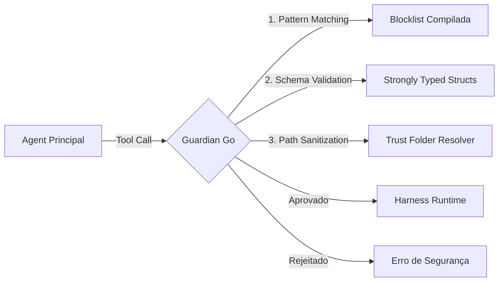




O **Guardian** é o motor de governança do Vectora, responsável por interceptar todas as chamadas de ferramentas (tool calls) e garantir que elas cumpram as políticas de segurança antes da execução. Na transição para Golang, o Guardian foi reescrito para operar de forma nativa e compilada.

## Validação Fortemente Tipada vs Zod

Na stack anterior, utilizávamos a biblioteca **Zod** (JavaScript) para validação de esquemas em runtime. Embora flexível, o Zod introduzia latência e dependência de um interpretador V8.

A nova implementação em Go utiliza **Struct Validation Nativa**:

| Característica        | Transição Técnica                        | Vantagem em Go                                                        |
| :-------------------- | :--------------------------------------- | :-------------------------------------------------------------------- |
| **Parsing**           | `zod.parse()` → `json.Unmarshal()`       | Menor overhead de CPU e zero alocações desnecessárias.                |
| **Garantia de Tipos** | Runtime Check → Static Check + Tags      | Erros de schema são detectados na desserialização pelo motor interno. |
| **Extensibilidade**   | Funções Zod customizadas → Interfaces Go | Validações complexas são executadas como código binário otimizado.    |

## O Motor de Interceptação

O Guardian Go atua como uma camada de middleware entre o **Agent Principal** e o **Harness Runtime**.

## Principais Proteções

O Guardian aplica múltiplas camadas de defesa para garantir que a execução do sub-agent permaneça dentro dos limites de segurança estabelecidos pelo usuário e pela organização.

## 1. Blocklist Compilada

Diferente de versões passadas que liam as regras de um JSON externo, os padrões críticos do Guardian (como acesso a `/etc/passwd`, `.env`, ou chaves `.pem`) são agora embutidos diretamente no código Go. Isso impede que o comportamento de segurança seja alterado através de injeção de arquivos de configuração maliciosos.

## 2. Trust Folder Resolver

O sistema de arquivos no Go permite o uso de `filepath.Abs` e `os.Readlink` de forma atômica para resolver caminhos antes da validação. O Guardian garante que o escopo de execução nunca saia do diretório de confiança definido no `vectora.config.yaml`.

## 3. Higienização de Output

O Guardian não monitora apenas o que entra, mas também o que sai do sub-agent. Se uma ferramenta MCP acidentalmente tentar retornar um token de API ou uma string sensível capturada do console, o Guardian Go aplica máscaras de segredos baseadas em heurísticas antes que os dados cheguem ao LLM.

---

_Parte do ecossistema Vectora_ · Engenharia Interna
