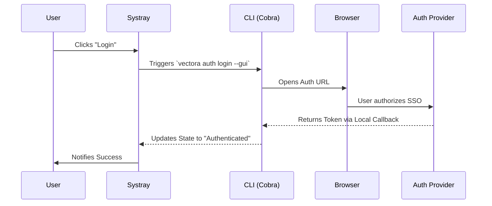




Vectora includes a system tray application (Systray) designed to provide a "frictionless" visual configuration experience, specifically focused on SSO authentication and quick status monitoring.

## Systray Objectives

1. **Simplified Login**: Automate browser opening for SSO, eliminating manual token copying.
2. **Status Visibility**: Provide real-time feedback on MCP server health and token quota usage.
3. **Quick Configuration**: Switch between namespaces or toggle debug mode without using the terminal.

## UI Architecture

The Systray is implemented in Go using cross-platform libraries that communicate directly with the [Harness Runtime](../core-migration.md). It operates in a separate event loop to ensure the interface remains responsive even during heavy indexing processes.

## SSO Authentication Flow

The Systray facilitates login through the following flow:

## Backend Integration

The Systray maintains a persistent connection with the Vectora core, ensuring that state changes are instantly reflected in the interface. This allows actions triggered via the terminal or changes in the configuration file to update the tray icon and menu without needing to restart the application.

## Menu Components

The tray menu is structured as follows:

- **Status**: `Connected` | `Disconnected` | `Indexing...`
- **Quick Actions**:
  - `Login / Logout`
  - `Open Dashboard`
  - `Restart MCP Server`
- **Settings**:
  - `Namespace`: [List selection]
  - `Debug Mode`: [Toggle]
- **About**: Binary version and links to documentation.

## Technical Implementation (Local AppData)

To ensure the Systray works correctly on Windows, the installer places the executable in `%LOCALAPPDATA%\Programs\Vectora`. On first launch, the app adds itself to the Windows "Startup" registry (if authorized), ensuring that the Vectora context is always available for the main Agent (Claude/Cursor).

---

_Part of the Vectora ecosystem_ · [Open Source (MIT)](https://github.com/Kaffyn/Vectora) · [Contributors](https://github.com/Kaffyn/Vectora/graphs/contributors)
