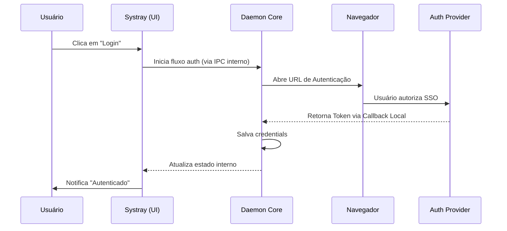




O Vectora inclui uma interface Systray (bandeja do sistema) como parte do daemon core. A Systray UI fornece uma experiência visual complementar à CLI Cobra, ambas operando no mesmo processo para sincronização de estado em tempo real.

## Objetivos da Systray

1. **Login Simplificado**: Automatizar a abertura do navegador para SSO a partir da interface visual.
2. **Visibilidade de Status**: Feedback em tempo real sobre saúde do servidor MCP e quota de uso.
3. **Configuração Rápida**: Alternar namespaces, ativar modo debug ou reiniciar o servidor sem CLI.
4. **Sincronização com CLI**: Mudanças feitas via CLI aparecem instantaneamente na Systray (e vice-versa).

## Arquitetura Integrada

Systray e CLI Cobra executam no mesmo processo (`vectora` daemon). A Systray opera em um loop de eventos separado para manter responsividade durante operações pesadas de indexação, mas compartilha estado diretamente com o core, sem IPC externo ou processo separado.

## Fluxo de Autenticação SSO

O Systray facilita o login através do seguinte fluxo (mesmo processo, sem chamadas externas):

## Integração com o Core

Systray e CLI compartilham o mesmo espaço de memória do daemon. Mudanças de estado são refletidas instantaneamente — ações na CLI atualizam a Systray UI (e vice-versa) sem chamadas IPC ou reinicializações.

## Componentes do Menu

O menu da bandeja é estruturado da seguinte forma:

- **Status**: `Conectado` | `Desconectado` | `Indexando...`
- **Quick Actions**:
  - `Login / Logout`
  - `Open Dashboard`
  - `Restart MCP Server`
- **Settings**:
  - `Namespace`: [Seleção de lista]
  - `Debug Mode`: [Toggle]
- **About**: Versão do binário e links para documentação.

## Implementação Técnica (Local AppData)

Para garantir que o Systray funcione corretamente no Windows, o instalador coloca o executável em `%LOCALAPPDATA%\Programs\Vectora`. No primeiro lançamento, o aplicativo se adiciona ao registro de "Startup" do Windows (se autorizado), garantindo que o contexto do Vectora esteja sempre disponível para o Agent Principal (Claude/Cursor).

---

_Parte do ecossistema Vectora_ · Engenharia Interna
