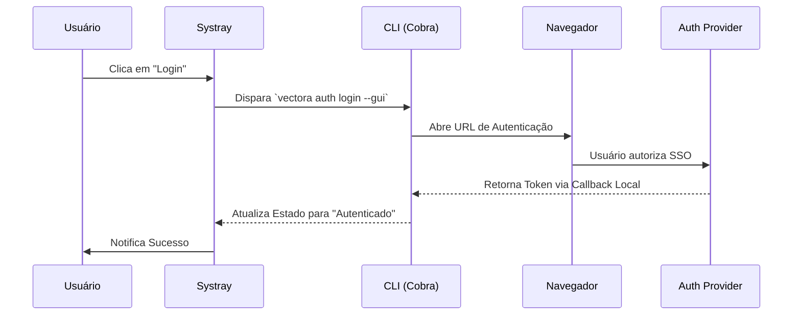




## Interface Systray (Bandeja do Sistema)

O Vectora inclui um aplicativo de bandeja do sistema (Systray) projetado para fornecer uma experiência de configuração visual e "sem atritos", especialmente focada em autenticação SSO e monitoramento rápido de status.

### Objetivos do Systray

1. **Login Simplificado**: Automatizar a abertura do navegador para SSO, eliminando a cópia manual de tokens.
2. **Visibilidade de Status**: Fornecer feedback em tempo real sobre a saúde do servidor MCP e o uso de quota.
3. **Configuração Rápida**: Alternar entre namespaces ou ligar/desligar o modo debug sem usar o terminal.

### Arquitetura da UI

O Systray é implementado em Go utilizando bibliotecas cross-platform que se comunicam diretamente com o [Harness Runtime](../core-migration.md). Ele opera em um loop de eventos separado para garantir que a interface permaneça responsiva mesmo durante processos pesados de indexação.

#### Fluxo de Autenticação SSO

O Systray facilita o login através do seguinte fluxo:

### Componentes do Menu

O menu da bandeja é estruturado da seguinte forma:

- **Status**: `Conectado` | `Desconectado` | `Indexando...`
- **Quick Actions**:
  - `Login / Logout`
  - `Open Dashboard`
  - `Restart MCP Server`
- **Settings**:
  - `Namespace`: [Seleção de lista]
  - `Debug Mode`: [Toggle]
- **About**: Versão do binário e links para documentação.

### Implementação Técnica (Local AppData)

Para garantir que o Systray funcione corretamente no Windows, o instalador coloca o executável em `%LOCALAPPDATA%\Programs\Vectora`. No primeiro lançamento, o aplicativo se adiciona ao registro de "Startup" do Windows (se autorizado), garantindo que o contexto do Vectora esteja sempre disponível para o Agent Principal (Claude/Cursor).

---

_Parte do ecossistema Vectora_ · Engenharia Interna
