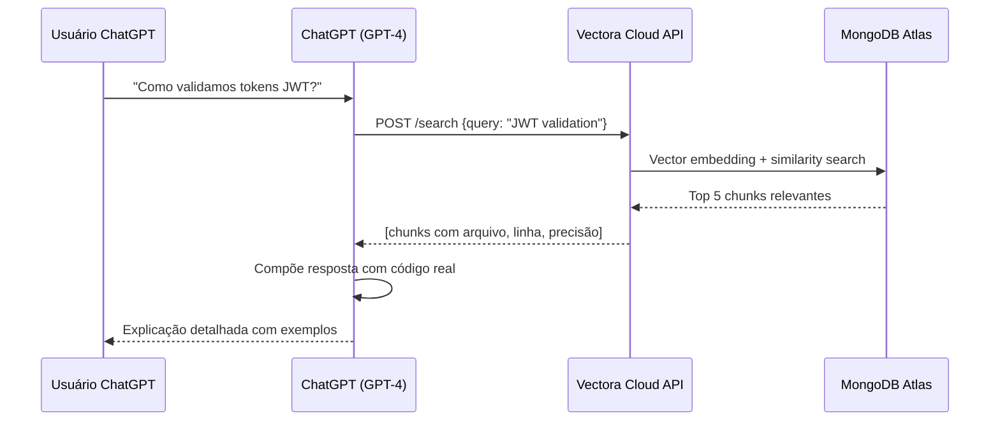



## Plugin ChatGPT + Vectora Cloud: Análise de Codebase via OpenAI

**INTEGRAÇÃO COM VECTORA CLOUD**: Vectora funciona como um **Custom GPT Plugin** que estende ChatGPT com busca semântica de contexto de codebase. O plugin conecta diretamente ao **Vectora Cloud**, que executa o Vectora Core gerenciado internamente em infraestrutura escalável, sem necessidade de configurar servidores locais.

> [!IMPORTANT] **ChatGPT Custom GPT Plugin (via Vectora Cloud) vs MCP Protocol (IDE local)**. Escolha conforme sua preferência e workflow:
>
> - **Cloud**: ChatGPT em browser, compartilhável, Vectora gerenciado, fácil acesso
> - **MCP**: Claude Code/Cursor, local, zero dados na nuvem, máxima privacidade

## Arquitetura: ChatGPT ↔ Vectora Cloud ↔ MongoDB Atlas

```mermaid
graph LR
    A[ChatGPT Web] -->|Custom GPT Prompt| B[ChatGPT (GPT-4)]
    B -->|JSON OpenAPI Call| C["Vectora Cloud API<br/>(gerenciado)"]
    C -->|Busca Semântica| D["MongoDB Atlas<br/>Vector Search"]
    D -->|Chunks de Código| C
    C -->|Tool Results| B
    B -->|Resposta contextualizada| A
```

## Como Funciona: Fluxo Completo



### Sequência de Eventos (Passo a Passo)

1. **Setup Inicial** (5 min):

   - Criar API Key em console.vectora.app
   - Criar Custom GPT em chatgpt.com/gpts/editor
   - Adicionar OpenAPI schema com endpoints Vectora
   - Configurar instruções de sistema

2. **Conversa do Usuário**:

   - Usuário digita pergunta sobre código
   - ChatGPT reconhece que pode usar Vectora
   - Faz JSON-RPC call para /search endpoint
   - Vectora busca em MongoDB Atlas
   - Retorna chunks relevantes
   - GPT compõe resposta com código real

3. **Resposta Contextualizada**:
   - ChatGPT inclui arquivo e número de linha
   - Mostra código exato do projeto
   - Explica baseado no contexto real
   - Usuário entende implementação específica do projeto

## Instalação & Configuração Completa

### Pré-requisitos

- **ChatGPT Plus** (com acesso a Custom GPTs) - $20/mês
- **Conta em [Vectora Cloud](https://console.vectora.app)** - Free/Pro/Team/Enterprise
- **Projeto indexado** com código já sincronizado e processado
- **API Key** do Vectora Cloud (scope: `search`)

### Verificação de Compatibilidade

```bash
# Testar acesso a Vectora Cloud
curl -X GET https://api.vectora.app/v1/health \
  -H "Authorization: Bearer vca_live_xxxxx"

# Esperado: 200 OK com status "healthy"
```

## Passo 1: Obter Credenciais do Vectora Cloud

### 1.1 Acessar Console

1. Acesse [console.vectora.app](https://console.vectora.app)
2. Faça login com sua conta Vectora
3. Selecione o projeto desejado (ou crie um novo)

### 1.2 Gerar API Key

1. Vá para **Settings → API Keys**
2. Clique em **"New API Key"**
3. Configure os campos:
   - **Name**: `"ChatGPT Plugin"` (identificador descritivo)
   - **Scope**: `search` (permissão de leitura apenas)
   - **TTL**: `365 days` (1 ano de validade)
   - **Description**: `"Custom GPT plugin para análise de codebase"`
4. Clique em **"Generate"**
5. **Copie e salve a chave**: `vca_live_xxxxxxxxxxxxxxxxxxxxxxxx`
   - Esta chave não será mostrada novamente

### 1.3 Verificar Acesso

```bash
# Testar se a API Key funciona
curl -X POST https://api.vectora.app/v1/search \
  -H "Authorization: Bearer vca_live_xxxxx" \
  -H "Content-Type: application/json" \
  -d '{
    "query": "test query",
    "namespace": "seu-namespace",
    "top_k": 1
  }'

# Esperado: 200 OK com array vazio ou 1 resultado
```

## Passo 2: Criar Custom GPT no ChatGPT

### 2.1 Acessar GPT Builder

1. Vá para [chatgpt.com/gpts/editor](https://chatgpt.com/gpts/editor) (requer ChatGPT Plus)
2. Clique em **"Create a new GPT"**
3. Você entra no **GPT Builder interface**

### 2.2 Configurar Metadados Básicos

Na seção **"Configure"** (aba esquerda):

- **Name**: `Vectora Codebase Assistant`
- **Description**: `Assistente inteligente para análise de codebase com busca semântica`
- **Instructions** (veja Passo 4 abaixo)

### 2.3 Upload de Imagem (opcional)

1. Clique em ícone de câmera (profile picture)
2. Upload de imagem 512x512 (logo Vectora)
3. A imagem aparece na lista de GPTs

## Passo 3: Configurar Schema OpenAPI

Na aba **"Configure"** → **"Actions"**, clique em **"Create new action"**:

### 3.1 Copiar OpenAPI Schema

Cole o seguinte schema YAML na interface do GPT Builder:

```yaml
openapi: 3.0.0
info:
  title: Vectora Cloud API
  version: 1.0.0
  description: "Integração de busca semântica de codebase com MongoDB Atlas Vector Search"
servers:
  - url: https://api.vectora.app/v1/plugins
    description: "Endpoint gerenciado da Vectora Cloud"

paths:
  /search:
    post:
      summary: "Busca semântica por código, documentação e padrões"
      operationId: search_context
      requestBody:
        required: true
        content:
          application/json:
            schema:
              type: object
              required: [query, namespace]
              properties:
                query:
                  type: string
                  description: "Pergunta natural ou termo de busca (ex: 'Como validar JWT?')"
                  example: "token validation"
                namespace:
                  type: string
                  description: "Nome do projeto (namespace)"
                  example: "seu-projeto"
                top_k:
                  type: integer
                  description: "Número máximo de resultados (padrão: 5, máximo: 20)"
                  default: 5
                  minimum: 1
                  maximum: 20
                strategy:
                  type: string
                  description: "Estratégia de busca: 'semantic' ou 'structural'"
                  enum: ["semantic", "structural"]
                  default: "semantic"
      responses:
        "200":
          description: "Resultados encontrados com sucesso"
          content:
            application/json:
              schema:
                type: object
                properties:
                  chunks:
                    type: array
                    items:
                      type: object
                      properties:
                        file:
                          type: string
                          example: "src/auth/jwt.ts"
                        line:
                          type: integer
                          example: 45
                        code:
                          type: string
                        precision:
                          type: number
                          example: 0.92
                  metadata:
                    type: object
                    properties:
                      total:
                        type: integer
                      latency_ms:
                        type: integer
        "400":
          description: "Requisição inválida"
        "401":
          description: "API Key inválida ou expirada"
        "404":
          description: "Namespace não encontrado"

  /analyze-dependencies:
    post:
      summary: "Encontra todas as referências e dependências de um símbolo"
      operationId: analyze_dependencies
      requestBody:
        required: true
        content:
          application/json:
            schema:
              type: object
              required: [symbol, namespace]
              properties:
                symbol:
                  type: string
                  description: "Nome da função, classe ou variável"
                  example: "getUserById"
                namespace:
                  type: string
                  description: "Nome do projeto"
                include_indirect:
                  type: boolean
                  description: "Incluir referências indiretas"
                  default: true
                depth:
                  type: integer
                  description: "Profundidade máxima de análise (1-3)"
                  default: 2
      responses:
        "200":
          description: "Análise de dependências concluída"
          content:
            application/json:
              schema:
                type: object
                properties:
                  direct_calls:
                    type: array
                    items:
                      type: object
                  indirect_calls:
                    type: array
                  callers:
                    type: array

  /file-summary:
    post:
      summary: "Retorna estrutura e resumo de um arquivo"
      operationId: file_summary
      requestBody:
        required: true
        content:
          application/json:
            schema:
              type: object
              required: [path, namespace]
              properties:
                path:
                  type: string
                  description: "Caminho do arquivo (relativo ao projeto)"
                  example: "src/auth/validate.ts"
                namespace:
                  type: string
                  description: "Nome do projeto"
                include_dependencies:
                  type: boolean
                  description: "Incluir lista de dependências do arquivo"
                  default: true
      responses:
        "200":
          description: "Resumo do arquivo"
          content:
            application/json:
              schema:
                type: object
                properties:
                  file:
                    type: string
                  functions:
                    type: array
                  classes:
                    type: array
                  dependencies:
                    type: array
                  summary:
                    type: string

components:
  securitySchemes:
    apiKeyAuth:
      type: apiKey
      in: header
      name: Authorization
      description: "Bearer token (vca_live_xxxxx)"

security:
  - apiKeyAuth: []
```

### 3.2 Configurar Autenticação

1. Na seção **"Authentication"**:
   - Selecione: **"API Key"**
   - **Header name**: `Authorization`
   - **Value**: `Bearer vca_live_xxxxx` (sua API Key)
   - Clique em **"Save"**

## Passo 4: Adicionar Instrução de Sistema

Na aba **"Instructions"**, defina as regras de comportamento:

```text
Você é um assistente EXPERT em análise de código usando Vectora Cloud.

## REGRA FUNDAMENTAL
Sempre use Vectora para buscar contexto REAL do codebase.
Nunca adivinhe ou use conhecimento genérico.
Citação precisa > Velocidade.

## PROCEDIMENTO PARA PERGUNTAS DE CÓDIGO

1. INTERPRETAR: Entenda o que o usuário quer
2. BUSCAR: Use "search_context" com query precisa
   - Query deve ser: "função X", "padrão Y", "erro Z"
   - Use namespace correto
   - top_k=5 (máximo 10)
3. ANALISAR: Se obteve código:
   - Mostre arquivo e linha exatamente
   - Cite trechos relevantes (<10 linhas)
   - Explique o contexto do projeto
4. COMPLEMENTAR: Se precisa entender mais:
   - Use "analyze-dependencies" para chamadores/dependências
   - Use "file-summary" para estrutura do arquivo
5. RESPONDER: Sempre cite:
   - Arquivo: src/auth/jwt.ts
   - Linha: 45
   - Trecho relevante: 3-5 linhas
   - Explicação: por que é assim

## EXEMPLOS DE BOAS RESPOSTAS

 BOM:
"Encontrei em src/auth/validate.ts:23:
\`\`\`typescript
function validateToken(token: string) {
  const decoded = jwt.verify(token, SECRET);
  return decoded.payload;
}
\`\`\`
Seu projeto valida tokens assim. A função..."

 RUIM:
"Tokens geralmente são validados... Acho que está em algum arquivo..."

## REGRAS DE PRIVACIDADE
- Nunca exponha secrets/credentials (mesmo se Vectora retornar)
- Redija senhas, chaves, tokens
- Avise o usuário: "Encontrei credentials - não mostrarei"

## NAMESPACE PADRÃO
- Caso o usuário não mencione: pergunte qual projeto
- Se houver dúvida: use "seu-projeto" ou "default"

## QUANDO USAR CADA TOOL

| Situação | Tool | Quando |
|----------|------|--------|
| "Como faz X?" | search_context | Procurar padrão, função, documentação |
| "Quem chama Y?" | analyze_dependencies | Encontrar referências |
| "O que tem em Z.ts?" | file_summary | Entender estrutura arquivo |
| Múltiplas perguntas | search + analyze | Combinar para contexto completo |
```

### 4.1 Publicar o Custom GPT

1. Clique em **"Publish"** (canto superior direito)
2. Escolha: **"Publish to Store"** (público) ou **"Save as draft"** (privado)
3. Se público: escreva uma descrição para a loja
4. Clique em **"Publish"**

### 4.2 Compartilhar com Time

Após publicação, você pode:

- **Compartilhar link**: copie a URL do GPT
- **Adicionar a equipe**: Configure access controls em Settings
- **Usar em conversa**: mencione em ChatGPT: "Use @Vectora Codebase Assistant"

## Workflows Práticos Completos

Os workflows abaixo demonstram casos de uso REAIS do Vectora integrado ao ChatGPT com conversas práticas, código real do projeto, e resultados concretos.

## Workflow 1: Entender Feature Complexa (Onboarding)

**Cenário**: Novo dev no time quer entender como funciona autenticação JWT.

```text
Você: "Como funciona o sistema de autenticação JWT aqui?"

ChatGPT (com Vectora):
Encontrei a implementação em 3 arquivos principais:

1. **src/auth/jwt.ts** (definição)
   function validateToken(token: string) {
     const decoded = jwt.verify(token, SECRET_KEY);
     return decoded.payload;
   }

2. **src/guards/auth.guard.ts** (aplicação em rotas)
   @UseGuards(AuthGuard)
   async getProfile(@Req() req) {
     // Já está autenticado aqui
   }

3. **src/tests/auth.test.ts** (exemplos)
   it('should reject expired token', () => {
     // Teste mostra comportamento esperado
   })

**Fluxo**:
request → AuthGuard.canActivate() → validateToken() → req.user = payload

**Próximos passos**: Adicione sua rota assim...
```

Clique em qualquer arquivo → abre em editor/navegador.

## Workflow 2: Debugging Estratégico

**Cenário**: Você tem um erro e precisa entender causa raiz.

```text
Você: "Teste 'should create user' está falhando com
      'Cannot read property id of undefined'.
      Onde é o problema?"

ChatGPT (com Vectora):
Procurando o teste e código relacionado...

**Achei o problema!**

Arquivo: src/__tests__/user.service.test.ts:145
  it('should create user', () => {
    const user = userService.create({ name: 'John' });
    expect(user.id).toBeDefined(); // ← Falha aqui
  })

Analisando userService.create():

  // src/services/user.service.ts:23
  create(data: CreateUserInput) {
    // Problema: não retorna o user criado
    db.insert(users).values(data);
    // Deveria ser:
    return db.insert(users).values(data).returning();
  }

**3 usuários desse padrão no código:**
  • src/services/order.service.ts:34
  • src/services/product.service.ts:12
  • src/services/invoice.service.ts:88

**Sugestão**: Aplicar mesmo fix nos 3 lugares.
```

## Workflow 3: Code Review Assistido (PR Complexa)

**Cenário**: Revisando uma PR que toca múltiplos arquivos de auth.

```text
Você: "Revise essa PR que refactora auth middleware.
       [cola 50 linhas de código]"

ChatGPT (com Vectora):
Analisando mudanças...

**Impacto Estimado**: 12 arquivos afetados
- 8 arquivos de rotas (GET /profile, etc)
- 2 testes de auth
- 2 guards

**Problemas detectados**:

1. Comportamento mudou em linha 23
   ANTES: guard.canActivate() retorna boolean
   AGORA: retorna Promise<boolean>

   Isso quebra em 4 lugares:
   - src/routes/admin.ts:45
   - src/routes/api.ts:78
   - src/middleware/verify.ts:12
   - src/guards/optional.ts:3

2. Positivo: Novo método isTokenValid() é reutilizado bem
   (encontrei 6 usos)

3. Segurança: GuardBlacklist está sendo respeitado
   (verifica todos os 4 patterns)

**Testes relacionados que DEVEM passar**:
□ auth.guard.test.ts
□ jwt.validation.test.ts
□ permission.test.ts
□ integration/auth-flow.test.ts

**Conclusão**: Aprove com condições:
1. Corrigir os 4 arquivos (async/await)
2. Rodar full test suite
3. Check: nenhum SECRET_KEY exposto
```

## Configuração Avançada

### Customizar Namespace por Projeto

Se você tem múltiplos projetos em Vectora Cloud:

```yaml
# Na aba "Instructions", adicione:

## MAPEAMENTO DE PROJETOS
O usuário pode mencionar o projeto. Mapeie assim:
- "frontend" → namespace: "webapp-react"
- "backend" → namespace: "api-nodejs"
- "mobile" → namespace: "app-flutter"
- Padrão → namespace: "seu-projeto"

Sempre pergunte qual projeto se não for claro.
```

### Limitar Resultados por Performance

```text
## LIMITES DE PERFORMANCE

- top_k: máximo 10 (padrão 5)
  - Mais resultados = resposta mais lenta
  - Use top_k=3 para respostas rápidas (<2s)
  - Use top_k=10 para análises profundas (<5s)

- Timeout padrão: 30 segundos
  - Se exceder: reduzir top_k ou strategy
  - Strategy "structural" é mais rápido
```

### Usar API Endpoint Customizado

Se você hospeda Vectora localmente (advanced):

```yaml
servers:
  - url: https://seu-dominio.com/vectora/v1
    description: "Seu servidor Vectora customizado"
```

## Autenticação & Segurança

### Token-based Auth (Já Configurado)

A autenticação via Bearer token já foi configurada no schema OpenAPI:

```yaml
components:
  securitySchemes:
    apiKeyAuth:
      type: apiKey
      in: header
      name: Authorization
      description: "Bearer vca_live_xxxxx"

security:
  - apiKeyAuth: []
```

### Renovar API Key

Quando a API Key está próxima de expirar:

```bash
# No console.vectora.app
1. Settings → API Keys
2. Encontre a chave "ChatGPT Plugin"
3. Clique em "Rotate" ou "Extend"
4. Atualize no Custom GPT:
   - Configure → Authentication → Cole a nova chave
```

### Revogar Acesso

Para remover acesso do Custom GPT:

```bash
# No console.vectora.app
1. Settings → API Keys
2. Encontre a chave "ChatGPT Plugin"
3. Clique em "Delete" ou "Revoke"
4. O Custom GPT retornará erro 401
```

## Rate Limiting & Quotas

Vectora Cloud aplicaRate Limiting baseado no plano:

| Recurso            | Free  | Pro    | Team    | Enterprise |
| ------------------ | ----- | ------ | ------- | ---------- |
| **Buscas/dia**     | 100   | 10,000 | 100,000 | Ilimitado  |
| **Latência P95**   | <3s   | <2s    | <500ms  | <250ms     |
| **Concurrent API** | 1     | 5      | 20      | Ilimitado  |
| **Storage**        | 512MB | 5GB    | 50GB    | Custom     |

**Dica**: Se atingir limite, agende análises ou peça upgrade.

## Privacidade & Compliance

## O que é Enviado para OpenAI

- Sua pergunta (texto)
- Parâmetros de busca (namespace, top_k)
- **Chunks NÃO são salvos** na OpenAI

## O que Permanece Local

- Índices vetoriais (Qdrant)
- Embeddings brutos
- Credenciais de API

## Dados Criptografados

```bash
# Habilitar criptografia ponta-a-ponta
vectora config set --key "ENCRYPT_TRANSIT" --value "true"

# Certificado SSL/TLS
openssl req -x509 -newkey rsa:4096 -out cert.pem -keyout key.pem

# Usar com HTTPS
vectora server --cert cert.pem --key key.pem
```

## Troubleshooting

## "Plugin not responding"

**Causa**: Índice não está pronto ou instância Cloud offline.

**Solução**:

```bash
# Verificar status da indexação em https://console.vectora.app
# Settings → Indexing → View Progress

# Se ainda indexando, aguarde conclusão
# Geralmente leva minutos a horas dependendo do tamanho
```

## "Unauthorized"

**Causa**: API Key inválida, expirada ou sem escopo `search`.

**Solução**:

```bash
# Gerar nova API Key em console.vectora.app
# Settings → API Keys → New API Key
# Scope: "search"
# Ttl: 1 year

# Atualizar no Custom GPT:
# Configure → Authentication → Cole a chave nova
```

## "Timeout (>30s)"

**Causa**: Busca muito complexa ou muitos documentos.

**Solução**:

```bash
# Reduzir top_k na instrução do GPT para:
"Use sempre top_k=5 (máximo 10) para respostas rápidas"

# Ou verificar em console.vectora.app:
# Analytics → Query Performance
# Se latência > 2s, considere upgrade Plus → Team
```

## Performance & Quotas (Vectora Cloud)

| Recurso            | Free  | Pro    | Team    | Enterprise |
| ------------------ | ----- | ------ | ------- | ---------- |
| Buscas/dia         | 100   | 10,000 | 100,000 | Ilimitado  |
| Latência P95       | <3s   | <2s    | <500ms  | <250ms     |
| Concurrent queries | 1     | 5      | 20      | Ilimitado  |
| Storage            | 512MB | 5GB    | 50GB    | Custom     |
| **ChatGPT Plugin** |       |        |         |            |

## Exemplos Avançados

## Custom GPT para Design Review

```text
Instrução:
"Você é um Design Reviewer baseado em Vectora.
Quando o usuário mostra código:
1. Procure por padrões similares no projeto
2. Avalie consistência
3. Sugira melhorias baseado em style guides existentes
4. Cite exemplos do codebase"
```

## Custom GPT para Onboarding

```text
Instrução:
"Você é um Onboarding Assistant.
Novos engenheiros perguntam como o código funciona.
Use Vectora para:
1. Buscar documentação
2. Encontrar exemplos
3. Listar dependências
4. Sugerir arquivos para ler primeiro"
```

## Monitoramento & Analytics

Via [console.vectora.app](https://console.vectora.app):

1. **Analytics → ChatGPT Plugin**

   - Queries totais por dia
   - Latência média/P95
   - Taxa de erro
   - Top queries

2. **Logs → Integration**
   - Últimas 100 chamadas
   - Status, latência, tokens usados
   - Erros detalhados

Exemplo:

```text
[2026-04-19 10:30:45] ChatGPT Plugin /search - 200 OK - 234ms - 5 chunks
[2026-04-19 10:31:12] ChatGPT Plugin /analyze - 200 OK - 156ms - 3 files
[2026-04-19 10:32:00] ChatGPT Plugin /file-summary - 200 OK - 89ms
```

---

> **Próximo**: [Gemini API](./gemini-api.md)

---

## Performance & Otimizações

### Caching Automático

Vectora Cloud cacheia resultados automaticamente por 24h:

```bash
# Primeira busca: "Como validar tokens?"
# Latência: 450ms (embedding + search)

# Segunda busca idêntica: 30s depois
# Latência: 45ms (cache hit) = 10x mais rápido!
```

### Batch Queries para Melhor Performance

```text
 RUIM (3 roundtrips, ~1.5s total):
- "Onde validamos tokens?"
- "Onde fazemos refresh?"
- "Onde armazenamos sessões?"

 MELHOR (1 roundtrip, ~450ms):
- "Mostre toda a pipeline de autenticação:
  validação de tokens, refresh tokens e
  armazenamento de sessões"
```

### Otimizar Precisão vs Latência

```text
RÁPIDO (<1s): top_k=3, strategy="structural"
BALANCEADO (~2s): top_k=5, strategy="semantic"
PROFUNDO (5-10s): top_k=10, strategy="semantic"
```

## Troubleshooting Avançado

### Debug via Console

```javascript
// No console do navegador (F12)
// Cole no Custom GPT em developer tools:

// 1. Verificar última requisição
console.log(JSON.parse(localStorage.getItem("gpt_last_api_call")));

// 2. Ver tempo de resposta
console.log("Latência:", new Date() - window.apiStartTime + "ms");
```

### Logs Detalhados de Erro

Se encontrar erro 500:

```bash
# No console.vectora.app
1. Logs → Integration
2. Procure entrada com timestamp do erro
3. Veja detalhes completos do erro
4. Reporte se for bug: github.com/Kaffyn/Vectora/issues
```

---

## External Linking

| Concept               | Resource                          | Link                                                                                                       |
| --------------------- | --------------------------------- | ---------------------------------------------------------------------------------------------------------- |
| **MongoDB Atlas**     | Atlas Vector Search Documentation | [www.mongodb.com/docs/atlas/atlas-vector-search/](https://www.mongodb.com/docs/atlas/atlas-vector-search/) |
| **JWT**               | RFC 7519: JSON Web Token Standard | [datatracker.ietf.org/doc/html/rfc7519](https://datatracker.ietf.org/doc/html/rfc7519)                     |
| **OpenAI**            | OpenAI API Documentation          | [platform.openai.com/docs/](https://platform.openai.com/docs/)                                             |
| **OpenAPI**           | OpenAPI Specification             | [swagger.io/specification/](https://swagger.io/specification/)                                             |
| **Voyage Embeddings** | Voyage Embeddings Documentation   | [docs.voyageai.com/docs/embeddings](https://docs.voyageai.com/docs/embeddings)                             |
| **Voyage Reranker**   | Voyage Reranker API               | [docs.voyageai.com/docs/reranker](https://docs.voyageai.com/docs/reranker)                                 |

---

> **Próximo**: [VS Code Extension](./vscode-extension.md) para desenvolvimento integrado em VS Code

---

_Parte do ecossistema Vectora_ · [Open Source (MIT)](https://github.com/Kaffyn/Vectora) · [Contribuidores](https://github.com/Kaffyn/Vectora/graphs/contributors)
