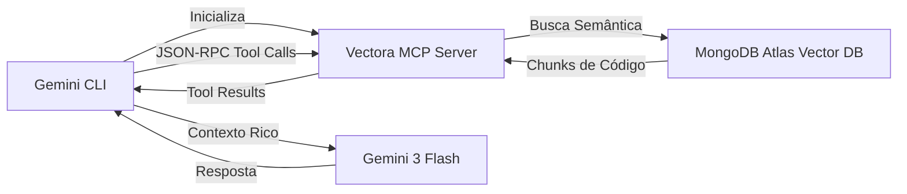



## Gemini CLI + Vectora via MCP

A **Google Gemini CLI** permite que você integre Vectora como um **Servidor MCP** (Model Context Protocol), permitindo que o Gemini acesse contexto de código gerenciado pelo Vectora durante conversas interativas.

> [!IMPORTANT] **Protocolo MCP**: Vectora funciona como um servidor MCP que se comunica com Gemini CLI via stdio. A comunicação é baseada em **JSON-RPC 2.0** com suporte a tools, resources e prompts.

## Arquitetura: Gemini CLI ↔ Vectora MCP Server



## Setup Completo (Passo a Passo)

### Passo 1: Instale Pré-requisitos

#### 1.1 Instale Google Cloud CLI (gcloud)

```bash
# macOS
brew install google-cloud-sdk

# Windows (via Chocolatey)
choco install google-cloud-sdk

# Linux (verificar docs do Google Cloud)
curl https://sdk.cloud.google.com | bash
```

#### 1.2 Autentique-se no Google Cloud

```bash
gcloud auth application-default login
```

Isso abre uma janela do navegador solicitando sua credencial Google.

#### 1.3 Instale Gemini CLI Globalmente

```bash
npm install -g @google/generative-ai-cli

# Verifique a instalação
gemini --version
```

### Passo 2: Configure Vectora como MCP Server

#### 2.1 Crie/Edite `~/.gemini/config.json`

```json
{
  "apiKey": "seu-gemini-api-key-aqui",
  "mcpServers": {
    "vectora": {
      "command": "vectora",
      "args": ["mcp", "--stdio"],
      "env": {
        "VECTORA_NAMESPACE": "seu-projeto",
        "VECTORA_API_KEY": "vca_live_...",
        "VECTORA_LOG_LEVEL": "info"
      }
    }
  }
}
```

#### 2.2 Chave de API do Gemini

Obtenha sua chave em: <https://aistudio.google.com/app/apikeys>

```bash
# Ou configure via variável de ambiente
export GOOGLE_API_KEY="your-api-key-here"
```

### Passo 3: Inicie uma Sessão com Vectora

```bash
# Começar conversa interativa com suporte a Vectora
gemini chat --model "gemini-3-flash"
```

Gemini CLI carregará automaticamente o Vectora como MCP Server.

## Comunicação MCP: How It Works

Quando você faz uma pergunta no Gemini CLI:

1. **Inicialização**: Gemini CLI executa `vectora mcp --stdio`
2. **Handshake**: Troca de mensagens JSON-RPC para descobrir tools
3. **Tool Discovery**: Gemini descobre que Vectora oferece `search_context`, `analyze_code`, etc.
4. **Tool Call**: Baseado na pergunta, Gemini chama um tool Vectora
5. **Busca**: Vectora busca em MongoDB Atlas e retorna chunks relevantes
6. **Composição**: Gemini compõe a resposta incluindo o contexto do Vectora
7. **Resposta**: Usuário recebe resposta com código real do seu projeto

### Exemplo Prático: "Como validar JWTs no projeto?"

```text
Usuário: "Como validar JWTs no nosso projeto?"
├─ Gemini: "Vou procurar por código de validação..."
├─ Tool Call: vectora.search_context("JWT validation", namespace="seu-projeto")
├─ Vectora:
│ └─ Busca em MongoDB Atlas
│ └─ Encontra: src/auth/validate.ts, src/middleware/jwt.go
│ └─ Retorna: chunks relevantes + precisão 0.89
├─ Gemini: Compõe resposta com código real
└─ Usuário: Vê a implementação exata do projeto
```

## Tools Disponíveis via MCP

### 1. `search_context`

Busca semântica por código e documentação.

```json
{
  "method": "tools/call",
  "params": {
    "name": "search_context",
    "arguments": {
      "query": "autenticação de usuário",
      "top_k": 5,
      "strategy": "semantic"
    }
  }
}
```

**Respostas**:

- `chunks`: Array de código relevante
- `metadata`: Precisão, latência, total buscado

### 2. `analyze_code`

Analisa padrões em código específico.

```json
{
  "method": "tools/call",
  "params": {
    "name": "analyze_code",
    "arguments": {
      "file_path": "src/auth/validate.ts",
      "analysis_type": "security"
    }
  }
}
```

### 3. `get_file_context`

Retorna contexto completo de um arquivo.

```json
{
  "method": "tools/call",
  "params": {
    "name": "get_file_context",
    "arguments": {
      "path": "src/middleware/auth.ts",
      "include_dependencies": true
    }
  }
}
```

## Configuração Avançada

### Filtrar por Namespace

```json
{
  "mcpServers": {
    "vectora": {
      "command": "vectora",
      "args": ["mcp", "--stdio", "--namespace", "seu-projeto"],
      "env": {
        "VECTORA_NAMESPACE": "seu-projeto"
      }
    }
  }
}
```

### Habilitar Logging Detalhado

```json
{
  "mcpServers": {
    "vectora": {
      "env": {
        "VECTORA_LOG_LEVEL": "debug",
        "VECTORA_LOG_FILE": "~/.gemini/vectora-debug.log"
      }
    }
  }
}
```

### Usar API Key Específica

```bash
# Via variável de ambiente
export VECTORA_API_KEY="vca_live_xxxxx"

# Ou no config.json
{
  "mcpServers": {
    "vectora": {
      "env": {
        "VECTORA_API_KEY": "vca_live_xxxxx"
      }
    }
  }
}
```

## Workflows Práticos

### Workflow 1: Code Review Assistido

```bash
gemini chat --model "gemini-3-flash"

# Na conversa:
# "Review o arquivo src/auth/validate.ts e sugira melhorias"
# → Gemini busca via Vectora, analisa, e fornece sugestões contextualizadas
```

### Workflow 2: Geração de Documentação

```bash
gemini chat

# "Gere documentação para a função getUserById"
# → Vectora encontra a função, Gemini gera docs precisas
```

### Workflow 3: Análise de Padrões

```bash
gemini chat

# "Quais padrões de tratamento de erro usamos em APIs?"
# → Vectora busca, Gemini analisa e resume padrões
```

## Troubleshooting

### Erro: "Vectora MCP Server não iniciado"

**Causa**: Vectora não está disponível no PATH.

**Solução**:

```bash
# Instale Vectora globalmente
npm install -g @kaffyn/vectora

# Ou use caminho absoluto em config.json
{
  "command": "/usr/local/bin/vectora"
}
```

### Erro: "JSON-RPC Communication Failed"

**Causa**: Vectora não respondeu corretamente ao handshake.

**Solução**:

```bash
# Teste manualmente
vectora mcp --stdio

# Digite handshake JSON-RPC:
{"jsonrpc": "2.0", "id": 1, "method": "initialize", "params": {}}

# Pressione Ctrl+D para sair
```

### Erro: "Namespace não encontrado"

**Causa**: Namespace configurado não existe em Vectora.

**Solução**:

```bash
# Liste namespaces disponíveis
vectora namespace list

# Configure o namespace correto em config.json
{
  "env": {
    "VECTORA_NAMESPACE": "seu-projeto-real"
  }
}
```

### Gemini não vê Vectora

**Passos de Debug**:

1. Verifique se Vectora está instalado:

   ```bash
   which vectora
   vectora --version
   ```

2. Teste MCP manualmente:

   ```bash
   vectora mcp --stdio < /dev/null
   ```

3. Verifique config.json:

   ```bash
   cat ~/.gemini/config.json | jq .mcpServers.vectora
   ```

4. Reinicie Gemini CLI:

   ```bash
   gemini chat
   # Pressione Ctrl+C e tente de novo
   ```

5. Verifique logs (se configurado):

   ```bash
   tail -f ~/.gemini/vectora-debug.log
   ```

## Performance & Otimizações

### Caching de Resultados

Vectora cacheia automaticamente buscas. Para aproveitar:

```bash
# Mesma query várias vezes → cache hit ~95%
gemini chat
# "Como fazemos login?" (primeira vez: 234ms)
# "E logout?" (usa cache de "como fazemos...")
```

### Batch Queries

Para múltiplas buscas, agrupe em uma pergunta:

```text
# Ruim (3 roundtrips)
"Onde validamos tokens?"
"Onde fazemos refresh?"
"Onde armazenamos sessões?"

# Melhor (1 roundtrip)
"Mostre toda a pipeline de autenticação: validação, refresh e armazenamento"
```

## Exemplos Completos

### Exemplo 1: Debug de Bug com Vectora

```bash
gemini chat

# "Estou vendo erro 401 em POST /api/users. Qual é a pipeline de auth?"
# → Gemini chama search_context("401 authentication pipeline")
# → Vectora retorna: validate.ts, auth middleware, guards, etc.
# → Gemini debugga baseado no código real
```

### Exemplo 2: Refatoração Guiada

```bash
gemini chat

# "Refatore a função getUserById para ser async/await"
# → Gemini busca função atual via Vectora
# → Analisa dependências
# → Sugere refatoração com contexto real
```

## Segurança & Privacy

> [!WARNING] **Dados Enviados ao Gemini**:
>
> - Queries de busca (podem conter palavras-chave de código)
> - Chunks de código retornados pelo Vectora
> - Análises e sugestões baseadas no código

**Mitigações**:

- Use Vectora com namespace privado
- Configure `VECTORA_NAMESPACE` para isolar dados por projeto
- Revise logs em `~/.gemini/vectora-debug.log`
- Use API keys com escopo mínimo (`read` apenas)

## Próximos Passos

1. [Setup Vectora](/getting-started/) - Configure Vectora localmente
2. [Protocolo MCP](/protocols/mcp/) - Entenda a especificação completa
3. [Context Engine](/concepts/context-engine/) - Saiba como Vectora busca código
4. [Segurança](/security/) - Proteja sua integração

## External Linking

| Concept           | Resource                             | Link                                                                                                       |
| ----------------- | ------------------------------------ | ---------------------------------------------------------------------------------------------------------- |
| **Gemini API**    | Google AI Studio Documentation       | [ai.google.dev/docs](https://ai.google.dev/docs)                                                           |
| **MCP**           | Model Context Protocol Specification | [modelcontextprotocol.io/specification](https://modelcontextprotocol.io/specification)                     |
| **MCP Go SDK**    | Go SDK for MCP (mark3labs)           | [github.com/mark3labs/mcp-go](https://github.com/mark3labs/mcp-go)                                         |
| **MongoDB Atlas** | Atlas Vector Search Documentation    | [www.mongodb.com/docs/atlas/atlas-vector-search/](https://www.mongodb.com/docs/atlas/atlas-vector-search/) |
| **JSON-RPC**      | JSON-RPC 2.0 Specification           | [www.jsonrpc.org/specification](https://www.jsonrpc.org/specification)                                     |
| **JWT**           | RFC 7519: JSON Web Token Standard    | [datatracker.ietf.org/doc/html/rfc7519](https://datatracker.ietf.org/doc/html/rfc7519)                     |

---

_Parte do ecossistema Vectora_ · [Open Source (MIT)](https://github.com/Kaffyn/Vectora) · [Contribuidores](https://github.com/Kaffyn/Vectora/graphs/contributors)
