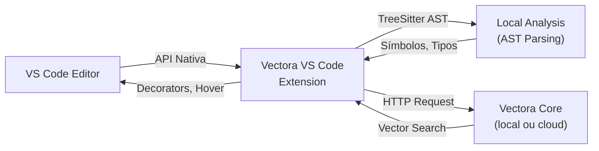



## Extensão VS Code - Análise de Codebase em Tempo Real

**APP PRÓPRIO**: Vectora oferece uma extensão nativa para VS Code com UI integrada (painel sidebar, commands, inline hover) - não precisa de MCP ou qualquer protocolo externo. Desenvolvimento totalmente customizado para VS Code aproveitando todas as APIs nativas.

> [!IMPORTANT] **VS Code Extension (app próprio) vs MCP Protocol (genérico)**:
>
> - **Extension**: UI nativa, performance local, hotkeys customizáveis, full VS Code integration
> - **MCP**: Genérico para múltiplas IDEs (Claude Code, Cursor, Zed), mas menos features

## Arquitetura: Extensão Native vs MCP



## Features Completas

| Feature                | Descrição                      | Atalho           |
| ---------------------- | ------------------------------ | ---------------- |
| **Sidebar Panel**      | Busca, índice, métricas        | Cmd/Ctrl+Shift+V |
| **Command Palette**    | Todos os comandos Vectora      | Cmd/Ctrl+Shift+P |
| **Hover Information**  | Contexto ao passar mouse       | Hover em símbolo |
| **Find References**    | Mostra referências + Vectora   | Cmd/Ctrl+Shift+H |
| **Code Lens**          | Links diretos acima de funções | Nativo VS Code   |
| **Status Bar**         | Status de indexação e saúde    | Canto inferior   |
| **Inline Diagnostics** | Avisos de issues detectadas    | Inline no editor |
| **Quick Fix**          | Sugestões de refatoração       | Cmd/Ctrl+.       |

## Instalação & Setup

### Via VS Code Marketplace (Recomendado)

1. Abra **VS Code**
2. Vá para **Extensions** (Cmd/Ctrl + Shift + X)
3. Procure: `Vectora` (oficial da Kaffyn)
4. Clique em **Install**
5. Permita acesso aos arquivos do projeto quando solicitado
6. A extension ativa automaticamente

### Alternativa: Manual Install (Dev)

```bash
# Clone do repositório GitHub
git clone https://github.com/kaffyn/vectora-vscode.git
cd vectora-vscode

# Instale dependências
npm install

# Link simbólico para ~/.vscode/extensions (opcional)
ln -s $(pwd) ~/.vscode/extensions/vectora-vscode
```

### Verificação de Instalação

```bash
# Na paleta de comandos (Cmd/Ctrl+Shift+P), digite:
> Vectora: Show Metrics

# Se funcionar: extension está ativa e conectada
```

## Setup Inicial do Projeto

### Passo 1: Inicializar Vectora no Projeto

```bash
# No terminal do seu projeto
cd ~/seu-projeto

# Inicialize Vectora
vectora init --name "Meu Projeto" --type codebase

# Resultado: arquivo .vectora/config.json criado
```

### Passo 2: Abrir em VS Code

```bash
# Abra o projeto em VS Code
code ~/seu-projeto

# A extension detecta .vectora/config.json automaticamente
# E começa a indexar (pode levar alguns minutos)
```

### Passo 3: Configurar Chaves de API

VS Code pedirá chaves de API na primeira execução. Opções:

#### Opção A: Via Diálogo VS Code (Fácil)

1. Quando VS Code pedir: insira suas chaves diretamente
2. Elas são armazenadas encriptadas em `settings.json`
3. Automático: a extension as usa para embeddings

#### Opção B: Via .env Local (Recomendado)

```bash
# Na raiz do projeto, crie .env
cat > .env << 'EOF'
GEMINI_API_KEY=sk-proj-xxxxx
VOYAGE_API_KEY=sv_xxxxx
VECTORA_NAMESPACE=seu-namespace
VECTORA_EMBEDDING_MODEL=voyage-code-3
EOF

# A extension lê automaticamente
# Dica: adicione .env ao .gitignore!
echo ".env" >> .gitignore
```

#### Opção C: Via Variáveis de Ambiente

```bash
# Terminal (macOS/Linux)
export GEMINI_API_KEY="sk-proj-xxxxx"
export VOYAGE_API_KEY="sv_xxxxx"

# PowerShell (Windows)
$env:GEMINI_API_KEY = "sk-proj-xxxxx"
$env:VOYAGE_API_KEY = "sv_xxxxx"

# Depois abra VS Code naquele terminal
code ~/seu-projeto
```

### Passo 4: Verificar Conexão

```bash
# No VS Code, abra a paleta de comandos:
Cmd/Ctrl + Shift + P

# Digite: Vectora: Show Metrics

# Esperado: aparecer painel com:
# Connection: Connected
# Index size: X chunks
# Last update: agora mesmo
```

## Interface & Features Detalhadas

### Sidebar Panel (Painel Lateral)

A extension mostra um painel "Vectora" na sidebar esquerda:

```text
┌──────────────────────────────────┐
│ Vectora │
├──────────────────────────────────┤
│ Indexed Files │
│ ├─ src/ (2,847 chunks) │
│ │ ├─ auth/ (145 chunks) │
│ │ ├─ handlers/ (312 chunks) │
│ │ └─ utils/ (89 chunks) │
│ ├─ docs/ (312 chunks) │
│ └─ tests/ (156 chunks) │
│ │
│ Search │
│ ┌──────────────────────────────┐ │
│ │ [Search query...] │ │ ← Live search
│ └──────────────────────────────┘ │
│ Strategy: ◉ Semantic ○ Structural│
│ Top K: [5] ▲▼ │
│ │
│ Stats │
│ ├─ Precision: 0.86 │
│ ├─ Latency: 145ms │
│ ├─ Indexed: 3,315 chunks │
│ ├─ Last updated: 2 min ago │
│ └─ Status: Healthy │
│ │
│ Settings │
│ └─ Configure... │
└──────────────────────────────────┘
```

**Interação**:

- Clique em pasta para expandir/colapsar
- Clique em arquivo para abrir no editor
- Busca ao digitar (sem pressionar Enter)
- Resultados aparecem em tempo real

### Command Palette (Paleta de Comandos)

Acesse via **Cmd/Ctrl + Shift + P** e digite `Vectora:`:

```text
Vectora: Search Context
├─ Abre painel de busca interativo
├─ Digita pergunta natural
└─ Mostra resultados em tempo real

Vectora: Analyze Dependencies
├─ Posicione cursor em símbolo
├─ Mostra quem chama + quem é chamado
└─ Análise de impacto automática

Vectora: Find Tests
├─ Busca testes relacionados à query
├─ Filtra por nome, descrição, tipo
└─ Jump-to-test com um clique

Vectora: Find Similar Code
├─ Encontra código similar ao selecionado
├─ Compara patterns
└─ Sugere refatoração

Vectora: Index Status
├─ Mostra progresso de indexação
├─ Tempo estimado restante
└─ Erros de indexação (se houver)

Vectora: Show Metrics
├─ Painel com estatísticas completas
├─ Gráficos de performance
└─ Taxa de cache hit

Vectora: Configure
├─ Abre settings da extension
├─ API keys, namespace, estratégia
└─ Salva em settings.json
```

### Inline Hover Information

Posicione o cursor sobre qualquer identificador:

```typescript
// Hover aqui
function getUserById(id: string) {
  // Info aparece:
  //
  // getUserById(id): Promise<User>
  //
  // Definido em: src/services/user.ts:45
  //
  // Similar:
  // • getUser (85% match)
  // • fetchUser (72% match)
  // • getActiveUser (68% match)
  //
  // Usado em 24 arquivos
}
```

### Code Lens (Links Acima de Funções)

Linhas acima de funções/classes mostram:

```typescript
[Referências (24)] [Definição] [Teste] [Semelhantes] [Ir para Implementação]

function validateToken(token: string) {
  // ...
}
```

Clique em qualquer link para ação direta.

### Status Bar (Barra de Status)

No canto inferior direito da VS Code:

```text
Vectora: Connected | 3,315 chunks | Precision: 0.86 | Last: 2m ago
```

Clique para abrir métricas detalhadas.

## Workflows Passo-a-Passo

Os workflows abaixo mostram a experiência típica de uso da extensão Vectora no VS Code, com interface detalhada e passos claros.

## Workflow 1: Busca Rápida (5s de setup)

**Cenário**: Você quer entender como tokens JWT são validados no projeto.

```text
1. Pressione Cmd/Ctrl + Shift + P (Command Palette)
   → Mostra: caixa de entrada vazia com ">" no topo

2. Digite: "Vectora: Search Context"
   → Autocomplete mostra opção Vectora

3. Pressione Enter
   → Abre painel de busca (direita da sidebar)

4. Digite: "Como faz validação de tokens?"
   → Em tempo real: mostra resultados conforme digita

5. Resultados aparecem em 120-250ms
   ┌─────────────────────────────────┐
   │ Vectora Results (8 chunks) │
   ├─────────────────────────────────┤
   │ src/auth/jwt.ts:45 │ ← Clique para ir
   │ validateToken() { ... │
   │ precision: 0.92 | latency 240ms│
   │ │
   │ src/auth/guards.ts:12 │
   │ VerifyJWT middleware { ... │
   │ precision: 0.88 | latency 240ms│
   │ │
   │ src/auth/types.ts:3 │
   │ interface JWTPayload { ... │
   │ precision: 0.76 │
   │ │
   │ [Mostrar mais] │
   └─────────────────────────────────┘
```

Clique em qualquer resultado → editor salta para o arquivo.

## Workflow 2: Análise Inteligente de Função

**Cenário**: Você clicou em uma função e quer ver TUDO que está relacionado.

```text
1. Posicione cursor em: getUserById
2. Pressione Cmd/Ctrl + Shift + H (Find References)
3. VS Code mostra painel "Find All References":

   ┌─────────────────────────────────┐
   │ 62 References to getUserById │
   ├─────────────────────────────────┤
   │ DIRECT CALLS (47) │
   │ • src/routes/user.ts:23 │
   │ • src/middleware/auth.ts:34 │
   │ • src/services/profile.ts:12 │
   │ │
   │ INDIRECT via getUserData (12) │
   │ • src/handlers/index.ts:5 │
   │ • src/cache/service.ts:99 │
   │ │
   │ TESTS (3) │
   │ • src/__tests__/user.test.ts:45 │
   │ │
   │ [Expandir com Vectora] ← Novo │
   └─────────────────────────────────┘
```

Clique em "Expandir com Vectora" → mostra contexto semântico:

```text
Referências semelhantes não encontradas por AST:
• getUserByEmail() [85% similar]
• fetchUser() [72% similar]
• getActiveUser() [68% similar]
```

## Workflow 3: Code Review com Contexto (Entender PR complexa)

**Cenário**: Revisando PR que toca autenticação, precisa entender impacto.

```text
1. Abra arquivo modificado: auth/jwt.ts
2. Cmd/Ctrl + Alt + F (Find Changes in Context)
3. Painel mostra:

   ┌────────────────────────────────────┐
   │ Vectora: Changes & Impact │
   ├────────────────────────────────────┤
   │ LINHAS MODIFICADAS │
   │ L45: function validateToken │
   │ L52: if (!token.verified) │
   │ │
   │ ARQUIVOS QUE USAM ESSAS FUNÇÕES │
   │ • src/guards/auth.guard.ts (5) │
   │ • src/routes/api.ts (3) │
   │ • src/middleware/verify.ts (8) │
   │ │
   │ TESTES RELACIONADOS │
   │ • auth.guard.test.ts │
   │ • jwt.validation.test.ts │
   │ │
   │ ALERT: 16 dependências │
   │ Recomenda rodar testes completos │
   └────────────────────────────────────┘
```

4. Clique em "Rodar Testes Relacionados"
   → VS Code executa apenas testes relevantes (10s vs 2min full suite)

## Configuração Avançada

### settings.json (Principal)

```json
{
  // === BÁSICO ===
  "vectora.enabled": true,
  "vectora.namespace": "seu-namespace",

  // === INDEXAÇÃO ===
  "vectora.autoIndex": true,
  "vectora.indexOnSave": true,
  "vectora.indexOnStartup": true,
  "vectora.trustFolder": "./src", // Pasta principal do código

  // === BUSCA & PERFORMANCE ===
  "vectora.searchStrategy": "semantic", // ou "structural"
  "vectora.maxResults": 10,
  "vectora.searchTimeout": 2000, // ms
  "vectora.maxTokens": 4096, // Máximo de tokens para contexto

  // === UI ===
  "vectora.showMetrics": true,
  "vectora.sidebarPosition": "right", // ou "left"
  "vectora.showCodeLens": true,
  "vectora.showStatusBar": true,

  // === PRIVACIDADE & DEBUG ===
  "vectora.debugMode": false,
  "vectora.sendTelemetry": true,
  "vectora.useLocalEmbeddings": false // Para máxima privacidade
}
```

### .vectora/config.json (Projeto)

```json
{
  "project": {
    "name": "Meu Projeto",
    "type": "codebase",
    "version": "0.1.0"
  },

  "indexing": {
    "include_patterns": ["**/*.ts", "**/*.tsx", "**/*.js"],
    "exclude_patterns": ["node_modules/**", "dist/**", ".git/**", "*.test.ts"],
    "incremental": true,
    "watch_mode": true
  },

  "embedding": {
    "model": "voyage-code-3",
    "provider": "voyage-ai",
    "batch_size": 100
  },

  "database": {
    "type": "sqlite",
    "path": ".vectora/index.db"
  }
}
```

### .vectora/.env (Segurança)

```bash
# API Keys (NÃO commit)
GEMINI_API_KEY=sk-proj-xxxxx
VOYAGE_API_KEY=sv_xxxxx

# Servidor remoto (se não local)
VECTORA_SERVER_URL=https://seu-servidor.com

# Debug (apenas desenvolvimento)
VECTORA_LOG_LEVEL=debug
VECTORA_LOG_FILE=.vectora/debug.log
```

### Hotkeys Customizáveis

Customize em **Code → Preferences → Keyboard Shortcuts** ou `keybindings.json`:

```json
{
  "key": "ctrl+shift+v",
  "command": "vectora.toggleSidebar"
},
{
  "key": "ctrl+shift+f",
  "command": "vectora.search"
},
{
  "key": "ctrl+alt+d",
  "command": "vectora.analyzeDependencies"
},
{
  "key": "ctrl+alt+t",
  "command": "vectora.findTests"
}
```

### Excluir Pastas da Indexação

No `.vectora/config.json`:

```json
{
  "indexing": {
    "exclude_patterns": ["node_modules/**", "dist/**", ".git/**", "build/**", "*.test.ts", "**/*.min.js", "coverage/**"]
  }
}
```

### Mudar Estratégia de Busca

```json
{
  // Rápido: AST structural matching (~50ms)
  "vectora.searchStrategy": "structural",

  // Preciso: Semantic vector search (~300ms)
  "vectora.searchStrategy": "semantic",

  // Híbrido: Estrutural + semântico (~400ms)
  "vectora.searchStrategy": "hybrid"
}
```

## Extensões Complementares

Para melhor experiência, instale:

1. **ES7+ React/Redux/React-Native snippets** — Autocompletar smart
2. **Prettier** — Formatação consistente
3. **GitLens** — Blame + history (combina bem com Vectora)

## Troubleshooting

## Extension não aparece na sidebar

**Causa**: Não está ativada.

**Solução**:

```text
Cmd/Ctrl + Shift + X → Procure "Vectora" → Clique em "Enable"
```

## "Vectora command not found" no terminal integrado

**Causa**: VS Code usa PATH diferente.

**Solução**:

```bash
# No terminal integrado
which vectora
# Se não encontra:
npm install -g @kaffyn/vectora

# Ou adicionar ao PATH em settings.json
"vectora.commandPath": "/usr/local/bin/vectora"
```

## "API key not configured"

**Solução**:

1. Cmd/Ctrl + Shift + P → "Vectora: Configure"
2. Cole suas chaves
3. Ou use `.env` no projeto root

## Extension muito lenta

**Reduzir escopo**:

```json
{
  "vectora.trustFolder": "./src",
  "vectora.searchStrategy": "structural"
}
```

**Desabilitar auto-index**:

```json
{
  "vectora.autoIndex": false,
  "vectora.indexOnSave": false
}
```

## Performance & Otimizações

### Diagnóstico de Performance

```bash
# Verificar saúde da extension
Cmd/Ctrl+Shift+P → Vectora: Show Metrics

# Esperado:
# Memory: <150MB
# Index size: 10,000 chunks
# Average latency: <200ms
# Cache hit rate: >70%
```

### Indexação Incremental (Rápido)

Por padrão, apenas arquivos mudados são re-indexados:

```bash
# Full reindex (lento, ~5-10min para projetos grandes)
Cmd/Ctrl+Shift+P → Vectora: Reindex Full

# Incremental (rápido, ~1-2 min)
# Acontece automaticamente ao salvar
```

### Filter by Language

Para projetos multi-linguagem, indexe apenas o que importa:

```json
{
  // Apenas TypeScript
  "vectora.includePatterns": ["**/*.ts", "**/*.tsx"],
  "vectora.excludePatterns": ["**/*.test.ts", "**/*.spec.ts"]
}
```

### Local Embeddings (Máxima Privacidade)

Para máxima privacidade, use embeddings locais (mais lento):

```json
{
  "vectora.embeddingProvider": "local",
  "vectora.embeddingModel": "all-MiniLM-L6-v2",
  "vectora.useLocalEmbeddings": true
}
```

**Tradeoff**:

- Local: Nenhum dado sai do seu PC (~500ms/chunk)
- Cloud: Mais rápido (~100ms/chunk), dados enviados

### Caching Inteligente

A extension cacheia automaticamente:

- Resultados de busca (24h)
- AST parsing (por arquivo)
- Embeddings (em disco)

```text
Primeira busca: "Como validar?" → 350ms
Segunda busca idêntica: 45ms (cache hit)
= 8x mais rápido!
```

### Monitoramento de Memória

```bash
# Monitor contínuo (developer tools)
Cmd/Ctrl+Shift+P → Developer: Toggle Developer Tools
# Vá para Performance tab

# Esperado:
# Memory: <150MB
# Heap: <100MB
# CPU: <5% idle
```

## Performance Metrics Reference

| Operação                  | Tempo      | Nota                 |
| ------------------------- | ---------- | -------------------- |
| Local AST search          | 50-100ms   | Estrutura apenas     |
| Semantic search (remote)  | 300-500ms  | Includes embedding   |
| Cached result             | 20-50ms    | Segundo hit idêntico |
| Full reindex (10K chunks) | 5-10min    | Uma vez              |
| Incremental index         | 30-60s     | Por save             |
| Hover information         | 100-200ms  | Mostrar contexto     |
| Code lens calculation     | 500-1000ms | Primeira vez         |

## Hotkeys

| Atalho                 | Ação                  |
| ---------------------- | --------------------- |
| `Cmd/Ctrl + Shift + P` | Abrir comando Vectora |
| `Cmd/Ctrl + Shift + V` | Abrir Vectora sidebar |
| `Cmd/Ctrl + Alt + F`   | Find via Vectora      |
| `Cmd/Ctrl + Alt + D`   | Analyze dependencies  |

Customize em: **Code** → **Preferences** → **Keyboard Shortcuts**

## Comparação: Extension vs MCP

| Feature     | VS Code Extension       | MCP (Cursor/Claude) |
| ----------- | ----------------------- | ------------------- |
| Install     | Marketplace             | Config JSON         |
| UI Panel    | Native                  | Chat-based          |
| Hotkeys     | Customizable            | Fixed               |
| Performance | Local                   | Network             |
| Privacy     | Full (local embeddings) | APIs                |

**Recomendação**: Use VS Code Extension para melhor UX. Use MCP para Cursor/Claude.

## Limitações

| Recurso          | Limite                      |
| ---------------- | --------------------------- |
| Busca simultânea | 1                           |
| Context window   | 4K-8K tokens (configurável) |
| Index size       | Unlimited (disk)            |
| Latency target   | < 300ms                     |

---

> **Próximo**: [ChatGPT Plugin](./chatgpt-plugin.md)

---

## Debugging & Troubleshooting Avançado

### Log Detalhado

Ative debug logging para investigar issues:

```bash
# 1. Abra settings.json
Cmd/Ctrl+, → search "vectora.debugMode"

# 2. Ative debug
"vectora.debugMode": true,
"vectora.logLevel": "debug"

# 3. Veja logs
Cmd/Ctrl+Shift+P → Vectora: Show Logs

# 4. Busque por pattern (erro, warning, info)
# Analise timestamps e correlacione com ações
```

### Desabilitar Temporariamente

Se a extension causa problemas:

```bash
# 1. Disable no VS Code
Cmd/Ctrl+Shift+X → Find "Vectora"
→ Click "Disable"

# 2. Reload window
Cmd/Ctrl+Shift+P → Developer: Reload Window

# 3. Re-enable quando pronto
→ Click "Enable"
```

### Clear Cache & Reindex

Se os índices ficarem corrompidos:

```bash
# 1. Deletar índice local
rm -rf .vectora/index.db

# 2. Deletar cache
rm -rf .vectora/cache

# 3. Full reindex
Cmd/Ctrl+Shift+P → Vectora: Reindex Full

# 4. Aguarde conclusão (pode levar tempo)
```

## Comparação: Extension vs MCP vs ChatGPT Plugin

| Aspecto              | VS Code Extension  | MCP (Claude/Cursor) | ChatGPT Plugin |
| -------------------- | ------------------ | ------------------- | -------------- |
| **Setup**            | 2 minutos          | 1 minuto            | 5 minutos      |
| **UI**               | Nativa VS Code     | Chat-based          | Web ChatGPT    |
| **Hotkeys**          | Customizável       | Fixo                | N/A            |
| **Performance**      | Instant (<100ms)   | Network (~200ms)    | Cloud (~500ms) |
| **Privacidade**      | Local option       | MCP local           | Cloud          |
| **Descoberta**       | Auto (Marketplace) | Config JSON         | Custom GPT     |
| **Compartilhamento** | Equipe do projeto  | Team via config     | Público        |
| **Integração**       | Full VS Code API   | IDE genérico        | ChatGPT only   |

**Recomendação**: Use Extension para desenvolvimento, MCP para IA integrada, ChatGPT plugin para análise rápida.

---

## External Linking

| Concept               | Resource                             | Link                                                                                                       |
| --------------------- | ------------------------------------ | ---------------------------------------------------------------------------------------------------------- |
| **AST Parsing**       | Tree-sitter Official Documentation   | [tree-sitter.github.io/tree-sitter/](https://tree-sitter.github.io/tree-sitter/)                           |
| **MCP**               | Model Context Protocol Specification | [modelcontextprotocol.io/specification](https://modelcontextprotocol.io/specification)                     |
| **MCP Go SDK**        | Go SDK for MCP (mark3labs)           | [github.com/mark3labs/mcp-go](https://github.com/mark3labs/mcp-go)                                         |
| **MongoDB Atlas**     | Atlas Vector Search Documentation    | [www.mongodb.com/docs/atlas/atlas-vector-search/](https://www.mongodb.com/docs/atlas/atlas-vector-search/) |
| **Voyage Embeddings** | Voyage Embeddings Documentation      | [docs.voyageai.com/docs/embeddings](https://docs.voyageai.com/docs/embeddings)                             |
| **Voyage Reranker**   | Voyage Reranker API                  | [docs.voyageai.com/docs/reranker](https://docs.voyageai.com/docs/reranker)                                 |

---

> **Próximo**: [Gemini API](./gemini-api.md) para integração com Google AI

---

**Vectora v0.1.0** · [GitHub](https://github.com/Kaffyn/Vectora) · [Licença (MIT)](https://github.com/Kaffyn/Vectora/blob/master/LICENSE) · [Contribuidores](https://github.com/Kaffyn/Vectora/graphs/contributors)

_Parte do ecossistema Vectora AI Agent. Construído com [ADK](https://adk.dev/), [Claude](https://claude.ai/) e [Go](https://golang.org/)._

© 2026 Contribuidores do Vectora. Todos os direitos reservados.
