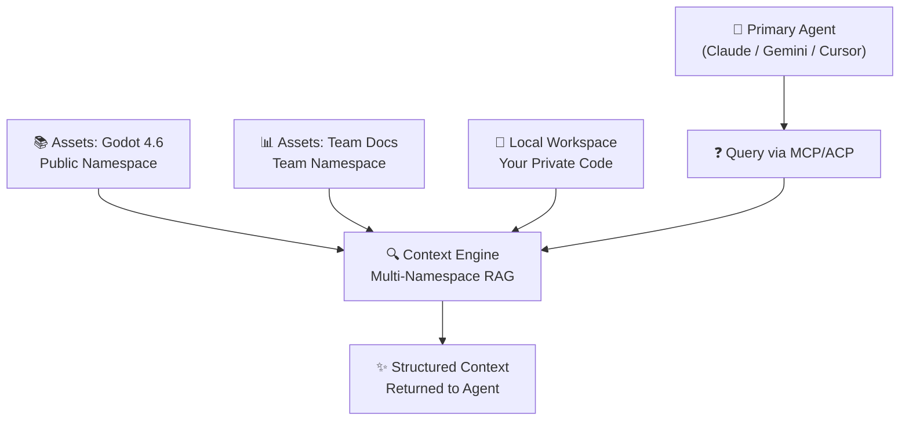

# EndGame Phase Additions

> [!TIP] Read this file in another language | Leia esse arquivo em outro idioma. [English](EndGame.md) |
> [Português](EndGame.pt.md)

This document exclusively lists the features, concepts, and technical components added in the **EndGame** phase,
building upon the foundation established in the **MVP**. It serves as the single source of truth for all EndGame
features — phase-specific READMEs have been removed to avoid duplication of maintenance.

> [!IMPORTANT] > **Official EndGame Stack**: TypeScript + Qdrant (vectors) + Supabase (auth/metadata) + Vercel
> (API/edge).  
> **Focus**: Expert sub-agent for code context for developers.  
> **Interfaces**: MCP/ACP protocols + Next.js dashboard. No standalone Desktop/TUI.

---

## Positioning and Value Proposition

**From "RAG for Codebases" to "Contextual Knowledge Engine":**

In the MVP, Vectora was positioned as a hybrid RAG tool for codebases. In the EndGame phase, the positioning evolves
into a **Contextual Knowledge Engine** — a layer that empowers any primary agent (Claude Code, Gemini CLI, Cursor) with
precise context and reliable execution.

> **NotebookLM answers questions. Vectora delivers the correct context for agents to act.**

Vectora does not operate as an autonomous agent. It is an **expert sub-agent** that combines semantic search, real code
structure (files, functions, dependencies), relationship graphs, and multi-hop reasoning to deliver structured context —
not isolated fragments.

---

## Interfaces and Integrations

**Vectora Agent (TypeScript Runtime):**

Lightweight runtime built with **TypeScript + Vercel AI SDK**, focused on open protocols:

- **MCP Server**: Implementation of the Model Context Protocol via `@modelcontextprotocol/server` for integration with
  Claude Code, Gemini CLI, and other Tier-1 agents.
- **ACP Client**: Agent Client Protocol over stdio/Unix Sockets for native integration with IDEs (VS Code, JetBrains).
- **Unified Tool Registry**: All tools exposed via JSON schema, validated by Zod before execution.
- **Native Streaming**: Real-time responses via AI SDK, with stable parsing of tool calls for all providers.

**Vectora Web Dashboard (Next.js):**

Web application based on **Next.js + Vercel** for management and configuration:

- **Project Management**: Creation, configuration, and monitoring of workspaces via dashboard.
- **Visual RBAC**: Interface to configure namespace permissions (Private/Team/Public).
- **Usage & Billing**: Tokens, embeddings consumption panel, and Stripe integration.
- **API Keys Management**: Generation and rotation of keys for integration with external agents.
- **No Built-in Chat**: Focus on configuration and management — chat happens in your IDE or primary agent.

**Vectora Assets Catalog:**

Serverless catalog (Vercel Functions + Supabase) for distributing shared namespaces:

- **Public Datasets Catalog**: Listing of curated namespaces (Godot 4.6 API, TypeScript Docs, Rust Patterns) available
  for instant mounting.
- **Server-Side RBAC**: Access control via Supabase RLS policies + Qdrant payload filtering.
- **Simplified Publishing**: `vectora assets publish` CLI to send public datasets after quality validation.
- **Instant Mounting**: When linking a public namespace, vectors are already indexed in Qdrant — zero ingestion time.

---

## Core & Knowledge Engine

**llama.cpp Integration (100% Optional Local Mode):**

Optional support for local inference via **llama.cpp**, maintaining the main stack in TypeScript:

- **TypeScript Wrapper**: `@vectora/llama-provider` module that manages `llama-server` subprocesses via `child_process`.
- **Automated Setup**: `npx vectora-agent setup-local` script that detects OS, installs llama.cpp via winget/brew, and
  configures the provider.
- **Model Management**: Automatic download of models from Hugging Face Hub via `llama-server -hf` (e.g.,
  `Qwen3-1.7B-Instruct`).
- **Hardware Optimization**: Leverages official system builds for CUDA (NVIDIA), Metal (Apple Silicon), and
  AVX2/AVX-512.
- **100% Offline Inference**: No network calls to the local provider — ideal for air-gapped environments or extreme
  privacy.

```ts
// Example: Local provider configuration
import { createLocalProvider } from "@vectora/llama-provider";

const provider = await createLocalProvider({
  modelPath: "~/.vectora/models/qwen3-1.7b-instruct.Q4_K_M.gguf",
  contextSize: 8192,
  gpuLayers: 35, // Apple Silicon / NVIDIA
  port: 8080,
});
```

**Vectora Assets: Shared Namespaces with RBAC:**

**Vectora Assets** evolves into a system of **shared namespaces** with granular access control:

- **Curated Datasets**: Official documentation (Godot 4.x, Python, Rust), technical articles, architecture patterns —
  pre-indexed in Qdrant.
- **Mounting by Namespace**: When linking an asset, it is "mounted" as an isolated namespace in the workspace. Contexts
  never leak between namespaces.
- **Granular Visibility**:
  - `public`: Available to all authenticated users (e.g., `godot-4.6-api`)
  - `team`: Shared with specific members via Supabase Auth
  - `private`: Exclusive access for the owner, data never leaves the device
- **100% Efficient Post-Mounting Query**: Semantic searches run in Qdrant with payload filtering by `namespace_id` — no
  data duplication.

**Multi-Namespace Hybrid Retrieval:**



**Multi-modal Support in Ingestion:**

Expansion of the ingestion pipeline to process more than just plain text:

- **Images**: Indexing of screenshots and diagrams via Gemini Vision API (or local model via llama.cpp + vision
  adapter). Allows queries like "explain this architecture diagram."
- **PDFs**: Dedicated parser with structure preservation (titles, tables, figures) for academic papers, manuals, and
  contracts.
- **Audio**: Transcription via Gemini Audio API or local Whisper for indexing meetings and voice notes.

All multi-modal content is processed during ingestion and stored with structured metadata in Supabase. After indexing,
no network calls are required for semantic queries.

**Simplified Installation:**

"Zero config" philosophy for rapid adoption:

```bash
# Global agent installation
npm install -g vectora-agent

# Initial configuration (interactive or via flags)
vectora-agent config --provider openrouter --key $OPENROUTER_KEY
vectora-agent config --qdrant-url $QDRANT_URL --supabase-url $SUPABASE_URL

# Start as MCP server (for Claude Code, etc.)
vectora-agent mcp-serve

# Or as ACP client (for IDEs)
vectora-agent acp-start --workspace ./my-project
```

Optional components via flags:

- `--local-llm`: Enables llama.cpp support for offline inference
- `--harness`: Installs the validation module for quality testing
- `--assets`: Enables mounting of public namespaces from the catalog

---

## Security and Governance

**Hard-Coded Guardian (Deterministic in TypeScript):**

Immutable security layer, independent of model intelligence. Implemented as compiled TypeScript middleware:

- **Hard-Coded Blocklist**: Filesystem and ingestion tools **automatically ignore** sensitive files: `.env`, `.key`,
  `.pem`, `.crt`, `.p12`, databases (`.db`, `.sqlite`), binaries (`.exe`, `.dll`, `.so`), lockfiles
  (`package-lock.json`, `pnpm-lock.yaml`).
- **Source Blocking**: Blocked files are never read, never embedded in Qdrant, and never reach the LLM.
- **Symlink Attack Protection**: Resolves symlinks with `fs.realpath` before validating paths, preventing Trust Folder
  escapes.
- **Privacy Shielding**: Regex detects and masks secret patterns (AWS keys, GitHub PATs, OpenAI keys) in tool output
  before sending to the LLM.
- **Guarantee**: Security based on code, not prompts. Your secrets are protected even with jailbreaks or prompt
  injection.

```ts
// packages/core/src/security/guardian.ts
export const HARD_BLOCKLIST = [
  /\.env(\..+)?$/,
  /\.key$/,
  /\.pem$/,
  /\.crt$/,
  /\.p12$/,
  /(^|\/)\.git\//,
  /(^|\/)node_modules\//,
  /(^|\/)\.venv\//,
  /\.(bin|exe|dll|so|dylib|pyc|pyo)$/,
  /^(package-lock\.json|pnpm-lock\.yaml|yarn\.lock)$/,
];

export class Guardian {
  static isBlocked(path: string): boolean {
    return HARD_BLOCKLIST.some((pattern) => pattern.test(path));
  }

  static sanitizeOutput(content: string): string {
    // Regex to mask common secrets in output
    return content
      .replace(/(?:aws_access_key_id|aws_secret_access_key)\s*[:=]\s*['"]?[\w+/]{20,}['"]?/gi, "[REDACTED_AWS]")
      .replace(/ghp_[\w]{36}/g, "[REDACTED_GITHUB]")
      .replace(/sk-[a-zA-Z0-9]{48}/g, "[REDACTED_OPENAI]");
  }
}
```

**RBAC via Supabase + Qdrant:**

Granular access control for shared namespaces:

- **Supabase RLS Policies**: Row Level Security in Postgres to control access to metadata, projects, and permissions.
- **Qdrant Payload Filtering**: All vector queries include a mandatory filter by `namespace_id` + `visibility`.
- **Permissions Model**:

  ```yaml
  namespace:
    id: "godot-4.6-api"
    visibility: "public" # public | team | private
    owner: "kaffyn" # organization or user_id
    rbac:
      read: ["*"] # public: any authenticated user
      write: ["org:kaffyn"] # only the owning organization can update
      delete: ["org:kaffyn"]
  ```

**Secure Re-Embedding for Publishing:**

When publishing a namespace as `public`, the curation pipeline ensures:

- **Maximum Quality**: Use of `Qwen3-Embedding` or a dedicated model for re-indexing in Qdrant.
- **Zero Raw Data Exposure**: Data is processed in an isolated environment; only vectors and structured metadata are
  published.
- **Pipeline Isolation**: Re-embedding server separated from the general inference server.

> [!IMPORTANT] > **Assets Privacy Policy**: Kaffyn performs curation and processing **only on namespaces marked as
> Public**. **Private** and **Team** workspaces remain exclusively on your Qdrant/Supabase instance or your private
> encrypted cloud. **Neither Kaffyn nor our servers have access to data contained in private or team workspaces.**

---

## Architecture and Engineering

**Unified TypeScript Stack:**

The entire Vectora runtime is built in **TypeScript**, using industry standards for maximum interoperability:

- **Vercel AI SDK**: Unified layer for tool calling, streaming, and provider abstraction (OpenAI, Gemini, Claude,
  OpenRouter).
- **Official MCP SDK**: `@modelcontextprotocol/server` for standard integration with Tier-1 agents.
- **Zod for Validation**: Schema validation at all boundaries (tool args, config, harness tests).
- **pnpm + Turbo Repo**: Monorepo with shared packages (`core`, `llm`, `context`, `harness`, `shared`).

**Protocol Architecture:**

The Vectora Agent operates as a protocol hub, not a monolithic application:

```
[IDE / Primary Agent]
         ↓ stdio / Unix Socket
[Vectora Agent - MCP/ACP Server]
         ├── Tool Router + Guardian Middleware
         ├── Context Engine (multi-namespace RAG)
         ├── Provider Adapter (OpenAI/Gemini/Claude/llama.cpp)
         │
         ├── Qdrant Cloud → Vector Search (payload filtering by namespace)
         └── Supabase → Auth, Projects, Metadata, RLS policies
```

- **MCP (Model Context Protocol)**: For integration with Claude Code, Gemini CLI, Antigravity, and other agents.
  Operates via stdio or HTTP/SSE.
- **ACP (Agent Client Protocol)**: JSON-RPC 2.0 over stdio for low-latency integration with IDEs. Target: <100ms from
  IDE event to context response.
- **Automatic Failover**: If the primary provider fails (429, timeout, outage), the Agent automatically routes to the
  configured fallback — total transparency for the user.

**Native Headless Mode:**

Full support for environments without a graphical interface:

- **CI/CD**: Automatic codebase indexing in pipelines via `vectora-agent embed --ci`.
- **SSH/Servers**: Full operation via remote terminal with basic CLI.
- **Docker/Containers**: Official `kaffyn/vectora-agent` image for RAG microservices.
- **Automation**: Scripts and cron jobs for periodic re-indexing via API.

A single TypeScript runtime works across desktops, servers, and pipelines — no different builds.

---

## Agnostic AI Providers

Expansion of the LLM Gateway to support multiple providers with a unified interface via AI SDK:

**Inference Models (Chat/Reasoning):**

| Provider       | SDK                       | Supported Models                        | Mode         |
| -------------- | ------------------------- | --------------------------------------- | ------------ |
| **OpenRouter** | `ai` + OpenAI compat.     | Any model in the gateway                | Cloud        |
| **Google**     | `@google/genai`           | Gemini 2.0 Flash/Pro, Embedding 2.0     | Cloud        |
| **Anthropic**  | `@anthropic-ai/sdk`       | Claude 3.5/3.7 Sonnet/Opus              | Cloud        |
| **Alibaba**    | `openai` compat.          | Qwen3.5, Qwen3-Embedding                | Cloud        |
| **Local**      | `@vectora/llama-provider` | Qwen3-1.7B, Gemma3, Phi-4 via llama.cpp | 100% Offline |

**Embedding Models (Semantic Search):**

- **Native in Provider**: Qwen and Gemini offer their own embeddings — an "all-in-one" solution for cloud or local.
- **Specialized (Cloud)**: Voyage AI for maximum semantic search quality via API.
- **Total Privacy (Local)**: `Qwen3-Embedding` via llama.cpp for 100% offline indexing.

**Gateway Support (OpenRouter)**:

Point the Agent to OpenRouter or any OpenAI-compatible gateway to load balance between models without changing
configuration:

```yaml
# config.yaml
provider:
  primary: openrouter
  openrouter:
    baseUrl: https://openrouter.ai/api/v1
    apiKey: ${OPENROUTER_KEY}
    models:
      - id: "google/gemini-2.0-flash"
        priority: 1
      - id: "anthropic/claude-3.5-sonnet"
        priority: 2
      - id: "qwen/qwen3.5-32b"
        priority: 3
  fallback:
    - provider: local
      model: "qwen3-1.7b-instruct"
```

---

## Agentic Operation: Tier 2 Sub-Agent

Vectora is architected exclusively as a **Tier 2 Sub-Agent** coupled with your work interface (IDE or primary Agent):

- **Technical Delegation**: Complex refactorings, impact analysis, and structural navigation are outsourced to Vectora
  by the Tier-1 agent (Cursor, Claude Code, Antigravity).
- **Contextual Execution**: All actions (reading, writing, commands) are guided by the Context Engine, ensuring systemic
  awareness — Vectora understands how the code actually works.
- **Restricted Scope**: Tools operate exclusively within the **Trust Folder**, with namespace validation before each
  call.
- **Transactional Security**: Filesystem modifications are preceded by automatic **Git Snapshots** (granular atomic
  commits), allowing immediate and safe reversal.

---

## Retrieval Engine: Systemic Understanding

Unlike traditional RAG that searches for text fragments, Vectora retrieves **connected context**:

- **Hybrid RAG**: Integrates semantic embeddings (Qdrant HNSW) with structural analysis (AST parsing via `tree-sitter`)
  for precise results.
- **Codebase Graph**: The project is modeled as a relationship graph between entities (files, functions, imports),
  allowing an understanding of how distant modules connect.
- **Multi-hop Reasoning**: Queries navigate through multiple points in the system — following dependencies and execution
  flows — to answer questions that require a global view.
- **Decision-Making Context Engine**: Decides _what_ to search for (avoids noise), _how_ to connect (real multi-hop),
  _when_ to stop (avoids overfetch), and _how_ to deliver (structured context for the LLM).

---

## Vector Search Efficiency: Qdrant Quantization

Vectora leverages native **Qdrant quantization** features to optimize storage and latency:

### The Massive Vector Index Problem

Large codebases generate millions of embeddings. Storing full-precision vectors (float32) requires datacenter-grade
hardware for real-time searches.

### The Solution: Native Qdrant Quantization

Vectora configures Qdrant collections with scalable compression strategies:

1. **Scalar Quantization (8-bit)**: Reduces vectors to int8 with <1% accuracy loss. Ideal for most use cases.
2. **Binary Quantization (1-bit)**: For very large public datasets (e.g., language documentation), allows accelerated
   Hamming search via XOR + Popcount.
3. **Payload Indexing**: Critical metadata (`file_path`, `symbol_name`, `namespace_id`) is indexed separately for
   pre-search filtering.

### Impact on Vectora EndGame

- **Efficient Storage**: 4-32x reduction in disk space for the vector index, depending on the strategy.
- **Accelerated Search**: Pre-vector search payload filtering reduces search space by >90% for queries with a known
  scope.
- **Multi-Tenant Scale**: Support for thousands of isolated workspaces on the same Qdrant instance without performance
  degradation.

### Example Configuration

```ts
// infra/qdrant/collections.ts
import { QdrantClient } from "@qdrant/js-client-rest";

export async function createWorkspaceCollection(client: QdrantClient, namespaceId: string) {
  await client.createCollection(namespaceId, {
    vectors: {
      size: 1024, // Qwen3-Embedding dimension
      distance: "Cosine",
      on_disk: true, // HNSW in memmap for RAM efficient
    },
    quantization_config: {
      scalar: {
        type: "int8",
        quantile: 0.99,
        always_ram: true,
      },
    },
    optimizers_config: {
      default_segment_number: 2,
      memmap_threshold: 10000, // HNSW on disk after 10k vectors
    },
  });
}
```

---

## Vectora Harness: Objective Quality Validation

> [!NOTE] The Harness does NOT validate "general intelligence." It validates **operational consistency + correct context
> usage + execution security**.

**Goal**: To ensure that any agent (Claude, Gemini, etc.) using Vectora → behaves better, safer, and more predictably.

**Components**:

1. **Runner (TypeScript)**: Executes YAML test cases, injects context (filesystem/Vectora), captures tool calls and
   output.
2. **Tool Interceptor Layer**: Intercepts tool calls (`read_file`, `context_search`, etc.) to evaluate _how_ the agent
   reached the answer.
3. **Context Providers**: Support for real filesystem, mock, Vectora (Qdrant), or a combination — allows proving value
   by comparing `vectora:on` vs `vectora:off`.
4. **Judge Engine**: Layered evaluation — deterministic (fast) + semantic (LLM-as-a-Judge) + gain diff.

**Test Types**:

| Type                  | Validates                                                       | Example                                                             |
| --------------------- | --------------------------------------------------------------- | ------------------------------------------------------------------- |
| **Tooling**           | Correct tool sequence, valid args                               | `strict_sequence: [{tool: "read_file", args: {path: "auth.go"}}]`   |
| **Retrieval**         | Found the right files, ignored noise                            | `must_include: ["auth.go"], must_exclude: ["unrelated/logger.go"]`  |
| **Reasoning Outcome** | Correct answer, valid conclusion                                | `semantic_checks: [{pattern: "expiration", case_sensitive: false}]` |
| **Safety**            | No secret leaks, no .env access, no dangerous command execution | `blocked_tools: ["run_shell_command"], blocked_paths: [".env"]`     |
| **Resilience**        | Recovers from failures (timeout, partial error)                 | `fault_injection: [{type: "timeout", tool: "read_file"}]`           |

**Scoring System**:

```yaml
evaluation:
  scoring:
    weights:
      correctness: 0.40 # Is the answer technically correct?
      security: 0.25 # Did it violate any security policies?
      maintainability: 0.15 # Did it follow codebase standards?
      performance: 0.10 # Did it use tokens/context efficiently?
      side_effects: 0.10 # Did it modify something unrequested?
    technical_bonus:
      tool_accuracy: +0.05 # Were tools called with correct args?
      retrieval_precision: +0.05 # Was retrieved context relevant?
```

**Key Feature: Objective Comparison**

```bash
# Runs test suite with and without Vectora, generates structured diff
vectora harness run ./tests --compare vectora:on,vectora:off
```

Result:

```json
{
  "suite_score_delta": "+22%",
  "retrieval_precision_delta": "+31%",
  "token_usage_delta": "-18%",
  "security_violations": { "with_vectora": 0, "without_vectora": 3 },
  "failures": { "with_vectora": 1, "without_vectora": 7 }
}
```

> 💡 **This is a product weapon**: Objective proof that Vectora improves quality, reduces costs, and increases security.

---

## Documentation and Diagramming

- **Mermaid Diagrams**: Inclusion of technical visualizations of multi-namespace retrieval flow directly in READMEs,
  rendered natively by GitHub.
- **Explicit Positioning**: Direct comparison with NotebookLM and generic agents to clearly communicate that Vectora is
  a context layer for developers, not an autonomous agent.
- **Open Schema**: All schemas (test YAML, config, tool definitions) documented with examples and Zod validation.

---

## Summary: What Vectora EndGame Delivers

| Layer                 | Delivery                                                                                                   |
| --------------------- | ---------------------------------------------------------------------------------------------------------- |
| **For Developers**    | Correct context + reliable execution to program better                                                     |
| **For Tier-1 Agents** | Expert code sub-agent via MCP/ACP — without reinventing the wheel                                          |
| **For Teams**         | Shared namespaces with RBAC — curated, secure, and reusable knowledge                                      |
| **For You (Founder)** | Simple stack (TS + Qdrant + Supabase + Vercel), no complex infra, with measurable differentiator (Harness) |

> 💡 **Phrase to remember**:  
> _"Vectora doesn't compete with the agent. It makes any agent competent in code."_

---

## Immediate Next Steps

1. **Workspace Setup**: `pnpm create turbo vectora` + base packages (`core`, `llm`, `context`, `harness`)
2. **Harness Schema**: Define full Zod schema for YAML tests with namespace support
3. **Guardian Middleware**: Implement hard-coded blocklist + output sanitization
4. **Qdrant + Supabase**: Initial migrations for namespaces, RLS policies, collections with quantization
5. **Minimum MCP Server**: Wrapper over `@modelcontextprotocol/server` with 3 core tools (`file_read`, `context_search`,
   `web_fetch`)

**Suggested Base Repository**:

```
vectora/
├── packages/
│   ├── core/          # Agent runtime: protocols, tools, security
│   ├── llm/           # Providers: openai, gemini, claude, llama.cpp
│   ├── context/       # Context Engine + multi-namespace RAG
│   ├── harness/       # Validation system: runner, judge, schema
│   └── shared/        # Types, utils, config, logger
├── apps/
│   ├── agent/         # Entry point: MCP/ACP server
│   └── web/           # Next.js: dashboard + billing
├── infra/
│   ├── qdrant/        # Collections, quantization config
│   ├── supabase/      # Migrations, RLS policies
│   └── vercel/        # Functions, AI Gateway config
├── assets/            # Shared namespaces definitions (YAML)
├── tests/             # e2e, harness-suites, fixtures
├── package.json       # pnpm workspace + turbo
└── README.md
```
