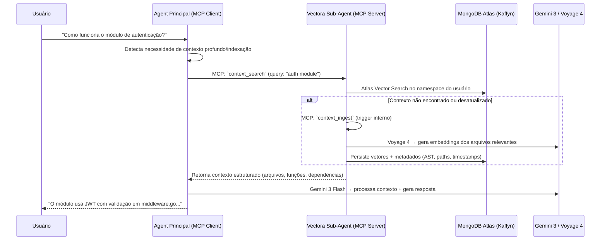

# Vectora — Modelo de Negócio, Planos e Operação

> [!IMPORTANT] > **Documento Oficial** | Especificação de planos, operação técnica e estratégia comercial do Vectora.  
> **Stack Validada**: `Gemini 3 Flash` (inferência) + `Voyage 4` (embeddings) + `MongoDB Atlas` (backend gerenciado)  
> **Arquitetura**: Sub-Agent 100% via MCP/ACP. **Sem interface de chat direto ao usuário.**  
> Versão: 1.6.0 | Última atualização: $(date +%Y-%m-%d)

---

## 🎯 Visão Geral do Modelo

> **Vectora é um sub-agent silencioso, exposto exclusivamente via MCP. Ele não conversa com usuários finais.**

Isso significa:

- ✅ **Zero interface de chat**: Não existe `vectora ask`, TUI ou app de conversação. Você conecta ao seu agent
  principal (Claude Code, Gemini CLI, Cursor, etc.) via MCP.
- ✅ **Delegação automática**: Seu agent principal detecta quando precisa de contexto profundo ou indexação e chama as
  tools MCP do Vectora.
- ✅ **Backend sempre gerenciado**: MongoDB Atlas (vetores + metadados + estado) provisionado e mantido pela Kaffyn em
  **todos os planos**.
- ✅ **BYOK First para API**: `Gemini 3 Flash` + `Voyage 4` usam suas chaves. Planos pagos adicionam quota gerenciada
  com fallback automático para BYOK.
- ✅ **Harness interno**: Valida a qualidade das tools MCP, precisão do RAG e segurança operacional — não é um teste de
  "chat".

---

## 🔄 Fluxo de Operação MCP (Como o Vectora Realmente Funciona)



> [!IMPORTANT] > **Vectora nunca responde ao usuário diretamente.**  
> Ele é um provedor de contexto e indexação sob demanda. O agent principal orquestra, o Vectora entrega contexto
> validado, o agent principal responde.

---

## 📊 Planos e Preços

### 🟢 Free (BYOK - Bring Your Own Key)

| Recurso               | Detalhes                                                                                                                   |
| --------------------- | -------------------------------------------------------------------------------------------------------------------------- |
| **Preço**             | $0/mês                                                                                                                     |
| **Inferência**        | Usuário fornece `GEMINI_API_KEY` (Google AI Studio free tier)                                                              |
| **Embeddings**        | Usuário fornece `VOYAGE_API_KEY` (Voyage AI free tier)                                                                     |
| **Backend**           | MongoDB Atlas gerenciado pela Kaffyn — **limite de 512MB de armazenamento total** (vetores + metadados + índices)          |
| **Interface**         | Exclusivamente via MCP. Sem CLI de chat, sem dashboard de conversação.                                                     |
| **Retenção de Dados** | ⚠️ **30 dias de inatividade = exclusão automática do índice vetorial**. Metadados preservados por 90 dias para exportação. |
| **Suporte**           | Comunidade (GitHub Discussions)                                                                                            |
| **Ideal para**        | Desenvolvedores individuais, validação técnica, testes pontuais via MCP                                                    |

> 💡 **Fluxo de Onboarding Free**:
>
> ```bash
> # 1. Instalar o runtime MCP
> npm install -g vectora-agent
>
> # 2. Obter chaves gratuitas
> # → https://aistudio.google.com/app/apikey
> # → https://dash.voyageai.com/api-keys
>
> # 3. Autenticar (provisiona backend gerenciado automaticamente)
> vectora auth login
>
> # 4. Configurar no seu agent principal (ex: Claude Desktop)
> # Adicionar ao mcpServers:
> {
>   "vectora": {
>     "command": "npx",
>     "args": ["vectora-agent", "mcp-serve"],
>     "env": { "VECTORA_API_KEY": "seu_token_kaffyn" }
>   }
> }
> # 5. Usar normalmente via seu agent principal
> ```

> [!WARNING] > **Política de Retenção - Plano Free**:
>
> - Conta inativa por **30 dias consecutivos** → índice vetorial excluído automaticamente
> - Cancelamento de upgrade → notificação de redução de limites → se exceder novo limite após 7 dias → exclusão de dados
>   excedentes
> - Exportação de dados disponível via `vectora export` a qualquer momento

---

### 🔵 Pro (~$20/mês ou $0.10/1k tokens)

| Recurso               | Detalhes                                                                                                   |
| --------------------- | ---------------------------------------------------------------------------------------------------------- |
| **Preço**             | $20/mês **ou** pay-as-you-go ($0.10/1k tokens + $0.05/1k vetores)                                          |
| **Inferência**        | Quota gerenciada: 500k tokens/mês (`Gemini 3 Flash`)                                                       |
| **Embeddings**        | Quota gerenciada: 100k vetores/mês (`Voyage 4`)                                                            |
| **Backend**           | MongoDB Atlas gerenciado pela Kaffyn — **limite de 10GB de armazenamento total**                           |
| **Fallback BYOK**     | ✅ Quando a quota de API esgota, usa automaticamente as chaves BYOK do usuário                             |
| **Namespaces**        | `private` + `public` (assets curados montáveis via MCP)                                                    |
| **Retenção de Dados** | Dados preservados enquanto a assinatura estiver ativa. Cancelamento → 90 dias de retenção para exportação. |
| **Dashboard**         | Usage tracking, billing, gestão de API keys, alertas de quota                                              |
| **Suporte**           | Email prioritário + documentação premium                                                                   |
| **Ideal para**        | Desenvolvedores profissionais que querem quota de API gerenciada + zero configuração                       |

> 💡 **Fluxo de Fallback Automático**:
>
> ```
> 1. Agent Principal → chama Vectora via MCP
> 2. Vectora detecta quota de API esgotada
> 3. Roteia silenciosamente para BYOK do usuário (Gemini/Voyage)
> 4. Contexto retornado ao Agent Principal sem interrupção
> 5. Notificação: "🔁 Quota esgotada. Fallback BYOK ativado."
> ```

---

### 🟣 Team ($5 base + $15/usuário/mês)

| Recurso                  | Detalhes                                                                                             |
| ------------------------ | ---------------------------------------------------------------------------------------------------- |
| **Preço**                | **$5/mês base + $15/usuário/mês** + consumo excedente de API                                         |
| **Exemplo**              | Time com 5 devs: $5 + (5 × $15) = **$80/mês**                                                        |
| **Inferência/Embedding** | Pool compartilhado de quota de API (`Gemini 3 Flash` + `Voyage 4`)                                   |
| **Backend**              | MongoDB Atlas dedicado (VPC peering, índices otimizados) — **limite de 50GB de armazenamento total** |
| **Fallback BYOK**        | ✅ Cada usuário pode configurar BYOK pessoal como fallback individual                                |
| **RBAC Aplicativo**      | Roles na camada de aplicação: `reader`, `contributor`, `admin`, `auditor`                            |
| **Namespaces**           | `private` + `team` + `public` + `shared` (cross-projects via `orgId`)                                |
| **Audit Logs**           | Persistidos no MongoDB, retenção configurável (padrão: 90 dias)                                      |
| **SSO/SAML**             | Integração via camada de aplicação (Okta, Auth0, Azure AD)                                           |
| **Harness Centralizado** | Suites de validação MCP em CI/CD com relatórios compartilhados                                       |
| **Retenção**             | 180 dias pós-cancelamento para exportação controlada                                                 |
| **Suporte**              | Email prioritário + SLA <24h                                                                         |
| **Ideal para**           | Equipes de 3-50 desenvolvedores que precisam de contexto compartilhado seguro e custo previsível     |

> 💡 **Por que $5 base + $15/usuário?**
>
> - **Baixa barreira de entrada**: Times pequenos pagam pouco ($5 + $15 = $20/mês para 1 usuário adicional)
> - **Escalabilidade justa**: Cresce linearmente com o time, sem saltos bruscos de preço
> - **Competitivo**: Comparado a ferramentas similares ($20-30/usuário), Vectora Team oferece mais por menos
> - **Previsibilidade**: Base fixa baixa + per-user claro = fácil de orçar

---

### ⚫ Enterprise (Sob consulta)

| Recurso               | Detalhes                                                                                |
| --------------------- | --------------------------------------------------------------------------------------- |
| **Preço**             | Custom (contato comercial)                                                              |
| **Deploy**            | MongoDB Atlas Dedicated ou arquitetura híbrida com VPC privada                          |
| **Conformidade**      | SOC 2, GDPR, HIPAA-ready (Encryption at Rest + Field-Level Encryption + VPC)            |
| **Custom Models**     | Fine-tuning de embeddings para domínio específico                                       |
| **Dedicated Harness** | Ambiente isolado de validação                                                           |
| **SLA**               | 99.99% com créditos de serviço                                                          |
| **Retenção de Dados** | Política custom definida pelo cliente (incluindo retenção perpétua com custo adicional) |
| **Suporte**           | Gerente de conta dedicado + suporte 24/7                                                |

---

## ⚙️ Operação Técnica: Como os Planos Funcionam

### Arquitetura MCP-First

```
[Agent Principal] (Claude Code, Gemini CLI, Cursor, etc.)
         ↓ MCP Protocol (stdio/HTTP)
[Vectora MCP Server] (TypeScript Runtime)
         ├── Tool Router + Guardian (segurança na aplicação)
         ├── Context Engine (decide search vs ingest)
         ├── Provider Adapter (Gemini 3 Flash + Voyage 4)
         │
         └── MongoDB Atlas (Backend Gerenciado Kaffyn)
               ├── Vector Search Index (embeddings + HNSW)
               ├── Documents Collection (metadata, AST, paths)
               ├── State Collection (sessões MCP, cache de contexto)
               └── Audit Collection (tool calls, decisões de indexação)
```

> [!IMPORTANT] > **Posicionamento Correto**:
>
> - **MongoDB Atlas** = infraestrutura de armazenamento (vetores + documentos + estado). Não é provedor de segurança.
> - **Segurança** = implementada na camada de aplicação: `Guardian` (blocklist hard-coded), `RBAC Logic` (validação de
>   namespace), `Privacy Shielding` (sanitização).
> - O banco armazena; a aplicação decide o que pode ser indexado, buscado ou retornado via MCP.

### Configuração por Plano (`config.yaml`)

```yaml
provider:
  inference:
    type: "gemini"
    model: "gemini-3-flash"
    api_key: "${GEMINI_API_KEY}" # BYOK (obrigatório em todos os planos)

  embedding:
    type: "voyage"
    model: "voyage-4"
    api_key: "${VOYAGE_API_KEY}" # BYOK (obrigatório em todos os planos)

backend:
  # Sempre gerenciado pela Kaffyn - URI injetada via auth
  managed: true
  mongodb:
    database: "vectora"
    collections:
      vectors: "embeddings"
      metadata: "documents"
      state: "agent_state"
      audit: "audit_logs"

quota:
  managed: true # Quota gerenciada de API (não de backend)
  plan: "pro" # free | pro | team | enterprise

  api_limits: # Limites de chamadas de API (Gemini/Voyage)
    inference_tokens: 500000 # Pro
    embedding_vectors: 100000 # Pro
    # Team: limites compartilhados por org, escaláveis sob demanda
    overage_rate:
      inference_per_1k: 0.10
      embedding_per_1k: 0.05

  fallback:
    enabled: true
    use_byok_on_exhaust: true # Usa chaves do usuário se quota de API esgotar
    notify_thresholds: [0.75, 0.90, 1.0]
    notify_channels: ["cli", "dashboard", "email"]

storage:
  # Limite unificado por armazenamento total (vetores + metadata + índices)
  limits:
    free: { total_mb: 512 }
    pro: { total_mb: 10240 }
    team: { total_mb: 51200 }
    enterprise: { total_mb: -1 } # ilimitado, sob contrato

  retention:
    free:
      inactivity_days: 30 # 30 dias sem uso = exclusão do índice vetorial
      export_grace_days: 90 # 90 dias para exportar dados após exclusão
    pro:
      cancellation_grace_days: 90
    team:
      cancellation_grace_days: 180
    enterprise: custom

team:
  # Configurações específicas do plano Team
  base_price: 5
  per_user_price: 15
  min_users: 1
  max_users: 50 # Acima disso, contatar Enterprise
  shared_quota:
    inference_tokens: 2000000 # Pool compartilhado para o time
    embedding_vectors: 400000
```

### Lógica de Fallback de API (TypeScript)

```ts
// packages/core/src/providers/quota-router.ts
export class QuotaRouter {
  private usage: { inference: number; embedding: number };
  private apiLimits: { inference: number; embedding: number };
  private managedKeys: { gemini?: string; voyage?: string };
  private byokKeys: { gemini: string; voyage: string };
  private plan: "free" | "pro" | "team" | "enterprise";

  constructor(config: ProviderConfig) {
    this.plan = config.quota?.plan ?? "free";
    this.apiLimits = config.quota?.api_limits ?? { inference: 0, embedding: 0 };
    this.managedKeys = config.managedApiKeys ?? {};
    this.byokKeys = {
      gemini: config.geminiApiKey!,
      voyage: config.voyageApiKey!,
    };
  }

  getInferenceClient(): GeminiProvider {
    const apiKey = this.shouldUseManagedApi("inference") ? this.managedKeys.gemini : this.byokKeys.gemini;
    if (!apiKey) throw new Error("GEMINI_API_KEY required");
    return new GeminiProvider(apiKey, "gemini-3-flash");
  }

  getEmbeddingClient(): VoyageProvider {
    const apiKey = this.shouldUseManagedApi("embedding") ? this.managedKeys.voyage : this.byokKeys.voyage;
    if (!apiKey) throw new Error("VOYAGE_API_KEY required");
    return new VoyageProvider(apiKey, "voyage-4");
  }

  private shouldUseManagedApi(type: "inference" | "embedding"): boolean {
    if (this.plan === "free") return false;
    if (!this.managedKeys[type === "inference" ? "gemini" : "voyage"]) return false;
    if (this.usage[type] >= this.apiLimits[type]) return false;
    return true;
  }

  trackApiUsage(type: "inference" | "embedding", cost: number): void {
    this.usage[type] += cost;
    const ratio = this.usage[type] / this.apiLimits[type];
    if (this.apiLimits[type] > 0 && [0.75, 0.9, 1.0].includes(ratio)) {
      this.notifyUser(type, ratio);
    }
  }

  private notifyUser(type: string, ratio: number): void {
    const message =
      ratio >= 1.0
        ? `⚠️ Quota de API ${type} esgotada. Usando sua chave BYOK como fallback.`
        : `🔋 Quota de API ${type} em ${(ratio * 100).toFixed(0)}%. Prepare fallback.`;
    console.warn(message);
  }
}
```

---

## 🛡️ Segurança e Governança (Camada de Aplicação)

| Camada                       | Implementação                                                                       | Responsabilidade                             |
| ---------------------------- | ----------------------------------------------------------------------------------- | -------------------------------------------- |
| **Blocklist Hard-Coded**     | `Guardian.ts`: regex compilados para `.env`, `.key`, `.pem`, binários, lockfiles    | Aplicação (não configurável, não bypassável) |
| **Validação de Namespace**   | Middleware verifica `userId`/`teamId` antes de `context_search` ou `context_ingest` | Aplicação (RBAC lógico)                      |
| **Sanitização de Output**    | Mascaramento de segredos antes de retornar contexto ao agent principal              | Aplicação                                    |
| **Trust Folder Enforcement** | Validação de paths via `fs.realpath` + escopo autorizado                            | Aplicação                                    |
| **Criptografia em Repouso**  | MongoDB Atlas AES-256                                                               | Infraestrutura (Kaffyn)                      |
| **Criptografia em Trânsito** | TLS 1.3 (MCP ↔ Vectora ↔ MongoDB)                                                 | Infraestrutura + Aplicação                   |
| **Audit Logs**               | Registro de tool calls MCP, decisões de ingestão, erros de quota                    | Aplicação + Armazenamento                    |

> [!IMPORTANT] > **Política de Privacidade**: A Kaffyn **nunca acessa o conteúdo** dos workspaces privados. Logs
> armazenam apenas metadados de operação MCP (`tool`, `timestamp`, `status`, `namespace`), jamais queries, código ou
> embeddings brutos.

---

## 🔄 Migração, Retenção e Gestão de Dados

### Inatividade no Plano Free

```
Dia 0: Último uso do Vectora (chamada MCP bem-sucedida)
Dia 30: Notificação: "Conta inativa há 30 dias. Índice vetorial será excluído em 24h."
Dia 31: Exclusão automática do índice vetorial (embeddings removidos do Atlas)
Dia 31-120: Metadados preservados para exportação (`vectora export`)
Dia 121: Exclusão completa se não houver nova atividade ou exportação
```

### Downgrade Pro/Team → Free

```bash
# 1. Cancela/altera plano no dashboard
# 2. Sistema notifica: "Limite reduzido para 512MB de armazenamento total.
#    Uso atual: X MB. Excedentes serão excluídos em 7 dias se não exportados."
# 3. Usuário executa: `vectora export --output ./backup`
# 4. Após 7 dias: exclusão automática de dados excedentes
# 5. Dados dentro do limite free permanecem disponíveis para MCP
```

### Team: Adicionar/Remover Membro

```bash
# Admin adiciona membro via dashboard ou CLI
vectora team invite --email dev@empresa.com --role contributor

# Membro recebe email com link de onboarding
# → Cria conta Kaffyn → Configura BYOK (obrigatório como fallback)
# → Ganha acesso aos namespaces do time via validação de teamId

# Remoção é imediata:
vectora team remove --email dev@empresa.com
# → Revoga acesso a namespaces team/shared
# → Dados pessoais do usuário permanecem privados (isolados por userId)
```

---

## 📈 Roadmap Comercial

### Q2 2026 (MVP)

- [x] Runtime MCP sub-agent (TypeScript)
- [x] BYOK para Gemini 3 Flash + Voyage 4
- [x] MongoDB Atlas gerenciado (Vector Search + collections)
- [x] Harness interno para validação de tools MCP e contexto
- [x] Sistema de retenção Free (30 dias inatividade)
- [ ] Dashboard básico (usage + alertas de quota)

### Q3 2026 (Pro Beta)

- [ ] Quota gerenciada de API + fallback BYOK automático
- [ ] Stripe billing + alertas de armazenamento
- [ ] Catálogo de namespaces públicos (`godot-4.6-api`, `typescript-docs`)
- [ ] MongoDB Atlas Triggers para indexação assíncrona sob demanda
- [ ] Exportação simplificada (`vectora export`)

### Q4 2026 (Team GA)

- [ ] Pricing Team: $5 base + $15/usuário
- [ ] RBAC avançado na camada de aplicação
- [ ] Harness centralizado CI/CD
- [ ] SSO/SAML integration
- [ ] SLA 99.9% backend gerenciado
- [ ] Audit logs exportáveis

### 2027+

- [ ] Enterprise: VPC privada / arquitetura híbrida
- [ ] Marketplace de namespaces pagos
- [ ] Expansão para novos providers **apenas se calibrados no Harness**

---

## ❓ FAQ Comercial

**P: Posso conversar diretamente com o Vectora?**  
R: Não. Vectora é um sub-agent silencioso exposto via MCP. Você interage com seu agent principal (Claude Code, Gemini
CLI, Cursor, etc.), que delega automaticamente tarefas de contexto, busca semântica e indexação ao Vectora. Não há
`vectora ask`, chat ou interface de conversação.

**P: No plano Free, eu preciso configurar meu próprio MongoDB?**  
R: Não. O backend é gerenciado pela Kaffyn em todos os planos. No Free, você tem 512MB de armazenamento total (vetores +
metadados + índices). Zero configuração de infra.

**P: O que acontece se eu ficar 30 dias sem usar o Vectora no plano Free?**  
R: O índice vetorial será excluído automaticamente. Metadados preservados por +90 dias para exportação. Basta reconectar
via MCP para restaurar o índice (indexação sob demanda).

**P: Por que o fallback é apenas para API e não para backend?**  
R: Porque o backend (MongoDB Atlas) é parte central da proposta: zero gestão de infra. Permitir que o usuário gerencie
seu próprio banco introduziria complexidade, riscos de segurança e inconsistências de índice. O fallback aplica-se às
chaves de API externas (Gemini/Voyage).

**P: Como funciona o pricing do plano Team?**  
R: Simples: **$5/mês base + $15 por usuário/mês**. Exemplo: time com 5 devs = $5 + (5 × $15) = $80/mês. Inclui quota
compartilhada de API, 50GB de armazenamento total, RBAC, audit logs e suporte prioritário.

**P: A segurança dos meus dados depende do MongoDB?**  
R: Não. A segurança é implementada na camada de aplicação: `Guardian` (blocklist hard-coded), validação de namespace por
`userId`/`teamId`, e sanitização de output. O MongoDB armazena; a aplicação controla acesso e processamento.

**P: E se o Google ou Voyage mudarem preços/limites?**  
R: Notificação com 30 dias. Fallback BYOK obrigatório garante controle total sobre custos de API.

---

## 📄 Termos Comerciais Resumidos

| Item                     | Política                                                                           |
| ------------------------ | ---------------------------------------------------------------------------------- |
| **Faturamento**          | Mensal. Anual = 2 meses grátis (Pro/Team)                                          |
| **Cancelamento**         | Imediato. Acesso até fim do ciclo. Notificação de redução de limites no downgrade. |
| **Reembolso**            | 7 dias para planos pagos, proporcional ao não utilizado                            |
| **Mudança de Preço**     | 60 dias de aviso. Aplica-se apenas a renovações/novas assinaturas                  |
| **Propriedade de Dados** | 100% do usuário. Exportação disponível a qualquer momento via `vectora export`     |
| **Retenção - Free**      | 30 dias inatividade = exclusão índice vetorial. +90 dias exportação metadados.     |
| **Retenção - Pago**      | 90 dias (Pro) / 180 dias (Team) pós-cancelamento                                   |
| **Responsabilidade**     | Serviço "como está". Pro+: SLA com créditos se indisponibilidade >0.1% mensal      |

---

> 💡 **Frase para o site/docs**:  
> _"Vectora não responde ao usuário. Ele entrega contexto ao seu agent. Backend gerenciado, API sob sua chave, segurança
> na aplicação, dados sempre seus. Team: $5 base + $15/usuário — escale sem surpresas."_

---

_Parte do ecossistema Vectora · Open Source · TypeScript_  
_Backend Unificado: MongoDB Atlas (vetores + metadados + estado) — gerenciado pela Kaffyn_  
_Modelo de Inferência: Gemini 3 Flash | Embeddings: Voyage 4_  
_Interface: Exclusivamente MCP/ACP. Sub-agent silencioso._  
_Segurança: Camada de aplicação (Guardian + RBAC lógico) + criptografia de infra_  
_Limites de Storage: 512MB (Free) / 10GB (Pro) / 50GB (Team)_  
_Versão: 1.6.0 | Próxima revisão: Q3 2026_
