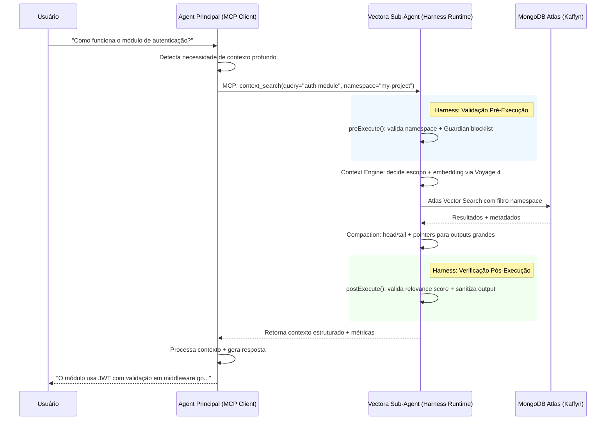

# Vectora

> [!TIP]
> Read this file in another language | Leia esse arquivo em outro idioma.
> [English](README.md) | [Português](README.pt.md)

> [!NOTE]
> **Contexto correto + execução confiável para desenvolvedores.**
> O sub-agent especialista que potencializa qualquer agent principal em codebases reais.

---

## 🎯 O Que é o Vectora

> **Vectora não é um agent autônomo. É a camada que faz qualquer agent funcionar melhor em código.**

Agents tradicionais operam em contexto fragmentado. O Vectora entrega **contexto conectado**:

- ✅ Busca semântica via **Voyage 4** + MongoDB Atlas Vector Search
- ✅ Estrutura de código (arquivos, funções, dependências) com AST parsing
- ✅ Namespaces isolados com RBAC na aplicação (não no banco)
- ✅ Raciocínio multi-hop com **Context Engine** inteligente
- ✅ Segurança por código: **Guardian** hard-coded (.env, .key, .pem nunca processados)

**Resultado**: Agents que entendem como seu sistema realmente funciona — não apenas trechos isolados.

> [!IMPORTANT] **Stack Curada**: Vectora opera exclusivamente com `Gemini 3` (inferência) + `Voyage 4`
> (embeddings/reranking).  
> Isso não é uma limitação — é uma garantia de qualidade, consistência e manutenção focada.

---

## ✨ Destaques

| Recurso                        | Descrição                                                                                                         | Por que importa                                               |
| ------------------------------ | ----------------------------------------------------------------------------------------------------------------- | ------------------------------------------------------------- |
| **Sub-Agent via MCP**          | Integra-se silenciosamente a Claude Code, Gemini CLI, Cursor — sem competir, apenas potencializando               | Zero atrito de adoção; você mantém seu agent principal        |
| **Context Engine Inteligente** | Decide _o que_, _como_ e _quando_ buscar; aplica compaction para evitar context rot [[28]]                        | Menos tokens, respostas mais rápidas, menos ruído             |
| **Harness Runtime**            | Infraestrutura que conecta o LLM ao mundo real: tool execution, state management, verification hooks [[16]]       | Governança ativa, não validação post-hoc                      |
| **Guardian Hard-Coded**        | Blocklist imutável (.env, .key, .pem, binários) executada antes de qualquer tool call                             | Segurança por código, não por prompt — impossível de bypassar |
| **Backend Unificado**          | MongoDB Atlas gerenciado pela Kaffyn: vetores + metadados + estado em uma única plataforma                        | Zero gestão de infra para o usuário; escala automática        |
| **BYOK + Fallback**            | Você fornece `GEMINI_API_KEY` + `VOYAGE_API_KEY`; planos pagos adicionam quota gerenciada com fallback automático | Controle total sobre custos; zero vendor lock-in              |
| **Retenção Transparente**      | Free: 30 dias inatividade = exclusão do índice vetorial; metadados preservados 90 dias para exportação            | Recursos justos para todos; exportação sempre disponível      |

---

## 🏗️ Arquitetura Atual

```text
[Agent Principal] (Claude Code, Gemini CLI, Cursor, etc.)
         ↓ MCP Protocol (stdio)
[Vectora Sub-Agent] (TypeScript Runtime)
         ├── Tool Execution Layer
         │   • Intercepta tool calls MCP
         │   • Valida args via Zod
         │   • Sanitiza output (Guardian)
         │
         ├── Context Engine
         │   • Decide escopo: filesystem / vector / hybrid
         │   • Embedding via Voyage 4
         │   • Compaction: head/tail + pointers
         │   • Namespace isolation (RBAC na aplicação)
         │
         ├── Provider Router (Stack Curada)
         │   • Gemini 3 SDK (@google/genai)
         │   • Voyage 4 SDK (voyageai)
         │   • Fallback: gemini-embedding-2
         │   • Quota tracking + BYOK fallback
         │
         └── State & Memory
             • Persiste sessões no MongoDB Atlas
             • AGENTS.md para continual learning [[16]]
             • Audit logs (metadados apenas)
                   ↓
         [MongoDB Atlas] (Gerenciado pela Kaffyn)
             • Vector Search Index (HNSW + filtros por namespace)
             • Documents Collection (metadata, AST, paths)
             • State Collection (sessões, memória operacional)
             • Audit Collection (tool calls, decisões)
```

> [!IMPORTANT] **Posicionamento Correto**:
>
> - **MongoDB Atlas** = infraestrutura de armazenamento (vetores + documentos + estado).
> - **Segurança** = implementada na aplicação: `Guardian` (blocklist), `RBAC Logic` (validação de namespace),
>   `Privacy Shielding` (sanitização).
> - O banco armazena; a aplicação decide o que pode ser indexado, buscado ou retornado via MCP.

---

## 🔌 Integração via MCP (Única Interface)

Vectora é exposto **exclusivamente via Model Context Protocol (MCP)**. Não há CLI de chat, TUI ou app de conversação.

### Configuração no Claude Desktop

```json
{
  "mcpServers": {
    "vectora": {
      "command": "npx",
      "args": ["vectora-agent", "mcp-serve"],
      "env": {
        "VECTORA_API_KEY": "seu_token_kaffyn",
        "GEMINI_API_KEY": "${GEMINI_API_KEY}",
        "VOYAGE_API_KEY": "${VOYAGE_API_KEY}"
      }
    }
  }
}
```

### Fluxo de Operação



> 💡 **Insight**: O Harness intercepta **duas vezes** por tool call: antes (validação) e depois (self-verification).
> Isso é harness engineering, não testing. [[19]]

---

## 🧩 Tools MCP Disponíveis

Todas as tools são expostas via schema JSON, validadas por Zod antes da execução.

### Filesystem & Code

| Tool          | Descrição                                           | Escopo                   |
| ------------- | --------------------------------------------------- | ------------------------ |
| `file_read`   | Leitura paginada de arquivos (suporta grandes)      | Trust Folder + namespace |
| `file_write`  | Escrita controlada com Git snapshot automático      | Trust Folder + namespace |
| `file_edit`   | Patching cirúrgico sem reescrever o arquivo inteiro | Trust Folder + namespace |
| `file_list`   | Listagem recursiva com metadados de estrutura       | Trust Folder + namespace |
| `file_find`   | Busca por glob patterns (`**/*.ts`, `src/**/*.tsx`) | Trust Folder + namespace |
| `grep_search` | Busca regex via ripgrep com filtros e limite        | Trust Folder + namespace |

### Context & RAG

| Tool             | Descrição                                     | Diferencial                             |
| ---------------- | --------------------------------------------- | --------------------------------------- |
| `context_search` | Busca semântica + estrutural no codebase      | Context Engine decide o que/como buscar |
| `context_ingest` | Indexação sob demanda de arquivos/diretórios  | Voyage 4 + compaction inteligente       |
| `context_build`  | Composição de contexto estruturado para o LLM | Evita overfetch, entrega só o relevante |

### System & Memory

| Tool          | Descrição                                                  | Uso                                             |
| ------------- | ---------------------------------------------------------- | ----------------------------------------------- |
| `memory_save` | Persistência de fatos/preferências (global ou por projeto) | Isolado por namespace, criptografado em repouso |
| `plan_mode`   | Modo estruturado para validar plano antes de executar      | UX para revisão humana de ações complexas       |

> [!IMPORTANT] **Hard-Coded Guardian**: Todas as tools validam paths contra blocklist imutável (`.env`, `.key`, `.pem`,
> binários, lockfiles). Arquivos bloqueados **nunca** são lidos, embedados ou enviados ao LLM — independente do prompt
> ou provider.

---

## 🔐 Segurança por Design (Na Aplicação, Não no Banco)

### Guardian: Blocklist Hard-Coded

```ts
// packages/core/src/security/guardian.ts
export const HARD_BLOCKLIST = [
  /\.env(\..+)?$/,
  /\.key$/,
  /\.pem$/,
  /\.crt$/,
  /\.p12$/,
  /(^|\/)\.git\//,
  /(^|\/)node_modules\//,
  /(^|\/)\.venv\//,
  /\.(bin|exe|dll|so|dylib|pyc|pyo)$/,
  /^(package-lock\.json|pnpm-lock\.yaml|yarn\.lock)$/,
];

export class Guardian {
  static isBlocked(path: string): boolean {
    return HARD_BLOCKLIST.some((pattern) => pattern.test(path));
  }

  static sanitizeOutput(content: string): string {
    return content
      .replace(/(?:aws_access_key_id|aws_secret_access_key)\s*[:=]\s*['"]?[\w+/]{20,}['"]?/gi, "[REDACTED_AWS]")
      .replace(/ghp_[\w]{36}/g, "[REDACTED_GITHUB]")
      .replace(/sk-[a-zA-Z0-9]{48}/g, "[REDACTED_OPENAI]");
  }
}
```

### RBAC na Aplicação (Não no Banco)

```ts
// packages/core/src/rbac.ts
export function validateNamespace(requestedPath: string, userNamespace: string): boolean {
  // Trust Folder: path deve estar dentro do escopo autorizado
  const resolved = fs.realpathSync(requestedPath);
  const allowedRoot = `/namespaces/${userNamespace}/`;
  return resolved.startsWith(allowedRoot) && !Guardian.isBlocked(requestedPath);
}
```

| Camada           | Implementação                                               | Por que na aplicação                                       |
| ---------------- | ----------------------------------------------------------- | ---------------------------------------------------------- |
| **Blocklist**    | `Guardian.ts`: regex compilados para `.env`, `.key`, `.pem` | O banco não sabe o que é "sensível" — só a aplicação       |
| **Trust Folder** | Validação de paths com `fs.realpath` + escopo por namespace | RBAC no banco é por usuário, não por contexto de execução  |
| **Sanitização**  | Mascaramento de segredos antes de retornar ao LLM           | O LLM não pode "desaprender" o que viu — prevenir é melhor |
| **Git Snapshot** | Hook pré-escrita que cria commit atômico                    | Versionamento é lógica de aplicação, não storage           |

> [!IMPORTANT] **Política de Privacidade**: A Kaffyn **nunca acessa o conteúdo** dos workspaces privados. Logs armazenam
> apenas metadados de operação MCP (`tool`, `timestamp`, `status`, `namespace`), jamais queries, código ou embeddings
> brutos.

---

## 🤖 Stack Curada: Por Que Apenas Gemini + Voyage?

Vectora **não é provider-agnóstico**. Operamos exclusivamente com:

| Componente             | Modelo Curado                       | Provider  | BYOK Obrigatório    |
| ---------------------- | ----------------------------------- | --------- | ------------------- |
| **LLM (Inferência)**   | `gemini-3-flash` / `gemini-3.1-pro` | Google AI | ✅ `GEMINI_API_KEY` |
| **Embedding**          | `voyage-4-code`                     | Voyage AI | ✅ `VOYAGE_API_KEY` |
| **Reranker**           | `voyage-rerank-3`                   | Voyage AI | ✅ (mesma chave)    |
| **Fallback Embedding** | `gemini-embedding-2`                | Google AI | ✅ (mesma chave)    |

### Por Que Essa Escolha?

| Razão                       | Impacto                                                                                                            |
| --------------------------- | ------------------------------------------------------------------------------------------------------------------ |
| **Harness calibrado**       | LLM-as-a-Judge usa `gemini-3-flash` com temperatura 0.1 → scores comparáveis ao longo do tempo                     |
| **Embeddings consistentes** | `voyage-4-code` usa dimensão fixa (1024) → índice MongoDB criado uma vez, nunca quebra                             |
| **Tool calling estável**    | Gemini 3 tem schema de functions documentado → parsing determinístico, sem quirks de providers múltiplos           |
| **Custo previsível**        | Dois providers = duas faturas. Simplicidade operacional máxima.                                                    |
| **Qualidade comprovada**    | `gemini-3-flash` para raciocínio rápido + `voyage-4-code` para embeddings de código = combo validado em benchmarks |

> 💡 **Posicionamento claro**:  
> _"Vectora não é um gateway genérico de LLMs. É um sub-agent calibrado para Gemini 3 + Voyage 4. Isso garante que nosso
> Harness prove qualidade de forma consistente — e que você tenha uma experiência previsível, do free tier ao
> enterprise."_

### Fallback Automático (Mesmo Provider, Mesma Chave)

```ts
// packages/core/src/providers/embedding-router.ts
export async function embedWithFallback(query: string, config: ProviderConfig): Promise<EmbeddingResult> {
  try {
    return await voyage.embed(query, { model: "voyage-4-code" });
  } catch (error) {
    if (error.code === "SERVICE_UNAVAILABLE" || error.code === "RATE_LIMITED") {
      logger.warn("Voyage unavailable, falling back to Gemini embedding");
      return await gemini.embed(query, { model: "gemini-embedding-2" });
    }
    throw error;
  }
}
```

---

## 🚀 Quick Start

### Instalação

```bash
# Instale globalmente via npm
npm install -g vectora-agent

# Verifique a instalação
vectora-agent --version
```

### Configuração (BYOK Obrigatório)

```bash
# Obter chaves gratuitas
# → https://aistudio.google.com/app/apikey (Gemini)
# → https://dash.voyageai.com/api-keys (Voyage)

# Configurar Vectora
vectora config --gemini $GEMINI_API_KEY --voyage $VOYAGE_API_KEY

# Autenticar (provisiona backend MongoDB gerenciado automaticamente)
vectora auth login
```

### Integração com Seu Agent Principal

1. **Claude Code**: Adicione ao `claude_desktop_config.json` (veja acima)
2. **Gemini CLI**: Use `--mcp vectora` ao iniciar
3. **Cursor / VS Code**: Instale a extensão Vectora (já inclui o runtime MCP)
4. **Agent Customizado**: Conecte via MCP client padrão

### Uso (Via Seu Agent Principal)

```text
Usuário: "Como funciona a autenticação JWT neste projeto?"
→ Agent Principal detecta necessidade de contexto profundo
→ Chama Vectora via MCP: context_search(query="JWT auth", namespace="my-project")
→ Vectora retorna contexto estruturado + métricas
→ Agent Principal responde ao usuário com evidências validadas
```

> [!TIP] **Não existe `vectora ask`**. Vectora não conversa com usuários finais. Ele entrega contexto ao seu agent
> principal via MCP.

---

## 💰 Planos e Preços

### 🟢 Free (BYOK - Bring Your Own Key)

| Recurso        | Detalhes                                                                                                                   |
| -------------- | -------------------------------------------------------------------------------------------------------------------------- |
| **Preço**      | $0/mês                                                                                                                     |
| **API**        | Você fornece `GEMINI_API_KEY` + `VOYAGE_API_KEY` (free tiers dos providers)                                                |
| **Backend**    | MongoDB Atlas gerenciado pela Kaffyn — **limite de 512MB de armazenamento total** (vetores + metadados + índices)          |
| **Retenção**   | ⚠️ **30 dias de inatividade = exclusão automática do índice vetorial**. Metadados preservados por 90 dias para exportação. |
| **Ideal para** | Desenvolvedores individuais, validação técnica, testes pontuais                                                            |

### 🔵 Pro (~$20/mês ou $0.10/1k tokens)

| Recurso           | Detalhes                                                                                       |
| ----------------- | ---------------------------------------------------------------------------------------------- |
| **Preço**         | $20/mês **ou** pay-as-you-go ($0.10/1k tokens + $0.05/1k vetores)                              |
| **API Quota**     | 500k tokens/mês (`gemini-3-flash`) + 100k vetores/mês (`voyage-4-code`) inclusos               |
| **Backend**       | MongoDB Atlas gerenciado — **limite de 10GB de armazenamento total**                           |
| **Fallback BYOK** | ✅ Quando a quota de API esgota, usa automaticamente suas chaves BYOK                          |
| **Retenção**      | Dados preservados enquanto a assinatura estiver ativa. Cancelamento → 90 dias para exportação. |
| **Ideal para**    | Desenvolvedores profissionais que querem zero configuração + previsibilidade                   |

### 🟣 Team ($5 base + $15/usuário/mês)

| Recurso        | Detalhes                                                                      |
| -------------- | ----------------------------------------------------------------------------- |
| **Preço**      | **$5/mês base + $15/usuário/mês** + consumo excedente de API                  |
| **Exemplo**    | Time com 5 devs: $5 + (5 × $15) = **$80/mês**                                 |
| **Backend**    | MongoDB Atlas dedicado — **limite de 50GB de armazenamento total**            |
| **RBAC**       | Roles na aplicação: `reader`, `contributor`, `admin`, `auditor`               |
| **Namespaces** | `private` + `team` + `public` + `shared` (cross-projects)                     |
| **Retenção**   | 180 dias pós-cancelamento para exportação controlada                          |
| **Ideal para** | Equipes de 3-50 desenvolvedores que precisam de contexto compartilhado seguro |

> 💡 **Por que $5 base + $15/usuário?**  
> Baixa barreira de entrada ($20/mês para 1 usuário adicional), escalabilidade justa, competitivo vs. ferramentas
> similares ($20-30/usuário), previsibilidade para orçamento.

---

## 🔄 Migração, Retenção e Gestão de Dados

### Inatividade no Plano Free

```text
Dia 0: Último uso do Vectora (chamada MCP bem-sucedida)
Dia 30: Notificação: "Conta inativa há 30 dias. Índice vetorial será excluído em 24h."
Dia 31: Exclusão automática do índice vetorial (embeddings removidos do Atlas)
Dia 31-120: Metadados preservados para exportação (`vectora export`)
Dia 121: Exclusão completa se não houver nova atividade ou exportação
```

### Downgrade Pro/Team → Free

```bash
# 1. Cancela/altera plano no dashboard
# 2. Sistema notifica: "Limite reduzido para 512MB. Uso atual: X MB.
#    Excedentes serão excluídos em 7 dias se não exportados."
# 3. Usuário executa: `vectora export --output ./backup`
# 4. Após 7 dias: exclusão automática de dados excedentes
# 5. Dados dentro do limite free permanecem disponíveis para MCP
```

### Exportação de Dados (Sempre Disponível)

```bash
# Exportar todos os dados do namespace
vectora export --namespace my-project --output ./backup.json

# O arquivo inclui:
# - Metadados estruturados (paths, AST, timestamps)
# - Embeddings como base64 (portable)
# - Audit logs (metadados apenas)
# - Configurações do namespace
```

---

## 🧪 Harness: Runtime de Orquestração (Não Framework de Testes)

> [!IMPORTANT] **Definição Correta**: O Harness **não é um framework de testes**. É a infraestrutura de runtime que
> envolve o LLM para transformá-lo em um agente funcional.  
> **Fórmula**: `Agente = Modelo + Harness` [[24]]

### O Que o Harness Faz

| Camada                  | Responsabilidade                             | Exemplo                                                        |
| ----------------------- | -------------------------------------------- | -------------------------------------------------------------- |
| **Tool Execution**      | Intercepta, valida e executa tool calls MCP  | Zod validation + Guardian blocklist + retry logic              |
| **Context Engineering** | Decide o que/como/quando injetar contexto    | Voyage 4 embedding + compaction + hybrid ranking               |
| **State Management**    | Persiste estado entre sessões MCP            | `AGENTS.md` + MongoDB Atlas para working state                 |
| **Provider Router**     | Roteia para Gemini 3 + Voyage 4 com fallback | `voyage-4-code` → `gemini-embedding-2` se indisponível         |
| **Verification Hooks**  | Validação em tempo real, não post-hoc        | `preExecute`: blocklist; `postExecute`: lint + relevance check |

### Exemplo: Tool Execution com Validação

```ts
// packages/harness/src/tool-executor.ts
async function executeTool(call: MCPToolCall, context: ExecutionContext): Promise<ToolResult> {
  // 1. Validar contra Guardian blocklist (ANTES da execução)
  if (Guardian.isBlocked(call.args.path)) {
    throw new SecurityError(`GUARDIAN_BLOCKED: ${call.args.path}`);
  }

  // 2. Validar args via Zod schema
  const tool = registry.get(call.name);
  const validatedArgs = tool.schema.parse(call.args);

  // 3. Executar com timeout + retry
  const result = await withRetry(() => tool.impl(validatedArgs, context), { maxAttempts: 3, backoff: "exponential" });

  // 4. Sanitizar output ANTES de retornar ao LLM
  return {
    ...result,
    content: Guardian.sanitizeOutput(result.content),
  };
}
```

> 💡 **Diferença crucial**: Estes hooks validam **comportamento operacional**, não "inteligência". O harness é
> infraestrutura; a validação garante que a infraestrutura funciona. [[24]]

---

## 📦 Estrutura do Projeto (Monorepo TypeScript)

```text
vectora/
├── packages/
│   ├── core/          # Harness runtime: tool execution, context engine, guardian, rbac
│   ├── providers/     # SDKs oficiais: @google/genai, voyageai (sem AI SDK)
│   ├── harness/       # Verification hooks, state management, audit logging
│   └── shared/        # Types, utils, config schema (Zod), constants
│
├── apps/
│   ├── agent/         # Entry point: MCP server (npx vectora-agent mcp-serve)
│   └── web/           # Next.js: dashboard de configuração + billing (sem chat)
│
├── infra/
│   └── mongodb/       # Collections schema, vector search indexes, RLS policies
│
├── tests/
│   ├── harness/       # Testes de regressão do runtime (não do "agente")
│   └── fixtures/      # Codebases mínimos para validação
│
├── config/
│   ├── vectora.config.yaml  # Schema de configuração validado por Zod
│   └── menu.yaml            # Navegação da documentação
│
├── package.json       # pnpm workspace + turbo
├── tsconfig.json      # Base config + paths aliases
└── README.md          # Você está aqui
```

---

## 🤝 Contribuindo

Vectora é open source e construído pela comunidade. Contribuições são bem-vindas!

### Primeiros Passos

```bash
# Clone o repo
git clone https://github.com/Kaffyn/Vectora.git
cd Vectora

# Instale dependências (pnpm + turbo)
pnpm install

# Rode o agent em modo desenvolvimento (MCP server)
pnpm --filter agent dev

# Rode testes de regressão do Harness
pnpm --filter harness test
```

### Diretrizes

- **TypeScript estrito**: Sem `any`, tipos explícitos, Zod para validation boundaries
- **Stack curada**: Novos providers só são aceitos se calibrados no Harness (processo de RFC)
- **Security by default**: Nenhuma feature que bypass o Guardian ou Trust Folder
- **Docs atualizadas**: Mudou a API? Atualize o schema Zod e os exemplos

### Roadmap Público

- [ ] Harness: Self-verification hooks para lint/type-check automático
- [ ] Context Engine: Hybrid ranking (vetorial + estrutural + relacional)
- [ ] Namespaces: Sistema de curadoria comunitária para assets públicos
- [ ] IDEs: Suporte nativo para JetBrains via MCP
- [ ] Observabilidade: Métricas de retrieval precision + tool accuracy em tempo real

---

## ❓ FAQ

**P: Posso conversar diretamente com o Vectora?**  
R: Não. Vectora é um sub-agent silencioso exposto via MCP. Você interage com seu agent principal (Claude Code, Gemini
CLI, Cursor, etc.), que delega automaticamente tarefas de contexto, busca semântica e indexação ao Vectora. Não há
`vectora ask`, chat ou interface de conversação.

**P: Posso usar outros modelos, como Claude ou Qwen?**  
R: Não. O Harness é calibrado exclusivamente para `gemini-3-flash` + `voyage-4-code`. Adicionar outros providers
introduziria variância nos scores, quebraria a comparabilidade de `retrieval_precision` e exigiria revalidação massiva.
Foco em qualidade > quantidade.

**P: No plano Free, eu preciso configurar meu próprio MongoDB?**  
R: Não. O backend (MongoDB Atlas) é gerenciado pela Kaffyn em todos os planos. No Free, você tem 512MB de armazenamento
total (vetores + metadados + índices) inclusos. Zero configuração de infra.

**P: O que acontece se eu ficar 30 dias sem usar o Vectora no plano Free?**  
R: O índice vetorial será excluído automaticamente. Metadados preservados por +90 dias para exportação. Basta reconectar
via MCP para restaurar o índice (indexação sob demanda).

**P: Por que o fallback é apenas para embeddings e não para inferência?**  
R: Porque a inferência (`gemini-3-flash` ↔ `gemini-3.1-pro`) já é do mesmo provider (Google), com mesma chave e mesma
infraestrutura. O fallback crítico é para embeddings: `voyage-4-code` → `gemini-embedding-2`, garantindo continuidade
mesmo se a Voyage estiver indisponível.

**P: A segurança dos meus dados depende do MongoDB?**  
R: Não. A segurança é implementada na camada de aplicação: `Guardian` (blocklist hard-coded), validação de namespace por
`userId`/`teamId`, e sanitização de output. O MongoDB armazena; a aplicação controla acesso e processamento.

**P: E se o Google ou Voyage mudarem preços/limites?**  
R: Monitoramos ativamente. Mudanças significativas serão comunicadas com 30 dias de antecedência. Como o fallback BYOK é
obrigatório em todos os planos, você sempre mantém controle sobre custos de API.

---

## 📄 Licença

Vectora é distribuído sob a licença **MIT**. Veja [LICENSE](LICENSE) para detalhes.

> 💡 **Frase para guardar**:  
> _"Vectora não responde ao usuário. Ele entrega contexto ao seu agent. Backend gerenciado, API sob sua chave, segurança
> na aplicação, dados sempre seus."_

---

_Parte do ecossistema Vectora · Open Source · TypeScript_  
_Backend Unificado: MongoDB Atlas (vetores + metadados + estado) — gerenciado pela Kaffyn_  
_Modelos Curados: Gemini 3 Flash/Pro (LLM) + Voyage 4 (embeddings/reranking)_  
_Interface: Exclusivamente MCP. Sub-agent silencioso._  
_Segurança: Camada de aplicação (Guardian + RBAC lógico) + criptografia de infra_  
_Retenção Free: 30 dias inatividade = exclusão índice vetorial; +90 dias exportação metadados_  
_Versão: 2.0.0 | Próxima revisão: Q3 2026_
