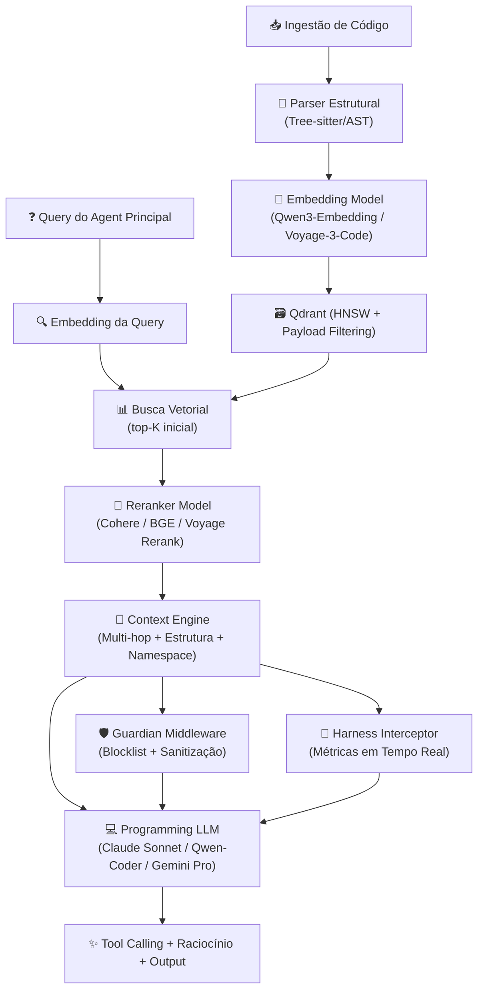

# 🧠 A Trindade do Contexto Inteligente: Embedding + Reranker + Programming LLMs

> [!IMPORTANT] > **Decisão Arquitetural Confirmada**  
> Vectora não é apenas RAG. É um pipeline orquestrado de **Embedding → Busca → Reranking → Raciocínio**.  
> Isso só é possível porque Vectora é um **Sub-Agent completo**, não um conjunto solto de tools MCP.

---

## 🔄 Pipeline Completo: Como as 3 Camadas Trabalham Juntas



### O Papel de Cada Camada

| Camada              | Função                                             | Por que é crítica para código                                                            |
| ------------------- | -------------------------------------------------- | ---------------------------------------------------------------------------------------- |
| **Embedding**       | Transforma código/documentos em vetores semânticos | Captura similaridade funcional, não apenas lexical. Ex: `validateToken()` ≈ `checkJWT()` |
| **Reranker**        | Reordena os `top-K` recuperados pelo vetor DB      | Remove ruído, prioriza arquivos com dependências reais, ignora boilerplate/vendor        |
| **Programming LLM** | Raciocínio, tool calling, geração e refatoração    | Entende sintaxe, padrões, segurança e arquitetura. Executa ações com contexto validado   |

> 💡 **Insight central**:  
> Embedding encontra _candidatos_.  
> Reranker seleciona _os relevantes_.  
> Programming LLM _age_ sobre eles.  
> **Vectora orquestra os três. Tools MCP isoladas não conseguem.**

---

## 📦 Seleção de Modelos Recomendada (Provider-Agnostic)

### 1. Embedding Models (Vetorização)

| Modelo                | Tipo       | Dimensão | Especialização                  | Modo                      |
| --------------------- | ---------- | -------- | ------------------------------- | ------------------------- |
| `Qwen3-Embedding`     | Open/Cloud | 1024     | Código + Documentação técnica   | Cloud + Local (llama.cpp) |
| `Voyage-3-Code`       | Cloud      | 1024     | Código puro, imports, AST-aware | Cloud                     |
| `nomic-embed-text-v2` | Open       | 768      | Geral, bom para docs/mix        | Cloud + Local             |
| `GTE-Code`            | Open       | 1024     | Fine-tuned em repos GitHub      | Local/Cloud               |

**Configuração no Vectora:**

```yaml
# vectora.config.yaml
embedding:
  provider: voyage
  model: voyage-3-code
  dimension: 1024
  batch_size: 32
  fallback: qwen3-embedding # se API falhar, usa local
```

### 2. Reranker Models (Precisão Cirúrgica)

| Modelo               | Tipo  | Latência | Precisão em Código                        | Modo  |
| -------------------- | ----- | -------- | ----------------------------------------- | ----- |
| `Cohere Rerank v3.5` | Cloud | ~50ms    | Alta (cross-attention real)               | Cloud |
| `Voyage Rerank 2`    | Cloud | ~40ms    | Alta + otimizado para código              | Cloud |
| `BGE-Reranker-v2-m3` | Open  | ~120ms   | Boa (local via llama.cpp/transformers.js) | Local |
| `ColBERT v2`         | Open  | ~80ms    | Excelente para match token-a-token        | Local |

**Por que o Reranker é obrigatório para código?**  
Vector DBs retornam por similaridade cossena. Em código, isso traz:

- `node_modules/` parecidos semanticamente
- `test/` files que espelham `src/` mas são irrelevantes
- Comentários/docstrings que "parecem" a query mas não têm lógica

O reranker cruza query ↔ chunk com atenção profunda, filtrando ruído antes do LLM gastar tokens.

### 3. Programming LLMs (Raciocínio + Execução)

| Família       | Modelo Recomendado     | Ponto Forte                                     | Uso no Vectora                                  |
| ------------- | ---------------------- | ----------------------------------------------- | ----------------------------------------------- |
| **Anthropic** | Claude 3.5/4 Sonnet    | Contexto longo, tool calling estável, segurança | Raciocínio multi-hop, refatoração, planejamento |
| **Alibaba**   | Qwen3-Coder / Qwen-Max | Open-weight, código puro, custo baixo           | Geração, análise estática, fallback local       |
| **Google**    | Gemini 2.5 Pro         | Multimodal, raciocínio complexo                 | Diagnóstico de bugs, análise de diagramas       |
| **Mistral**   | Codestral-22B          | Latência baixa, fine-tuned em código            | Tool calling rápido, scripts, automação         |

**Gateway Inteligente (AI SDK):**

```ts
// packages/llm/src/router.ts
export const programmingRouter = createRouter({
  primary: { provider: "anthropic", model: "claude-3-5-sonnet" },
  fallback: [
    { provider: "openrouter", model: "qwen/qwen3-coder" },
    { provider: "local", model: "qwen3-1.7b-instruct" },
  ],
  timeout_ms: 15000,
  max_tokens: 4096,
});
```

---

## 🛠️ Implementação Técnica (TypeScript + Stack Atual)

### 1. Context Engine com Reranker Integrado

```ts
// packages/context/src/engine.ts
import { qdrantClient } from "@vectora/infra";
import { rerank } from "@vectora/reranker";
import { composeContext } from "./composer";

export async function retrieveAndRerank(query: string, namespace: string, topK: number = 50, topN: number = 10) {
  // 1. Embedding da query (cache se já calculado)
  const queryEmbedding = await embedder.encode(query);

  // 2. Busca vetorial no Qdrant (payload filtering por namespace)
  const candidates = await qdrantClient.search(namespace, {
    vector: queryEmbedding,
    limit: topK,
    filter: { visibility: "active", namespace_id: namespace },
  });

  // 3. Reranking (cross-attention real)
  const ranked = await rerank(
    query,
    candidates.map((c) => c.payload.text),
  );

  // 4. Selecionar topN e montar contexto estruturado
  const finalChunks = ranked.slice(0, topN).map((r) => candidates[r.index]);

  return composeContext(finalChunks, {
    includeAST: true, // estrutura real do código
    includeDependencies: true, // grafo de imports
    namespace: namespace,
  });
}
```

### 2. Reranker Provider Interface

```ts
// packages/reranker/src/provider.ts
export interface RerankerProvider {
  rerank(query: string, documents: string[]): Promise<RerankResult[]>;
}

export class CohereReranker implements RerankerProvider {
  async rerank(query: string, documents: string[]) {
    const res = await cohere.rerank({
      model: "rerank-v3.5",
      query,
      documents,
      top_n: documents.length,
    });
    return res.results.map((r) => ({
      index: r.index,
      score: r.relevance_score,
    }));
  }
}

export class LocalBGEReranker implements RerankerProvider {
  private model: any; // carregado via @xenova/transformers ou llama.cpp
  async rerank(query: string, documents: string[]) {
    // inferência local, zero custo de API
    return runCrossAttention(this.model, query, documents);
  }
}
```

### 3. Integração com Programming LLM (Tool Calling + Raciocínio)

```ts
// packages/llm/src/programming-agent.ts
import { streamText } from "ai";
import { toolRegistry } from "@vectora/core";
import { guardian } from "@vectora/security";

export async function executeWithProgrammingLLM(context: StructuredContext, prompt: string) {
  const systemPrompt = buildSystemPrompt(context);

  const result = await streamText({
    model: programmingRouter.resolve(),
    system: systemPrompt,
    prompt: prompt,
    tools: toolRegistry.asOpenAIFormat(), // normaliza para qualquer provider
    maxTokens: 4096,
    temperature: 0.1,
    onChunk: (chunk) => harnessInterceptor?.onToken(chunk),
  });

  // Validar output antes de retornar ao agent principal
  return {
    text: await result.text,
    toolCalls: await result.toolCalls,
    metrics: { tokens: result.usage, retrieval_precision: context.precision },
    safety: guardian.sanitizeOutput(await result.text),
  };
}
```

---

## 🧪 Impacto no Harness: Validação em 3 Camadas

O Harness agora avalia **cada estágio do pipeline**, não só o output final:

| Camada              | Métrica do Harness                                            | Como é medida                                                       |
| ------------------- | ------------------------------------------------------------- | ------------------------------------------------------------------- |
| **Embedding**       | `retrieval_recall`                                            | Quantos arquivos relevantes aparecem no `top-K` inicial?            |
| **Reranker**        | `retrieval_precision`                                         | Dos `top-K`, quantos sobrevivem ao reranking e são realmente úteis? |
| **Programming LLM** | `correctness`, `security`, `maintainability`, `tool_accuracy` | Avaliação determinística + LLM-as-a-Judge com rubrica               |

### Exemplo de Teste no Harness (com Reranker)

```yaml
id: "reranker-precision-validation"
task:
  prompt: "Como o middleware valida tokens JWT antes de rotear?"
context:
  providers: [vectora]
  namespace: auth-service
  embedding_model: voyage-3-code
  reranker_model: cohere-rerank-v3.5

expectations:
  retrieval:
    must_include: ["middleware.go", "jwt_validator.go"]
    must_exclude: ["vendor/**", "test/mock_*.go"]
    min_reranker_score: 0.72
    noise_reduction_ratio: 0.65 # % de ruído removido vs top-K bruto

evaluation:
  judge_config: { method: "hybrid" }
  scoring:
    weights: { correctness: 0.30, performance: 0.25, security: 0.25, maintainability: 0.20 }
    technical_bonus: { retrieval_precision: 0.20 }
  thresholds: { pass_score: 0.75 }
```

> 💡 **Feature Chave**: `vectora harness run --compare reranker:on,reranker:off`  
> Prova objetiva de que o reranker reduz tokens, aumenta precisão e diminui alucinações.

---

## 🏆 Por que Isso Consolida o Sub-Agent (vs MCP Tools)

| Capacidade                                             | MCP Tools Genéricas                         | Vectora Sub-Agent                                        |
| ------------------------------------------------------ | ------------------------------------------- | -------------------------------------------------------- |
| Orquestrar Embedding → Busca → Reranking → LLM         | ❌ Depende do agent principal fazer isso    | ✅ Pipeline nativo, controlado pelo Context Engine       |
| Validar reranker score antes de enviar contexto ao LLM | ❌ Impossível sem interceptação interna     | ✅ Guardian + Harness avaliam em tempo real              |
| Trocar embedding/reranker/LLM sem reescrever tools     | ❌ Tools são estáticas, hardcoded no client | ✅ Provider Router + Adapter layer dinâmico              |
| Medir impacto de cada camada no resultado final        | ❌ Sem métricas granulares                  | ✅ Harness score por dimensão + diff comparativo         |
| Garantir que segredos nunca cheguem ao reranker ou LLM | ❌ Sanitização fica no prompt (frágil)      | ✅ Guardian middleware executa antes de qualquer chamada |

> ⚠️ **Fato técnico**:  
> Nenhum agent principal (Claude Code, Cursor, Gemini CLI) expõe hooks para reranking pós-retrieval, validação de
> embedding ou interceptação de tool sequence.  
> **Vectora precisa ser um sub-agent completo para orquestrar essas camadas com governança.**

---

## 🚀 Próximos Passos Imediatos

1. **Implementar Reranker Provider Interface** (`packages/reranker/`) com suporte a Cohere, Voyage e BGE local
2. **Atualizar Context Engine** para pipeline `Embed → Search → Rerank → Compose → Validate`
3. **Adicionar métricas de reranker no Harness** (`retrieval_precision`, `noise_reduction_ratio`)
4. **Configurar Provider Router** para embedding, reranker e programming LLMs separadamente
5. **Atualizar README/docs** com guia de seleção de modelos por caso de uso

---

> 💡 **Frase para guardar**:  
> _"Embedding encontra. Reranker filtra. Programming LLM age. Vectora orquestra. Tools MCP apenas assistem."_

Quer que eu codifique agora:

1. O módulo `@vectora/reranker` com providers Cohere + BGE local?
2. A atualização do `Context Engine` com pipeline completo?
3. O schema do Harness com métricas de reranking?
4. O `Provider Router` unificado para as 3 camadas?

Escolha um e eu entro codando. 🛠️
