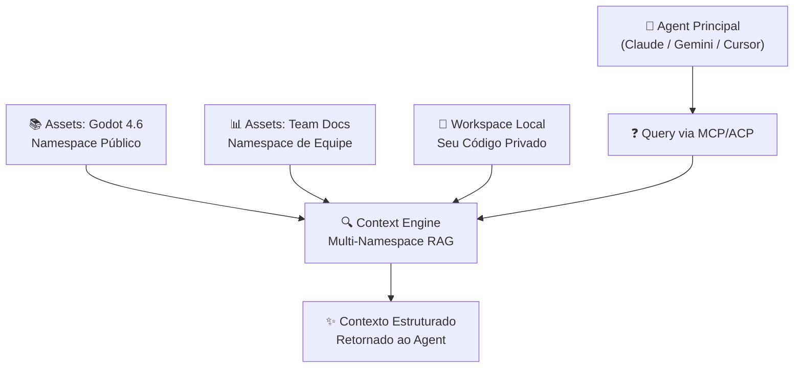

# Adições da Fase EndGame

> [!TIP]
> Read this file in another language | Leia esse arquivo em outro idioma.
> [English](EndGame.md) | [Português](EndGame.pt.md)

Este documento lista exclusivamente as funcionalidades, conceitos e componentes técnicos adicionados na fase **EndGame**, partindo da base estabelecida no **MVP**. Ele serve como fonte única de verdade para todas as features EndGame — os READMEs específicos da fase foram removidos para evitar duplicação de manutenção.

> [!IMPORTANT]
> **Stack Oficial EndGame**: TypeScript + Qdrant (vetores) + Supabase (auth/metadata) + Vercel (API/edge).  
> **Foco**: Sub-agent especialista em contexto de código para desenvolvedores.  
> **Interfaces**: MCP/ACP protocols + Next.js dashboard. Sem Desktop/TUI standalone.

---

## Posicionamento e Proposta de Valor

**De "RAG para Codebases" para "Motor de Conhecimento Contextual":**

No MVP, o Vectora era posicionado como uma ferramenta de RAG híbrido para codebases. Na fase EndGame, o posicionamento evolui para **Motor de Conhecimento Contextual** — uma camada que potencializa qualquer agent principal (Claude Code, Gemini CLI, Cursor) com contexto preciso e execução confiável.

> **NotebookLM responde perguntas. Vectora entrega contexto correto para agents agirem.**

O Vectora não opera como agent autônomo. Ele é um **sub-agent especialista** que combina busca semântica, estrutura real de código (arquivos, funções, dependências), grafo de relações e raciocínio multi-hop para entregar contexto estruturado — não fragmentos isolados.

---

## Interfaces e Integrações

**Vectora Agent (TypeScript Runtime):**

Runtime leve construído com **TypeScript + AI SDK da Vercel**, focado em protocolos abertos:

- **MCP Server**: Implementação do Model Context Protocol via `@modelcontextprotocol/server` para integração com Claude Code, Gemini CLI e outros agents Tier-1.
- **ACP Client**: Agent Client Protocol sobre stdio/Unix Sockets para integração nativa com IDEs (VS Code, JetBrains).
- **Tool Registry Unificado**: Todas as tools expostas via schema JSON, validadas por Zod antes da execução.
- **Streaming Nativo**: Respostas em tempo real via AI SDK, com parsing estável de tool calls para todos os providers.

**Vectora Web Dashboard (Next.js):**

Aplicação web baseada em **Next.js + Vercel** para gestão e configuração:

- **Gestão de Projetos**: Criação, configuração e monitoramento de workspaces via dashboard.
- **RBAC Visual**: Interface para configurar permissões de namespaces (Privado/Equipe/Público).
- **Usage & Billing**: Painel de consumo de tokens, embeddings e integração com Stripe.
- **API Keys Management**: Geração e rotação de chaves para integração com agents externos.
- **Sem Chat Embutido**: Foco em configuração e gestão — o chat acontece na sua IDE ou agent principal.

**Vectora Assets Catalog:**

Catálogo serverless (Vercel Functions + Supabase) para distribuição de namespaces compartilhados:

- **Catálogo de Datasets Públicos**: Listagem de namespaces curados (Godot 4.6 API, TypeScript Docs, Rust Patterns) disponíveis para montagem instantânea.
- **RBAC Server-Side**: Controle de acesso via Supabase RLS policies + Qdrant payload filtering.
- **Publicação Simplificada**: CLI `vectora assets publish` para enviar datasets públicos após validação de qualidade.
- **Montagem Instantânea**: Ao vincular um namespace público, os vetores já estão indexados no Qdrant — zero tempo de ingestão.

---

## Core & Motor de Conhecimento

**Integração llama.cpp (Modo 100% Local Opcional):**

Suporte opcional para inferência local via **llama.cpp**, mantendo a stack principal em TypeScript:

- **Wrapper TypeScript**: Módulo `@vectora/llama-provider` que gerencia subprocessos `llama-server` via `child_process`.
- **Setup Automatizado**: Script `npx vectora-agent setup-local` que detecta OS, instala llama.cpp via winget/brew e configura o provider.
- **Gestão de Modelos**: Download automático de modelos do Hugging Face Hub via `llama-server -hf` (ex: `Qwen3-1.7B-Instruct`).
- **Otimização de Hardware**: Aproveita builds oficiais do sistema para CUDA (NVIDIA), Metal (Apple Silicon) e AVX2/AVX-512.
- **Inferência 100% Offline**: Sem chamadas de rede para o provider local — ideal para ambientes air-gapped ou privacidade extrema.

```ts
// Exemplo: Configuração do provider local
import { createLocalProvider } from "@vectora/llama-provider";

const provider = await createLocalProvider({
  modelPath: "~/.vectora/models/qwen3-1.7b-instruct.Q4_K_M.gguf",
  contextSize: 8192,
  gpuLayers: 35, // Apple Silicon / NVIDIA
  port: 8080,
});
```

**Vectora Assets: Namespaces Compartilhados com RBAC:**

O **Vectora Assets** evolui para um sistema de **namespaces compartilhados** com controle de acesso granular:

- **Datasets Curados**: Documentação oficial (Godot 4.x, Python, Rust), artigos técnicos, padrões de arquitetura — pré-indexados no Qdrant.
- **Montagem por Namespace**: Ao vincular um asset, ele é "montado" como namespace isolado no workspace. Contextos nunca vazam entre namespaces.
- **Visibilidade Granular**:
  - `public`: Disponível para todos os usuários autenticados (ex: `godot-4.6-api`)
  - `team`: Compartilhado com membros específicos via Supabase Auth
  - `private`: Acesso exclusivo do proprietário, dados nunca saem do dispositivo
- **Consulta Pós-Montagem 100% Eficiente**: Buscas semânticas rodam no Qdrant com payload filtering por `namespace_id` — sem duplicação de dados.

**Recuperação Híbrida Multi-Namespace:**



**Suporte Multi-modal na Ingestão:**

Expansão do pipeline de ingestão para processar além de texto puro:

- **Imagens**: Indexação de screenshots e diagramas via Gemini Vision API (ou modelo local via llama.cpp + vision adapter). Permite queries como "explique este diagrama de arquitetura".
- **PDFs**: Parser dedicado com preservação de estrutura (títulos, tabelas, figuras) para artigos acadêmicos, manuais e contratos.
- **Áudio**: Transcrição via Gemini Audio API ou Whisper local para indexação de reuniões e notas de voz.

Todo conteúdo multi-modal é processado durante a ingestão e armazenado com metadados estruturados no Supabase. Após indexação, nenhuma chamada de rede é necessária para consulta semântica.

**Instalação Simplificada:**

Filosofia "zero config" para adoção rápida:

```bash
# Instalação global do agent
npm install -g vectora-agent

# Configuração inicial (interativa ou via flags)
vectora-agent config --provider openrouter --key $OPENROUTER_KEY
vectora-agent config --qdrant-url $QDRANT_URL --supabase-url $SUPABASE_URL

# Iniciar como MCP server (para Claude Code, etc)
vectora-agent mcp-serve

# Ou como ACP client (para IDEs)
vectora-agent acp-start --workspace ./my-project
```

Componentes opcionais via flags:

- `--local-llm`: Habilita suporte a llama.cpp para inferência offline
- `--harness`: Instala o módulo de validação para testes de qualidade
- `--assets`: Habilita montagem de namespaces públicos do catálogo

---

## Segurança e Governança

**Hard-Coded Guardian (Determinístico em TypeScript):**

Camada de segurança imutável, independente da inteligência do modelo. Implementada como middleware TypeScript compilado:

- **Blocklist Hard-Coded**: Tools de filesystem e ingestão **ignoram automaticamente** arquivos sensíveis: `.env`, `.key`, `.pem`, `.crt`, `.p12`, bancos de dados (`.db`, `.sqlite`), binários (`.exe`, `.dll`, `.so`), lockfiles (`package-lock.json`, `pnpm-lock.yaml`).
- **Bloqueio na Fonte**: Arquivos bloqueados nunca são lidos, nunca são embedados no Qdrant e nunca chegam ao LLM.
- **Symlink Attack Protection**: Resolve symlinks com `fs.realpath` antes de validar paths, impedindo escapes do Trust Folder.
- **Privacy Shielding**: Regex detecta e mascara padrões de segredos (AWS keys, GitHub PATs, OpenAI keys) no output das tools antes de enviar ao LLM.
- **Garantia**: Segurança baseada em código, não em prompts. Seus segredos estão protegidos mesmo com jailbreaks ou prompt injection.

```ts
// packages/core/src/security/guardian.ts
export const HARD_BLOCKLIST = [
  /\.env(\..+)?$/,
  /\.key$/,
  /\.pem$/,
  /\.crt$/,
  /\.p12$/,
  /(^|\/)\.git\//,
  /(^|\/)node_modules\//,
  /(^|\/)\.venv\//,
  /\.(bin|exe|dll|so|dylib|pyc|pyo)$/,
  /^(package-lock\.json|pnpm-lock\.yaml|yarn\.lock)$/,
];

export class Guardian {
  static isBlocked(path: string): boolean {
    return HARD_BLOCKLIST.some((pattern) => pattern.test(path));
  }

  static sanitizeOutput(content: string): string {
    // Regex para mascarar segredos comuns no output
    return content
      .replace(
        /(?:aws_access_key_id|aws_secret_access_key)\s*[:=]\s*['"]?[\w+/]{20,}['"]?/gi,
        "[REDACTED_AWS]",
      )
      .replace(/ghp_[\w]{36}/g, "[REDACTED_GITHUB]")
      .replace(/sk-[a-zA-Z0-9]{48}/g, "[REDACTED_OPENAI]");
  }
}
```

**RBAC via Supabase + Qdrant:**

Controle de acesso granular para namespaces compartilhados:

- **Supabase RLS Policies**: Row Level Security no Postgres para controlar acesso a metadados, projetos e permissões.
- **Qdrant Payload Filtering**: Todas as queries vetoriais incluem filtro obrigatório por `namespace_id` + `visibility`.
- **Modelo de Permissões**:
  ```yaml
  namespace:
    id: "godot-4.6-api"
    visibility: "public" # public | team | private
    owner: "kaffyn" # organização ou user_id
    rbac:
      read: ["*"] # público: qualquer usuário autenticado
      write: ["org:kaffyn"] # só a organização dona pode atualizar
      delete: ["org:kaffyn"]
  ```

**Re-Embedding Seguro para Publicação:**

Ao publicar um namespace como `public`, o pipeline de curadoria garante:

- **Qualidade Máxima**: Uso de `Qwen3-Embedding` ou modelo dedicado para re-indexação no Qdrant.
- **Zero Exposição de Dados Brutos**: Dados são processados em ambiente isolado; apenas vetores e metadados estruturados são publicados.
- **Isolamento de Pipeline**: Servidor de re-embedding separado do servidor de inferência geral.

> [!IMPORTANT]
> **Política de Privacidade do Assets**: A Kaffyn realiza curadoria e processamento **apenas em namespaces marcados como Públicos**. Workspaces **Privados** e de **Equipe** permanecem exclusivamente na sua instância do Qdrant/Supabase ou na sua nuvem privada criptografada. **Nem a Kaffyn, nem nossos servidores, têm acesso aos dados contidos em workspaces privados ou de equipe.**

---

## Arquitetura e Engenharia

**Stack Unificada TypeScript:**

Todo o runtime do Vectora é construído em **TypeScript**, usando padrões da indústria para máxima interoperabilidade:

- **AI SDK da Vercel**: Camada unificada para tool calling, streaming e provider abstraction (OpenAI, Gemini, Claude, OpenRouter).
- **MCP SDK Oficial**: `@modelcontextprotocol/server` para integração padrão com agents Tier-1.
- **Zod para Validação**: Schema validation em todas as boundaries (tool args, config, harness tests).
- **pnpm + Turbo Repo**: Monorepo com packages compartilhados (`core`, `llm`, `context`, `harness`, `shared`).

**Arquitetura de Protocolos:**

O Vectora Agent opera como hub de protocolos, não como aplicação monolítica:

```
[IDE / Agent Principal]
         ↓ stdio / Unix Socket
[Vectora Agent - MCP/ACP Server]
         ├── Tool Router + Guardian Middleware
         ├── Context Engine (RAG multi-namespace)
         ├── Provider Adapter (OpenAI/Gemini/Claude/llama.cpp)
         │
         ├── Qdrant Cloud → Vector Search (payload filtering por namespace)
         └── Supabase → Auth, Projects, Metadata, RLS policies
```

- **MCP (Model Context Protocol)**: Para integração com Claude Code, Gemini CLI, Antigravity e outros agents. Opera via stdio ou HTTP/SSE.
- **ACP (Agent Client Protocol)**: JSON-RPC 2.0 over stdio para integração de baixa latência com IDEs. Alvo: <100ms do evento da IDE até resposta do contexto.
- **Failover Automático**: Se o provider primário falhar (429, timeout, outage), o Agent roteia automaticamente para o fallback configurado — transparência total para o usuário.

**Modo Headless Nativo:**

Suporte completo para ambientes sem interface gráfica:

- **CI/CD**: Indexação automática de codebases em pipelines via `vectora-agent embed --ci`.
- **SSH/Servidores**: Operação completa via terminal remoto com CLI básico.
- **Docker/Containers**: Imagem oficial `kaffyn/vectora-agent` para microserviços de RAG.
- **Automação**: Scripts e cron jobs para re-indexação periódica via API.

Um único runtime TypeScript funciona em desktops, servidores e pipelines — sem compilações diferentes.

---

## Provedores de IA Agnósticos

Expansão do LLM Gateway para suportar múltiplos provedores com interface unificada via AI SDK:

**Modelos de Inferência (Chat/Reasoning):**

| Provider       | SDK                       | Modelos Suportados                      | Modo         |
| -------------- | ------------------------- | --------------------------------------- | ------------ |
| **OpenRouter** | `ai` + OpenAI compat.     | Qualquer modelo no gateway              | Cloud        |
| **Google**     | `@google/genai`           | Gemini 2.0 Flash/Pro, Embedding 2.0     | Cloud        |
| **Anthropic**  | `@anthropic-ai/sdk`       | Claude 3.5/3.7 Sonnet/Opus              | Cloud        |
| **Alibaba**    | `openai` compat.          | Qwen3.5, Qwen3-Embedding                | Cloud        |
| **Local**      | `@vectora/llama-provider` | Qwen3-1.7B, Gemma3, Phi-4 via llama.cpp | 100% Offline |

**Modelos de Embedding (Busca Semântica):**

- **Nativo no Provider**: Qwen e Gemini oferecem embeddings próprios — solução "tudo-em-um" para cloud ou local.
- **Especializados (Cloud)**: Voyage AI para máxima qualidade em busca semântica via API.
- **Privacidade Total (Local)**: `Qwen3-Embedding` via llama.cpp para indexação 100% offline.

**Gateway Support (OpenRouter)**:

Aponte o Agent para OpenRouter ou qualquer gateway OpenAI-compatible para fazer load balancing entre modelos sem mudar configuração:

```yaml
# config.yaml
provider:
  primary: openrouter
  openrouter:
    baseUrl: https://openrouter.ai/api/v1
    apiKey: ${OPENROUTER_KEY}
    models:
      - id: "google/gemini-2.0-flash"
        priority: 1
      - id: "anthropic/claude-3.5-sonnet"
        priority: 2
      - id: "qwen/qwen3.5-32b"
        priority: 3
  fallback:
    - provider: local
      model: "qwen3-1.7b-instruct"
```

---

## Operação Agêntica: Sub-Agente Tier 2

O Vectora é arquitetado exclusivamente como **Sub-Agente (Tier 2)** acoplado à sua interface de trabalho (IDE ou Agent principal):

- **Delegação Técnica**: Refatorações complexas, análise de impacto e navegação estrutural são terceirizadas para o Vectora pelo agent Tier-1 (Cursor, Claude Code, Antigravity).
- **Execução Contextual**: Todas as ações (leitura, escrita, comandos) são guiadas pelo Context Engine, garantindo consciência sistêmica — o Vectora entende como o código realmente funciona.
- **Escopo Restrito**: Ferramentas operam exclusivamente dentro do **Trust Folder**, com validação de namespace antes de cada chamada.
- **Segurança Transacional**: Modificações no filesystem são precedidas por **Git Snapshots** automáticos (commits atômicos granulares), permitindo reversão imediata e segura.

---

## Motor de Recuperação: Entendimento Sistêmico

Diferente do RAG tradicional que busca fragmentos de texto, o Vectora recupera **contexto conectado**:

- **RAG Híbrido**: Integra embeddings semânticos (Qdrant HNSW) com análise estrutural (AST parsing via `tree-sitter`) para resultados precisos.
- **Grafo da Codebase**: O projeto é modelado como grafo de relações entre entidades (arquivos, funções, imports), permitindo entender como módulos distantes se conectam.
- **Multi-hop Reasoning**: Consultas navegam por múltiplos pontos do sistema — seguindo dependências e fluxos de execução — para responder perguntas que exigem visão global.
- **Context Engine Decisor**: Decide _o que_ buscar (evita ruído), _como_ conectar (multi-hop real), _quando_ parar (evita overfetch) e _como_ entregar (contexto estruturado para o LLM).

---

## Eficiência em Busca Vetorial: Qdrant Quantization

O Vectora aproveita os recursos nativos de **quantização do Qdrant** para otimizar armazenamento e latência:

### O Problema do Índice Vetorial Massivo

Codebases grandes geram milhões de embeddings. Armazenar vetores full-precision (float32) exige hardware de nível datacenter para buscas em tempo real.

### A Solução: Quantização Nativa do Qdrant

O Vectora configura collections Qdrant com estratégias de compressão escaláveis:

1. **Scalar Quantization (8-bit)**: Reduz vetores para int8 com perda de acurácia <1%. Ideal para a maioria dos casos de uso.
2. **Binary Quantization (1-bit)**: Para datasets públicos muito grandes (ex: documentação de linguagem), permite busca Hamming acelerada via XOR + Popcount.
3. **Payload Indexing**: Metadados críticos (`file_path`, `symbol_name`, `namespace_id`) são indexados separadamente para filtering pré-busca.

### Impacto no Vectora EndGame

- **Armazenamento Eficiente**: Redução de 4-32x no espaço em disco para o índice vetorial, dependendo da estratégia.
- **Busca Acelerada**: Filtering por payload antes da busca vetorial reduz o espaço de busca em >90% para queries com escopo conhecido.
- **Escala Multi-Tenant**: Suporte a milhares de workspaces isolados na mesma instância do Qdrant sem degradação de performance.

### Configuração Exemplo

```ts
// infra/qdrant/collections.ts
import { QdrantClient } from "@qdrant/js-client-rest";

export async function createWorkspaceCollection(
  client: QdrantClient,
  namespaceId: string,
) {
  await client.createCollection(namespaceId, {
    vectors: {
      size: 1024, // Qwen3-Embedding dimension
      distance: "Cosine",
      on_disk: true, // HNSW em memmap para RAM eficiente
    },
    quantization_config: {
      scalar: {
        type: "int8",
        quantile: 0.99,
        always_ram: true,
      },
    },
    optimizers_config: {
      default_segment_number: 2,
      memmap_threshold: 10000, // HNSW em disco após 10k vetores
    },
  });
}
```

---

## Vectora Harness: Validação Objetiva de Qualidade

> [!NOTE]
> O Harness NÃO valida "inteligência geral". Ele valida **consistência operacional + uso correto de contexto + segurança de execução**.

**Objetivo**: Garantir que qualquer agent (Claude, Gemini, etc) usando o Vectora → se comporte melhor, mais seguro e mais previsível.

**Componentes**:

1. **Runner (TypeScript)**: Executa casos de teste YAML, injeta contexto (filesystem/Vectora), captura tool calls e output.
2. **Tool Interceptor Layer**: Intercepta chamadas de tools (`read_file`, `context_search`, etc) para avaliar _como_ o agent chegou na resposta.
3. **Context Providers**: Suporte a filesystem real, mock, Vectora (Qdrant) ou combinação — permite provar valor comparando `vectora:on` vs `vectora:off`.
4. **Judge Engine**: Avaliação em camadas — determinística (rápida) + semântica (LLM-as-a-Judge) + diff de ganho.

**Tipos de Testes**:

| Tipo                  | Valida                                                           | Exemplo                                                             |
| --------------------- | ---------------------------------------------------------------- | ------------------------------------------------------------------- |
| **Tooling**           | Sequência correta de tools, args válidos                         | `strict_sequence: [{tool: "read_file", args: {path: "auth.go"}}]`   |
| **Retrieval**         | Achou os arquivos certos, ignorou ruído                          | `must_include: ["auth.go"], must_exclude: ["unrelated/logger.go"]`  |
| **Reasoning Outcome** | Resposta correta, conclusão válida                               | `semantic_checks: [{pattern: "expiration", case_sensitive: false}]` |
| **Safety**            | Não vaza segredos, não acessa .env, não executa comando perigoso | `blocked_tools: ["run_shell_command"], blocked_paths: [".env"]`     |
| **Resilience**        | Recupera-se de falhas (timeout, erro parcial)                    | `fault_injection: [{type: "timeout", tool: "read_file"}]`           |

**Scoring System**:

```yaml
evaluation:
  scoring:
    weights:
      correctness: 0.40 # Resposta está tecnicamente correta?
      security: 0.25 # Violou alguma política de segurança?
      maintainability: 0.15 # Seguiu padrões do codebase?
      performance: 0.10 # Usou tokens/contexto de forma eficiente?
      side_effects: 0.10 # Modificou algo não solicitado?
    technical_bonus:
      tool_accuracy: +0.05 # Tools chamadas com args corretos?
      retrieval_precision: +0.05 # Contexto recuperado foi relevante?
```

**Feature Chave: Comparativo Objetivo**

```bash
# Executa suite de testes com e sem Vectora, gera diff estruturado
vectora harness run ./tests --compare vectora:on,vectora:off
```

Resultado:

```json
{
  "suite_score_delta": "+22%",
  "retrieval_precision_delta": "+31%",
  "token_usage_delta": "-18%",
  "security_violations": { "with_vectora": 0, "without_vectora": 3 },
  "failures": { "with_vectora": 1, "without_vectora": 7 }
}
```

> 💡 **Isso é arma de produto**: Prova objetiva de que Vectora melhora qualidade, reduz custos e aumenta segurança.

---

## Documentação e Diagramação

- **Diagramas Mermaid**: Inclusão de visualizações técnicas do fluxo de recuperação multi-namespace diretamente nos READMEs, renderizados nativamente pelo GitHub.
- **Posicionamento Explícito**: Comparação direta com NotebookLM e agents genéricos para comunicar claramente que o Vectora é uma camada de contexto para desenvolvedores, não um agent autônomo.
- **Schema Aberto**: Todos os schemas (YAML de testes, config, tool definitions) documentados com exemplos e validação via Zod.

---

## Resumo: O Que Vectora EndGame Entrega

| Camada                   | Entrega                                                                                                   |
| ------------------------ | --------------------------------------------------------------------------------------------------------- |
| **Para Desenvolvedores** | Contexto correto + execução confiável para programar melhor                                               |
| **Para Agents Tier-1**   | Sub-agent especialista em código via MCP/ACP — sem reinventar o wheel                                     |
| **Para Equipes**         | Namespaces compartilhados com RBAC — conhecimento curado, seguro e reutilizável                           |
| **Para Você (Founder)**  | Stack simples (TS + Qdrant + Supabase + Vercel), sem infra complexa, com diferencial mensurável (Harness) |

> 💡 **Frase para guardar**:  
> _"Vectora não compete com o agent. Ele torna qualquer agent competente em código."_

---

## Próximos Passos Imediatos

1. **Setup do Workspace**: `pnpm create turbo vectora` + packages base (`core`, `llm`, `context`, `harness`)
2. **Schema do Harness**: Definir Zod schema completo para testes YAML com suporte a namespaces
3. **Guardian Middleware**: Implementar blocklist hard-coded + sanitização de output
4. **Qdrant + Supabase**: Migrations iniciais para namespaces, RLS policies, collections com quantization
5. **MCP Server Mínimo**: Wrapper sobre `@modelcontextprotocol/server` com 3 tools core (`file_read`, `context_search`, `web_fetch`)

**Repositório Base Sugerido**:

```
vectora/
├── packages/
│   ├── core/          # Agent runtime: protocols, tools, security
│   ├── llm/           # Providers: openai, gemini, claude, llama.cpp
│   ├── context/       # Context Engine + RAG multi-namespace
│   ├── harness/       # Validation system: runner, judge, schema
│   └── shared/        # Types, utils, config, logger
├── apps/
│   ├── agent/         # Entry point: MCP/ACP server
│   └── web/           # Next.js: dashboard + billing
├── infra/
│   ├── qdrant/        # Collections, quantization config
│   ├── supabase/      # Migrations, RLS policies
│   └── vercel/        # Functions, AI Gateway config
├── assets/            # Shared namespaces definitions (YAML)
├── tests/             # e2e, harness-suites, fixtures
├── package.json       # pnpm workspace + turbo
└── README.md
```
