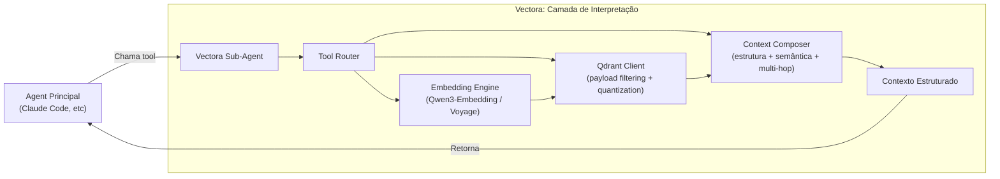

# Por que Vectora é um Sub-Agent Completo, Não Apenas MCP Tools?

> [!IMPORTANT]
> **Decisão Arquitetural Estratégica** | Esta não é uma limitação técnica — é uma escolha deliberada para garantir controle, validação e qualidade operacional.

---

## 🎯 Resposta Direta

> **Vectora é um sub-agent completo porque RAG de qualidade exige controle que MCP tools sozinhas não podem fornecer.**

Se Vectora fosse apenas um conjunto de ferramentas MCP expostas para Claude Code, Gemini CLI ou Cursor:

1. ❌ **Não poderíamos gerenciar embeddings** — os agents principais não têm modelos de embedding integrados
2. ❌ **Perderíamos o Harness** — sem interceptação interna, não há como validar _como_ o agent chegou na resposta
3. ❌ **Não teríamos controle de execução** — sem acesso ao SDK do provider, não validamos comandos antes de executar
4. ❌ **Seríamos "mais um RAG genérico"** — sem diferencial estratégico em um mercado saturado

---

## 🔍 Parte 1: O Problema do Embedding (Técnico)

### A Realidade dos Agents Principais

| Agent Principal | Possui Modelo de Embedding Integrado? | Pode Executar RAG Local? |
| --------------- | ------------------------------------- | ------------------------ |
| GitHub Copilot  | ❌ Não                                | ❌ Não                   |
| Cursor          | ❌ Não                                | ❌ Não                   |
| Claude Code     | ❌ Não                                | ❌ Não                   |
| Gemini CLI      | ⚠️ Apenas via API cloud               | ❌ Não localmente        |
| OpenAI Codex    | ❌ Não                                | ❌ Não                   |
| Windsurf / Trae | ❌ Não                                | ❌ Não                   |

### Por que Isso Importa?

Para fazer RAG de qualidade, você precisa:

1. **Escolher o modelo de embedding certo** (ex: `Qwen3-Embedding` para código, `Voyage-3` para documentação)
2. **Gerar vetores com parâmetros específicos** (dimensão, normalização, quantization)
3. **Indexar no backend vetorial** (Qdrant com payload filtering por namespace)
4. **Recuperar com filtros contextuais** (namespace, relevância, estrutura)

Nenhum agent principal faz isso nativamente. Eles esperam que _você_ forneça o contexto pronto.

### A Solução Vectora: Interpreter Interno



> 💡 **Insight**: O Vectora não é apenas um "provedor de contexto". É um **interpretador especializado** que traduz queries genéricas em operações vetoriais precisas — algo que agents principais não fazem e não querem fazer.

---

## 🔍 Parte 2: O Problema do Controle (Estratégico)

### O Que Você Perde Sendo Apenas MCP Tools

Mesmo para tools que **não** envolvem embedding (ex: `file_read`, `grep_search`), atuar como MCP tools puro significa perder:

| Recurso                  | Por que importa                                                               | O que acontece sem Sub-Agent                                                                  |
| ------------------------ | ----------------------------------------------------------------------------- | --------------------------------------------------------------------------------------------- |
| **Harness**              | Valida _como_ o agent usou as tools, não só o output final                    | Sem interceptação interna, não há métricas de tool sequence, retrieval precision ou segurança |
| **Guardian Middleware**  | Blocklist hard-coded (.env, .key, .pem) executada antes de qualquer tool call | Depende de prompts de sistema, que podem ser contornados via jailbreak                        |
| **Namespace Validation** | Isolamento real entre projetos via RBAC                                       | Tools MCP genéricas não têm conceito de namespace — risco de vazamento de contexto            |
| **Failover Automático**  | Roteia entre providers se o primário falhar                                   | Agent principal precisa lidar com erros de API — complexidade vazada para o usuário           |
| **Tool Calling Estável** | Adapter layer normaliza respostas entre OpenAI/Gemini/Claude                  | Cada provider tem quirks diferentes — parsing frágil, tool calls inconsistentes               |

### A Ilusão do "Treinamento via Docs"

> _"Mas posso escrever Agents.md, Claude.md, Gemini.md para ensinar o agent principal a usar as tools corretamente!"_

Sim, pode. Mas isso **não resolve** os problemas fundamentais:

```yaml
# O que você CONSEGUE fazer com docs:
- Ensinar o formato esperado dos argumentos
- Sugerir sequência recomendada de tools
- Documentar políticas de segurança (em linguagem natural)

# O que você NÃO CONSEGUE fazer com docs:
❌ Validar argumentos antes da execução (Zod schema enforcement)
❌ Bloquear tool calls perigosos em runtime (Guardian middleware)
❌ Interceptar e métricas de tool sequence (Harness)
❌ Garantir isolamento de namespace (RBAC em código)
❌ Controlar loops de retry ou fallback entre providers
❌ Acessar o SDK do provider para parsing estável de streaming
```

> ⚠️ **Prompts são sugestões. Código é lei.**  
> Vectora escolheu código.

---

## 🧠 Sub-Agent vs MCP Tools: Comparação Direta

### Cenário: "Refatore o módulo de autenticação"

#### Abordagem MCP Tools Genérico

```
1. Claude Code recebe prompt
2. Claude decide chamar file_read("auth.go")
3. Tool MCP retorna conteúdo
4. Claude decide chamar grep_search("JWT", "*.go")
5. Tool MCP retorna resultados
6. Claude propõe refatoração
7. [SEM VALIDAÇÃO INTERMEDIÁRIA]
8. Claude chama file_write() → modifica arquivo
```

**Problemas**:

- Não há validação de que `auth.go` era o arquivo certo
- Não há métrica de quantos arquivos irrelevantes foram recuperados
- Não há bloqueio se `file_write` tentar modificar `.env`
- Não há snapshot Git automático antes da escrita
- Não há como provar que a refatoração seguiu padrões do projeto

#### Abordagem Vectora Sub-Agent

```
1. Claude Code delega para Vectora: "refactor_with_context"
2. Vectora intercepta: valida namespace + Trust Folder
3. Context Engine decide: buscar em Qdrant? filesystem? ambos?
4. Tool Interceptor registra: tool calls, timing, retrieval precision
5. Guardian valida: paths bloqueados? segredos no output?
6. Git Snapshot: commit atômico antes de qualquer escrita
7. Harness (se ativo): avalia tool sequence + output + segurança
8. Retorna contexto estruturado + métricas para Claude
9. Claude propõe refatoração com evidências validadas
```

**Vantagens**:

- ✅ Validação em tempo real, não post-hoc
- ✅ Métricas objetivas de qualidade (Harness)
- ✅ Segurança por código, não por prompt
- ✅ Isolamento de contexto por namespace
- ✅ Prova de valor comparável (`--compare vectora:on,off`)

---

## 🏗️ Arquitetura: Por que Sub-Agent Permite Isso

### Camadas de Controle Exclusivas do Sub-Agent

```typescript
// packages/core/src/subagent/runtime.ts
export class VectoraSubAgent {
  // 1. Tool Router com validação Zod
  private router: ToolRouter;

  // 2. Guardian middleware (hard-coded, não configurável)
  private guardian: Guardian;

  // 3. Context Engine com decisão multi-hop
  private contextEngine: ContextEngine;

  // 4. Harness hook para interceptação
  private harnessInterceptor?: HarnessInterceptor;

  // 5. Provider adapter com failover automático
  private providerAdapter: ProviderAdapter;

  async execute(request: AgentRequest): Promise<AgentResponse> {
    // Validação de namespace ANTES de qualquer ação
    if (!this.guardian.validateNamespace(request.namespace)) {
      throw new SecurityError("Namespace validation failed");
    }

    // Interceptação para Harness (se ativo)
    if (this.harnessInterceptor) {
      await this.harnessInterceptor.onCall(request);
    }

    // Decisão de contexto: o que/como/quando buscar
    const context = await this.contextEngine.build(request);

    // Execução com validação de args via Zod
    const result = await this.router.execute(
      request.tool,
      request.args,
      context,
    );

    // Sanitização de output antes de retornar ao agent principal
    const sanitized = this.guardian.sanitizeOutput(result);

    return { context: sanitized, metrics: this.collectMetrics() };
  }
}
```

### O Que MCP Tools Sozinhas Não Conseguem Fazer

```typescript
// Exemplo: tool MCP genérico (sem controle interno)
export async function file_read(args: { path: string }): Promise<string> {
  // ❌ Sem validação de namespace
  // ❌ Sem blocklist hard-coded
  // ❌ Sem interceptação para Harness
  // ❌ Sem sanitização de output
  // ❌ Sem métricas de timing/retrieval
  return fs.readFileSync(args.path, "utf-8");
}
```

> 💡 **Diferença fundamental**:  
> MCP tools são **funções passivas**.  
> Vectora Sub-Agent é um **sistema ativo de governança**.

---

## 🎯 Diferenciação Estratégica: Por que Isso Importa para Você

### Para Desenvolvedores

| Benefício      | Como o Sub-Agent Entrega                                                                                          |
| -------------- | ----------------------------------------------------------------------------------------------------------------- |
| **Confiança**  | Segurança por código, não por prompt — seus segredos estão protegidos mesmo se o agent principal for comprometido |
| **Qualidade**  | Harness prova objetivamente que Vectora melhora respostas — não é "acho", é dado                                  |
| **Controle**   | Você decide quais namespaces montar, quais providers usar, quais políticas aplicar                                |
| **Eficiência** | Context Engine evita overfetch — menos tokens, respostas mais rápidas                                             |

### Para Equipes de Engenharia

| Benefício       | Como o Sub-Agent Entrega                                                    |
| --------------- | --------------------------------------------------------------------------- |
| **Governança**  | RBAC por namespace + audit logs via Harness — compliance sem atrito         |
| **Colaboração** | Namespaces compartilhados com curadoria — conhecimento reutilizável, seguro |
| **Evolução**    | Harness detecta regressões antes de deploy — confiança para iterar rápido   |
| **Custo**       | Redução mensurável de tokens via retrieval precision — ROI comprovado       |

### Para Integradores de Agents

| Benefício              | Como o Sub-Agent Entrega                                                                    |
| ---------------------- | ------------------------------------------------------------------------------------------- |
| **Interoperabilidade** | MCP/ACP padrão — integra com Claude Code, Gemini CLI, Cursor sem reescrever                 |
| **Extensibilidade**    | Provider-agnostic — troque OpenAI por Gemini sem mudar a lógica do seu agent                |
| **Validação**          | Harness como serviço — valide seu próprio agent usando a mesma infraestrutura               |
| **Foco**               | Você constrói a experiência; Vectora cuida do contexto — divisão clara de responsabilidades |

---

## 🔄 E Se Eu Quiser Apenas MCP Tools?

> [!TIP]
> **Você pode.** Mas não vai ter o que torna Vectora único.

Se você realmente quer apenas tools MCP genéricas:

```bash
# Exemplo: usar apenas file_read como tool MCP
# (sem Context Engine, sem Harness, sem Guardian)
vectora-agent mcp-serve --mode tools-only
```

**O que você ganha**:

- ✅ Integração rápida com qualquer client MCP
- ✅ Menor overhead de configuração

**O que você perde**:

- ❌ Context Engine inteligente (decide o que/como buscar)
- ❌ Harness de validação (prova objetiva de qualidade)
- ❌ Guardian middleware (segurança por código)
- ❌ Namespace isolation (RBAC real entre projetos)
- ❌ Failover automático entre providers
- ❌ Métricas de retrieval precision e tool accuracy

> 💡 **Recomendação**: Comece com o Sub-Agent completo. Se depois de validar o valor você quiser simplificar, a opção `--mode tools-only` está disponível. Mas a maioria dos usuários descobre que as camadas de controle são justamente o que faltava.

---

## 🧭 Conclusão: Sub-Agent Não é Complexidade, é Controle

> _"Vectora não é mais um conjunto de tools MCP. É a camada que faz qualquer agent funcionar melhor em código — com controle, validação e segurança por design."_

| Se você quer...                                                | Use...                      |
| -------------------------------------------------------------- | --------------------------- |
| Tools genéricas de arquivo/busca                               | MCP tools padrão do mercado |
| **Contexto correto + execução confiável + validação objetiva** | **Vectora Sub-Agent**       |

> 💡 **Frase para guardar**:  
> _"Tools MCP te dão funções. Vectora Sub-Agent te dá governança."_

---

_Parte do ecossistema Vectora · Open Source · TypeScript · Provider-Agnostic_
